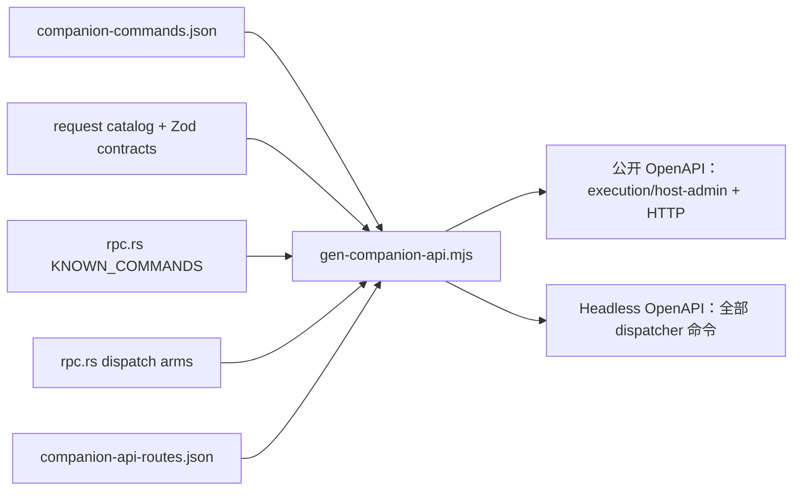

# RPC 命令 Manifest

<Status variant="beta" />

<TLDR>
  每个信任边界只挂载一个 RPC dispatcher：配对设备使用 `POST /api/_rpc/{name}`，本机 Headless
  Brain 使用 `POST /internal/_rpc/{name}`。`KNOWN_COMMANDS` 仍是运行时 allowlist，
  `protocol/companion-commands.json` 则提供 target、transport、capability、risk、approval、
  idempotency 与 schema 元数据。生成器对这些来源取交集，不再维护第三份手写 OpenAPI 命令表。
</TLDR>

<StatGrid>
  <Stat label="运行时 dispatcher" value="自动生成" hint="KNOWN_COMMANDS" />
  <Stat label="公开设备子集" value="自动生成" hint="execution/host-admin + HTTP" />
  <Stat label="Manifest schema" value="v2" hint="protocol/companion-commands.json" />
  <Stat label="生成 spec" value="2" hint="公开设备 + Headless service" />
</StatGrid>

## 分类规则



命令只有同时满足以下条件才会进入公开设备 spec：

1. Rust dispatcher 接受该命令；
2. manifest 存在对应 descriptor；
3. target 为 `execution` 或 `host-admin`；
4. transports 包含 `http`。

即使代码中存在同名入口，service 与 client-only descriptor 也不会公开。Headless spec 受 loopback
service token 保护，因此包含 dispatcher 的全部命令。

## 请求形式

生成的具体路径便于命令发现与 parity 审阅，运行时则使用 wildcard handler：

```http
POST /api/_rpc/session_list HTTP/1.1
Authorization: DPoP <access-token>
DPoP: <signed-proof>
Content-Type: application/json

{
  "limit": 20,
  "offset": 0
}
```

Headless 等价路由是 `/internal/_rpc/session_list`，使用
`Authorization: Bearer <service-token>`。内部 plane 仍执行 descriptor 级验证、幂等与 approval 策略。

对于 manifest 中的通用 input，生成器会依次使用显式 request catalog、递归 Zod 契约或直接 Rust
dispatch arm。每条 operation 通过 `x-cognia-request-schema-source` 标明 schema 来自 `contract`、
`zod-contract`、`runtime-inferred` 或 `manifest`。覆盖门禁会拒绝通用 fallback、缺少 `items` 的数组，
以及会让 Apifox 生成占位字段的无约束对象。

## 更新契约

dispatcher 或 descriptor 变化后，重新生成并校验两份 spec：

```bash
pnpm companion-api:gen
pnpm companion-api:check
pnpm companion-api:lint
```

`companion-api:check` 检测生成漂移；`spec_parity.rs` 在 Rust 层双向校验：每条预期命令都必须有具体
生成路径，每条具体路径也必须存在于对应运行时集合。

不要直接在公开 YAML 中手动加入 service 命令。只有信任与 transport 语义确实改变时才修改
descriptor，然后交由生成器更新产物。

## 性能命令边界

远端性能使用 execution capability 合同完成 lease open、renew、close、snapshot 与 observation read。Dispatcher 注入已认证 caller device ID，请求参数不能自行指定。旧的全局 `perf_start_sampling`、`perf_set_interval`、`perf_stop_sampling`、hotspot reset 和 trace folder reveal 保持 local/internal 兼容命令，不会向远端声明。Plugin `ctx.perf` 保持只读：可以观察已活动 stream 及 source metadata，但不能 open lease、Capture、reset state、读取 raw attachment 或控制进程。
