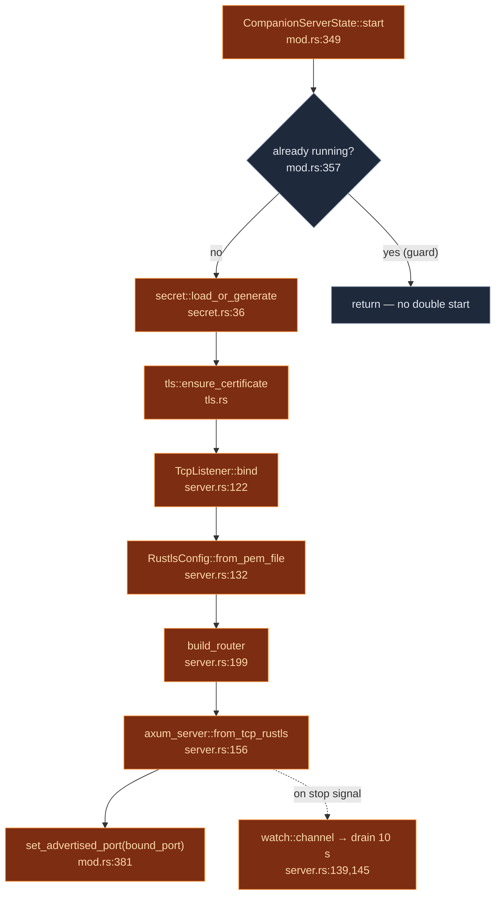
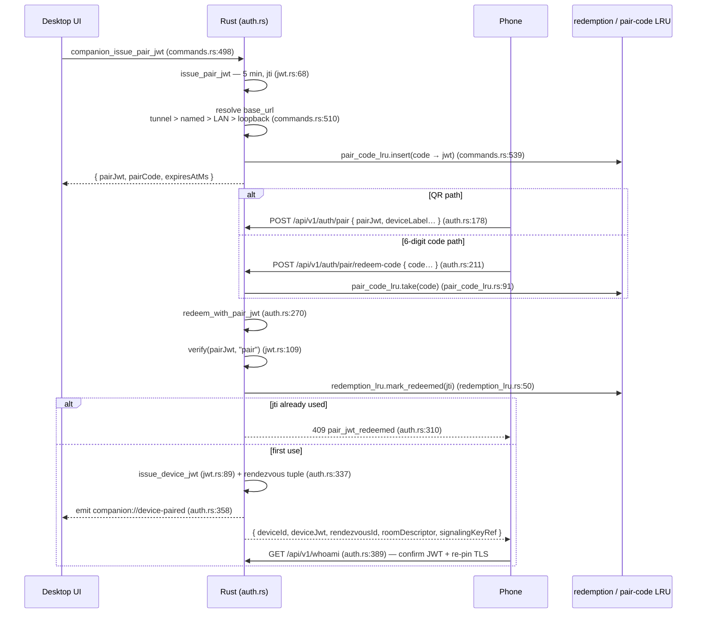

# 服务器与认证

<Status variant="beta" />

<TLDR>
  `CompanionServerState::start`（`mod.rs:349`）加载 HS256 签名密钥，构建共享状态，并调用
  `spawn_server`（`server.rs:108`）。该函数绑定一个 TCP socket（loopback 或 `0.0.0.0`），由
  Rustls 完成 TLS 终止，并以 10 秒优雅关闭排空的方式运行 `build_router`。两个互不重叠的中间件层
  保护各路由：三个配对端点上有基于 IP 的令牌桶限流，其余路由则使用 device JWT 校验器。配对流程
  颁发一个 **5 分钟、单次使用** 的 pair JWT（`jwt.rs:27`），手机通过扫描二维码或输入 6 位数字码
  来兑换，最终获得一个 **90 天** 有效期的 device JWT（`jwt.rs:29`）；重放攻击由一个 256 条目的
  兑换 LRU 缓存阻断。
</TLDR>

<StatGrid>
  <Stat label="默认端口" value="27890" hint="server.rs — DEFAULT_PORT" />
  <Stat label="请求体限制" value="64 KiB" hint="server.rs:47" />
  <Stat label="Pair JWT TTL" value="5 分钟" hint="jwt.rs:27 — 单次使用" />
  <Stat label="Device JWT TTL" value="90 天" hint="jwt.rs:29" />
  <Stat label="TLS 有效期" value="10 年" hint="tls.rs:30 — 密钥复用，指纹稳定" />
  <Stat label="预认证限流" value="20 次/分钟" hint="mod.rs:203 — 突发上限 5，按 IP 计" />
</StatGrid>

## 服务器启动

`spawn_server`（`server.rs:108`）是唯一的入口点。绑定 IP 取决于模式：
`Loopback` 模式使用 `Ipv4Addr::LOCALHOST`，`Lan` 模式使用 `Ipv4Addr::UNSPECIFIED`（`0.0.0.0`）
（`server.rs:114-118`）。它首先以**同步**方式绑定 `TcpListener`（`server.rs:122-130`），以便读回
OS 分配的临时端口（`port = 0`）并对外通告，然后将 socket 交给
`axum_server::from_tcp_rustls`（`server.rs:156`），并附上
`into_make_service_with_connect_info::<SocketAddr>()`（`server.rs:165`）——正是这个
connect-info 让预认证限流器能够获知对端 IP。



### 状态容器

| 结构体 | 所在位置 | 职责 |
| --- | --- | --- |
| `CompanionState` | `mod.rs:92` | axum handler 状态（以 `SharedState` `Arc` 包装，`mod.rs:89`）：签名密钥、事件总线、各 bridge 与 registry |
| `CompanionServerState` | `mod.rs:221` | Tauri 托管的生命周期包装，持有运行中的 `ServerHandle` |
| `CompanionServerInner` | `mod.rs:274` | `handle` + `bound_port` + `bind_mode` |
| `BindMode` | `mod.rs:287` | `Loopback` \| `Lan` |
| `ServerHandle` | `server.rs:60` | `bound_port` + `shutdown` 发送端 |

`mod.rs` 中还有几个进程级全局单例：TLS 指纹（`mod.rs:160`）、已通告端口（`mod.rs:176`）、
推送分发集合（`mod.rs:148`），以及**预认证**限流器（`mod.rs:199`，配置为
`capacity: 5.0`，`refill: 20.0/60.0`，见 `mod.rs:202-203`）。

## 中间件栈

两层中间件在 `build_router` 中注册，但分别挂载到不同的子路由器，因此同一请求永远只会经过其中一层。

### 预认证限流 — `pre_auth_rate_limit`（`middleware.rs:201`）

仅保护配对路由（`server.rs:216`）。它从 `ConnectInfo<SocketAddr>` 中提取对端 IP
（`middleware.rs:202`），**对 loopback 短路放行**（`middleware.rs:212-214`——同机调试从不被限流），
然后检查按 IP 维护的令牌桶。拒绝时返回 `429 { "code": "rate_limited" }` 并携带
`Retry-After` 响应头（`middleware.rs:219-233`）。

### Device JWT — `require_device_jwt`（`middleware.rs:79`）

保护 `whoami`、`_rpc` 及两个 WebSocket 端点（`server.rs:239-242`）。执行步骤如下：

<Steps>
<Step>
**提取 token** — 从 `Authorization: Bearer <jwt>` 中读取（`middleware.rs:85-90`），WebSocket
场景下回退到 `?token=` 查询字符串（`middleware.rs:92-96`）；两者同时存在时以 header 为准
（`middleware.rs:99`）。两者均缺失则返回 `401 missing_authorization`。
</Step>
<Step>
**校验** — `verify(secret, token, "device")`（`middleware.rs:111` → `jwt.rs:109`）。错误映射到
具体错误码：`WrongScope` → `wrong_scope`，过期 → `expired_token`，其余情况为
`invalid_signature`（`middleware.rs:113-124`）。
</Step>
<Step>
**从 claims 中提取 `device_id`**，或返回 `401 malformed_token`（`middleware.rs:127-135`）。
</Step>
<Step>
**拒绝列表检查** — `deny_list.is_revoked(device_id)` → `401 device_revoked`
（`middleware.rs:138-140` → `deny_list.rs:73`）。
</Step>
<Step>
**将 `DeviceContext` 注入**请求扩展字段（`middleware.rs:143-146`），运行 handler，随后
**尽力触发** `companion://device-seen` 事件，携带 `{ device_id, seen_at_ms }`
（`middleware.rs:152-164`），以便桌面 UI 显示最近活跃时间。
</Step>
</Steps>

两层均使用相同的扁平错误信封格式 — `{ code, message }`（`middleware.rs:174`，在 `auth.rs:410`
中镜像定义）。

## JWT scope

```rust title="src-tauri/src/companion_api/jwt.rs"
const PAIR_TTL_SECS: i64 = 5 * 60;             // jwt.rs:27  — 5 minutes, single-use
const DEVICE_TTL_SECS: i64 = 90 * 24 * 3600;   // jwt.rs:29  — 90 days
```

`Claims`（`jwt.rs:37`）携带 `scope`（`"pair"` 或 `"device"`）、`iat`、`exp`、可选的 `jti`
（仅出现在 pair token 中，用于单次使用追踪），以及可选的 `device_id`（仅出现在 device token 中）。
`verify`（`jwt.rs:109`）使用 HS256，**zero leeway**（`jwt.rs:112`），开启 `validate_exp`，并要求
`exp` claim 必须存在。两个颁发函数分别是 `issue_pair_jwt`（`jwt.rs:68`，生成新鲜的 UUIDv4 `jti`）
和 `issue_device_jwt`（`jwt.rs:89`）。

签名密钥是一个 32 字节的值，持久化存储在 OS keyring 中，service 为
`"com.cognia.companion/v1"`，account 为 `"signing-key"`（`secret.rs:21-22`），通过
`load_or_generate`（`secret.rs:36`）加载。轮换密钥（`secret.rs:55`）会立即使所有已颁发的 token
失效。

## 配对流水线

配对是唯一建立双向身份的时刻。有两种兑换路径——扫描二维码和输入 6 位数字码——最终汇聚到同一个
核心函数 `redeem_with_pair_jwt`（`auth.rs:270`）。



### Handler 及其结构

| Handler | 所在位置 | 请求 | 响应 |
| --- | --- | --- | --- |
| `issue_handler` | `auth.rs:119` | 无请求体 | `IssueResponse { pairJwt, expiresAtMs, pairCode, pairCodeExpiresAtMs }`（`auth.rs:49`） |
| `pair_handler` | `auth.rs:178` | `PairRequest { pairJwt, deviceLabel, devicePlatform, devicePubkey, appVersion }`（`auth.rs:81`） | `PairResponse`（见下） |
| `redeem_code_handler` | `auth.rs:211` | `RedeemCodeRequest { code, deviceLabel, … }`（`auth.rs:70`） | `PairResponse` |
| `whoami_handler` | `auth.rs:389` | （device JWT） | `{ device_id, server_version, tls_fingerprint }` |

`PairResponse` 包含 `{ deviceId, deviceJwt, serverVersion, rendezvousId,
roomDescriptor, signalingKeyRef }`。`rendezvousId` 是规范 descriptor 的 hash；
descriptor 仅包含双方角色公钥，不包含 secret。host 私钥由 `signalingKeyRef` 指向
原生安全存储，mobile 私钥不会跨过配对边界。详见 [v2 WebRTC 平面](./signaling-webrtc)。

### 单次使用强制执行

6 位数字码（`generate_pair_code`，`auth.rs:158`，范围 `100_000..=999_999`）通过 `PairCodeLru`
（容量 64，`pair_code_lru.rs:39`）映射到对应的 pair JWT；`take`（`pair_code_lru.rs:91`）在首次
兑换时将其移除，并在底层 JWT 的 `exp` 过期后返回 `Expired`。pair JWT 本身随后由
`RedemptionLru`（容量 256 FIFO，`redemption_lru.rs:26`）进行第二层保护：
`mark_redeemed(jti)`（`redemption_lru.rs:50`）在重放时返回 `false`，产生 `409 pair_jwt_redeemed`。
因此，泄露的二维码在一次成功配对后即无效，并且无论如何在 5 分钟后失效。

## 撤销：拒绝列表与控制允许列表

两个进程级全局集合用于管控已配对的设备：

- **`DenyList`**（`deny_list.rs`）——已撤销的 device ID。提供 `revoke` / `unrevoke` / `is_revoked` /
  `seed`（`deny_list.rs:52-82`）；在每次受保护请求时检查（`middleware.rs:138`）。桌面端在启动时
  以及每次从设置 UI 执行撤销操作时，从 Dexie 中同步数据进行初始化。超过 1000 条时会记录警告日志，
  但没有硬性上限（`deny_list.rs:27`）。
- **`ControlAllowList`**（`control_allow_list.rs:35`）——*可选加入*的设备集合，允许这些设备调用
  会话控制动词（`session_attach`、`goal_pause`、`automation_consent_respond` 等；
  `control_allow_list.rs:3-11`）。提供 `allow` / `disallow` / `is_allowed` / `reseed`
  （`control_allow_list.rs:59-80`）。在 `rpc_handler`（`rpc.rs:591`）和 `dispatch`
  （`rpc.rs:724`）中各执行一次检查。

两者均通过 Tauri 命令从 Dexie 同步镜像——`companion_seed_deny_list`（`commands.rs:257`）、
`companion_revoke_device`（`commands.rs:282`）、`companion_set_remote_control`（`commands.rs:309`）、
`companion_seed_remote_control`（`commands.rs:323`）。

## TLS：自签名、已锁定、指纹稳定

`tls::ensure_certificate` 在首次启动时使用 `rcgen` 生成一张 **10 年**（`tls.rs:30`）自签名证书，
通用名为 `"cognia-companion"`（`tls.rs:29`），持久化存储到
`<data_dir>/cognia/companion/tls.pem` 和 `tls.key`（`tls.rs:27-28,57`）。它计算
SubjectPublicKeyInfo 的 SHA-256 哈希并作为指纹对外暴露（`mod.rs:160`）。由于**密钥在重签时复用**，
指纹保持稳定——手机在配对时锁定一次该指纹，此后无需重新配对。桌面浏览器访问该 URL 时仍会看到
安全警告；只有手机的证书锁定路径才将其视为可信。指纹的分发路径详见
[发现、隧道与 TLS](./discovery-tunnel)。

## 已知局限

- **单签名密钥，进程级作用域。** 多账户/多 vault 场景需要升级 service 名（`com.cognia.companion/v2`）。
  轮换密钥会导致所有设备重新配对。
- **预认证限流按 IP 计，而非按设备计。** 其目的仅在于减缓对配对端点的暴力破解；loopback 完全豁免。
- **`store.rs` 不在实时路径上。** `AppStore` / `SqliteAppStore` 抽象（`store.rs`）是无头模式
  的持久化层（[数据平面](./data-plane-bridges)）；Tauri 桌面构建始终使用 WebView bridge，
  而非 SQLite store。

## 相关页面

<Cards>
  <Card title="RPC 命令清单" href="./rpc-manifest" description="已配对设备持有 device JWT 后实际可以调用哪些命令。" />
  <Card title="WebRTC 信令平面" href="./signaling-webrtc" description="配对过程中生成的 rendezvous 元组的使用场景。" />
  <Card title="移动端：发现与配对" href="../../ui/mobile-architecture/discovery-pairing" description="该流程的客户端部分——二维码扫描、数字码输入、TLS 证书锁定。" />
</Cards>
