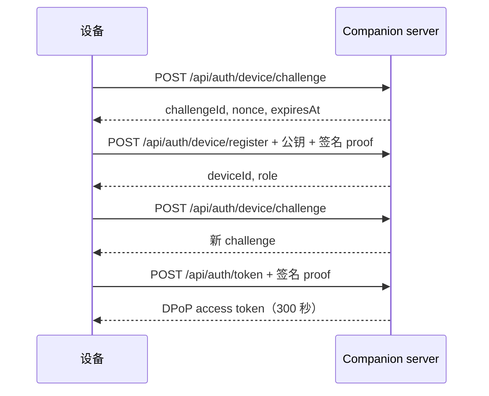

# 服务器与鉴权

<Status variant="beta" />

<TLDR>
  规范设备 API 不再把长期 bearer token 当作正常凭据。设备先注册公钥并签署一分钟 challenge，
  再换取五分钟 DPoP access token；每次 WebSocket 连接还需签发 60 秒、单次使用的 ticket。
  Headless 模式使用独立的 loopback service token，不进入设备鉴权流程。
</TLDR>

## Listener 边界

desktop 管理的 Companion listener 默认使用 loopback，启用 LAN 后才对外开放。独立入口
`cognia-server serve` 为部署场景绑定 `0.0.0.0:27890`；选择
`pnpm dev:headless --local-debug` 时，开发启动器会附加 `--bind-loopback`。TLS 在 Rust 内终止，
请求体有大小上限，中间件会先按信任边界分类，再交给 handler。

| 路由族 | 凭据 |
| --- | --- |
| `/healthz`、`/livez`、`/readyz`、agent card | 无 |
| `/api/auth/device/challenge`、`/api/auth/device/register` | 已签名设备 challenge，加 invitation 或配置的 OIDC authority |
| `/api/auth/token` | 已注册设备对 challenge 的签名 |
| 规范 `/api/*` | `Authorization: DPoP <access-token>` 与匹配的 `DPoP` proof header |
| 规范 `/ws/*` | `POST /api/auth/socket-ticket` 签发的路径绑定 ticket |
| `/internal/*`、`/ide/content*` | loopback service token |
| 显式 `/api/v1/*`、`/ws/v1/*` | 已发布客户端的弃用 device JWT 兼容 |

## 设备初始化



单用户模式下注册需要 invitation；受管模式使用配置的身份 authority。开发者不能把 Headless
service token 交给公开路由来绕过这条边界。

## 调用规范 HTTP 路由

每个受保护请求都携带五分钟 access token，以及绑定 token identifier、HTTP method 与 path 的签名：

```http
POST /api/_rpc/session_list HTTP/1.1
Authorization: DPoP eyJ…
DPoP: eyJ…
Content-Type: application/json

{}
```

高风险命令还要遵循 `protocol/companion-commands.json` 中的 capability、approval、限流与幂等策略。

## WebSocket ticket

用有效 DPoP 请求调用 `POST /api/auth/socket-ticket` 并指定 channel。返回 ticket 在 60 秒后过期、
只能使用一次且绑定目标 socket path。通过 `ticket` query parameter 传入；不要把 DPoP access token
放进 WebSocket URL。

## 兼容策略

已发布 v1 移动端仍使用长期 device JWT，因此服务器只挂载公开 OpenAPI 明确列出的兼容路由，包括
`POST /api/v1/_rpc/{name}`、`GET /ws/v1/events` 与 `GET /ws/v1/terminal`。这些路由均标记
`deprecated`，新客户端不得照搬。待已发布客户端完成 DPoP onboarding 后，再按正常弃用流程移除。

## 开发调试凭据

无渲染本地调试优先使用自动、仅当前进程有效的鉴权：

```bash
pnpm dev:headless --local-debug --skip-build
```

启动器会强制 loopback bind，并写出临时 Apifox/Postman 环境；它不会关闭鉴权。仅在凭据需要跨重启
保存时，才使用 `pnpm --silent dev:headless token` 获取 24 小时 service JWT。详见
[Headless service plane](./headless-service-plane)。
