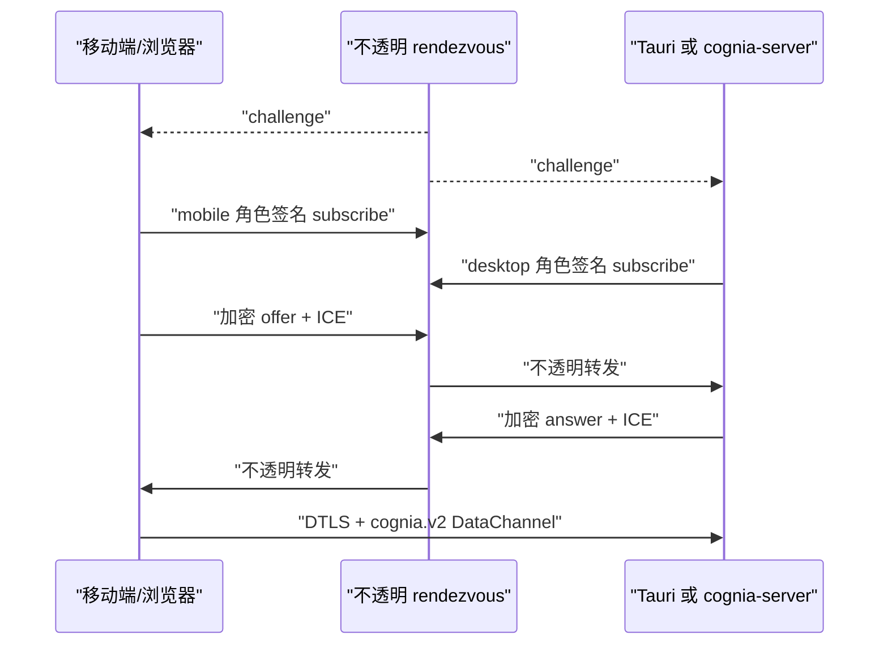

# WebRTC 信令与 DataChannel

同一套 answerer 同时运行在 Tauri 和全新启动的 `cognia-server` 中，不依赖
renderer 参与。

## 模块

| 模块 | 职责 |
| --- | --- |
| `signaling/mod.rs` | `SignalingHub`、每设备任务生命周期、配置和恢复 |
| `signaling/registration_store.rs` | v2 room descriptor 与 host key ref 的 SQLite 权威源 |
| `signaling/client.rs` | challenge/subscribe、加密 SDP/ICE、deadline、心跳和重连 |
| `signaling/envelope_v2.rs` | 规范字段、ECDSA/ECDH/HKDF/AES-GCM、epoch/seq 防重放 |
| `signaling/peer.rs` | `webrtc-rs` answerer 与受界 ICE/DataChannel 队列 |
| `signaling/datachannel_framing.rs` | 32 KiB 帧、1 MiB 消息及受界分片重组 |
| `signaling/dispatch.rs` | RPC、持久幂等、事件 resume/ack/replay/resync |

## 连接过程

配对将 host 角色私钥放入原生 secret store，将公开
`RoomDescriptorV2` 放入 SQLite。Tauri 可幂等导入 renderer 记录；
headless 启动时从同一 store 恢复全部 answerer。

五秒 challenge 绑定 room、role、session、随机 epoch、签发时间和临时
P-256 ECDH 公钥，并由角色 ECDSA 私钥签名。每个 room 只有一个 desktop
和一个 mobile；新的合法同角色会话原子替换旧会话。

## 安全边界

SDP/ICE 使用 AES-256-GCM 加密；方向密钥来自临时 P-256 ECDH 与
HKDF-SHA-256；ECDSA P-256 签名覆盖长度前缀的规范 header 和密文。
中继只看见路由元数据，无法解密，也无法把合法消息改标成另一个角色。

接收端拒绝过期 descriptor、时钟越界、签名错误、角色错误、旧 epoch、
重复 seq，以及超出受界重排窗口的缺口。不存在 v1 parser 或降级路径。

## 数据面边界

有序可靠的 `cognia.v2` 通道最多并发 32 个 RPC。物理帧最大 32 KiB，
逻辑消息最大 1 MiB；每 peer 最多 8 个重组、4 MiB 内存、15 秒期限。
入站队列最多 128 帧；pending ICE 最多 256 条、保存 30 秒，并且只在
匹配 epoch 的 remote description 设置后应用。

RTC 与 HTTPS 共享命令 manifest、设备限流器和持久幂等 ledger。事件从
持久全局 cursor 恢复并显式 ack；当 24 小时/10,000 条窗口不足时发送
`resync_required`，禁止静默形成缺口。

## 恢复

信令连接使用 8 秒 connect、5 秒 challenge/subscribe deadline、20 秒
心跳、10 秒 pong deadline 和全抖动受界退避。所有协商任务绑定 epoch，
旧异步任务不能回写新 peer。对端尚未上线时进入 `awaiting-peer`，不计为
连接失败。
