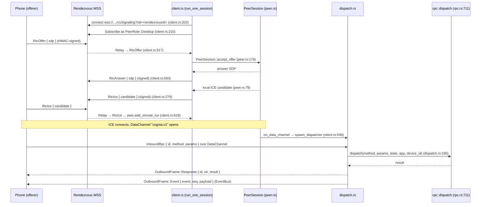

# WebRTC 信令平面

<Status variant="beta">beta · M-RTC</Status>

<TLDR>
  当手机处于蜂窝网络——无 LAN、无隧道——时，它通过 **WebRTC DataChannel** 而非 HTTPS
  连接到桌面端（[ADR-0021](../../adr/0021-webrtc-datachannel-wan-transport)）。桌面端扮演
  **answerer** 角色：`SignalingHub`（`signaling/mod.rs:108`）为每个配对设备维护一个长连接
  WSS 客户端（`signaling/client.rs`），连接到公共 rendezvous worker；当手机的 offer 到达时，
  客户端构建一个 `webrtc-rs` `PeerSession`（`signaling/peer.rs:64`），回应 answer，并在
  DataChannel 打开后启动一个泵（`signaling/dispatch.rs`），将入站 JSON-RPC 路由到与 HTTP
  **相同**的 `rpc::dispatch`，并将 EventBus 帧流式返回。每个被中继的信封均使用配对时生成的
  `rendezvous_secret` 通过规范 JSON 进行 HMAC-SHA256 签名，并经过重放检查。
</TLDR>

<StatGrid>
  <Stat label="DataChannel 标签" value="cognia.v1" hint="peer.rs:32 — 有序" />
  <Stat label="桌面端角色" value="answerer" hint="手机是 offerer" />
  <Stat label="重放窗口" value="256" hint="按 (role,seq)+(role,nonce) — envelope.rs:38" />
  <Stat label="时钟偏差" value="±5 min" hint="envelope.rs:35" />
  <Stat label="设备层级数" value="5" hint="Offline/Awaiting/Negotiating/Connected/Failed" />
</StatGrid>

## 为什么使用经过代理的 DataChannel

LAN + mDNS 在家中可用；当用户配置了 Cloudflared 隧道时也可用。但对于处于运营商 NAT 后的手机
需要连接处于家庭 NAT 后的桌面端，两者都不适用。WebRTC 通过 ICE 解决 NAT 穿透问题，但两个 peer
仍然需要一个 **rendezvous** 来交换 SDP offer/answer 和 ICE 候选。Cognia 托管了一个轻量级、
不受信任的中继服务（`signaling.cognia.cn`，即[信令服务器](../../ui/mobile-architecture/webrtc-transport#the-rendezvous-server)），
它只转发不透明的、经过 HMAC 签名的信封——从不查看明文内容，也不持有任何凭证。

## 模块概览

| 模块 | 职责 | 入口 |
| --- | --- | --- |
| `signaling/mod.rs` | `SignalingHub` —— 进程级注册表，每设备一个客户端任务，层级 FSM，Tauri 命令 | `SignalingHub::new` (`:108`) |
| `signaling/client.rs` | 长连接 rendezvous WSS 客户端：订阅、接收 offer、构建 peer、中继 answer/ICE、重连 | `run_one_session` (`:194`) |
| `signaling/peer.rs` | `webrtc-rs` `RTCPeerConnection` answerer 封装，通过 mpsc 分发回调 | `PeerSession::new` (`:64`) |
| `signaling/dispatch.rs` | DataChannel ↔ `rpc::dispatch` + EventBus 泵 | `spawn` (`:81`)，入站路由 (`:195`) |
| `signaling/envelope.rs` | 规范 JSON + HMAC-SHA256 签名/验证 + 重放 LRU | `build_signed_envelope` (`:197`)，`verify_signed_envelope` (`:234`) |

## 连接序列



## Hub 与客户端

`SignalingHub`（`mod.rs:108`）是进程全局注册表。`companion_signaling_sync_devices`
（`mod.rs:589`）从 WebView 推送当前配对设备列表（每个设备包含其 `rendezvousId` +
`rendezvousSecret`）；hub 为每个设备启动或停止一个 `client.rs` 任务。
`companion_signaling_configure`（`mod.rs:600`）设置信令 URL 和 ICE 服务器——默认值为
`DEFAULT_SIGNALING_URL = "wss://signaling.cognia.cn/v1/signaling"`（`mod.rs:51`），
配合 Google + Cloudflare STUN（`default_ice_servers`，`mod.rs:58`）。状态命令：
`companion_signaling_status`（`mod.rs:617`）、`companion_signaling_devices_status`
（`mod.rs:633`）、`companion_signaling_reconnect_device`（`mod.rs:644`）。

每个 `client.rs` 任务（`run_one_session`，`:194`）连接到 rendezvous，附加 `?rid=` 用于
worker 的房间路由（`append_rid`，`:203`），以 `PeerRole::Desktop` 身份订阅（`:215`），
并在 match 中处理中继的帧（`:509-648`）：

| 信封类型 | 处理方式 | 位置 |
| --- | --- | --- |
| `RtcOffer` | ICE 重启时复用现有 peer，否则构建新的 `PeerSession`；回复 `RtcAnswer` | `client.rs:517-609` |
| `RtcIce` | 解析 `body.candidate` → `add_remote_ice` | `client.rs:619-635` |
| `RtcClose` | 关闭 peer + dispatcher，层级 → `Awaiting` | `client.rs:636-648` |
| `RtcAnswer` | 桌面端始终是 answerer → 非预期，记录日志后丢弃 | `client.rs:610-618` |
| `Hello` | 仅记录日志 | `client.rs:510-516` |

重连退避时间为 `[1, 2, 4, 8, 16, 30, 60] s`（`client.rs:46`）；每 25 秒发送一次
keepalive `Ping`（`client.rs:243`）。

## Peer 与泵

`PeerSession`（`peer.rs:64`）封装了一个配置为 answerer 的 `webrtc-rs` `RTCPeerConnection`。
`accept_offer`（`peer.rs:176`）执行 `set_remote_description` → `create_answer` →
`set_local_description`，并返回 answer SDP。DataChannel 标签固定为
`DATACHANNEL_LABEL = "cognia.v1"`（`peer.rs:32`），并在 `on_data_channel`（`peer.rs:113-119`）
中强制检查——任何其他标签的 channel 均被忽略。本地 ICE 候选通过 mpsc 分发
（`peer.rs:79-93`），由 `client.rs` 封装为已签名的 `RtcIce` 信封。

DataChannel 首次打开时，`client.rs` 调用 `spawn_dispatcher(peer, data_rx, state, app, device_id)`
（`client.rs:599` → `dispatch.rs:81`）。该泵：

- 解码 `InboundRpc { id, method, params, idempotencyKey }`（`dispatch.rs:31`），
- 通过 `crate::companion_api::rpc::dispatch(method, params, state, app, device_id)`
  （`dispatch.rs:195`）路由——与 HTTP 使用完全相同的入口点，因此 `CONTROL_COMMANDS` 和幂等性
  （键为 `(device_id, key)`，`dispatch.rs:179`）照常生效，
- 发出 `OutboundFrame::{Response, Event}`（`dispatch.rs:46-76`），其中 `Event` 变体消耗
  与 WebSocket 相同的 EventBus。

## 已签名的信封

`signaling/envelope.rs` 是安全边界：rendezvous 中继不受信任，因此每一帧都使用配对时生成的
32 字节 `rendezvous_secret` 进行端到端认证。

- **规范 JSON** 确保字节与 TS 端实现完全一致
  （[`lib/signaling/envelope.ts`](../../ui/mobile-architecture/webrtc-transport#the-typescript-twin)）——
  键按字典序排序，数字仅用整数表示。
- **签名** —— `build_signed_envelope`（`:197`）以空 MAC 起草信封，然后对规范字节进行
  HMAC-SHA256 计算。
- **验证** —— `verify_signed_envelope`（`:234`）检查版本、`±5 min` 时钟偏差窗口
  （`REPLAY_CLOCK_SKEW_MS`，`:35`），以及常数时间 MAC 比较。
- **重放** —— `ReplayWindow::observe`（`:308`）按角色跟踪最近 256 个（`REPLAY_LRU_CAPACITY`，
  `:38`）`(role, seq)` 和 `(role, nonce)` 对，拒绝重复。跨实现的 MAC 测试固定值（`:374`）
  防止 Rust 和 TS 实现产生偏差。

## 设备层级 FSM

Hub 发布每设备的连接层级，供 UI 显示当前使用的传输方式：

```text
DeviceTier::{ Offline, Awaiting, Negotiating, Connected, Failed }   // mod.rs:493
```

`TierWriter`（`mod.rs:539`）推送层级转换；重连限速为 `5 s`
（`RECONNECT_DEVICE_MIN_SPACING`，`mod.rs:44`），防止频繁抖动。在客户端，这些层级对应
[移动端传输层](../../ui/mobile-architecture/transport-layer#transport-tiers)中显示的
`rtc-direct` / `rtc-relay` 传输层级。

## 相关页面

<Cards>
  <Card title="服务器与认证" href="./server-and-auth" description="rendezvousId + rendezvousSecret 元组在配对时的生成位置。" />
  <Card title="移动端：WebRTC 传输" href="../../ui/mobile-architecture/webrtc-transport" description="客户端 offerer、TS 信封实现，以及 Cloudflare Worker rendezvous 服务器。" />
  <Card title="RPC 命令清单" href="./rpc-manifest" description="DataChannel 泵直接复用的 dispatch 入口。" />
</Cards>
