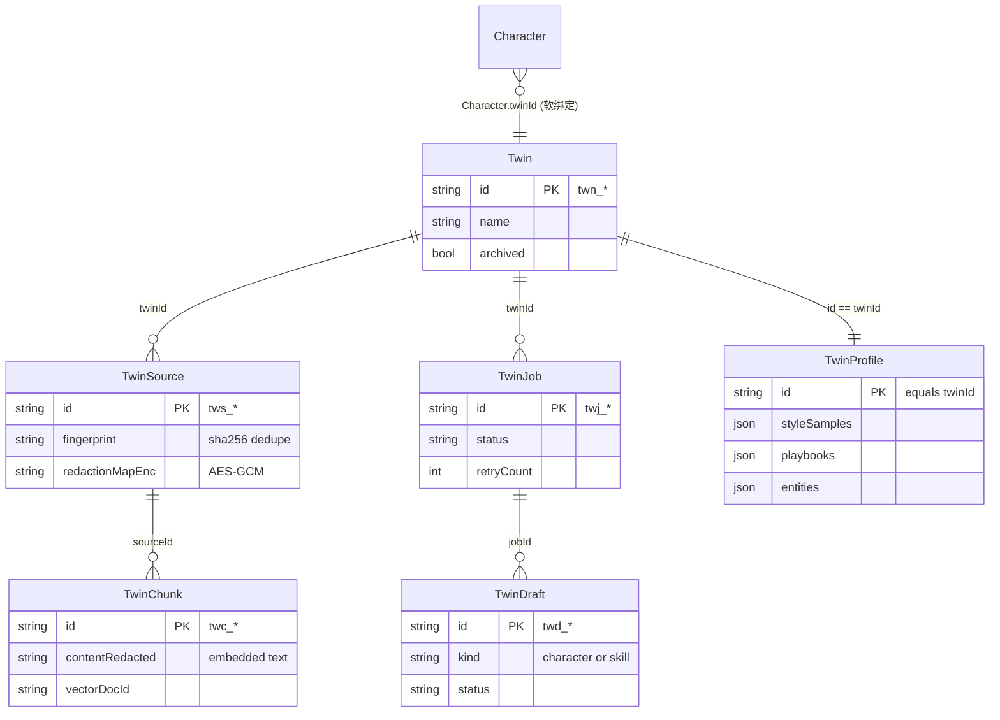

# 数据模型

<Status variant="stable" />

本子系统的一切都以 `types/twin/index.ts`（572 行）中的类型模型，以及它所支撑的六张 Dexie 表来描述。请先读本页。

## 七个类型簇



| 类型簇 | 关键类型（`types/twin/index.ts`） | 用途 |
| --- | --- | --- |
| **Sources** | `TwinSource`（L64）、`TwinSourceKind`（L28）、`TwinSourceFormat`（L34）、`TwinSourceStatus`（L62） | 每个被 ingest 的原始素材的注册表。横跨文档 / 聊天 / 邮件 / 代码四族共 22 种格式。 |
| **Chunks** | `TwinChunk`（L148）、`TwinChunkMetadata`（L130）、`ChunkingStrategyId`（L111）、`VectorBackend`（L123） | 切片 + 向量库指针（`vectorDocId`）+ 溯源。同时保存 `content`（显示）与 `contentRedacted`（被嵌入）。 |
| **Profile** | `TwinProfile`（L270）、`StyleSample`（L188）、`Playbook`（L228）、`ProfileEntity`（L245）、`DecisionRecord`（L257） | 蒸馏后的画像，1:1 对应每个孪生。每条子记录都带 `pinned?` 标记（重蒸馏保护）。 |
| **Drafts** | `TwinDraft`（L330）、`TwinDraftPayload`（L300）、`TwinDraftProvenance`（L312）、`TwinDraftEvaluation`（L321） | 待审核的合成角色 / 技能草稿，含溯源 + 评估分。 |
| **Jobs** | `TwinJob`（L368）、`TwinJobKind`（L356）、`TwinJobStatus`（L358） | 持久化的 ingest / distill / re-distill 任务状态，带 `nextAttemptAt`（退避）+ `leaseExpiresAt`（崩溃恢复）。 |
| **Bindings** | `TwinSettings`（L425）、`DEFAULT_TWIN_SETTINGS`（L445）、`Twin`（L480）、`TwinCronSettings`（L460） | 角色软绑定、每孪生 cron，以及多孪生 registry 行。 |
| **Runtime config** | `TwinRuntimeSettings`（L541）、`TwinRuntimeStorageConfig`（L502）、`TwinRuntimeEmbeddingSettings`（L511）、`TwinRuntimeRerankSettings`（L526） | 向量后端 + 嵌入 + 蒸馏 LLM + 重排器，存为一行设置。 |

### 源格式族

`TwinSourceFormat`（`types/twin/index.ts:34-60`）是每个导入器与 ingest 分发器所依据的联合类型。各族与
`lib/twin/ingest/dispatch.ts:55`（`KIND_BY_FORMAT`）一一对应：

- **文档** → `markdown · pdf · docx · xlsx · pptx · odt · odp · html · csv · epub · rtf · code`（路由到 `lib/document/document-processor`；`xlsx` 同时覆盖 `.xls/.xlsm/.ods` 表格）。
- **聊天** → `chatgpt-export · claude-export · gemini-export · slack-export · lark-export · dingtalk-export · wechat-export`。
- **邮件** → `mbox · eml`。
- **代码** → `git-repo`。

### 为什么 chunk 存两份文本

```ts title="types/twin/index.ts:154-161"
  /**
   * Original chunk text (UI display, citation snippets). Kept alongside
   * `contentRedacted` so the workbench shows the user's own data while
   * embeddings/LLM calls always use the scrubbed version.
   */
  content: string
  /** PII-stripped version — fed to embed() and any LLM call. */
  contentRedacted: string
```

这一拆分是隐私模型的结构核心：工作台渲染 `content`，但只有 `contentRedacted` 会被嵌入、写入远程向量负载、或交给蒸馏
agent。这对文本如何生成见 [ingest 流水线](./ingest-pipeline)。

## 六张 Dexie 表

声明在 `CogniaDB` 类上（`lib/db/schema.ts:140-145`）。孪生表在 **schema v14** 引入；`twins` registry 行在
**v34** 加入（`schema.ts:1138`）；`[twinId+fingerprint]` 去重索引在 **v58** 加入。当前 schema 为 **v70**。

```ts title="lib/db/schema.ts（孪生索引串，当前版本）"
twins:       "&id, updatedAt, archived, createdAt",
twinSources: "&id, twinId, kind, format, status, fingerprint, [twinId+kind], [twinId+status]",
twinChunks:  "&id, twinId, sourceId, vectorDocId, [twinId+sourceId], [twinId+createdAt]",
twinProfile: "&id, twinId",
twinDrafts:  "&id, twinId, jobId, kind, status, [twinId+status], [twinId+kind]",
twinJobs:    "&id, twinId, status, queuedAt, [twinId+status], [twinId+kind]",
```

这些复合索引不是装饰 —— 每个都支撑一个热点查询：

| 索引 | 支撑 |
| --- | --- |
| `twinSources.[twinId+status]` | "待入队的 pending 源"（`listTwinSourcesByTwinAndStatus`） |
| `twinSources.[twinId+fingerprint]` | 重新 ingest 去重（`findTwinSourceByFingerprint`，v58） |
| `twinChunks.[twinId+sourceId]` | 级联删除 + 按源列举 |
| `twinChunks.[twinId+createdAt]` | BM25 缓存失效签名（`getTwinChunksVersion`） |
| `twinDrafts.[twinId+status]` | "待审核"队列 |
| `twinJobs.[twinId+status]` | "进行中"徽标 + 排队任务认领 |

## DB CRUD 层（`lib/db/twin-*.ts`）

每张表有一个轻量、带类型的访问模块。运行时、流水线与 UI **从不** 直接碰 Dexie —— 都经由这些模块。

| 模块 | 重要入口 |
| --- | --- |
| `twins.ts`（231） | `createTwin` · `listTwins` · `renameTwin` · `cloneTwin`（仅元数据）· `archiveTwin` · **`deleteTwin`**（级联，L110）· `backfillTwinRegistryFromUsage`（registry 回填，L195） |
| `twin-sources.ts`（114） | `createTwinSource` · `listTwinSourcesByTwinAndStatus` · `listTwinSourcesByTwinAndKind` · **`findTwinSourceByFingerprint`**（L67，去重）· `getTwinSourcesByIds`（bulkGet）· `deleteTwinSource`（级联 chunk） |
| `twin-chunks.ts`（143） | `bulkCreateTwinChunks` · **`getTwinChunkByVectorDocId`**（L78，RAG 命中 → chunk）· `getTwinChunksByVectorDocIds` · `listTwinChunksByTwin` · **`getTwinChunksVersion`**（L115，BM25 缓存键）· `deleteTwinChunksBySource` |
| `twin-profile.ts`（473） | `ensureTwinProfile` · `upsertStyleSamples` / `upsertPlaybooks` / `upsertEntities`（重蒸馏安全、保留 pin）· `backfillStyleSampleEmbeddings` · 供 persona 浏览器用的逐项 `add*` / `update*` / `remove*` / `set*Pinned` |
| `twin-drafts.ts`（165） | `bulkCreateTwinDrafts` · **`listPendingTwinDraftsSortedByQuality`**（L83）· `markTwinDraftAccepted` / `Rejected` / `Edited` · `updateTwinDraftPayload` |
| `twin-jobs.ts`（272） | **`claimNextQueuedJob`**（L95，原子）· `updateJobProgress`（lease 续期）· `completeJob` · `failJob` · `requeueJob` · `cancelJob` · `retryDeadLetterJob` |
| `twin-runtime-settings.ts`（93） | `getTwinRuntimeSettings`（默认合并）· `saveTwinRuntimeSettings` · `observeTwinRuntimeSettings` |

### 级联删除

`deleteTwin` 在所有六张孪生表 **加上** `characters` 上跑一个事务，随后对调度器与远程向量库做尽力而为的提交后清理：

```ts title="lib/db/twins.ts:132-156"
result.chunks  = await db.twinChunks.where("twinId").equals(id).delete()
result.sources = await db.twinSources.where("twinId").equals(id).delete()
result.drafts  = await db.twinDrafts.where("twinId").equals(id).delete()
result.jobs    = await db.twinJobs.where("twinId").equals(id).delete()
const profile = await db.twinProfile.where("twinId").equals(id).first()
if (profile) { await db.twinProfile.delete(profile.id); result.profileDeleted = true }
const characters = await db.characters.toArray()
for (const character of characters) {
  if (character.twinId !== id) continue
  await db.characters.update(character.id, (obj) => {
    const o = obj as unknown as Record<string, unknown>
    delete o.twinId; delete o.twinSettings
  })
  result.detachedCharacterIds.push(character.id)
}
await db.twins.delete(id)
```

角色在内存里逐一扫描（`characters` 上未给 `twinId` 建索引）；事务提交后，`syncTwinCronToScheduler(id, undefined)`
删除两个 cron 行（`twins.ts:168`），`store.deleteCollection(vectorCollectionName(id))` 删掉远程向量
（`twins.ts:174`），两者均包在 try/catch 中，清理失败绝不阻塞本地删除。

### 运行时设置存在哪里

`TwinRuntimeSettings` **不是** 独立表 —— 它寄居在 `settings` 单例表的 `id: "twin-runtime"` 行下，以避免 schema
升级（`twin-runtime-settings.ts:17`）。`getTwinRuntimeSettings` 把存储的 payload 深合并到
`DEFAULT_TWIN_RUNTIME_SETTINGS` 之上（重新合并 `storage` / `embedding` / `llm`），回填旧版本缺失的任何字段。向量后端默认值在调用时计算
—— Tauri 上为 `native`（sqlite-vec），浏览器里为 web 基线 `qdrant`：

```ts title="lib/db/twin-runtime-settings.ts:50"
const derivedVectorBackendDefault = () =>
  isTauri() ? "native" : DEFAULT_TWIN_RUNTIME_SETTINGS.storage.vectorBackend
```

## 下一步

<Cards>
  <Card title="Ingest 流水线" href="./ingest-pipeline" description="twinSources 如何变成 twinChunks —— 7 阶段先脱敏流水线。" />
  <Card title="Distill 流水线" href="./distill-pipeline" description="twinChunks 如何变成 twinProfile + twinDrafts。" />
</Cards>
