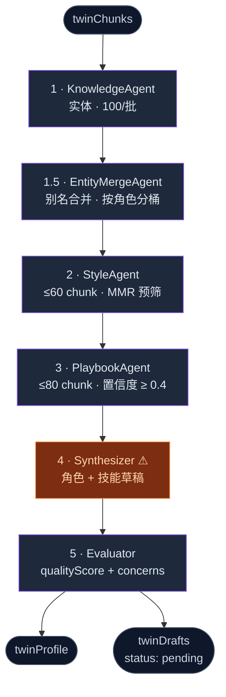

# Distill 流水线

<Status variant="stable" />

<TLDR>
  `runOrchestrator`（`lib/twin/distill/orchestrator.ts:92`）**顺序运行六个 agent** —— Knowledge → EntityMerge
  → Style → Playbook → Synthesizer → Evaluator —— 把 `twinChunks` 转成一个 `twinProfile` 加上可审核的角色 / 技能
  `twinDrafts`。每个 agent 都经 `LlmClient` 抽象缝（`llm.ts:45`）调用，每个非承重 agent 都被 `withTimeoutOrFallback`
  包裹，而 synthesizer 是唯一的硬依赖（那里超时会抛 `SynthesizerError`）。
</TLDR>

## 六个 agent

尽管源码里有 "T1…T5" 标签，执行是 **完全顺序** 的 —— 没有 `Promise.all` 并发。编排器在每个阶段后 ping `onProgress`。



| # | Agent | 范围 / 上限 | 失败时 |
| --- | --- | --- | --- |
| 1 | **KnowledgeAgent**（`knowledge-agent.ts:46`） | 分批循环，`KNOWLEDGE_BATCH_SIZE = 100`；抽取 `ProfileEntity[]` + 每 chunk 实体标签 | 回退 `{entities: [], perChunk: {}}` |
| 1.5 | **EntityMergeAgent**（`entity-merge-agent.ts:165`） | 每角色桶一次 LLM 调用（5 个角色）；折叠别名；桶 `< 6` 跳过 LLM | 回退为未合并桶 |
| 2 | **StyleAgent**（`style-agent.ts:46`） | ≤ 60 chunk；池更大时做 MMR 预筛；产出 `StyleSample[]` | 回退 `{samples: []}` |
| 3 | **PlaybookAgent**（`playbook-agent.ts:76`） | ≤ 80 chunk，需 ≥ 3；**置信度下限 0.4** | 回退 `{playbooks: []}` |
| 4 | **Synthesizer**（`synthesizer.ts:91`） | 画像 + 最后 30 chunk；1 个角色草稿 + 每个置信度 ≥ 0.6 的 playbook 一个技能 | **抛 `SynthesizerError`**（硬） |
| 5 | **Evaluator**（`evaluator.ts:51`） | 以"新人视角"为每个草稿打分；`qualityScore`（默认 0.5）+ `concerns` + `suggestions` | 回退 `{evaluations: {}}` |

knowledge 阶段是分批循环，每批独立守护，使一个慢批拖不垮整次运行：

```ts title="lib/twin/distill/orchestrator.ts:104-122"
for (let i = 0; i < chunks.length; i += KNOWLEDGE_BATCH_SIZE) {
  const batch = chunks.slice(i, i + KNOWLEDGE_BATCH_SIZE)
  const batchLabel = `knowledge-agent#${Math.floor(i / KNOWLEDGE_BATCH_SIZE)}`
  const { value, error } = await withTimeoutOrFallback(
    () => runKnowledgeAgent(llm, { chunks: batch }),
    batchLabel,
    { timeoutMs: agentTimeoutMs,
      fallback: { entities: [] as ProfileEntity[], perChunk: {} as Record<string, string[]> },
      onError: recordFailure },
  )
  allEntities.push(...value.entities)
  Object.assign(chunkEntityTags, value.perChunk)
```

synthesizer 是唯一 **承重** 阶段。它被喂一个 *临时* 画像（基础画像 + 本次运行的新鲜风格样本、playbook 与合并实体），
因此即使部分 agent 回退为空它也总能看到最新蒸馏结果，且那里超时会令整个任务失败：

```ts title="lib/twin/distill/orchestrator.ts:193-213"
const transientProfile: TwinProfile = {
  ...profile,
  styleSamples: [...profile.styleSamples, ...styleResult.value.samples],
  playbooks: [...profile.playbooks, ...playbookResult.value.playbooks],
  entities: dedupeEntitiesByName([...profile.entities, ...mergedEntities]),
  updatedAt: Date.now(),
}
const recent = chunks.slice(-30)
let synthResult: Awaited<ReturnType<typeof runSynthesizer>>
try {
  synthResult = await withTimeout(
    runSynthesizer(llm, { profile: transientProfile, recentChunks: recent }),
    agentTimeoutMs, "synthesizer")
} catch (err) {
  throw new SynthesizerError(err instanceof Error ? err.message : String(err), err)
}
```

## LlmClient 抽象缝

每个 agent 都通过一个极小接口与模型对话，于是生产环境接真实客户端，而测试注入一个永不触网的 mock：

```ts title="lib/twin/distill/llm.ts:45-59"
export interface LlmClient {
  complete(prompt: string, options?: LlmClientCallOptions): Promise<string>
  getUsageSnapshot?(): LlmUsageSnapshot
}
```

`complete` 返回 **原始文本** —— 每个 agent 用 `extractJson`（`llm.ts:188`）自己解析 JSON，它先试围栏块，再回退到一个识别字符串的平衡括号遍历器。
生产工厂是 `createLlmClient`（`llm.ts:133`）；它惰性构建一个 AI-SDK 模型（`@ai-sdk/anthropic` / openai / google /
mistral / cohere）并累计用量快照。`createAnthropicLlmClient`（`llm.ts:177`）是保留向后兼容的废弃别名。`getUsageSnapshot`
是可选的 —— 编排器以 `?.` 守护。

## pin 在重蒸馏中的保留

用户 pin（风格样本、playbook、实体或决策上的 `pinned: true`）必须在重蒸馏中存活。该机制 **分布在两层**：

1. **实体 pin 绕过聚类** —— 在 `EntityMergeAgent` 内，pinned 实体被从桶中过滤出来并原样透传，因此绝不会被重命名为聚类规范名：

   ```ts title="lib/twin/distill/agents/entity-merge-agent.ts:180-189"
   // Pinned entities are user-curated — never cluster, rename, or fold them.
   const pinned = fullBucket.filter((e) => e.pinned)
   const bucket = fullBucket.filter((e) => !e.pinned)
   merged = [...merged, ...pinned]
   if (bucket.length < minBucket) { merged = [...merged, ...bucket]; continue }
   ```

2. **写入时按内容去重 + 保留 pin** —— distill 的 `job-runner` 用 upsert（而非 append），使重跑按内容去重并保留 pin，借助
   `upsert*` DB 辅助函数（`lib/db/twin-profile.ts`）：

   ```ts title="lib/twin/distill/job-runner.ts:101-107"
   // Upsert (not append) so a re-distill de-dupes by content and preserves any
   // user-pinned style sample / playbook instead of multiplying the arrays.
   await upsertStyleSamples(job.twinId, result.styleSamples, { embeddingFn })
   await upsertPlaybooks(job.twinId, result.playbooks)
   if (result.entities.length > 0) { await upsertEntities(job.twinId, result.entities) }
   ```

## 两层 PII 防线

distill 是最可能 *重新引入* PII 的路径，因为 LLM 可能把一个看起来真实的邮箱幻觉进草稿。两道独立守卫拦截它：

- **落库时（静默再脱敏）** —— distill 的 `job-runner` 在写入前对合成草稿负载与 `voiceSummary` 再脱敏，需要清理时记一条警告日志。
- **编辑时（深度扫描，抛错）** —— 当审核者编辑草稿时，`assertDraftBodyClean(payload)`（`draft-pii-guard.ts:54`）用
  `hasNoLeakingPiiDeep` 递归遍历每个字段，使 PII 无法藏在嵌套值里；遇泄漏抛 `DraftPiiError`。`assertFieldsClean`
  （`draft-pii-guard.ts:82`）是 persona 编辑器使用的扁平变体。

像 `<EMAIL_001>` 这样的占位符 **不会** 被标记 —— 真实值仍加密保存在 `twinSources.redactionMapEnc`，仅在接受时还原。

### 接受时反脱敏

`unredact-draft.ts` 在草稿被接受时把占位符还原为真实值。`loadTwinUnredactMap`（`unredact-draft.ts:54`）解密并合并每个源的逆向映射；
`previewUnredact`（`unredact-draft.ts:96`）列出草稿中发现的占位符（每个默认"保留"）；`applyUnredactSelection`
（`unredact-draft.ts:122`）以 JSON 安全的方式把所选原值拼回。这是 [反脱敏对话框](./workbench-ui#drafts-tab--接受流程) 驱动的界面。

## 辅助件

- **`with-timeout.ts`** 是对 `@cognia/primitives` 的再导出薄封装。`withTimeout` 是会拒绝的硬截止；
  `withTimeoutOrFallback` 返回 `{ value, error }`，经 `onError` 记日志并产出给定回退值。默认 agent 超时为 90 秒。
- **`heuristics/style-prefilter.ts`**（`selectStyleCandidates`，L50）用 **TF-IDF 信息量 + 贪心 MMR 多样性**
  （`MMR_LAMBDA = 0.7`）把 StyleAgent 的候选池缩到约 30 个 chunk，并施加每源惩罚使一篇长文档无法独占样本。双语停用词（英文 + 中文）。

## 下一步

<Cards>
  <Card title="运行时" href="./runtime" description="蒸馏出的画像在发送时如何被使用。" />
  <Card title="任务与调度" href="./jobs-and-scheduling" description="distill 任务如何入队、认领与重试。" />
</Cards>
