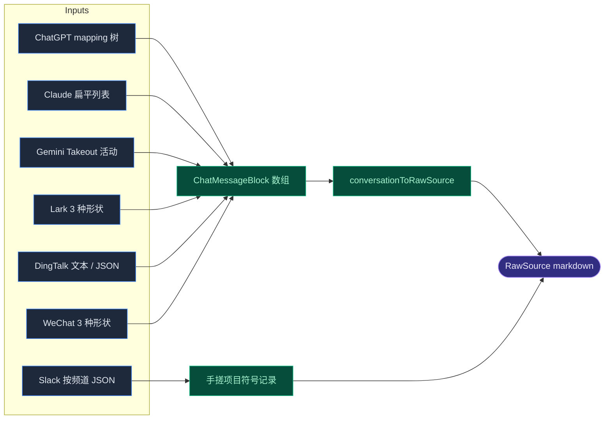

# 导入器

<Status variant="stable" />

<TLDR>
  导入器（`lib/twin/importers/`）把第三方导出转成 `RawSource[]` —— 即 `parseSource` 消费的形状。每个聊天导入器把各平台
  古怪的导出归一为规范的 `ChatMessageBlock[]`，再经 `conversationToRawSource` 渲染成一份 markdown 记录。输出始终是
  `format: "markdown"`，唯独 git-repo 输出 `format: "code"`。
</TLDR>

## 共享契约

`chat-export/types.ts` 定义了最小公分母消息形状，以及每个聊天导入器汇入的汇聚点：

```ts title="lib/twin/importers/chat-export/types.ts:17-26"
export interface ChatMessageBlock {
  speaker: string
  timestamp?: number          // ms since epoch
  text: string
  threadId?: string           // Slack thread_ts / Lark·DingTalk thread root
  externalId?: string         // Slack ts, ChatGPT mapping id
}
```

`conversationToRawSource(input)`（`types.ts:114`）是共享汇聚点：收集去重发言者、计算时间戳范围、构建 `baseMetadata`
（`speakers`、`timestamp`），并经 `blocksToMarkdown`（`types.ts:55`）把 block 渲染成对 heading 切分器友好的 markdown 记录。
空会话返回 `null`。

```ts title="lib/twin/importers/chat-export/types.ts:114-131"
export function conversationToRawSource(input: ConversationToRawSourceInput): RawSource | null {
  if (input.blocks.length === 0) return null
  const speakers = collectSpeakers(input.blocks)
  const { earliest, latest } = timestampRange(input.blocks)
  const baseMetadata: TwinChunkMetadata = {
    speakers,
    ...(earliest !== undefined ? { timestamp: earliest } : {}),
    ...(latest !== undefined && latest !== earliest ? { timestampMax: latest } : {}),
    ...input.extraMetadata,
  }
  return {
    id: nextRawSourceId(input.twinId, input.label),
    filename: `${input.title}.md`,
    format: "markdown",
    text: blocksToMarkdown(input.title, input.blocks),
    baseMetadata,
  }
}
```

### 没有 registry —— 由调用方分发

`importers/index.ts` 是扁平的桶式再导出；**没有分发器映射**。当拖入文件的来源无法从扩展名判断时，
[源上传器](./workbench-ui#sources--上传器) 通过调用导出的形状检测器来挑导入器。检测器集合是有意不对称的：

| 平台 | 形状检测器 | 用共享汇聚点？ |
| --- | --- | --- |
| ChatGPT | `isChatgptExportShape` | 是 |
| Claude | `isClaudeExportShape` | 是 |
| Gemini | `isGeminiExportShape` | 是 |
| Slack | *（无）* | **否 —— 手搓项目符号列表** |
| Lark | `isLarkExportShape` | 是 |
| DingTalk | `isDingtalkTextShape` + `isDingtalkJsonShape` | 是 |
| WeChat | `isWechatExportShape` | 是 |

## 聊天导入器



- **ChatGPT**（`chatgpt.ts:128`）—— `conversations.json` 是带分支的 `mapping` 树。`linearisePath`
  （`chatgpt.ts:77`）从 `current_node` 沿 `parent` 向上遍历（带环检测）再反转 —— 因此重生成的回合（兄弟节点）不会被重复计入。每会话一个 `RawSource`。
- **Claude**（`claude.ts:68`）—— 扁平 `chat_messages`，`sender: "human" | "assistant"`；`pickText` 优先
  `content[].text`，回退 `text`。每会话一个源。
- **Gemini**（`gemini.ts:76`）—— Google Takeout `MyActivity.json`；每条是一问一答 → 两个 block。过滤非 gemini 产品、剥离
  `"Asked Gemini: "` 前缀。整个活动日志输出 **一个** 源。
- **Slack**（`slack.ts:100`）—— 唯一绕过共享汇聚点的导入器。把回复按 `thread_ts` 根分组，渲染成缩进的 **项目符号列表**；
  `resolveDisplayName`（`slack.ts:77`）经可选 `userMap` → `user_profile` → `username` → `<@user>` 解析用户 id。
- **Lark**（`lark.ts:148`）—— 接受三种形状（官方 `chat_name`+`messages`、非官方 CLI `groupName`+`messages`、扁平归一数组），按结构分发。
- **DingTalk**（`dingtalk.ts:122`）—— 两种格式：移动端纯文本（`[YYYY-MM-DD HH:mm:ss] 昵称` 头，由有状态的逐行累加器解析）与桌面端 JSON；先试 JSON，回退文本。
- **WeChat**（`wechat.ts:140`）—— 无官方导出，故支持三种第三方形状（chatlog CSV 行、WechatExporter JSON 用整型消息类型 `1` = 文本、扁平归一）。每个聊天一个源。

Lark / DingTalk / WeChat 反复用一个时间戳启发式：值 `>= 1e12` 即已是毫秒，否则按秒 × 1000。

## 代码：git-repo

`parseGitRepo(options)`（`code-repo/git-repo.ts:50`）是唯一跨入 Rust 的导入器。它委托给 Tauri 命令
**`twin_parse_git_repo`**（经 `git2` crate 的 libgit2）—— 因此 `simple-git` 不在 Next.js bundle 里。非 Tauri 调用方提前返回
`[]`；`invoke` 失败也返回 `[]`（优雅降级）。作用域（`maxCommits`，默认 200；`author` 过滤）在 Rust 侧强制执行，每个 commit
的 diff 是 `--stat` 摘要加一段统一 patch，**上限 8 KB**。

每个 commit 变成一个 `RawSource`，`format: "code"` 且带 `metadata.commitSha`，渲染为含 `diff` 围栏块的 markdown（`renderCommit`，`git-repo.ts:89`）。

## 邮件：mbox 与 eml

`parseMbox(content, options)`（`email/mbox.ts:27`）是手写的 RFC-5322/4155 解析器 —— 无外部库。`splitOnMboxBoundary`
（`mbox.ts:114`）按 `From ` 分隔行切分；`parseHeaders`（`mbox.ts:99`）先展开 RFC-2822 续行再按首个冒号切分。每条消息变成一个
markdown `RawSource`（`# subject` + From/To/Date + 正文）。**不做** quoted-printable / base64 / multipart 解码，也 **不做** 线程化
—— 每条消息独立。`detectMbox`（`mbox.ts:134`）检测 `From ` 行。

`parseEml(content, options)`（`email/eml.ts:14`）是薄封装：它给单个 `.eml` 预置一个合成的 `From ` 标记，使其走同一套 mbox 头/体逻辑，再把 id/文件名改写为 `_eml_`。

## 下一步

<Cards>
  <Card title="Ingest 流水线" href="./ingest-pipeline" description="导入器产出 RawSource 之后会发生什么。" />
  <Card title="工作台 UI" href="./workbench-ui" description="驱动导入器选择的上传器。" />
</Cards>
