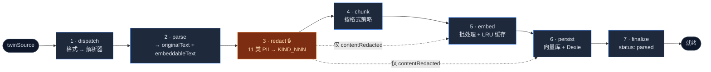

# Ingest 流水线

<Status variant="stable" />

<TLDR>
  `runIngestJob`（`lib/twin/ingest/job-runner.ts:104`）把每个已注册的 `twinSource` 转成被嵌入的
  `twinChunks`。每个源依次执行 **dispatch → parse → redact → chunk → embed → persist → finalize**。
  脱敏（第 3 阶段）是隐私红线：只有 `contentRedacted` 会离开渲染端。单个源失败不致命 —— 循环继续，由执行器决定全员失败的运行是否令任务失败。
</TLDR>

## 七个阶段

实现：`lib/twin/ingest/`。编排器：`runIngestJob`（`job-runner.ts:104`）。进度以 `TOTAL_STAGES = 6`
（`job-runner.ts:73`）跟踪 —— route + parse 共享一个进度步，finalize 钉在 99（100 留给执行器的 `completeJob`）。



runner 逐个处理 `rawSources`。每个源通过分数 `stageBase` 偏移占据进度条的 `1/N` 区段（`job-runner.ts:126`），
因此 Jobs tab 能显示平滑的逐源进度。

```ts title="lib/twin/ingest/job-runner.ts:132-149（阶段主干）"
// Stage 1+2 — dispatch + parse.
await progress(job.id, `parsing:${raw.filename}`, (stageBase + 1) / TOTAL_STAGES)
const parsed = await parseSource(raw)

// Stage 3 — redact PII.
await progress(job.id, `redacting:${raw.filename}`, (stageBase + 2) / TOTAL_STAGES)
const redaction = redactText(parsed.embeddableText, input.nameHints ?? [])

await updateTwinSource(row.id, { kind: parsed.kind, title: parsed.title, bytes: parsed.bytes, redacted: true })
row = (await getTwinSource(row.id)) as TwinSource

// Stage 4 — chunk.
await progress(job.id, `chunking:${raw.filename}`, (stageBase + 3) / TOTAL_STAGES)
```

### 1 · dispatch

`dispatchSource(format)`（`dispatch.ts:84`）是纯路由 —— 给定 `TwinSourceFormat`，返回
`{ kind, routesToDocumentProcessor, importerKey? }`。文档格式（`DOCUMENT_FORMATS`，`dispatch.ts:31`）走
`lib/document/document-processor`；聊天 / 邮件 / 代码格式指定一个导入器（见 [导入器](./importers)）。未知格式抛错。
`detectSourceFormat(filename)`（`dispatch.ts:146`）为上传器把扩展名映射成格式。

### 2 · parse

`parseSource(raw)`（`parse.ts:69`）产出含两份文本的 `ParsedSource`：`originalText`（逐字节、含 PII）与
`embeddableText`（尽力去格式化、进入脱敏的子集）。二进制文档走 `processDocumentAsync`（`mammoth` / `pdfjs-dist`），
文本文档走 `processDocument`，导入器族被惰性 `import()` 并由 `collectImporterText`（`parse.ts:203`）归约成一个 markdown 块。

### 3 · redact —— 隐私红线

`redactText(text, nameHints)`（`redact.ts:227`）是隐私模型的核心。它检测 **11 类 PII**，将每类替换为 `<KIND_NNN>`
占位符（补零、3 位）：

| 类别 | 检测方式 |
| --- | --- |
| `EMAIL` | RFC 宽松正则 |
| `PHONE` | 中国手机 / E.164 / 美国号码 |
| `CN_ID` | 17 位 + 校验位 |
| `BANK_CARD` | 13–19 位，**Luhn 校验** |
| `NAME` | 提示驱动（`nameHints` + 前置标记） |
| `IP_ADDR` | 公网 IPv4（排除回环/私网）+ IPv6 |
| `API_KEY` | 已知前缀（`sk-`、`ghp_`、`AKIA`、`AIza`…）+ 提示词后的高熵串 |
| `JWT` | 三段式 `eyJ…` token |
| `PEM_KEY` | PEM 块标记 |
| `PASSPORT` | 护照模式 |
| `DRIVER_LICENSE` | 中文提示驱动的 12 位 |

逆向映射由 `tokenize`（`redact.ts:209`）构建，对同一原文的重复出现复用同一占位符（文档内稳定）：

```ts title="packages/redact/src/index.ts:209-217"
function tokenize(state: RedactState, kind: PiiKind, original: string): string {
  const cached = state.reuse.get(original)
  if (cached) return cached
  state.counters[kind] += 1
  const placeholder = `<${kind}_${pad(state.counters[kind])}>`
  state.reuse.set(original, placeholder)
  state.map[placeholder] = { placeholder, original, kind }
  return placeholder
}
```

**无泄漏闸门** `hasNoLeakingPii(text)`（`redact.ts:308`）是脱敏后断言 —— 重跑每个检测器，遇首个泄漏即返回 `false`。

<Callout type="info" title="闸门实际如何被执行">
  `hasNoLeakingPii` **并不** 在 ingest runner 内被调用。这里的云安全是 *结构性* 的：runner 只把 `redaction.redacted`
  文本往下游传，且只有 `contentRedacted` 进入嵌入器（`embed.ts:48`）与远程向量负载（`persist.ts:137`）。显式的
  `hasNoLeakingPii` / `hasNoLeakingPiiDeep` 断言守护的是 **distill** 草稿与共享记忆 `publishEntry` 路径 —— 那里
  LLM 生成的文本可能重新引入 PII。见 [Distill 流水线](./distill-pipeline#两层-pii-防线)。
</Callout>

切分后，用于显示的原文是通过 **对脱敏后的 chunk 反脱敏** 重建的，而非按偏移切原文 —— 占位符长度会移动字符偏移，按偏移切会错：

```ts title="lib/twin/ingest/job-runner.ts:169-173"
const enriched = chunks.map((c) => ({
  ...c,
  contentRedacted: c.content,
  content: unredactText(c.content, redaction.map),
}))
```

### 逆向映射加密

PII↔占位符映射在写入 `twinSources.redactionMapEnc` 前先加密。`redaction-key.ts` 使用 **AES-GCM-256**，密钥为
**32 字节原始 CSPRNG**（不做口令派生），每次加密用 12 字节随机 IV（`encryptRedactionMap`，`redaction-key.ts:255`）。存储是双路的：

- **Tauri** —— 密钥存于 OS keyring（`namespace: "twin-redaction"`）；从不进 IndexedDB。
- **Web** —— 密钥以 base64 存于 Dexie `settings` 行（与数据同处，但映射本身仍加密）。

两种模式下都在 Dexie 中存一份密钥的 SHA-256 **指纹**。`getRedactionKey`（`redaction-key.ts:177`）仅在真正首次运行时
引导新密钥；若密钥缺失但指纹存在，则抛 `RedactionKeyMismatchError`，而非静默换钥、令所有既有映射变孤儿：

```ts title="lib/twin/ingest/redaction-key.ts:177-192"
export async function getRedactionKey(): Promise<CryptoKey> {
  let bytes = await readMasterKeyBytes()
  const storedFingerprint = await readStoredFingerprint()
  if (!bytes) {
    if (storedFingerprint) {
      throw new RedactionKeyMismatchError(
        "Twin redaction master key is missing but a key fingerprint is recorded — " +
          "the secret store is unavailable or the key was lost. ...")
    }
    bytes = randomBytes(32)
    await writeMasterKeyBytes(bytes)
    await writeStoredFingerprint(await fingerprintOf(bytes))
  }
```

### 4 · chunk

`prepareChunks(input)`（`chunk.ts:90`）从 `FORMAT_TO_STRATEGY`（`chunk.ts:31`）选策略 —— markdown → `heading`，
代码 / git-repo → `code`，pdf → `smart`，聊天 / 邮件 → `paragraph`，csv → `fixed` —— 再委托给 `chunkDocument`
（`lib/ai/embedding/chunking`），由后者掌管 token 上限与重叠。token 计数用 `~4 字符/token` 近似（`chunk.ts:55`）。

```ts title="lib/twin/ingest/chunk.ts:90-95"
export function prepareChunks(input: ChunkInput): PreparedChunk[] {
  const strategy = input.strategy ?? FORMAT_TO_STRATEGY[input.format] ?? "paragraph"
  const result = chunkDocument(input.redactedText, { ...input.options, strategy })
```

重新 ingest 的幂等不是靠内容哈希 —— 而是 persist 里的 `deleteTwinChunksBySource` 替换（见下）；按内容复用是嵌入缓存的职责。

### 5 · embed

`embedRedactedChunks(redactedTexts, config)`（`embed.ts:48`）以 `DEFAULT_BATCH_SIZE = 64`（`embed.ts:32`）
分批调用 `generateEmbeddings`（`lib/ai/embedding/embedding`）。一个模块级 LRU 缓存（5 000 条，键 `provider::model::text`，
`embed.ts:44`）加上调用内去重，避免重复嵌入相同文本。本层 **无重试/退避** —— `generateEmbeddings` 的拒绝会冒泡到 runner 的逐源 catch。

### 6 · persist —— 远程优先双写

`persistChunks`（`persist.ts:67`）**先** 写远程向量库，再写 Dexie。远程写是硬闸门 —— 若抛错，本地什么都不写，避免两库分叉：

```ts title="lib/twin/ingest/persist.ts:132-150"
await input.store.addDocuments(
  collection,
  rows.map((row, i) => ({
    id: row.vectorDocId,
    content: row.contentRedacted,
    metadata: { twinId: row.twinId, chunkId: row.id, sourceId: row.sourceId,
      contentPreview: row.contentRedacted.slice(0, 200) },
    embedding: input.embeddings[i],
  }))
)
await bulkCreateTwinChunks(rows)
```

写入前 persist 做幂等替换：列出该源的既有 chunk，删其远程文档（失败可容忍）与 Dexie 行，再插入新行 —— 因此重跑绝不重复。
集合名为 `cognia_twin_<twinId>`（`vectorCollectionName`，`persist.ts:24`）。

### 7 · finalize

`finalizeIngestRun`（`job-runner.ts:243`）触碰 `twinProfile.updatedAt`（刷新工作台统计卡）、把任务进度钉到 99，并返回一个
`failureSummary`，其 `allFailed` 标志告诉执行器：全部源失败的运行是否应令整个任务失败。

## 失败模型

单源错误被捕获并记录（`updateTwinSource(..., status: "failed")`），但循环继续到下一个源（`job-runner.ts:196-204`）。
runner 本身 **无 lease 续期、无重试** —— 那些归 [任务 worker](./jobs-and-scheduling)。它唯一抛出的信号是
`failureSummary.allFailed`，worker 据此升级为任务级失败。

## URL ingest

`fetchUrlAsRawSource(url)`（`url-fetcher.ts:47`）以 30 秒 `AbortController` 超时抓取 URL，从 HTML `<title>` 或 URL 提取标题，
`pickFormatForUrl`（`url-fetcher.ts:75`）按内容类型返回 `html` 或 `markdown` —— 产出一个由普通流水线 ingest 的 `RawSource`。

## 下一步

<Cards>
  <Card title="导入器" href="./importers" description="喂给 parseSource 的东西 —— 聊天 / 代码 / 邮件导入器。" />
  <Card title="Distill 流水线" href="./distill-pipeline" description="消费本流水线产出的 chunk。" />
</Cards>
