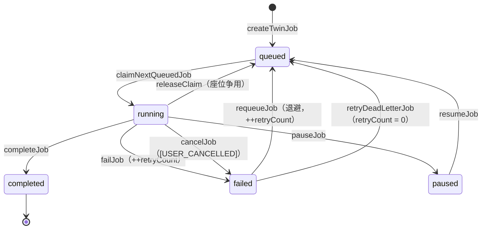
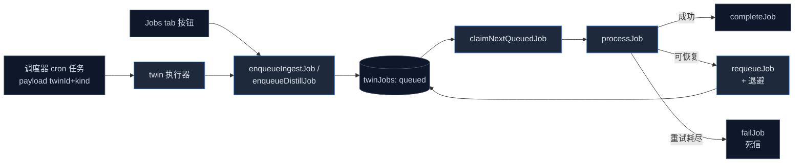

# 任务与调度

<Status variant="stable" />

<TLDR>
  ingest 与 distill 都以持久化的 `twinJobs` 行运行。worker（`lib/twin/job-worker.ts:284`）轮询、原子认领最旧的合格任务
  （`claimNextQueuedJob`，`twin-jobs.ts:95`）并路由它。崩溃恢复靠 **lease**（10 分钟 TTL）—— lease 过期的 `running` 行会被重新认领。
  瞬时失败按指数退避重试（`job-retry.ts`），3 次后进入死信。一个每孪生 cron 桥（`cron-bridge.ts:93`）让日程与调度器保持同步。
</TLDR>

## 任务生命周期



`TwinJobStatus` 为 `queued | running | paused | completed | failed`。`requeueJob` 与 `failJob` 都递增 `retryCount`；
`releaseClaim` 与 `resumeJob` 不递增；`retryDeadLetterJob` 把它重置为 0（`twin-jobs.ts`）。

## worker

`startJobWorker(config, twinId?)`（`job-worker.ts:284`）返回一个句柄（`pause` / `resume` / `pauseJob` / `resumeJob` /
`stop`）并跑一个 `setTimeout` 轮询循环（间隔 `max(500, pollIntervalMs ?? 2000)`）。每次 tick 认领一个任务并分派，受
**按种类并发上限**（`maxConcurrentIngest` / `maxConcurrentDistill`，各最小 1）约束，由 in-flight `Set` 跟踪：

```ts title="lib/twin/job-worker.ts:305-326（tickOnce）"
const job = await claimNextQueuedJob(twinId, (config.now ?? Date.now)())
if (!job) return
if (!seatsOpen(job.kind)) {
  await releaseClaim(job.id)   // seat contention != failure; no retry burn
  return
}
const tracker = job.kind === "ingest" ? inflightIngest : inflightDistill
tracker.add(job.id)
const promise = processJob(job.id, config)
  .catch((err) => { log.error("twin job-worker: tick error", err) })
  .finally(() => { tracker.delete(job.id); inflightAll.delete(promise) })
inflightAll.add(promise)
```

`processJob`（`job-worker.ts:103`）按 `job.kind` 路由：`"ingest"` → `runIngestJob`，`"distill"` / `"re-distill"` →
`runDistillJob`（未知种类，或没有配置 LLM 的 distill，会立即失败而不消耗重试）。`failureSummary.allFailed` 为真的 ingest 会被升级为任务失败。

<Callout type="info" title="无 tab 锁 —— 认领即是锁">
  没有跨 tab 互斥量。唯一的并发守卫是 `claimNextQueuedJob` 内的原子事务 —— queued → running 的翻转发生在
  `db.transaction("rw", ...)` 内，因此两个 worker 绝不会认领同一行。进程内并行由按种类的 in-flight 集合约束，而非锁。
</Callout>

## 原子认领 + lease 恢复

`claimNextQueuedJob` 在一个事务里选出合格行：退避（`nextAttemptAt`）已过的 `queued` 行，**加上** `leaseExpiresAt` 已过的
`running` 行（崩溃或关闭的 worker），按 `queuedAt` FIFO 排序。胜者被翻转为 `running` 并赋予新的 10 分钟 lease：

```ts title="lib/db/twin-jobs.ts:95-129（节选）"
return db.transaction("rw", db.twinJobs, async () => {
  const queued = await db.twinJobs.where("status").equals("queued").toArray()
  const stuck  = await db.twinJobs.where("status").equals("running").toArray()
  const eligible = [
    ...queued.filter((j) => (j.nextAttemptAt ?? 0) <= now),                     // backoff elapsed
    ...stuck.filter((j) => j.leaseExpiresAt !== undefined && j.leaseExpiresAt <= now), // crashed worker
  ].sort((a, b) => a.queuedAt - b.queuedAt)                                      // FIFO
  if (eligible.length === 0) return undefined
  const oldest = eligible[0]
  const claimed = { ...oldest, status: "running", phase: "starting",
    startedAt: Date.now(), leaseExpiresAt: now + LEASE_TTL_MS }
  await db.twinJobs.put(claimed)
  return claimed
})
```

健康的任务通过 `updateJobProgress`（`twin-jobs.ts:147`）保活 lease，它在每次进度写入时刷新 `leaseExpiresAt`。**没有** lease 的
`running` 行永不被重新认领（`!== undefined` 守卫），因此尚未开始报告进度的任务不会被竞态重认领。

## 重试与死信

`job-retry.ts` 是纯计算。`backoffMs(attempt)` 是带抖动的指数退避，上限 60 秒；超过 `MAX_RETRIES = 3` 后任务进入死信：

```ts title="lib/twin/job-retry.ts:31-37"
export function backoffMs(attempt: number, random: () => number = Math.random): number {
  if (!Number.isFinite(attempt) || attempt < 1) return BASE_BACKOFF_MS   // 1000
  const exp = BASE_BACKOFF_MS * Math.pow(2, attempt - 1)                 // 1s, 2s, 4s...
  const capped = Math.min(MAX_BACKOFF_MS, exp)                           // cap 60s
  const jitter = Math.floor(random() * 500)                             // [0, 500ms)
  return capped + jitter
}
```

可恢复失败时 worker 计算 `backoffMs(retryCount + 1)` 并 `requeueJob(id, now + wait)`；一旦 `shouldRetry(retryCount)`
为假，就 `formatDeadLetter` 该消息并 `failJob`。死信消息可经 `parseDeadLetter` 往返，使 Jobs tab 能显示原始错误与尝试次数。

## 每孪生 cron

`syncTwinCronToScheduler(twinId, cron)`（`cron-bridge.ts:93`）把一个孪生的 `TwinCronSettings`（`enabled`、`ingestSchedule`、
`distillSchedule`、`timezone`）与调度器的任务表对账。它拥有两个任务 id —— `twin::<twinId>::ingest` 与 `twin::<twinId>::distill`
—— 并针对每一侧，根据日程是否启用且 cron 表达式是否有效，创建 / 更新 / 删除调度器任务：

```ts title="lib/twin/cron/cron-bridge.ts:108-126（ingest 侧）"
const ingestExpr = cron?.ingestSchedule?.trim() ?? ""
if (enabled && ingestExpr) {
  if (!validateCronExpression(ingestExpr).valid) {
    result.invalidExpressions.push(`ingest: ${ingestExpr}`)
  } else {
    const next = buildTask(twinId, "ingest", ingestExpr, cron?.timezone, existingIngest)
    if (existingIngest) { await schedulerDb.updateTask(next); result.ingest = "updated" }
    else { await schedulerDb.createTask(next); result.ingest = "created" }
  }
} else if (existingIngest) {
  await schedulerDb.deleteTask(ingestId); result.ingest = "deleted"
}
```

每个任务为 `type: "twin"`，带 `payload: { twinId, kind }`；调度器的 twin 执行器读取该 payload 并调用
`enqueueIngestJob` / `enqueueDistillJob`，它们铸造 worker 随后认领的 `queued` `twinJobs` 行。`CRON_PRESETS`
（`cron-bridge.ts:152`）提供每小时 / 每 6 小时 / 每日 03:00 / 每周一 09:00。级联 `deleteTwin` 用 `undefined` 调用它以删除两个任务。

## 端到端



## 下一步

<Cards>
  <Card title="工作台 UI" href="./workbench-ui" description="驱动这些队列的 Jobs tab 与 cron 卡。" />
  <Card title="Ingest 流水线" href="./ingest-pipeline" description="一个 ingest 任务实际运行什么。" />
</Cards>
