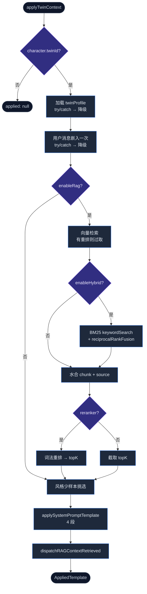

# 运行时

<Status variant="stable" />

<TLDR>
  `applyTwinContext`（`lib/twin/runtime/apply-twin-context.ts:170`）是唯一的发送时入口。对一个绑定孪生的角色，它把用户消息
  **只嵌入一次**，执行 RAG（向量，可选经 RRF 与 BM25 融合，可选过取并做词法重排），挑选风格少样本，组装四段式系统提示。
  它 **永不抛错** —— 每个可能失败的 I/O 步都被单独守护，宁可降级为"更少上下文"也不打断聊天。它接入了 `resolveSendOptions`
  （`lib/claude/build-options.ts:625`）。
</TLDR>

## 发送时流程



全部六个 `TwinSettings` 在 `settingsFor(character)`（`apply-twin-context.ts:113`）一次性解析，各自以
`?? DEFAULT_TWIN_SETTINGS.*` 取默认。用户消息只嵌入一次，那一个向量同时喂给 RAG 与风格两条路 —— 团队聊天甚至连这次也省去，靠传入
`precomputedQueryEmbedding`。

### 过取 + 向量检索

当配置了重排器时，检索会过取一个更大的候选池（默认 3×），让重排有可重排的内容：

```ts title="lib/twin/runtime/apply-twin-context.ts:222-229"
const overFetch = deps.reranker?.overFetch ?? 3
const fetchLimit = deps.reranker
  ? Math.max(settings.ragTopK * overFetch, settings.ragTopK)
  : settings.ragTopK
const vectorHits = await deps.store.searchByEmbedding(collection, queryEmbedding, {
  limit: fetchLimit,
})
```

### 混合检索（BM25 + RRF）

当 `enableHybrid` 打开时，一个每孪生 BM25 关键词检索与向量检索并行运行，两个排序列表用 Reciprocal Rank Fusion 融合。BM25 失败会优雅退回纯向量：

```ts title="lib/twin/runtime/apply-twin-context.ts:245-253"
const keywordHits = await keywordSearch(character.twinId, userMessage, fetchLimit)
const keywordWeight = Math.min(1, Math.max(0, settings.hybridKeywordWeight))
const fused = reciprocalRankFusion(
  [vectorHits.map((h) => ({ id: h.id, score: h.score })), keywordHits],
  [1 - keywordWeight, keywordWeight],
  60
)
orderedIds = fused.slice(0, fetchLimit).map((f) => f.id)
```

BM25 索引（`bm25-index.ts`）是对共享 `BM25Index`（`lib/ai/rag/hybrid-search.ts`，`k1 = 1.2`、`b = 0.75`、CJK 感知分词器）的每孪生
LRU 缓存（最多 3 个孪生）。它索引 `contentRedacted`，即嵌入器所见的同一份文本，使关键词与向量视图保持一致。其缓存键是
`getTwinChunksVersion`（数量 + 最新 `createdAt`），因此一次 ingest 会自动令其失效。RRF 以 `Σ weight_i · 1/(k + rank + 1)`、`k = 60`
合并列表（`reciprocalRankFusion`，`hybrid-search.ts:247`）。

### 词法重排

若配置了重排器且候选多于 `ragTopK`，过取的池会被重新打分并裁剪。内置词法打分器把先前的余弦分与查询词覆盖率混合：

```ts title="lib/twin/runtime/reranker.ts:147-157"
const queryTerms = tokenSet(query)
if (queryTerms.size === 0) return c.score
const contentTerms = tokenSet(c.content)
let covered = 0
for (const term of queryTerms) if (contentTerms.has(term)) covered += 1
const coverage = covered / queryTerms.size
return 0.7 * c.score + 0.3 * coverage   // 70% 余弦, 30% 关键词覆盖
```

`rerank`（`reranker.ts:73`）让打分器与一个 1.5 秒超时竞速，任何错误都回退到原序 —— 因此重排器打嗝绝不丢结果，只是保留融合后的顺序。

### 风格少样本挑选

`selectFewShotSamples`（`few-shot-selector.ts:70`）**逐样本** 对风格样本排序：若样本有缓存嵌入，按与查询嵌入的余弦打分，否则逐个回退到词重叠
（无查询文本时回退到长度启发式）。因此单个未嵌入的样本不会令整条路失效 —— 一个惰性回填（`maybeBackfillStyleEmbeddings`，
`apply-twin-context.ts:140`）在后台补齐缺失的嵌入。

## 四段式提示

`applySystemPromptTemplate`（`system-prompt-template.ts:112`）用 `\n\n---\n\n` 连接至多四段：

| # | 段 | 来源 | 可缓存性 |
| --- | --- | --- | --- |
| 1 | 基础角色提示 | `character.systemPrompt` | 稳定 |
| 2 | 孪生身份 | `You are <name>` + 语气摘要 + 实体词典 | 稳定（缓存友好） |
| 3 | 相关历史材料 | 召回的 chunk（`contentRedacted`，带分数 + 引用指令） | 每回合 |
| 4 | 风格示例 | 选中的少样本（逐字原文） | 每回合 |

空段会被跳过，因此绝不会有悬空标题。召回的 chunk 渲染其 `contentRedacted`（而非原始 content），使提示与被嵌入、被索引的内容保持一致。

## 依赖注入

`applyTwinContext` 经 `deps` 接收其向量库、嵌入配置与可选重排器。`tryBuildTwinDeps`（`build-deps.ts:14`）从
`TwinRuntimeSettings` 组装它们 —— 除非 worker 已启用、存在嵌入 API key、且所选向量后端的必需字段齐全，否则返回 `undefined`（不注入）。
重排器仅在 `settings.reranker.enabled` 时构建，默认用免密钥的 `lexicalRerankScorer`，`overFetch: 3`。

## 运行时在何处被调用

```mermaid
sequenceDiagram
  participant Hook as use-claude-chat
  participant BO as resolveSendOptions
  participant RT as applyTwinContext
  Hook->>Hook: tryBuildTwinDeps()（twinHandshake，L1139）
  Hook->>BO: resolveSendOptions(ctx 含 twinDeps + twinUserMessage)
  BO->>RT: applyTwinContext(...)（build-options.ts:627）
  RT-->>BO: { applied, retrievedChunks, degraded }
  BO->>BO: baseSystem = applied.systemPrompt; twinReplacedBase = true
  BO-->>Hook: opts（含 opts.twinContext）
  Hook->>Hook: turnComplete → mergeTwinSourcesIntoLastAssistant（L1460）
```

- **聊天（主路径）** —— `resolveSendOptions`（`build-options.ts:625-662`）在角色绑定孪生且调用方提供了 `twinDeps` + `twinUserMessage`
  时调用 `applyTwinContext`。`result.applied` 时它替换 `baseSystem` 并置 `twinReplacedBase = true`（这会抑制 v2 persona 段，避免矛盾指引）。
  整块包在 try/catch 中 —— 失败保留原提示。召回的上下文被暂存到 `opts.twinContext` 供 UI 使用。
- **聊天 hook 握手** —— `use-claude-chat.ts:1139` 在有用户消息时构建 deps；在 `turnComplete`（`use-claude-chat.ts:1460`）把一个 Twin SourcesPart 附到助手消息。
- **工作流** —— `lib/workflow/nodes/shared/twin-injector.ts:70` 是另一个调用方。

<Callout type="warn" title="注入日志仅工作流">
  `recordTwinInject`（`inject-log.ts:38`）是一个内存环形缓冲（最近 200 条），由 [注入日志卡](./workbench-ui#settings-tab) 展示。
  目前 **唯一** 的生产者是工作流 `twin-injector`；聊天发送路径 **不** 写入它，因此聊天侧的注入不会出现在该诊断视图。在聊天路径接入之前，请把该卡视为面向工作流的。
</Callout>

## 下一步

<Cards>
  <Card title="Distill 流水线" href="./distill-pipeline" description="本运行时所读画像的产生方式。" />
  <Card title="工作台 UI" href="./workbench-ui" description="配置检索的设置，以及注入日志视图。" />
</Cards>
