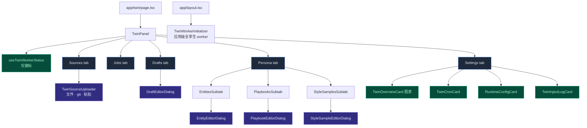

# 工作台 UI

<Status variant="stable" />

<TLDR>
  工作台（`components/twin/`，路由 `app/twin/page.tsx`）是整个孪生生命周期的主界面。`TwinPanel`
  （`twin-panel.tsx:78`）解析当前孪生并渲染 **五个** Radix tab —— Sources · Jobs · Drafts · Persona · Settings ——
  并经 `useTwinWorkerStatus` 显示 worker 徽标。任务 worker 本身在 **应用级**运行（见下方 _worker 生命周期_），不由面板挂载。Overview、Cron 与 Inject-log 界面是 **Settings tab 内的卡**，不是顶级 tab。
</TLDR>

## 组件树



`TwinPanel` 把当前 tab 与孪生镜像到 URL（`?tab=`、`?twinId=`）并无条件挂载 worker；一个状态徽标显示 worker 是否活跃（以及若否，原因）：

```tsx title="components/twin/twin-panel.tsx:43-44 —— 真实 tab 集"
type TabKey = "sources" | "jobs" | "drafts" | "persona" | "settings"
const VALID_TABS: TabKey[] = ["sources", "jobs", "drafts", "persona", "settings"]
```

## Sources & 上传器

Sources tab（`twin-sources-tab.tsx:34`）列出已注册的源（标题、状态徽标、格式、字节、chunk 数、错误），带逐行删除和
`?sourceId=` 深链滚动/高亮。"Add source" 挂载 `TwinSourceUploader`（`twin-source-uploader.tsx:492`），它有 **三** 条输入路径：

1. **文件选择器** —— 文本 + 二进制文档（二进制经 `processDocumentAsync` 客户端解析），以及经导入器形状检测器
   （`detectChatJsonImporter`，`twin-source-uploader.tsx:172`）自动分发的 JSON 聊天导出；mbox/eml 会展开成多个源。
2. **Git 仓库**（仅 Tauri）—— max-commits + author 过滤，经 Tauri 对话框调用 `parseGitRepo`。
3. **粘贴文本** —— 标题 + 来自 `listSupportedFormats()` 的格式 `Select` + 内容文本域。

三条路径都写入 `status: "pending"` 的 `twinSource`（用 SHA-256 指纹）。上传器只 **注册** 源 —— 实际的 chunk ingest 从 Jobs tab 单独触发。

## Jobs tab

`twin-jobs-tab.tsx:27` 暴露两个队列按钮 —— "Queue ingest"（对 pending 源 `enqueueIngestJob`）与 "Queue distill"
（`enqueueDistillJob`）—— 以及每个任务一行的实时显示：

```tsx title="components/twin/twin-jobs-tab.tsx:33-41"
const queueIngest = async () => {
  const pending = await listTwinSourcesByTwinAndStatus(twinId, "pending")
  if (pending.length === 0) return
  await enqueueIngestJob({ twinId, sourceIds: pending.map((s) => s.id) })
}
const queueDistill = async () => {
  await enqueueDistillJob(twinId)
}
```

每个 `JobRow`（`twin-jobs-tab.tsx:84`）显示状态徽标（运行时脉动）、种类 + 尝试徽标、死信徽标（经 `parseDeadLetter`）、实时
`<Progress>` 条，以及任务失败时的 **Retry** 操作（`retryFailedJob`）。当前 UI 没有暂停/取消控件，尽管状态枚举含 `paused`。

## Drafts tab — 接受流程

`twin-drafts-tab.tsx:43` 把 pending 草稿排在前、`qualityScore` 最低的排在最前。每个 `DraftRow` 显示种类、状态、质量徽标、正文、
评估器的 concerns / suggestions，以及（pending 时）Edit / Reject / Accept 操作。**接受会写入一个真实的角色或技能行**，再用新 id 标记草稿已接受：

```tsx title="components/twin/twin-drafts-tab.tsx:126-148"
if (draft.payload.kind === "character") {
  const character = await createCharacter({
    name, description, avatarColor: "oklch(0.7 0.15 240)",
    systemPrompt: body, twinId: draft.twinId,
  })
  acceptedId = character.id
} else {
  const skill = await createSkill({ name, description, content: body })
  acceptedId = skill.id
}
await markTwinDraftAccepted(draft.id, acceptedId)
```

编辑草稿会在 `updateTwinDraftPayload` 前运行 `assertDraftBodyClean`（[编辑时 PII 守卫](./distill-pipeline#两层-pii-防线)）。
独立的 `UnredactDialog`（`unredact-dialog.tsx:62`）是 M2 界面，用于在草稿成行前把 `<KIND_NNN>` 占位符还原为真实值（见
[接受时反脱敏](./distill-pipeline#接受时反脱敏)）。

## Persona tab

`twin-persona-tab.tsx:40` 是对 `twinProfile` 的实时视图，含三个嵌套子 tab 与计数徽标：

```tsx title="components/twin/twin-persona-tab.tsx:64-79（节选）"
<TabsList className="w-max">
  <TabsTrigger value="entities">{t("tabs.entities")}</TabsTrigger>
  <TabsTrigger value="playbooks">{t("tabs.playbooks")}</TabsTrigger>
  <TabsTrigger value="style">{t("tabs.styleSamples")}</TabsTrigger>
</TabsList>
<TabsContent value="entities"><EntitiesSubtab twinId={twinId} entities={safeProfile.entities} /></TabsContent>
<TabsContent value="playbooks"><PlaybooksSubtab twinId={twinId} playbooks={safeProfile.playbooks} /></TabsContent>
<TabsContent value="style"><StyleSamplesSubtab twinId={twinId} styleSamples={safeProfile.styleSamples} /></TabsContent>
```

每个子 tab 可搜索且 **pin 优先** 排序 —— 实体按名、playbook 按置信度、风格样本按时间新近。逐行 pin / 编辑 / 删除经
`twin-profile.ts` 的逐项辅助函数写入（`setEntityPinned`、`updatePlaybook`、`removeStyleSample`…）。三个编辑器对话框
（`EntityEditorDialog`、`PlaybookEditorDialog`、`StyleSampleEditorDialog`）都经 `assertFieldsClean` 受 PII 守护，且手动新增默认
`pinned: true` —— 因此人工编辑总能在下次重蒸馏中存活。

## Settings tab

`twin-settings-tab.tsx:60` 堆叠一张画像统计卡和四张卡：

- **`TwinOverviewCard`**（`twin-overview-card.tsx:73`）—— recharts 仪表盘：7 天 chunk 增长面积图、源种类饼图、切分策略柱图、状态行。
- **`TwinCronCard`**（`twin-cron-card.tsx:42`）—— 启用开关加 ingest/distill cron 字段，带 `CRON_PRESETS` 选择器与人类可读预览；保存调用 `updateTwin` 再 `syncTwinCronToScheduler`，`CronTriggerInfo` 读调度器行显示上次/下次运行。
- **`RuntimeConfigCard`**（`twin-settings-tab.tsx:101`）—— 实时 `TwinRuntimeSettings` 编辑器：worker-enabled + 重排器开关、嵌入 provider/model/key、distill LLM，以及向量库后端及其逐后端字段（`native` 仅在 Tauri 显示，带打开文件夹 / 测试连接 / 重置库操作）。保存调用 `saveTwinRuntimeSettings`。
- **`TwinInjectLogCard`**（`twin-inject-log-card.tsx:30`）—— 内存注入环形缓冲的最近 50 条（applied / skipped / degraded + chunk/sample/token 计数）。如 [运行时页](./runtime) 所述，目前仅由工作流路径喂数据。

## worker 生命周期

任务 worker 是 **应用级而非面板级**。`TwinWorkerInitializer`（`twin-worker-initializer.tsx`）在 `app/layout.tsx`
中挂载一次（紧邻 `SchedulerInitializer`），调用 `useBackgroundTwinWorker`：它实时读取 `TwinRuntimeSettings`，经
`buildTwinWorkerConfig` 构建一个与具体孪生无关的 `JobWorkerConfig`（当 worker 被禁用、向量配置不全或缺 LLM key
时返回 `null`，即无 worker），并启动一个 **全孪生** worker（`startJobWorker(config)`，不带 `twinId` → 排空每个孪生的队列），卸载时停止：

```ts title="components/twin/use-twin-worker.ts (useBackgroundTwinWorker)"
useEffect(() => {
  if (!config) return
  const handle = startJobWorker(config)   // 不带 twinId → 全孪生
  return () => { void handle.stop() }
}, [config])
```

这正是让 cron 入队的 ingest/distill 作业在应用打开时就能排空的关键 —— `twinJobs` 是 IndexedDB（渲染端）表，调度器的
twin executor 只能往里 _入队_；排空需要一个活的渲染端 worker，若把它绑死在 `/twin` 页，凌晨 03:00 的定时 ingest
就只有在工作台恰好打开时才会运行。

面板改用 `useTwinWorkerStatus(twinId)` —— 一个纯粹、无副作用的派生（不启动任何 worker，避免对同一队列起第二个轮询循环），
返回 `{ active, reasonKey? }`（原因：`noTwinSelected` / `disabled` / `incompleteConfig`）用于 worker 徽标。

## 多孪生切换器

`TwinSelector`（`twin-selector.tsx:94`）是更丰富的多孪生管理器 —— 一个带创建 / 重命名 / 克隆 / 归档 / 删除（驱动
`lib/db/twins.ts`）的下拉菜单和一个归档区。注意：`TwinPanel` 本身用一个朴素的内联 `Select` 切换；`TwinSelector` 是用于孪生生命周期管理的更完整替代界面。

## 下一步

<Cards>
  <Card title="概览" href="./index" description="返回子系统概览与模块导航。" />
  <Card title="数据模型" href="./data-model" description="每个 tab 读写的表。" />
</Cards>
