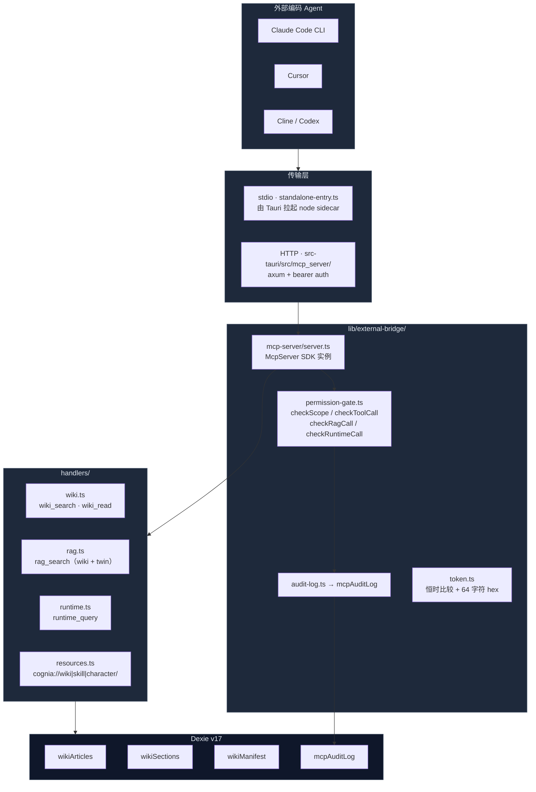

# 外部桥

<Status variant="stable">Phase 1 已实现 · stdio + HTTP 双传输</Status>

<TLDR>
  External Bridge 把 Cognia 自己生成的代码 Wiki、RAG 切片与运行时实体（skills / characters / twins /
  plugins / agent-teams）通过 MCP 协议暴露给外部编码 Agent（Claude
  Code、Cursor、Cline、Codex）。所有调用经 **permission-gate** 与白名单比对，默认仅开启
  `wiki:cognia` + `rag:cognia` 两个公共代码 scope，其他 scope 必须在 Settings
  里手动打开。每次调用都会写一行 `mcpAuditLog`（封顶 5000 条），用户可在 Settings → External Bridge
  看到外部 Agent 究竟问了什么。stdio 传输跑在 Node sidecar 里，HTTP 传输由 Tauri
  Rust（axum）承载，两条路通向同一份 `lib/external-bridge/` 代码。
</TLDR>

## 适用场景

- 在 IDE 里跑 Claude Code / Cursor，需要让它"了解"Cognia 自己的代码结构（"Cognia 的 twin distill pipeline 是怎么工作的？"）。
- 把 Cognia 已经维护的 skills / characters 暴露给 Claude Code，作为可读资源（`cognia://skill/<id>` → SKILL.md）。
- 让外部 Agent 查询 Cognia 的运行时实体清单（`runtime_query`），例如"列出我安装的所有插件"。
- 通过 `rag_search`（scope=`twin`）让外部 Agent 触达用户数字孪生中的私有上下文 —— 仅在用户**显式**开启 `rag:twin` 后才可用。

## 不适用场景

- 外部 Agent 写入 Cognia 状态（保存 skill、写笔记） —— Phase 4 才会引入 `record_lesson` / `save_skill_draft` 等 inbound 写工具。
- 多机/远程访问 —— HTTP 传输仅绑定 `127.0.0.1`，token 也以明文存放在本地 IndexedDB，未做密钥管理。
- 内部模块自查询 —— Cognia 自己读 wiki 应直接走 `lib/db/wiki-articles.ts`；MCP 服务是给"外部"用的。

## 架构



## 关键模块与文件路径

<Files>
  <Folder name="lib/external-bridge/" defaultOpen>
    <File name="types.ts" />
    <File name="permission-gate.ts" />
    <File name="audit-log.ts" />
    <File name="token.ts" />
    <File name="tauri-control.ts" />
    <Folder name="mcp-server/">
      <File name="server.ts" />
      <File name="transport-stdio.ts" />
      <File name="standalone-entry.ts" />
    </Folder>
    <Folder name="handlers/">
      <File name="wiki.ts" />
      <File name="rag.ts" />
      <File name="runtime.ts" />
      <File name="resources.ts" />
    </Folder>
  </Folder>
  <Folder name="types/wiki/">
    <File name="index.ts" />
  </Folder>
  <Folder name="lib/db/">
    <File name="wiki-articles.ts" />
    <File name="wiki-sections.ts" />
    <File name="wiki-manifest.ts" />
    <File name="mcp-audit-log.ts" />
  </Folder>
  <Folder name="components/settings/external-bridge/">
    <File name="external-bridge-section.tsx" />
    <File name="wiki-rebuild-card.tsx" />
  </Folder>
</Files>

| 文件                             | 职责                                                                                          |
| -------------------------------- | --------------------------------------------------------------------------------------------- | ----- | ----------------------------- |
| `types.ts`                       | 重导出 `BridgeScope` / `ExternalBridgeSettings` / `TOOL_TO_SCOPE` / `RUNTIME_ENTITY_TO_SCOPE` |
| `permission-gate.ts`             | `checkScope` / `checkToolCall` / `checkRuntimeCall` / `checkRagCall` —— 单一信任来源          |
| `audit-log.ts`                   | `recordCall` 封装 → 写 `mcpAuditLog`，吞掉 Dexie 失败不抛                                     |
| `token.ts`                       | 32 字节随机 hex token、`constantTimeEquals`、`parseBearerHeader`                              |
| `tauri-control.ts`               | `startMcpServer / stopMcpServer / restartMcpServer / getMcpServerStatus` 四个 IPC 封装        |
| `mcp-server/server.ts`           | `buildMcpServer({ settingsGetter })` —— 注册四个工具 + 三类资源 + 两条引导 prompt             |
| `mcp-server/standalone-entry.ts` | Node CLI 入口，根据 `COGNIA_BRIDGED` 选择 bridged / standalone 两种 settings 来源             |
| `handlers/wiki.ts`               | token-overlap 排序的 `wiki_search` + 按 slug 取全文的 `wiki_read`                             |
| `handlers/rag.ts`                | 段落级 BM25-ish 检索（wiki sections / twin chunks 双路径）                                    |
| `handlers/runtime.ts`            | 列出/读取 5 种运行时实体；list 故意丢字段保持响应紧凑，get 返回整行                           |
| `handlers/resources.ts`          | `cognia://wiki                                                                                | skill | character/:id` URI 解析与读取 |

## 权限模型

权限是这个子系统的核心。10 个 scope（`BridgeScope`）一一映射到 Settings UI 的开关：

| Scope                 | 默认 | 允许范围                                          |
| --------------------- | :--: | ------------------------------------------------- |
| `wiki:cognia`         |  ✅  | 读 Cognia 自己源码生成的 wiki 文章                |
| `wiki:user-repo`      |  ❌  | 读用户外部仓库的 wiki（Phase 3 解锁）             |
| `rag:cognia`          |  ✅  | 段落级 RAG over Cognia 源码                       |
| `rag:user-repo`       |  ❌  | 段落级 RAG over 用户外部仓库（Phase 3）           |
| `rag:twin`            |  ❌  | RAG over 用户数字孪生 —— 涉及隐私数据，强默认 OFF |
| `runtime:skills`      |  ❌  | 列出/读取 skills                                  |
| `runtime:characters`  |  ❌  | 列出/读取 characters                              |
| `runtime:twins`       |  ❌  | 列出 twin id 及其 sources                         |
| `runtime:plugins`     |  ❌  | 列出/读取已安装插件                               |
| `runtime:agent-teams` |  ❌  | 列出/读取 agent teams                             |

`permission-gate.ts` 的入口结构：

```ts title="lib/external-bridge/permission-gate.ts"
export function checkScope(
  settings: ExternalBridgeSettings | undefined,
  scope: BridgeScope
): ScopeCheckResult {
  if (!settings) return { allowed: false, reason: "external bridge not configured" }
  if (!settings.enabled) return { allowed: false, reason: "external bridge disabled" }
  if (!settings.enabledScopes.includes(scope)) {
    return {
      allowed: false,
      reason: `scope '${scope}' not enabled — toggle it in Settings → External Bridge`,
    }
  }
  return { allowed: true }
}
```

四个 helper 把不同入口归一到 `checkScope`：

- `checkToolCall(settings, "wiki_search")` —— 从 `TOOL_TO_SCOPE` 表里取 scope。
- `checkRuntimeCall(settings, "skill")` —— 从 `RUNTIME_ENTITY_TO_SCOPE` 取 scope。
- `checkRagCall(settings, "twin")` —— twin 走 `rag:twin`，其余 wiki scope 走 `rag:cognia`。
- 未知工具/未知实体 → `unknown tool` / `unknown runtime entity` 直接拒。

## 数据流

### 一次 `wiki_search` 调用

<Steps>
<Step>外部 Agent 通过 stdio 或 HTTP 发出 JSON-RPC `tools/call name=wiki_search`。</Step>
<Step>`server.ts:registerWikiTools` 注册的回调收到 args。</Step>
<Step>`runWithGate` 取 `settingsGetter()` → 拿到 `ExternalBridgeSettings` 当前快照。</Step>
<Step>`checkToolCall(settings, "wiki_search")` → 检查 `wiki:cognia` 是否在 `enabledScopes`。</Step>
<Step>若拒绝：`recordCall({ allowed: false, reason })` 后返回 `isError: true` 的 MCP envelope，外部 Agent 看到人话错误。</Step>
<Step>若允许：调用 `handlers/wiki.ts:wikiSearch` —— 它走 `listAllWikiArticles` 或 `listWikiArticlesByScope`，按 token-overlap + pageRank 评分排序取前 K。</Step>
<Step>`recordCall({ allowed: true, latencyMs })` 写一条 audit row；响应包装成 `{ content: [{type:'text', text: JSON.stringify(...) }], structuredContent: {...} }` 返回。</Step>
</Steps>

### 一次 `resources/read cognia://skill/<id>` 调用

<Steps>
<Step>SDK 自动从 `ResourceTemplate("cognia://skill/{id}")` 解析模板。</Step>
<Step>注册的 read 回调先取 settings 检查 `runtime:skills` scope —— 若关，throw error（SDK 转成 JSON-RPC error）。</Step>
<Step>`parseResourceUri` 把 `cognia://skill/xyz` 拆成 `{ kind: "skill", id: "xyz" }`。</Step>
<Step>`getSkill(id)` 走 Dexie；缺失即抛 not found。</Step>
<Step>用 `lib/claude/skills-io.ts:serializeSkill` 序列化成 SKILL.md 格式（YAML front-matter + body）。</Step>
<Step>返回 `{ contents: [{ uri, mimeType: "text/markdown", text }] }` —— Claude Code 就能直接渲染。</Step>
</Steps>

## 数据库表（Dexie v17）

四张新表，每张都有专属 CRUD 模块。详见 [存储](../data/storage)。

| 表名           | 主键 / 索引                                     | 用途                                                     | CRUD 文件                 |
| -------------- | ----------------------------------------------- | -------------------------------------------------------- | ------------------------- |
| `wikiArticles` | `id` / `&slug` / `[scope+module]` / `pageRank`  | 每"模块"一行，含全文 Markdown + embedding + sourceRefs   | `lib/db/wiki-articles.ts` |
| `wikiSections` | `id` / `articleId` / `[articleId+sectionIndex]` | 文章切片出来的小段，给 `rag_search` 和增量重建用         | `lib/db/wiki-sections.ts` |
| `wikiManifest` | `scope` (复合主键)                              | 每个 scope 的 Merkle 表 + 最近构建时间 + 文章总数        | `lib/db/wiki-manifest.ts` |
| `mcpAuditLog`  | `id` / `ts` / `tool` / `allowed`                | 每次 MCP 调用一行；写入时若超过 5000 自动 prune 最旧 100 | `lib/db/mcp-audit-log.ts` |

### `mcpAuditLog` 行结构

```ts title="types/wiki/index.ts"
export interface McpAuditLogRow {
  id: string
  ts: number // epoch ms
  tool: string // 工具或方法名，如 "wiki_search" / "tools/list"
  scope: BridgeScope | "n/a" // n/a 表示协议级方法
  allowed: boolean // permission gate 结果
  latencyMs: number // handler dispatch → response 写入
  reason?: string // 仅 allowed=false 时
  errorMessage?: string // 仅 allowed=true 但 handler 抛错时
}
```

封顶 5000 行的实现见 `lib/db/mcp-audit-log.ts:appendMcpAuditLog`，写入时在同一个事务里调用 `pruneOldest(5000)`。

## MCP 工具与资源清单

### 工具（四个）

| 工具            | 必需 scope                 | 输入                                                     | 输出形状                                   |
| --------------- | -------------------------- | -------------------------------------------------------- | ------------------------------------------ |
| `wiki_search`   | `wiki:cognia`              | `query` · `scope?` · `k? (1-20)`                         | `{ results: WikiSearchHit[], considered }` |
| `wiki_read`     | `wiki:cognia`              | `slug`                                                   | `WikiReadOutput \| { error }`              |
| `rag_search`    | `rag:cognia` 或 `rag:twin` | `query` · `scope?` · `twinId?` · `k? (1-30)` · `rerank?` | `{ chunks: RagSearchHit[], considered }`   |
| `runtime_query` | `runtime:<entityType>`     | `entityType` · `op (list\|get)` · `id?` · `filter?`      | `RuntimeQueryOutput`                       |

`server.ts` 注册时统一给工具加 `annotations: { readOnlyHint: true, destructiveHint: false, idempotentHint: true, openWorldHint: false }` —— Phase 1 全是读操作。

### 资源（三类 URI）

- `cognia://wiki/<slug>` —— text/markdown，文章全文。
- `cognia://skill/<id>` —— text/markdown，由 `serializeSkill` 转成的 SKILL.md。
- `cognia://character/<id>` —— application/json，character 原行。

资源也注册到了 `server.ts:registerResources`，list 路径"软门禁"（不在 enabledScopes 的资源不出现），read 路径"硬门禁"（即使 URI 已知也会再过一次 `checkScope`）。

### 引导 prompt（两条）

- `cognia-howto` —— "我想浏览 Cognia 代码库，引导我使用你的工具。"
- `cognia-architecture` —— 按子系统拆解 Cognia 架构的导航 prompt。

外部 Agent 可通过 `prompts/get` 拉到这两条文本，作为它自己规划下一步动作的入参。

## 配置项与扩展点

`AppSettings.externalBridge` 持久化在 Dexie `settings` 表，结构如下：

```ts title="types/wiki/index.ts"
export interface ExternalBridgeSettings {
  enabled: boolean
  bearerToken?: string // 64 字符 hex (32 随机字节)，HTTP 传输必填
  enabledScopes: BridgeScope[] // 白名单
  httpPort?: number // 最近一次 HTTP 绑定端口（0 = OS 分配）
  tokenRotatedAt?: number // ISO ms，审计用
}
```

启动一台 HTTP MCP 服务的步骤：

<Steps>
<Step>用户在 Settings 里 Generate token → 写入 `externalBridge.bearerToken`（plaintext）。</Step>
<Step>勾选需要的 scope → 写入 `externalBridge.enabledScopes`。</Step>
<Step>点 Start → 前端调 `tauri-control.ts:startMcpServer`。</Step>
<Step>Tauri Rust 收到 `mcp_server_start(port, token, settings_json, sidecar_path)`，详见 [MCP 服务（Tauri）](./mcp-server-tauri)。</Step>
<Step>Rust 拉起 Node sidecar（`COGNIA_BRIDGED=1` + `COGNIA_BRIDGE_SETTINGS=<JSON>`），axum 在 `127.0.0.1:<port>` 监听。</Step>
<Step>返回真正绑定的端口（OS 分配场景），前端写回 `httpPort`，UI 显示 "Running on 127.0.0.1:47920"。</Step>
</Steps>

外部 Agent 可通过 stdio 接管同一段代码：把 `cognia-mcp.js`（即 `standalone-entry.ts` 的打包产物）作为 MCP server 注册到 Claude Code / Cursor 的配置，无需启动 Cognia 的 HTTP 服务。

## 关联子系统

<Cards>
  <Card
    title="MCP 服务（Tauri 端）"
    href="./mcp-server-tauri"
    description="src-tauri/src/mcp_server/ —— axum + bearer auth + 长生命 sidecar"
  />
  <Card
    title="MCP 服务（Sidecar 端）"
    href="./mcp-server-sidecar"
    description="sidecar/a2ui-mcp.mjs + builtin-tools/ —— 另一类 MCP 服务"
  />
  <Card
    title="Wiki 生成器"
    href="./wiki-generator"
    description="lib/wiki/ —— 给 wiki_search / wiki_read 提供数据源"
  />
  <Card
    title="A2UI 系统"
    href="./a2ui-system"
    description="与 External Bridge 不同的另一条 MCP 通路（UI 绘制）"
  />
  <Card title="数字孪生" href="./employee-twin" description="rag:twin scope 暴露的 chunks 来源" />
  <Card title="存储" href="./storage" description="Dexie v17 新增 4 张表的完整 schema" />
</Cards>

## 关联 ADR

- [ADR 0008 — External Bridge (LLM Wiki + MCP server)](../adr/0008-external-bridge) —— 完整的设计动机、参考对比（DeepWiki / claude-context）、各阶段路线图。

## 已知限制 / 开放问题

- **R1（已解决）**：HTTP MCP 服务**不能**放在 `app/api/mcp` 路由 —— Cognia 的 `next.config.ts:output:"export"` 删掉了 server runtime。结论：HTTP 必须走 Tauri Rust。
- **R2（追踪中）**：Phase 2 npm 插件包打成独立 Node 时，Dexie 在 Node 里需要 `fake-indexeddb` 或换用 `better-sqlite3` 适配器。
- **R3（已知成本）**：~150K LOC 全量重建按 8K 入 / 2K 出 tokens × 模块数估算约 $5–15。Settings UI 加二次确认；增量重建为默认。
- **R7（未来缓解）**：Wiki 内容由 LLM 生成，存在 prompt injection 风险。Phase 4 inbound 写工具默认 OFF，且返回内容会被 `<untrusted_content>` 包裹。
- **token 明文**：`bearerToken` 写在 IndexedDB 不加密，可接受是因为 IndexedDB 本身已经用户本地隔离；当桥支持远程访问时必须迁移到 OS keyring。
- **`wiki_search` 排序**：当前是 token-overlap + pageRank 启发式，Phase 2 切换到 BM25 + 向量余弦的混合排序。
- **`runtime_query entityType=twin`**：Phase 1 通过遍历 `characters.twinId` 反推出去重列表 —— Phase 4 inbound 写工具落地后会引入显式的 `twins` 索引表。
- **HTTP 传输尚未支持 SSE**：`POST /mcp/sse` 返回 501，外部 Agent 只能用 `POST /mcp` 单请求-单响应模式。Phase 2 补 SSE。
