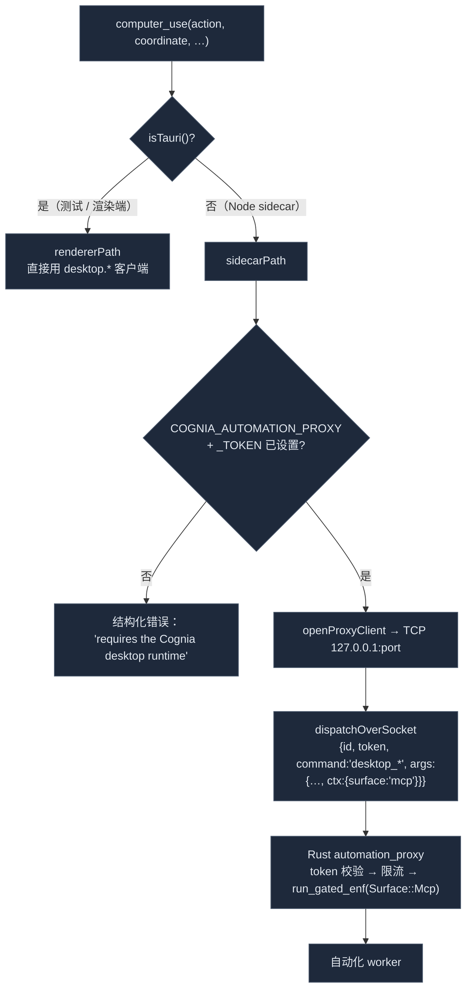

# 动作工具

<Status variant="stable">稳定 · `lib/external-bridge/handlers/{computer-use,connectors}.ts`</Status>

<TLDR>
  两个 handler 构成动作面，二者默认关闭。`computer_use`（`computer-use.ts:95`）通过打开到 Rust
  `automation_proxy` 的 TCP socket 来驱动宿主桌面——截屏 / 点击 / 输入 / 拖拽 / 滚动 / 按键；代理强制每次调用走
  与应用内 Computer Use 相同的自动化权限门（`Surface::Mcp`），因此 `mcp:computer-use` scope 必要但不充分。
  六个 `connectors_*` 工具（`connectors.ts`）暴露收件箱自省——列举适配器、会话、审计、草稿——和一个写工具
  `connectors_send_message`，它经 `runConnectorDigestTurn` 入队一条 AI 回复，使 PII 门、策略解析器、幂等缓存
  和出站执行器全部在路径上。
</TLDR>

## `computer_use` —— 驱动桌面

handler 有两条执行路径，由 `isTauri()` 选择（`computer-use.ts:95`）：



- **渲染端路径**（`computer-use.ts:107`）—— 测试和任何渲染端挂载使用；以 `ctx = { surface: "mcp" }` 直接调用
  `lib/automation/client` 的 `desktop.*` API。
- **Sidecar 路径**（`computer-use.ts:193`）—— 生产路径。从环境读取 `COGNIA_AUTOMATION_PROXY` +
  `COGNIA_AUTOMATION_PROXY_TOKEN`；若任一缺失则返回清晰的结构化错误而非静默失败（独立 npm 模式尚不支持）。

### 代理 envelope

`openProxyClient`（`computer-use.ts:243`）懒导入 `node:net`，开一条连接，并在其上多路复用并发调用——每次调用
得到一个 UUID `id` 和自己的待定回调，从换行分帧的响应中解复用（`computer-use.ts:261-283`）。每个 envelope
携带共享密钥 token 和一个 `desktop_<name>` 命令：

```ts title="lib/external-bridge/handlers/computer-use.ts:322"
function envelope(command: string, args: Record<string, unknown>): ProxyEnvelope {
  return { id: cryptoRandomId(), token, command, args: { ...args, ctx } }   // ctx = { surface: "mcp" }
}
```

九个 MCP `action` 值映射到 `desktop_*` 命令：`screenshot → desktop_screenshot`、`click → desktop_click`、
`type → desktop_type`、`keys → desktop_keys`、`mouse_move → desktop_mouse_move`、`drag → desktop_drag`、
`scroll → desktop_scroll`、`hold_key → desktop_hold_key`、`mouse_button → desktop_mouse_button`，外加
`cursor_position → desktop_cursor_position`。出错时把缓存的客户端置 `null`，使下次调用重连（例如 sidecar 重启后）。

<Callout type="warn" title="两道门，而非一道">
  `mcp:computer-use` MCP scope 只让调用离开桥。在 Rust 侧，`automation_proxy` 把每个非探针命令通过
  `dispatcher::run_gated_enf` 走 `Surface::Mcp`——即治理应用内 Computer Use 的同一道门——外加按 IP 限流和
  坏 token 锁定。在没有浮层的无头场景下，`PerCall` 同意层级解析为拒绝。见
  [传输 → automation_proxy](./transports#automation-proxy)。
</Callout>

## 收件箱连接器工具

六个工具（`connectors.ts`，295 行）位于两个 scope 之后：五个只读工具在 `inbox:connectors:read` 下，
单一写工具在 `inbox:connectors:send` 下。

| 工具 | 读取 / 委派到 | 上限 |
| --- | --- | --- |
| `connectors_list_adapters` | `db.adapterInstances` → `{id, type, displayName, enabled, defaultMode, muted, lastWhoamiAt}` | — |
| `connectors_list_conversations` | `db.sessions` + `conversationOverrides`，按 adapterId/pinned/unread/archived 过滤 | 默认 50，最大 200 |
| `connectors_get_audit` | `listAuditRecent`（`lib/db/connector-audit`），可选 conversationKey 过滤 | 默认 100，最大 500 |
| `connectors_export_audit` | `listAuditRecent` → `auditToCsv` / `auditToJson`（`lib/connectors/audit-export`） | 默认 500，最大 5000 |
| `connectors_list_drafts` | `db.connectorDrafts`，240 字符文本预览 | — |
| `connectors_send_message` | `runConnectorDigestTurn`（`lib/connectors/scheduled-outbound`） | — |

只读工具是轻量的 Dexie/聚合查询：`connectors_list_conversations` 计算 `unread = lastReadAt <
session.updatedAt` 并按 `updatedAt` 降序；`connectors_list_drafts` 从草稿段落抽取 240 字符预览。

### `connectors_send_message` —— 唯一的写路径

这是唯一会改动外部状态的动作。它拒绝凭空捏造会话：预检查找绑定的 `ChatSession`，若无则返回确定性的原因。

```ts title="lib/external-bridge/handlers/connectors.ts:264"
const sessions = await db.sessions
  .filter((s) => s.platformBinding?.conversationKey === input.conversationKey)
  .toArray()
if (sessions.length === 0) return { ok: false, reason: "session_missing" }
// 否则委派给应用内 digest 使用的同一 AI 回路：
const result = await runConnectorDigestTurn({
  adapterId: input.adapterId, conversationKey: input.conversationKey,
  characterId: input.characterId, prompt: input.prompt,
  sourceTaskId: input.sourceTaskId ?? "external-bridge",
})
```

```mermaid
sequenceDiagram
  participant Agent as 外部代理
  participant H as connectors_send_message
  participant DB as db.sessions
  participant Digest as runConnectorDigestTurn
  participant Loop as PII 门 · 策略 · 幂等 · 出站执行器

  Agent->>H: { adapterId, conversationKey, prompt, characterId? }
  H->>DB: 按 platformBinding.conversationKey 找会话
  alt 无会话
    H-->>Agent: { ok:false, reason:"session_missing" }
  else 会话存在
    H->>Digest: runConnectorDigestTurn(... sourceTaskId="external-bridge")
    Digest->>Loop: safeSendPrompt → resolvePolicy → idempotency → enqueue
    Loop-->>Digest: result
    Digest-->>H: { success, output | error }
    H-->>Agent: { ok, detail | reason }
  end
```

因为它委派给 `runConnectorDigestTurn`，**PII 脱敏**（`safeSendPrompt`）、策略解析器、幂等缓存和出站执行器
全部留在路径上——外部代理得到与应用内回复完全相同的安全封套，在审计日志中标记为
`sourceTaskId = "external-bridge"`。`SendMessageOutput` 是 `{ ok, reason?（session_missing | send_failed | …）,
detail? }`。

## 相关

<Cards>
  <Card title="传输" href="./transports" description="对 computer_use 鉴权 + 限流的 automation_proxy，以及它的 addr/token 如何抵达 sidecar。" />
  <Card title="平台连接器" href="../platform-connectors" description="connectors_* 工具背后的 ConnectorBus、适配器与出站执行器。" />
  <Card title="权限模型" href="./permission-model" description="read/send scope 切分与第二道自动化门。" />
  <Card title="Computer Use" href="../sandbox" description="computer_use 复用的自动化 worker + 权限门。" />
</Cards>
