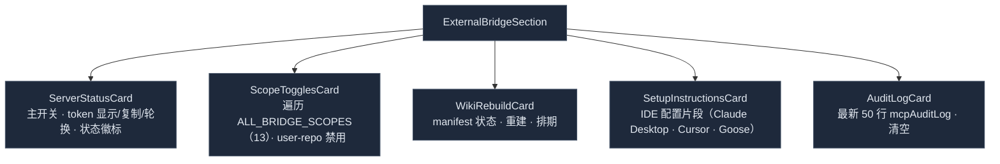

# 审计、存储与设置

<Status variant="stable">稳定 · `audit-log.ts` · `lib/db/*` · `components/settings/external-bridge/`</Status>

<TLDR>
  每个门决策——允许或拒绝——都由 `recordCall`（`audit-log.ts:38`）记入 `mcpAuditLog` 表，该表在同一次写事务内
  自剪枝到其最新 **5000** 行。bearer token 是 `token.ts:generateToken` 生成的 32 字节十六进制，以常量时间比较。
  本子系统拥有**四张 Dexie v17 表**（`wikiArticles`、`wikiSections`、`wikiManifest`、`mcpAuditLog`）。设置 UI
  （`external-bridge-section.tsx`）是五卡片表面——服务器状态 + token、scope 开关（遍历全部 13 个 scope）、wiki 重建卡、
  IDE 设置片段，以及实时审计日志查看器——由 `settings.externalBridge` 下约 138 个 i18n 键支撑。
</TLDR>

## 审计日志

`recordCall` 是每个 tool/resource 路径都调用的轻量策略包装器。它打时间戳、把门结果映射成行，且**绝不抛出**——
Dexie 失败被记录并吞掉，使审计无法弄坏一次正常调用：

```ts title="lib/external-bridge/audit-log.ts:40"
const row = await appendMcpAuditLog({
  ts: Date.now(),
  tool: input.tool,
  scope: input.scope,                                  // BridgeScope | "n/a"
  allowed: input.check.allowed,
  latencyMs: input.latencyMs,
  reason: input.check.allowed ? undefined : input.check.reason,
  errorMessage: input.errorMessage,                    // 允许但 handler 抛出时设置
})
```

`appendMcpAuditLog`（`lib/db/mcp-audit-log.ts:27`）把插入**和**剪枝包进单次事务：

```ts title="lib/db/mcp-audit-log.ts"
const AUDIT_CAP = 5000
// 在一次 rw 事务内：add(row) → pruneOldest(AUDIT_CAP)
// pruneOldest 按 ts 删除（total − keep）个最旧行
```

`McpAuditLogRow` = `{ id, ts, tool, scope, allowed, latencyMs, reason?, errorMessage? }`。`listMcpAuditLog`
按最新优先返回，可选 `{ tool, deniedOnly, limit }` 过滤；`clearMcpAuditLog` 清空它。`scope` 对协议级方法为 `"n/a"`。

## bearer token 工具

`token.ts`（75 行）支撑 HTTP 传输的鉴权：

| 函数 | 行为 |
| --- | --- |
| `generateToken()` | `toHex(randomBytes(TOKEN_BYTES))` → **64 字符十六进制**（`TOKEN_BYTES = 32`） |
| `constantTimeEquals(a, b)` | XOR 循环，仅在长度不符时早退——等长时为常量时间 |
| `verifyToken(stored, candidate)` | 比较器的 null 安全包装 |
| `parseBearerHeader(header)` | 经 `/^Bearer\s+([A-Za-z0-9._\-]+)\s*$/` 从 `Bearer <token>` 抽取 token |

token 在前端用 `crypto.getRandomValues` 生成，以明文存于 IndexedDB（可接受，因为 IndexedDB 已是用户本地隔离；
待桥支持远程访问时再议）。轮换会整体覆盖它并打上 `tokenRotatedAt`。

## Dexie v17 表

四张表，全在 `lib/db/schema.ts` 的 `version(17)` 声明（数据库今日在 v70；这些表是纯新增，自此未变）：

```ts title="lib/db/schema.ts:861 (v17.stores)"
wikiArticles: "&id, &slug, scope, module, pageRank, generatedAt, [scope+module]",
wikiSections: "&id, articleId, [articleId+sectionIndex]",
wikiManifest: "&scope, lastBuildAt",
mcpAuditLog:  "&id, ts, tool, allowed, [tool+ts]",
```

| 表 | 键 / 索引 | 用途 | CRUD |
| --- | --- | --- | --- |
| `wikiArticles` | `&id` · `&slug` · `[scope+module]` · `pageRank` | 每模块一行：Markdown + embedding + sourceRefs + fileHashes | `lib/db/wiki-articles.ts` |
| `wikiSections` | `&id` · `articleId` · `[articleId+sectionIndex]` | 供 `rag_search` 的以标题为根的段落 | `lib/db/wiki-sections.ts` |
| `wikiManifest` | `&scope` · `lastBuildAt` | 每 scope 的 Merkle 映射 + 构建元数据 | `lib/db/wiki-manifest.ts` |
| `mcpAuditLog` | `&id` · `ts` · `tool` · `[tool+ts]` | 每次 MCP 调用一行，上限 5000 | `lib/db/mcp-audit-log.ts` |

`wikiArticles` 拥有**级联删除**：`deleteWikiArticle`（`wiki-articles.ts:103`）和
`deleteAllWikiArticlesForScope` 都在事务内清掉文章的 `wikiSections`，以唯一 `&slug` 为键，使重建干净地替换旧行。

## 设置 UI

`components/settings/external-bridge/external-bridge-section.tsx`（约 598 行）挂载五张卡：



- **ServerStatusCard** —— 切换 `externalBridge.enabled`；启用时解析 sidecar 路径（`~/.cognia/cognia-mcp.js`）
  并调用 `startMcpServer(...)`，禁用时 `stopMcpServer()`。显示 / 复制 / 轮换 bearer token（`generateToken` +
  `tokenRotatedAt`）并渲染 live/idle/web 徽标。
- **ScopeTogglesCard** —— 遍历 `ALL_BRIDGE_SCOPES`，为每个 scope 渲染一个带 i18n 描述（`scopeDescriptions.<scope>`）
  的开关；两个 `user-repo` scope 被禁用（`PHASE_1_DISABLED_SCOPES`，`external-bridge-section.tsx:72`）。变更时持久化
  `enabledScopes`。
- **AuditLogCard** —— `useLiveQuery(listMcpAuditLog({ limit: 50 }))` 渲染最新 50 次调用，带一个接到 `clearMcpAuditLog`
  的清空确认对话框。

### wiki 重建卡

`wiki-rebuild-card.tsx`（约 361 行）显示当前 `wikiManifest`（scope、lastBuild、articleCount、generator）、
一个 force-rebuild 开关、排期子表单（off / daily / weekly / custom cron + force），以及结果框（added / changed /
removed / unchanged / errors）。`onRebuild` 调用 `runWikiRebuild({ force })`；`onSaveSchedule` 把 `wikiSchedule`
合并进设置后调用 `syncWikiCronToScheduler(schedule)`（见 [Wiki 生成器 → 排期重建](./wiki-generator#排期重建)）。

所有面向用户的字符串位于 `settings.externalBridge` i18n 命名空间下（约 138 个键，跨 `wikiIndex`、`server`、
`scopes`/`scopeDescriptions`、`setup`、`audit`），en.json 与 zh-CN.json 各一份。

## 相关

<Cards>
  <Card title="权限模型" href="./permission-model" description="这些开关编辑的 scope 白名单，以及产出每条审计行的门。" />
  <Card title="Wiki 生成器" href="./wiki-generator" description="重建卡驱动的流水线及其写入的表。" />
  <Card title="传输" href="./transports" description="服务器状态卡调用的 startMcpServer / 生命周期。" />
  <Card title="存储" href="../../data/storage" description="四张桥表所在的完整 Dexie schema。" />
</Cards>
