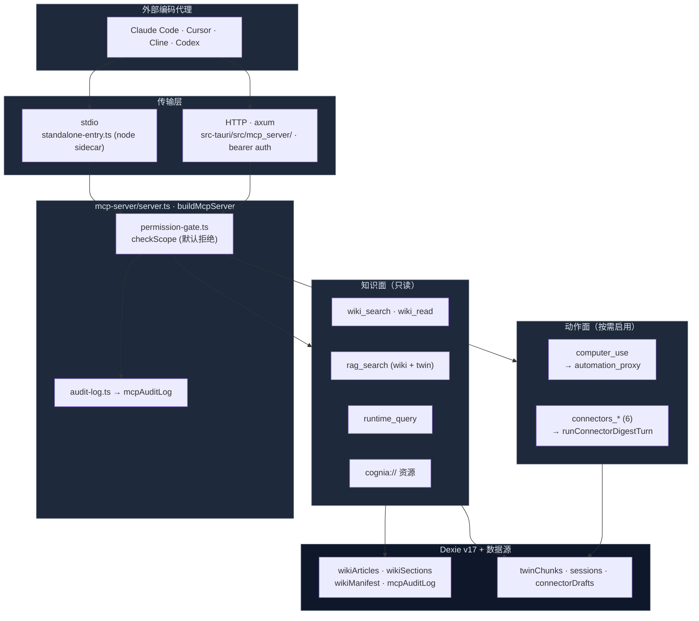

# External Bridge

<Status variant="stable">稳定 · 13 个 scope · stdio + HTTP · Dexie v17</Status>

<TLDR>
  External Bridge 反转了 Cognia 的集成方向：不再由 Cognia 把 Claude Code / Cursor 当子代理来驱动，而是让
  *那些*代理通过 **Model Context Protocol** 读取 Cognia 的一扇窗。其表面分两层——一个**只读知识面**
  （生成的代码 wiki、段落级 RAG、运行时实体清单、URI 资源）和一个**受控动作面**（`computer_use` 桌面驱动、
  六个收件箱连接器工具）。每次 tool/resource 调用都先经过 `permission-gate.ts:checkScope`，对照一张按 scope 的白名单
  做校验，且**默认拒绝**——全新安装只开启 `wiki:cognia` + `rag:cognia`——并向 `mcpAuditLog`（上限 5000）写入一行。
  MCP 服务器骨架（`mcp-server/server.ts:buildMcpServer`）与传输无关：一个 Node sidecar 通过 **stdio** 运行它，
  而 Tauri Rust 侧（`src-tauri/src/mcp_server/`，axum）以 **HTTP** + bearer 鉴权对外提供同一个 sidecar。
  `computer_use` 走一条专用的 `automation_proxy` 旁路，因此它会被与应用内 Computer Use 相同的自动化权限门
  做鉴权 + 限流。
</TLDR>

<StatGrid>
  <Stat label="权限 scope" value="13" hint="默认开启 2 个（wiki:cognia · rag:cognia）" />
  <Stat label="MCP 工具" value="11" hint="5 知识 · 1 computer_use · 5+1 连接器" />
  <Stat label="URI 资源" value="3" hint="cognia://wiki|skill|character" />
  <Stat label="引导 prompt" value="2" hint="cognia-howto · cognia-architecture" />
  <Stat label="传输方式" value="2" hint="stdio sidecar · axum HTTP（1 MiB）" />
  <Stat label="Dexie 表" value="4" hint="wikiArticles · wikiSections · wikiManifest · mcpAuditLog（v17）" />
</StatGrid>

## 它弥合的不对称

在这座桥之前，Cognia 与 LLM 编码代理生态有三条不对称的边
（[ADR-0008](../../adr/0008-external-bridge)）：

1. **出站** —— 完整的 ACP / OpenCode / Anthropic-SDK 客户端覆盖，使 Cognia 能把 Claude Code、Cursor、Codex
   当子代理驱动。
2. **进程内插件** —— 丰富的 `lib/plugin/` 系统（工具 / 模式 / 钩子 / 市场）。
3. **入站** —— *空白*。用户日常的 Claude Code 会话对 Cognia 已为其蒸馏的一切都一无所知。

External Bridge 就是第 3 条边。它暴露一扇只读窗（以及在显式选择启用后的一扇狭窄动作窗），让用户在 Cognia
*之外*运行的代理能查询 Cognia 所知的内容。

## 两个面



**知识面**回答"Cognia 怎么工作 / 它知道什么"——以生成的 wiki 和数字孪生为依据。**动作面**回答"替我做点什么"——
驱动桌面，或通过完整的 AI 回路回复一条收件箱会话。两者在 scope 层面被切开，因此运维者可以授予深度自省，
却不必启用任何自动化副作用。

## 代码位置

```
lib/external-bridge/
  types.ts              # BridgeScope 再导出 + TOOL_TO_SCOPE + RUNTIME_ENTITY_TO_SCOPE
  permission-gate.ts    # checkScope + 4 个按入口的包装器（唯一真相源）
  audit-log.ts          # recordCall → mcpAuditLog（吞掉 Dexie 失败）
  token.ts              # 32 字节十六进制 bearer + 常量时间比较 + Bearer 头解析
  tauri-control.ts      # Rust HTTP 生命周期的 4 个 IPC 包装器
  mcp-server/
    server.ts           # buildMcpServer —— 注册 11 工具 + 3 资源 + 2 prompt
    transport-stdio.ts  # createStdioTransport（SDK StdioServerTransport）
    standalone-entry.ts # node CLI；COGNIA_BRIDGED 选择 bridged vs standalone 设置源
  handlers/
    wiki.ts rag.ts runtime.ts resources.ts   # 知识面
    computer-use.ts connectors.ts            # 动作面

src-tauri/src/mcp_server/
  mod.rs commands.rs http_server.rs sidecar.rs types.rs automation_proxy.rs

lib/wiki/               # 知识面的内容生产者（见 Wiki 生成器）
lib/db/{wiki-articles,wiki-sections,wiki-manifest,mcp-audit-log}.ts   # Dexie v17 CRUD
components/settings/external-bridge/   # 设置面
```

## 模块地图

<Cards>
  <Card title="权限模型" href="./permission-model" description="13 个 scope、默认拒绝白名单、checkScope + 四个按入口的包装器、资源的软/硬鉴权。" />
  <Card title="MCP 服务器" href="./mcp-server" description="buildMcpServer：runWithGate 封装、11 工具 / 3 资源 / 2 prompt 如何注册、SDK capabilities。" />
  <Card title="知识工具" href="./knowledge-tools" description="wiki_search 排序、rag_search（wiki 词重叠 + twin BM25）、runtime_query list/get、cognia:// 资源。" />
  <Card title="动作工具" href="./action-tools" description="computer_use 经 automation_proxy 旁路，以及六个收件箱连接器工具（read + send_message）。" />
  <Card title="传输" href="./transports" description="stdio sidecar + standalone-entry、Rust/axum HTTP 服务器、长驻串行 sidecar、automation_proxy、tauri-control。" />
  <Card title="Wiki 生成器" href="./wiki-generator" description="lib/wiki：Merkle 增量遍历 → Twin 切块器 → 4 个 LLM 子代理 → wikiArticles/wikiSections，以及 cron 排期。" />
  <Card title="审计、存储与设置" href="./audit-and-settings" description="audit-log + 5000 上限的 mcpAuditLog、4 张 Dexie v17 表、token 工具，以及设置 UI。" />
</Cards>

## 默认姿态

<Callout type="warn" title="默认拒绝，敏感项一律按需启用">
  全新安装只开启 `wiki:cognia` + `rag:cognia`（`types/wiki/index.ts:93`，`DEFAULT_ENABLED_SCOPES`）。
  主开关 `externalBridge.enabled` 默认 `false`，因此在用户开启之前两种传输都不会启动。Twin RAG、每个运行时实体族、
  `computer_use` 以及收件箱连接器在设置 → External Bridge 中显式打开前一律关闭。门把 `undefined` 设置视为"全部关闭"，
  因此刚启动的 sidecar 会失败到关闭态。
</Callout>

## 相关

<Cards>
  <Card title="ADR-0008" href="../../adr/0008-external-bridge" description="最初的设计理据、DeepWiki / claude-context 参照，以及分阶段路线图。" />
  <Card title="Computer Use" href="../sandbox" description="computer_use 经代理复用的自动化 worker + 权限门。" />
  <Card title="平台连接器" href="../platform-connectors" description="connectors_* 工具委派到的收件箱 / ConnectorBus / 出站执行器。" />
  <Card title="员工数字孪生" href="../employee-twin" description="rag:twin scope 暴露的块的来源。" />
  <Card title="存储" href="../../data/storage" description="四张桥表的完整 Dexie v17 schema。" />
</Cards>
