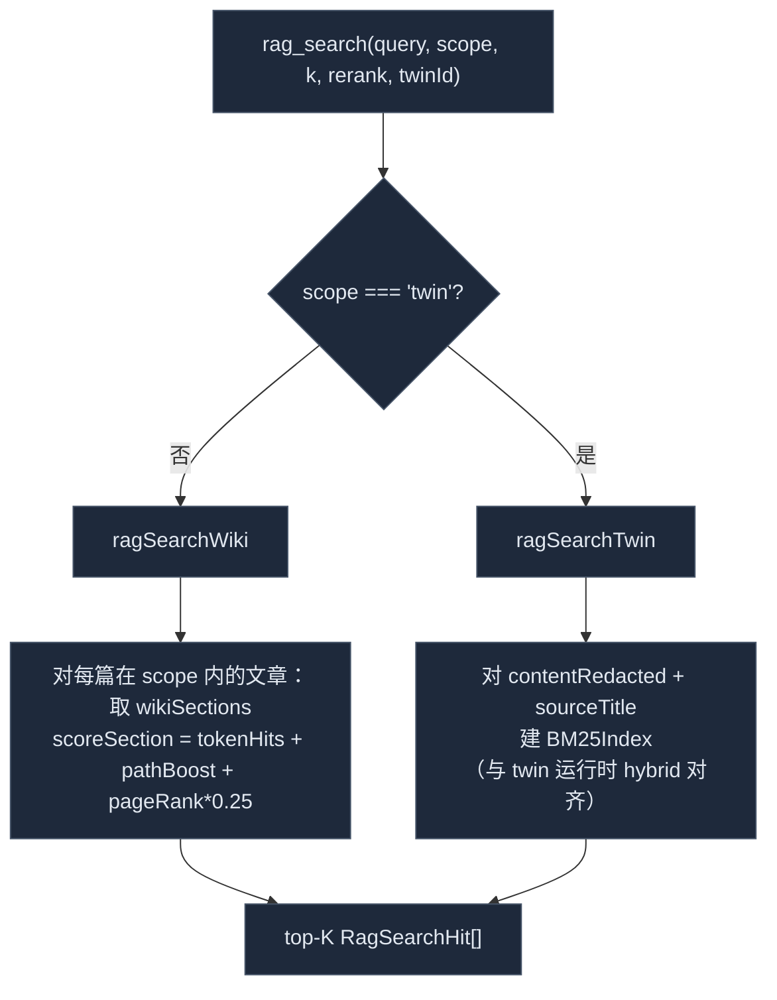

# 知识工具

<Status variant="stable">稳定 · `lib/external-bridge/handlers/{wiki,rag,runtime,resources}.ts`</Status>

<TLDR>
  四个只读 handler 支撑知识面。`wiki_search`（`wiki.ts:57`）按加权词重叠对模块文章排序（标题 ×4、模块 ×3、
  摘要 ×1）外加 `pageRank × 0.5` 的 tie-break。`wiki_read` 按 slug 返回整篇文章。`rag_search`（`rag.ts:66`）是
  双路径：wiki 段落用段落级词重叠 + 路径加成，而 `scope=twin` 时对孪生的脱敏块跑真正的 **BM25**。`runtime_query`
  （`runtime.ts:50`）list 或 get 五个实体族之一，在 `list` 模式裁剪重字段。`resources.ts` 为三个资源族解析
  `cognia://kind/id` URI。
</TLDR>

## `wiki_search` —— 模块发现

`wikiSearch(input): Promise<WikiSearchOutput>`（`wiki.ts:57`）。`k` 钳制到 `[1, 20]`（默认 5）。

```ts title="lib/external-bridge/handlers/wiki.ts (scoring)"
// raw = titleHits*4 + moduleHits*3 + summaryHits*1
// return raw + a.pageRank * 0.5     // pageRank 作为 0–0.5 的 tie-break
```

- **分词**查询（`wiki.ts:76`）—— 按空白/标点切分，保留 `length > 1` 的 token。
- 按标题 / 模块 / 摘要的加权词重叠**打分**每篇文章（`wiki.ts:110-122`）。
- 用 `pageRank * 0.5` **打破平局**，使结构上居中的模块在重叠相等时上浮。
- **空查询** → 仅按 pageRank 取 top-K（`wiki.ts:64-73`），免费得到一份"目录"。
- 得分为 `0` 的文章被丢弃（`wiki.ts:79`），其余切到 `k`。输出报告 `considered`（排序前的候选数）。

`WikiSearchHit` 携带 `{ slug, title, module, scope, summary, pageRank, score }`。代理随后把有潜力的 `slug`
喂给 `wiki_read`。

## `wiki_read` —— 整篇文章

`wikiRead({ slug }): Promise<WikiReadOutput | undefined>`（`wiki.ts:170`）。返回
`{ slug, title, module, scope, summary, contentMd, sourceRefs, generatedAt }`，slug 未知时返回 `undefined`
（服务器把它转成 `{ error: "wiki article '<slug>' not found" }`）。`sourceRefs` 是生成时携带的 `file:line` 溯源指针。

## `rag_search` —— 段落级检索

`ragSearch(input): Promise<RagSearchOutput>`（`rag.ts:66`）。`k` 钳制到 `[1, 30]`（默认 8）。
`scope` 参数选择两个检索引擎之一：



- **Wiki 路径**（`rag.ts:82-112`）—— 取该 scope 的全部文章，然后对每篇取其 `wikiSections`，对每段的 `bodyMd`
  打分：词命中 + 每个匹配源文件路径 token 的 `+0.5` 加成 + `article.pageRank * 0.25`（`scoreSection`，
  `rag.ts:161-185`）。
- **Twin 路径**（`rag.ts:126-159`）—— 对每个块的 `contentRedacted + sourceTitle`（`rag.ts:139`）建
  `BM25Index`，使排序与孪生运行时的 hybrid 检索器一致，但返回块的**原始** `content`（`rag.ts:154`）。
  需要 `twinId` 和 `rag:twin` scope。

<Callout type="warn" title="Twin RAG 以脱敏排序、返回原文">
  BM25 索引建在 `contentRedacted` 上（PII 已替换为占位符），使检索面保持私密；返回的 `content` 是块的原文，
  好让外部代理得到可用上下文。`rag:twin` scope 默认关闭，正是因为这个面可能携带个人数据。
</Callout>

`RagSearchHit` = `{ filePath, lineStart, lineEnd, content, score, articleSlug?（wiki）, twinSourceId? /
twinId?（twin）}`。`rerank` 目前是保留的空操作标志。

## `runtime_query` —— 实体清单

`runtimeQuery(input): Promise<RuntimeQueryOutput>`（`runtime.ts:50`）。`RuntimeEntityType =
"skill" | "character" | "twin" | "plugin" | "agent-team"`；`op = "list" | "get"`。

| entityType | `list` meta 字段 | `get` |
| --- | --- | --- |
| `skill` | `isBuiltIn, category, source, status, tags, updatedAt` | 完整行 |
| `character` | `isBuiltIn, updatedAt` | 完整行 |
| `agent-team` | `isBuiltIn, memberCount` | 完整行 |
| `plugin` | `version, status, source, enabled, capabilities` | 完整行 |
| `twin` | `{ kind: "twin" }` | 完整行 |

`list` 返回紧凑的 `RuntimeListEntry[]`（`{ id, name, description?, meta }`）—— 它刻意省略重字段
（skill `content`、prompt 主体、完整定义）以保持响应短小；`get` 按 `id` 返回完整行。

### twin 没有表 —— 它是推导出来的

没有专门的 `twins` 表。twin 列表把 `Character.twinId` 值去重进一个 `Set`：

```ts title="lib/external-bridge/handlers/runtime.ts:112"
case "twin": {
  const seen = new Set<string>()
  for (const c of await listCharacters()) if (c.twinId) seen.add(c.twinId)
  return Array.from(seen).map((twinId) => ({ id: twinId, name: twinId, meta: { kind: "twin" } }))
}
```

因此 `runtime_query entityType=twin op=list` 返回被至少一个角色引用的 twin id 集合——若没有角色绑定到孪生则为空。

## 资源 —— URI 解析

`resources.ts`（179 行）暴露三个 `cognia://` 族。`parseResourceUri` 是一个极小的、无正则的切分器：

```ts title="lib/external-bridge/handlers/resources.ts:100"
export function parseResourceUri(uri: string): { kind: string; id: string } | undefined {
  if (!uri.startsWith(SCHEME)) return undefined        // SCHEME = "cognia://"
  const rest = uri.slice(SCHEME.length)
  const idx = rest.indexOf("/")
  if (idx <= 0 || idx === rest.length - 1) return undefined
  return { kind: rest.slice(0, idx), id: rest.slice(idx + 1) }
}
```

支持的 kind 是 `wiki`、`skill`、`character`。该模块还导出 `listResources`、`scopeForResourceUri`、
`readResource`，但生产中由 [MCP 服务器](./mcp-server#资源--高级-resourcetemplate) 经 SDK `ResourceTemplate`
API 直接注册资源，并复用 `parseResourceUri` 做 URI 切分和按文章的 scope 推导。

## 相关

<Cards>
  <Card title="Wiki 生成器" href="./wiki-generator" description="生产 wiki_search、wiki_read 与 wiki rag 路径所读的 wikiArticles / wikiSections。" />
  <Card title="员工数字孪生" href="../employee-twin" description="rag:twin 路径复用的块 + BM25 检索器。" />
  <Card title="MCP 服务器" href="./mcp-server" description="每个 handler 如何被鉴权并封装进 MCP envelope。" />
  <Card title="动作工具" href="./action-tools" description="表面的另一半——桌面驱动与收件箱连接器。" />
</Cards>
