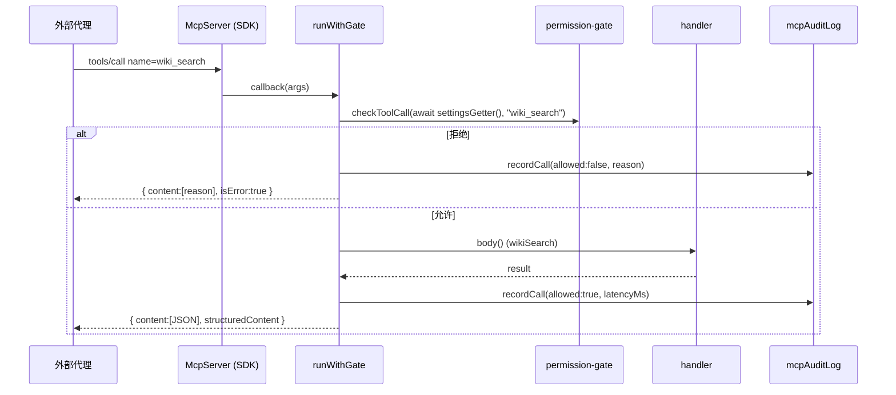

# MCP 服务器

<Status variant="stable">稳定 · `lib/external-bridge/mcp-server/server.ts`（约 926 行）</Status>

<TLDR>
  `buildMcpServer(opts)`（`server.ts:58`）构造一个 `@modelcontextprotocol/sdk` 的 `McpServer`，把 Cognia 的
  所有工具、资源和 prompt 通过权限门 + 审计日志预先接好。它**与传输无关**——调用方经 `server.connect(transport)`
  提供 stdio / HTTP / 内存传输。每个 tool 回调都汇入同一个 helper `runWithGate`（`server.ts:877`）：取最新设置 →
  跑门 → 派发到 handler → 记录延迟 + 结果 → 把结果封装进 MCP `{ content }`。注入一个 `SettingsGetter` 使服务器
  始终读取*当前*白名单，而非构建时捕获的旧快照。
</TLDR>

## 工厂

```ts title="lib/external-bridge/mcp-server/server.ts:58"
export function buildMcpServer(opts: BuildServerOptions): McpServer {
  const server = new McpServer(opts.serverInfo ?? DEFAULT_SERVER_INFO, {
    capabilities: { tools: {}, resources: {}, prompts: {} },
  })
  registerWikiTools(server, opts.settingsGetter)
  registerRagTool(server, opts.settingsGetter)
  registerRuntimeTool(server, opts.settingsGetter)
  registerComputerUseTool(server, opts.settingsGetter)
  registerConnectorTools(server, opts.settingsGetter)
  registerResources(server, opts.settingsGetter)
  registerPrompts(server)
  return server
}
```

`capabilities` 预先声明，好让 SDK 运行时的 `assertRequestHandlerCapability` 检查接受底层的 `resources/*`
处理器。`SettingsGetter` 是 `() => Promise<ExternalBridgeSettings | undefined>`（`server.ts:41`）——
sidecar 如何从 `COGNIA_BRIDGE_SETTINGS` 解析它见 [传输](./transports)。

## 注册的表面

| 类型 | 名称 | 所需 scope | 注册器 |
| --- | --- | --- | --- |
| tool | `wiki_search` | `wiki:cognia` | `registerWikiTools` |
| tool | `wiki_read` | `wiki:cognia` | `registerWikiTools` |
| tool | `rag_search` | `rag:cognia` / `rag:twin` | `registerRagTool` |
| tool | `runtime_query` | 按 `entityType` | `registerRuntimeTool` |
| tool | `computer_use` | `mcp:computer-use` | `registerComputerUseTool` |
| tool | `connectors_list_adapters` | `inbox:connectors:read` | `registerConnectorTools` |
| tool | `connectors_list_conversations` | `inbox:connectors:read` | `registerConnectorTools` |
| tool | `connectors_get_audit` | `inbox:connectors:read` | `registerConnectorTools` |
| tool | `connectors_export_audit` | `inbox:connectors:read` | `registerConnectorTools` |
| tool | `connectors_list_drafts` | `inbox:connectors:read` | `registerConnectorTools` |
| tool | `connectors_send_message` | `inbox:connectors:send` | `registerConnectorTools` |
| resource | `cognia://wiki/{slug}` | `wiki:cognia` / `wiki:user-repo` | `registerWikiResource` |
| resource | `cognia://skill/{id}` | `runtime:skills` | `registerSkillResource` |
| resource | `cognia://character/{id}` | `runtime:characters` | `registerCharacterResource` |
| prompt | `cognia-howto` | — | `registerPrompts` |
| prompt | `cognia-architecture` | — | `registerPrompts` |

### 工具注解编码了"面"

五个知识工具 + 连接器只读工具以
`{ readOnlyHint: true, destructiveHint: false, idempotentHint: true, openWorldHint: false }` 注册。
`computer_use` 则相反——`{ readOnlyHint: false, destructiveHint: true, idempotentHint: false,
openWorldHint: true }`（`server.ts:251`）——而 `connectors_send_message` 是
`{ readOnlyHint: false, idempotentHint: false, openWorldHint: true }`（`server.ts:444`）。
这些注解告诉客户端哪些调用有副作用。

## `runWithGate` —— 派发流水线

每个 tool 回调都是委派给 `runWithGate` 的一行。wiki 搜索的注册是其范式形状：

```ts title="server.ts:101"
async (args) =>
  runWithGate({
    tool: "wiki_search",
    scope: "wiki:cognia",
    check: checkToolCall(await settingsGetter(), "wiki_search"),
    body: () => wikiSearch({ query: args.query, scope: args.scope, k: args.k }),
  })
```



helper 本身（`server.ts:877`）：

```ts title="server.ts:877"
async function runWithGate<T>(input: RunWithGateInput<T>): Promise<ToolEnvelope> {
  const start = Date.now()
  if (!input.check.allowed) {
    await recordCall({ tool: input.tool, scope: input.scope, check: input.check, latencyMs: Date.now() - start })
    return { content: [{ type: "text", text: input.check.reason }], isError: true }
  }
  try {
    const result = await input.body()
    await recordCall({ tool: input.tool, scope: input.scope, check: { allowed: true }, latencyMs: Date.now() - start })
    const structured = result !== null && typeof result === "object" && !Array.isArray(result)
      ? (result as Record<string, unknown>) : { value: result }
    return { content: [{ type: "text", text: JSON.stringify(result) }], structuredContent: structured }
  } catch (err) {
    const message = err instanceof Error ? err.message : String(err)
    await recordCall({ tool: input.tool, scope: input.scope, check: { allowed: true }, latencyMs: Date.now() - start, errorMessage: message })
    return { content: [{ type: "text", text: message }], isError: true }
  }
}
```

三个值得点名的性质：

- **拒绝与 handler 异常都变成 `isError: true`** 并带人类可读消息——代理永远不会得到静默失败。
- **`structuredContent` 必须是 JSON 对象**，因此数组/原始值被包成 `{ value: ... }`，以在不违反 MCP schema 的前提下
  完成往返。
- **延迟围绕派发测量**（`body()` 前后各取一次 `Date.now()`），给审计日志每次调用一个真实的 `latencyMs`。

## 资源 —— 高级 `ResourceTemplate`

资源使用 SDK 的 `ResourceTemplate("cognia://wiki/{slug}", { list })` API，同时带 `list` 回调（软门）和
`read` 回调（硬门）。wiki 的 `read` 路径按文章逐篇推导所需 scope 并重新校验：

```ts title="server.ts:560"
const article = await getWikiArticleBySlug(parts.id)
const requiredScope: BridgeScope =
  article?.scope === "cognia-self" ? "wiki:cognia" : "wiki:user-repo"
const check = checkScope(s, requiredScope)
if (!check.allowed) { /* 记录 + 抛出 check.reason */ }
```

每个 `list`/`read` 路径直接调用 `recordCall`（资源处理器不走 `runWithGate`），记录
`resources/list:wiki`、`resources/read:skill` 等。skill 资源经 `lib/claude/skills-io.ts:serializeSkill`
渲染为 SKILL.md；character 资源把行返回为美化的 JSON。

## Prompt —— 发现辅助

两个 `registerPrompt` 条目返回预置的用户消息模板（`server.ts:783`）：

- **`cognia-howto`** —— 解释工具阶梯（`wiki_search` → `wiki_read` → `rag_search` → `runtime_query`）
  和三个资源 URI 族，并给出建议工作流。
- **`cognia-architecture`** —— 带代理走过 Cognia 的主要子系统（External Bridge、Wiki、Twin、Connectors、
  Subscription、Data）并让它对每个都 `wiki_read` + `rag_search`。

外部代理经 `prompts/get` 拉取这些文本喂进自己的规划——它们是纯文本，不受任何门约束。

## 相关

<Cards>
  <Card title="知识工具" href="./knowledge-tools" description="wiki_search / rag_search / runtime_query / 资源背后的 handler 主体。" />
  <Card title="动作工具" href="./action-tools" description="computer_use 与六个 connectors_* handler 主体。" />
  <Card title="权限模型" href="./permission-model" description="每个回调传给 runWithGate 的 checkToolCall / checkRuntimeCall / checkRagCall。" />
  <Card title="传输" href="./transports" description="buildMcpServer 如何连接到 stdio 并经 HTTP 提供。" />
</Cards>
