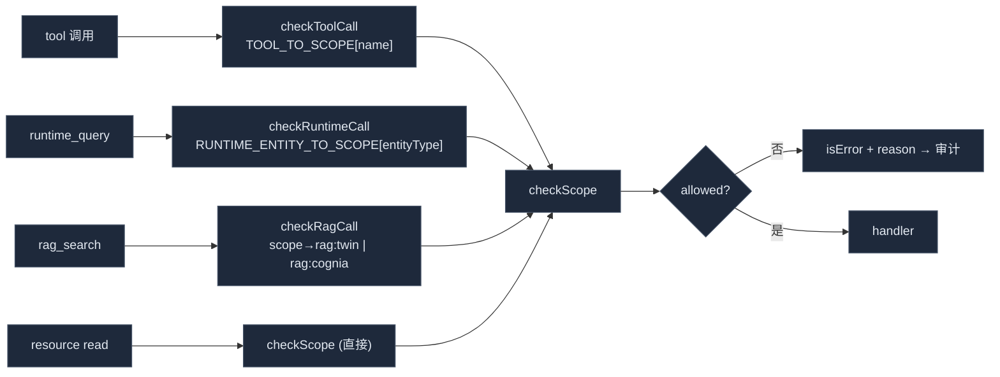

# 权限模型

<Status variant="stable">稳定 · `lib/external-bridge/permission-gate.ts`</Status>

<TLDR>
  每次 MCP 调用在做任何工作前都先经过 `checkScope`（`permission-gate.ts:25`）。它的输入只有所请求的
  `BridgeScope` 和来自 `AppSettings.externalBridge` 的 `enabledScopes` 白名单。白名单是**唯一**真相源：
  没有任何隐式的"首次使用即启用"，且 `undefined` 设置会失败到关闭态。四个轻包装器把不同入口规整到同一个
  `checkScope`——`checkToolCall`（查表）、`checkRuntimeCall`（按 `entityType`）、`checkRagCall`（按 `scope` 参数）。
  资源使用两层门：`list` 用**软门**（不在 scope 内的条目被隐藏），`read` 用**硬门**（即便 URI 已知也重新校验 scope）。
</TLDR>

## 13 个 scope

每个 *(能力 × 内容)* 组合一个开关（`types/wiki/index.ts:37-90`）。设置 UI 遍历 `ALL_BRIDGE_SCOPES`，
为每个值渲染一个开关。

| Scope | 默认 | 面 | 解锁内容 |
| --- | :---: | --- | --- |
| `wiki:cognia` | ✅ | 知识 | 对 Cognia 自身生成 wiki 的 `wiki_search` / `wiki_read` |
| `wiki:user-repo` | ❌ | 知识 | 用户外部仓库的 wiki（Phase 3；**UI 中禁用**） |
| `rag:cognia` | ✅ | 知识 | 对 wiki 段落的段落级 `rag_search` |
| `rag:user-repo` | ❌ | 知识 | 对用户外部仓库的 `rag_search`（Phase 3；**UI 中禁用**） |
| `rag:twin` | ❌ | 知识 | 对数字孪生块的 `rag_search` —— **私密数据** |
| `runtime:skills` | ❌ | 知识 | `runtime_query` + `cognia://skill/<id>` 资源 |
| `runtime:characters` | ❌ | 知识 | `runtime_query` + `cognia://character/<id>` 资源 |
| `runtime:twins` | ❌ | 知识 | `runtime_query entityType=twin`（id 列表） |
| `runtime:plugins` | ❌ | 知识 | `runtime_query entityType=plugin` |
| `runtime:agent-teams` | ❌ | 知识 | `runtime_query entityType=agent-team` |
| `mcp:computer-use` | ❌ | **动作** | `computer_use` 桌面驱动（截屏/点击/输入/…） |
| `inbox:connectors:read` | ❌ | **动作** | 5 个只读连接器工具（适配器 / 会话 / 审计 / 草稿） |
| `inbox:connectors:send` | ❌ | **动作** | `connectors_send_message` —— 入队一条 AI 回复 |

`DEFAULT_ENABLED_SCOPES = ["wiki:cognia", "rag:cognia"]`（`types/wiki/index.ts:93`）。连接器上的
`read`/`send` 切分沿用 `rag:twin` 的敏感度先例：运维者可在不启用自动回复的前提下授予可观测性。

## `checkScope` —— 门

```ts title="lib/external-bridge/permission-gate.ts:25"
export function checkScope(
  settings: ExternalBridgeSettings | undefined,
  scope: BridgeScope
): ScopeCheckResult {
  if (!settings) return { allowed: false, reason: "external bridge not configured" }
  if (!settings.enabled) return { allowed: false, reason: "external bridge disabled" }
  if (!settings.enabledScopes.includes(scope)) {
    return { allowed: false, reason: `scope '${scope}' not enabled — toggle it in Settings → External Bridge` }
  }
  return { allowed: true }
}
```

三个按序的失败到关闭条件：无设置 → 无主开关 → scope 不在白名单。`reason` 字符串既是外部代理看到的内容
（作为 MCP error），也是落入审计行的内容。

## 四个入口包装器

每个对外表面都通过一个解析正确 scope 的包装器抵达 `checkScope`，因此门本身从不需要知道工具名或参数形状。



- **`checkToolCall(settings, name)`**（`:66`）—— 查 `TOOL_TO_SCOPE[name]`；未注册的名字被以
  `unknown tool '<name>'` 拒绝，所以拼写错误不会意外通过。
- **`checkRuntimeCall(settings, entityType)`**（`:78`）—— 查 `RUNTIME_ENTITY_TO_SCOPE[entityType]`；
  未知实体 → `unknown runtime entity`。`runtime_query` 需要它，因为 scope 取决于参数而非工具名。
- **`checkRagCall(settings, ragScope)`**（`:96`）—— 把请求的 rag scope 映射到 `BridgeScope`：
  `"twin" → rag:twin`，`"user-repo" → rag:user-repo`，而 `"cognia-self" | "all" | "" | undefined →
  rag:cognia`。其它值 → `unknown rag scope`。

### scope 映射表

```ts title="lib/external-bridge/types.ts:34"
export const TOOL_TO_SCOPE: Record<string, BridgeScope> = {
  wiki_search: "wiki:cognia",
  wiki_read: "wiki:cognia",
  rag_search: "rag:cognia",
  computer_use: "mcp:computer-use",
  connectors_list_adapters: "inbox:connectors:read",
  connectors_list_conversations: "inbox:connectors:read",
  connectors_get_audit: "inbox:connectors:read",
  connectors_export_audit: "inbox:connectors:read",
  connectors_list_drafts: "inbox:connectors:read",
  connectors_send_message: "inbox:connectors:send",
}
```

`runtime_query` 故意缺席 —— 它带一个 `entityType` 参数，故 `RUNTIME_ENTITY_TO_SCOPE`（`types.ts:55`）
把 `skill → runtime:skills`、`character → runtime:characters`、`twin → runtime:twins`、
`plugin → runtime:plugins`、`agent-team → runtime:agent-teams`。

## 资源的软/硬鉴权

资源以两种不同的门强度被列举和读取（注册代码见 [MCP 服务器](./mcp-server)）：

| 阶段 | 门 | 不在 scope 内的行为 |
| --- | --- | --- |
| `resources/list` | **软** | 该条目被静默地从列举中省略——无错误，代理只是永远看不到读不到的 URI。 |
| `resources/read` | **硬** | 即便 URI 已知也重新跑 `checkScope`；拒绝会抛出，SDK 将其转成 JSON-RPC error。 |

对 wiki 资源，所需 scope 按 `article.scope` 逐篇推导（`cognia-self → wiki:cognia`，否则 `wiki:user-repo`），
因此同一个 URI 族横跨两个 scope。

## `computer_use` 的两层防御

`mcp:computer-use` scope 只是**第一道**门。通过 `checkScope` 的调用仍会被 `automation_proxy` 强制走 Rust 侧的
**自动化权限门**（`Surface::Mcp`），后者可独立拒绝、要求同意并限流。见 [动作工具](./action-tools) 与
[传输](./transports#automation-proxy)。两道门互相独立：启用 MCP scope 不会绕过桌面自动化策略。

## 相关

<Cards>
  <Card title="MCP 服务器" href="./mcp-server" description="包装器如何经 runWithGate 接入每个 tool/resource 回调。" />
  <Card title="审计、存储与设置" href="./audit-and-settings" description="每个门决策——允许或拒绝——都记入 mcpAuditLog。" />
  <Card title="动作工具" href="./action-tools" description="computer_use 还需通过的第二道自动化门。" />
</Cards>
