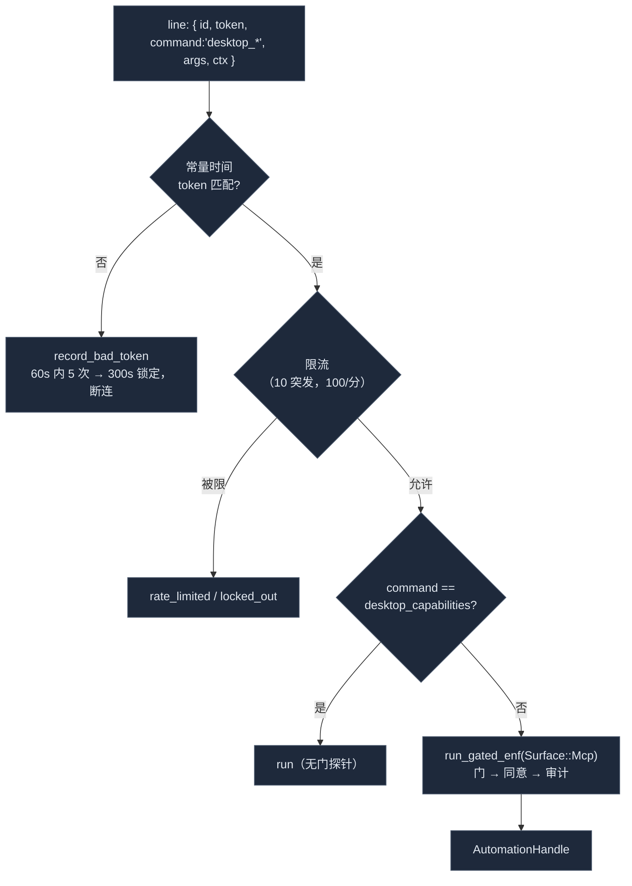

# 传输

<Status variant="stable">稳定 · `mcp-server/` + `src-tauri/src/mcp_server/`</Status>

<TLDR>
  同一个 `buildMcpServer` 骨架有两条抵达路径。经 **stdio** 时，一个 Node sidecar（`standalone-entry.ts`）从
  `COGNIA_BRIDGE_SETTINGS`（bridged）或一个 JSON 文件（standalone）解析其设置，然后 `connect()` SDK 的
  `StdioServerTransport`。经 **HTTP** 时，Tauri Rust 侧（`src-tauri/src/mcp_server/`，axum）绑定
  `127.0.0.1:<port>`，以常量时间（`subtle`）鉴权 bearer token，并把每行 JSON-RPC 经一个 `Mutex` 守护的
  `round_trip` 转发给一个**长驻、串行**的 Node sidecar。四个 `#[tauri::command]` 暴露生命周期。服务器启动时还会
  spawn 一个 `automation_proxy`——sidecar 用于 `computer_use` 的第二个 127.0.0.1 socket，受自动化权限门约束并按 peer 限流。
</TLDR>

## stdio —— sidecar 入口

`standalone-entry.ts`（98 行）是把 MCP 服务器跑在 stdin/stdout 上的 Node CLI。除 `buildMcpServer` 外它唯一的活
就是选择**设置从哪里来**，以 `COGNIA_BRIDGED` 为键：

```ts title="lib/external-bridge/mcp-server/standalone-entry.ts:77"
export async function runMcpServerStdio(): Promise<void> {
  const server = buildMcpServer({ settingsGetter: resolveSettingsGetter() })
  await server.connect(createStdioTransport())
}
```

| 模式 | 条件 | 设置源 | 新鲜度 |
| --- | --- | --- | --- |
| **bridged** | `COGNIA_BRIDGED` = `"1"` / `"true"` | `COGNIA_BRIDGE_SETTINGS` 环境变量（JSON） | 仅解析**一次**并缓存——scope 变更需重启 |
| **standalone** | 否则 | `${COGNIA_DATA_DIR}/external-bridge.json` | **每次调用**都读 |

`bridgedSettingsGetter`（`:41`）把环境 JSON 解析一次并返回 `async () => cached`；`standaloneSettingsGetter`
（`:59`）每次调用读文件，出错时回退到 `DEFAULT_EXTERNAL_BRIDGE_SETTINGS`。`transport-stdio.ts` 是导出
`createStdioTransport()` 的 13 行包装器，便于测试换入内存传输。该入口的打包产物是 `cognia-mcp.js`；设置 UI 默认在
`~/.cognia/cognia-mcp.js` 解析它（`external-bridge-section.tsx:78`）。

## HTTP —— Tauri/axum 服务器

`src-tauri/src/mcp_server/` 是 HTTP 传输。它在 `src-tauri/src/lib.rs` 注册：模块在 `lib.rs:22`，状态经
`.manage(McpServerState::new())` 在 `lib.rs:214`，四个命令在 invoke handler 的 `lib.rs:534-537`。

```mermaid
flowchart TB
  subgraph Agent["外部代理（HTTP）"]
    Client["POST http://127.0.0.1:&lt;port&gt;/mcp<br/>Authorization: Bearer &lt;token&gt;"]
  end
  subgraph Rust["src-tauri/src/mcp_server/"]
    Cmds["commands.rs<br/>mcp_server_start / stop / restart / status"]
    State["mod.rs · McpServerState<br/>Mutex&lt;McpServerInner&gt;"]
    Http["http_server.rs<br/>axum · auth_middleware · graceful shutdown"]
    Side["sidecar.rs · SidecarProcess<br/>tokio::process + Mutex&lt;SidecarIo&gt;"]
    Proxy["automation_proxy.rs<br/>computer_use 的 127.0.0.1 socket"]
  end
  subgraph Node["Node sidecar（COGNIA_BRIDGED=1）"]
    Entry["standalone-entry.ts → buildMcpServer"]
  end

  Client -->|loopback| Http
  Cmds --> State
  State --> Http
  State --> Side
  State --> Proxy
  Http -->|round_trip(line)| Side
  Side -->|stdin/stdout| Node
  Proxy -. COGNIA_AUTOMATION_PROXY(_TOKEN) .-> Node

  classDef n fill:#1e293b,stroke:#475569,color:#e2e8f0
  class Agent,Rust,Node n
```

### 端点

| 方法 | 路径 | 鉴权 | 行为 |
| --- | --- | --- | --- |
| GET | `/healthz` | 无 | `{ "ok": true, "version": "<CARGO_PKG_VERSION>" }` |
| POST | `/mcp` | bearer | 一行 JSON-RPC 入 → 一行出（`mcp_post`） |
| POST | `/mcp/sse` | bearer | **501** 占位 —— `{ error: "SSE streaming is not implemented in Phase 1; use POST /mcp" }` |

```rust title="src-tauri/src/mcp_server/http_server.rs"
const BODY_LIMIT_BYTES: usize = 1024 * 1024;   // 1 MiB

let app = Router::new()
    .route("/healthz", get(healthz))
    .route("/mcp", post(mcp_post))
    .route("/mcp/sse", post(mcp_sse))
    .layer(from_fn_with_state(state.clone(), auth_middleware))
    .layer(RequestBodyLimitLayer::new(BODY_LIMIT_BYTES))
    .with_state(state);
```

`auth_middleware`（`http_server.rs:168`）放行 `/healthz`，然后抽取 `Bearer <token>` 与 `state.token` 用
`subtle::ConstantTimeEq` 比较——长度不符即拒，内容比较为常量时间以挫败时序攻击。缺头 → 401 `missing bearer token`；
不匹配 → 401 `invalid token`。`mcp_post` 对空体回 400，sidecar 失败映射为 502 Bad Gateway，并把 sidecar 响应作为
原始 `serde_json::Value` 转发，以避免二次序列化造成字段丢失。

### 生命周期命令

四个 `#[tauri::command]`（`commands.rs`）与 `tauri-control.ts` 一一对齐：

| 命令 | 输入 | 输出 | 备注 |
| --- | --- | --- | --- |
| `mcp_server_start` | `port` · `token` · `settings_json` · `sidecar_path`（+ `AutomationState`） | `u16` 绑定端口 | `port=0` → 由 OS 分配 |
| `mcp_server_stop` | — | `()` | 已停止则 `NotRunning` |
| `mcp_server_restart` | 同 start | `u16` 绑定端口 | 尽力 stop + 重新 start |
| `mcp_server_status` | — | `McpServerStatus` | `{ running, port, startedAt }` |

```ts title="lib/external-bridge/tauri-control.ts:36"
export async function startMcpServer(args: StartArgs): Promise<number> {
  return transport.call<number>("mcp_server_start", {
    port: args.port, token: args.token,
    settingsJson: JSON.stringify(args.settings), sidecarPath: args.sidecarPath,
  })
}
```

`mcp_server_start`（`commands.rs:26`）还接收 `AutomationState` 并把 `Enforcement::from_state(&automation)`
转发进 `McpServerState::start`——这就是自动化门抵达代理的方式。

## sidecar 进程模型

`McpServerState::start`（`mod.rs:108`）校验 token（空 → `TokenMissing`）、早早解析设置 JSON（坏 →
`InvalidSettings`）、并防止重复启动（`AlreadyRunning(port)`）。然后**按序**：spawn `AutomationProxy` →
带代理 addr/token spawn sidecar → spawn HTTP 监听。

```rust title="src-tauri/src/mcp_server/sidecar.rs (spawn_with_env)"
let mut cmd = Command::new("node");
cmd.arg(sidecar_path)
   .env("COGNIA_BRIDGED", "1")
   .env("COGNIA_BRIDGE_SETTINGS", settings_json);
for (key, value) in extra_env { cmd.env(key, value); }   // COGNIA_AUTOMATION_PROXY(_TOKEN)
cmd.stdin(Stdio::piped()).stdout(Stdio::piped()).stderr(Stdio::inherit())
   .kill_on_drop(true);
```

进程是**长驻且串行**的——单个 `Mutex<SidecarIo>` 串行化 `round_trip`：

```rust title="src-tauri/src/mcp_server/sidecar.rs (round_trip)"
let mut io = self.request_lock.lock().await;   // 串行化 stdin/stdout
io.stdin.write_all(request.as_bytes()).await?; io.stdin.write_all(b"\n").await?;
io.stdin.flush().await?;
let mut line = String::new();
io.stdout.read_line(&mut line).await?;          // 恰好读回一行
```

理据：MCP SDK 的 `StdioServerTransport` 天生顺序，多路复用毫无收益；单个 mutex 防止两个并发 axum 处理器交错字节；
长生命周期意味着 V8、handler 模块和 Dexie 适配器只初始化一次。`kill_on_drop(true)` 保证 `SidecarProcess` 被丢弃时
子进程随之结束——`stop`（`mod.rs:188`）`Option::take` 出服务器元组，发送 axum graceful-shutdown 信号，并让 sidecar
+ 代理被丢弃。`stderr` 被继承，因此 sidecar 的 `console.error` 流入 Tauri 日志。集成测试用 `spawn_echo_for_tests`
（`sidecar.rs`），当 `node` 不在 PATH 时早退，使 CI 不硬依赖 Node。

### 错误模型

`McpServerError`（`types.rs`，`thiserror`）序列化为单个字符串供 React toast：`AlreadyRunning(port)`、
`NotRunning`、`Bind { port, source }`、`InvalidSettings(reason)`、`TokenMissing`、`SidecarSpawn(reason)`、
`SidecarIo(reason)`。`McpServerStatus` 是 `{ running, port, startedAt }`（camelCase serde），`default()` 全空/false。

## automation_proxy

`automation_proxy.rs` 是 sidecar **仅**用于 `computer_use` 的专用 127.0.0.1 socket——它被刻意留在 MCP
stdin/stdout 管道之外，使长时间的 `desktop_*` 调用不会卡住 MCP 分帧。`McpServerState::start` 调用
`AutomationProxy::spawn(handle, enforcement)`，并把 `COGNIA_AUTOMATION_PROXY=<addr>` +
`COGNIA_AUTOMATION_PROXY_TOKEN=<hex>` 转发给 sidecar。



防御（常量在 `automation_proxy.rs:57-63`）：

- **Token**：32 字节十六进制，用 `subtle::ConstantTimeEq`（`token_matches`）比较。socket 绑定 loopback，但
  token 才是承重防御——与 HTTP bearer 同一模型。
- **限流**（`RATE_LIMIT_BURST = 10`，`RATE_LIMIT_REFILL_PER_SEC = 100/60`）：每 IP 令牌桶，使紧凑的
  `screenshot` 循环无法把代理变成 DoS 放大器。
- **坏 token 锁定**（`BAD_TOKEN_THRESHOLD = 5` 于 `BAD_TOKEN_WINDOW = 60s` 内 → `BAD_TOKEN_LOCKOUT = 300s`）：
  反复猜测会断连。
- **门**：每个非探针命令被强制经 `dispatcher::run_gated_enf` 走 `Surface::Mcp`（按去前缀名匹配，如 `click`）——
  这关闭了历史上代理直接调用 worker、不记录也不强制的旁路。`desktop_capabilities` 是唯一无门探针，使客户端总能发现
  后端支持。

`AutomationProxy::Drop` 中止监听任务并释放端口，因此代理存活时间恰好与依赖它的 MCP sidecar 一致。

## 相关

<Cards>
  <Card title="动作工具" href="./action-tools" description="打开此代理 socket 并组装 envelope 的 computer_use handler。" />
  <Card title="MCP 服务器" href="./mcp-server" description="两种传输都连接的 buildMcpServer 骨架。" />
  <Card title="Remote Control" href="../remote-control" description="同款 bearer 鉴权 + IPC 模式的姊妹 axum HTTP 路径。" />
  <Card title="审计、存储与设置" href="./audit-and-settings" description="用 token + sidecar 路径调用 startMcpServer 的设置 UI。" />
</Cards>
