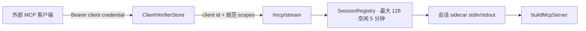
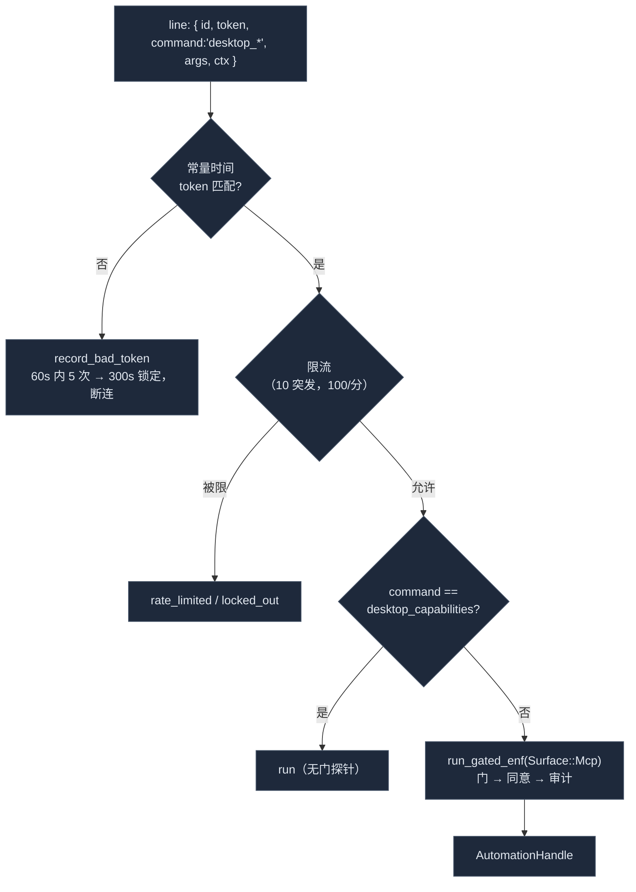

# 传输

<Status variant="stable">稳定 · `lib/external-bridge/mcp-server/` + `crates/cognia-mcp-server/`</Status>

<TLDR>
  同一个 `buildMcpServer` 骨架可通过 stdio 与 loopback External Bridge 使用。HTTP 只保留一个 MCP 路径：
  `GET|POST|DELETE /mcp/stream`。每个 bearer credential 解析为独立 client identity 与规范 scope，
  每个 `Mcp-Session-Id` 都绑定到该 identity。`/mcp` 与 `/mcp/sse` 不再挂载。活动会话最多 128 个，
  空闲五分钟后回收；超额 initialize 明确返回 503。
</TLDR>

## stdio —— sidecar 入口

`lib/external-bridge/mcp-server/standalone-entry.ts` 构建共享 MCP server 并连接 SDK 的
`StdioServerTransport`。bridged 模式读取 `COGNIA_BRIDGE_SETTINGS`；standalone 模式在每次调用时读取
host 数据文件。打包入口是 `sidecar/cognia-mcp.mjs`；Rust 的 spawn 与客户端配置使用同一个路径解析器，
避免展示路径与实际安装文件漂移。

## HTTP —— 规范 Streamable HTTP

监听器位于 `crates/cognia-mcp-server/`。`http_server.rs` 负责 loopback 绑定、DNS rebinding 防护、鉴权、
1 MiB body 上限与 graceful shutdown；`streamable_http.rs` 负责 MCP 会话创建、路由、SSE、空闲回收与准入控制。



### 端点

| 方法 | 路径 | 鉴权 | 行为 |
| --- | --- | --- | --- |
| GET | `/healthz` | 无 | 仅存活探针；loopback Host/Origin 校验仍生效。 |
| POST | `/mcp/stream` | per-client bearer | 初始化会话、发送 JSON-RPC，或以 JSON/SSE 接收响应。 |
| GET | `/mcp/stream` | per-client bearer + session | 长连接 server-to-client SSE。 |
| DELETE | `/mcp/stream` | per-client bearer + session | 关闭会话并释放 worker。 |

```rust title="crates/cognia-mcp-server/src/http_server.rs"
let app = Router::new()
    .route("/healthz", get(healthz))
    .route(
        "/mcp/stream",
        post(streamable_http::post_handler)
            .get(streamable_http::get_handler)
            .delete(streamable_http::delete_handler),
    );
```

首个 JSON-RPC `initialize` 请求不带 `Mcp-Session-Id`，响应返回该 header；后续调用必须携带它。
无 `id` notification 返回 202。普通请求返回 JSON；`Accept: text/event-stream` 时返回 SSE，并在匹配响应后结束。
属于其他 client 的 session id 会被拒绝；credential rotate、revoke 或 expiry 会关闭既有会话。

### 鉴权与 scope

Host 只持久化 SHA-256 client credential verifier。middleware 对 bearer 求 hash，进行常量时间 digest 比较并校验过期时间，
再向 sidecar 请求写入可信 `clientId` 与 scopes；调用者伪造的 scope metadata 会被覆盖。MCP permission gate 将 client scope
与 host enabled scopes 取交集，不维护 transport-local tool allowlist。监听器还要求 loopback `Host`，若携带 `Origin`，
它也必须是 loopback。

### 规范生命周期

公共控制面是 `external_bridge_*` 命令族：revisioned config、按 client create/list/rotate/revoke、start/stop/restart
以及脱敏 status。这些命令受 manifest 治理并经 `remote_execution` 执行。启动时从 host security store 读取活动 client verifier，
再调用 `McpServerState::start_with_clients`；替换 verifier 会关闭全部会话，避免过期 stream 越过 credential 变更继续存活。

旧 `mcp_server_*` Tauri lifecycle 仍作为本地设置 UI 的迁移接缝存在。它不是 HTTP MCP facade，也不会重新挂载
`/mcp` 或 `/mcp/sse`；其删除由远程 API 收敛工作继续跟踪。

## 会话与进程模型

`SessionRegistry` 通过 non-blocking semaphore 最多接纳 128 个活动会话。permit 持有到最后一个 in-flight reference 被释放，
因此仅从 registry 删除记录不会在 SSE/request task 仍使用会话时超额放行。容量耗尽返回 503，不再 spawn 新进程。
同步 POST 的匹配响应等待最多 30 秒；每会话 broadcast channel 上限 256 条；后台 sweep 回收空闲超过五分钟的会话。

当前每个 session 拥有一个 sidecar child、一个 writer lock，以及把 stdout line 分发给 POST/GET consumer 的 reader task。
`McpServerState` 还保留 root sidecar 用于生命周期与 managed-process reporting。计划中的单进程 framed multiplexer 尚未落地；
在迁移完成前，128 会话准入上限约束当前进程数与内存暴露。

### 错误模型

鉴权失败为 401，跨域或跨 client 访问为 403，错误请求为 400，未知 session 为 404，sidecar spawn/write 失败为 502，
容量过载为 503，等待匹配响应超时为 504。响应体只包含简短 `{ error }`，绝不回显 bearer、scope、command args 或 result。

## automation_proxy

`automation_proxy.rs` 是 sidecar **仅**用于 `computer_use` 的专用 127.0.0.1 socket——它被刻意留在 MCP
stdin/stdout 管道之外，使长时间的 `desktop_*` 调用不会卡住 MCP 分帧。`McpServerState::start` 调用
`AutomationProxy::spawn(handle, enforcement)`，并把 `COGNIA_AUTOMATION_PROXY=<addr>` +
`COGNIA_AUTOMATION_PROXY_TOKEN=<hex>` 转发给 sidecar。



防御（常量在 `automation_proxy.rs:57-63`）：

- **Token**：32 字节十六进制，用 `subtle::ConstantTimeEq`（`token_matches`）比较。socket 绑定 loopback，但
  token 才是承重防御——与 HTTP bearer 同一模型。
- **限流**（`RATE_LIMIT_BURST = 10`，`RATE_LIMIT_REFILL_PER_SEC = 100/60`）：每 IP 令牌桶，使紧凑的
  `screenshot` 循环无法把代理变成 DoS 放大器。
- **坏 token 锁定**（`BAD_TOKEN_THRESHOLD = 5` 于 `BAD_TOKEN_WINDOW = 60s` 内 → `BAD_TOKEN_LOCKOUT = 300s`）：
  反复猜测会断连。
- **门**：每个非探针命令被强制经 `dispatcher::run_gated_enf` 走 `Surface::Mcp`（按去前缀名匹配，如 `click`）——
  这关闭了历史上代理直接调用 worker、不记录也不强制的旁路。`desktop_capabilities` 是唯一无门探针，使客户端总能发现
  后端支持。

`AutomationProxy::Drop` 中止监听任务并释放端口，因此代理存活时间恰好与依赖它的 MCP sidecar 一致。

## 相关

<Cards>
  <Card title="动作工具" href="./action-tools" description="打开此代理 socket 并组装 envelope 的 computer_use handler。" />
  <Card title="MCP 服务器" href="./mcp-server" description="两种传输都连接的 buildMcpServer 骨架。" />
  <Card title="Companion API" href="../companion-api" description="规范的宿主鉴权控制面。" />
  <Card title="审计、存储与设置" href="./audit-and-settings" description="用 token + sidecar 路径调用 startMcpServer 的设置 UI。" />
</Cards>
