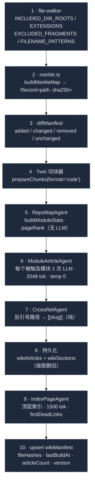

# Wiki 生成器

<Status variant="stable">稳定 · `lib/wiki/` · 知识面的内容生产者</Status>

<TLDR>
  `lib/wiki/` 是 `wiki_search` / `wiki_read` / wiki `rag_search` 路径背后的生产者。`rebuildWiki`
  （`orchestrator.ts:103`）运行一条 10 步流水线：过滤源码树 → SHA-256 Merkle 映射 → `diffManifest`
  （added / changed / removed / unchanged）→ 复用 Twin 代码切块器 → 四个子代理（`RepoMapAgent` 启发式
  pageRank，无 LLM；`ModuleArticleAgent` 每模块一次 LLM 调用，2048 token 上限，temp 0；`CrossRefAgent` 纯
  Markdown 后处理器插入 `[[slug]]`；`IndexPageAgent` 顶层导航，1500 token 上限）→ 持久化到 `wikiArticles` +
  `wikiSections`。增量是默认；只有被变更文件触及的模块会被重新生成。一个 `wikiSchedule` 协调到单个调度任务，
  使重建能按 cron 运行。
</TLDR>

## 流水线



```ts title="lib/wiki/orchestrator.ts:103"
export async function rebuildWiki(deps: WikiOrchestratorDeps, opts: RebuildOptions): Promise<RebuildResult>
// deps: { fs: FileSystem; llm: LlmClient; embed?: EmbedFn }
// opts: { scope: WikiScope; rootDir: string; generatorVersion: string; force?: boolean; moduleTokenBudget?: number }
```

`RebuildResult` 报告 `{ added, changed, removed, unchanged, articles, indexPage?, errors, durationMs }`。
模块失败被收进 `errors[]`——一个坏模块绝不回滚整次构建。可选的 `EmbedFn` 默认是 `ZERO_EMBEDDING`
（`orchestrator.ts:56`），因此 Phase 1 排序是词重叠 + pageRank，而非向量。

## 文件纳入规则

严格的白名单 + 黑名单 + 文件名模式，全是 `file-walker.ts` 中的纯函数：

```ts title="lib/wiki/file-walker.ts:16"
export const INCLUDED_DIR_ROOTS = ["lib", "app", "components", "hooks", "types"] as const
export const INCLUDED_EXTENSIONS = [".ts", ".tsx", ".rs", ".md", ".mdx"] as const
export const EXCLUDED_FRAGMENTS = [
  "/node_modules/", "/.next/", "/out/", "/dist/", "/coverage/",
  "/.claude/worktrees/", "/components/ui/", "/components/ai-elements/",
] as const
export const EXCLUDED_FILENAME_PATTERNS = [
  /\.test\.[mc]?[jt]sx?$/, /\.spec\.[mc]?[jt]sx?$/, /\.d\.ts$/, /\.stories\.[jt]sx?$/,
]
```

`shouldIncludeFile`、`filterIncludedPaths`、`bucketByModule`、`moduleToSlug` 推导模块键与 slug。
`components/ui/`（shadcn）和 `components/ai-elements/`（vendored）被硬排除——无信息价值。

## Merkle 增量

`merkle.ts`：`hashContent`（经 SubtleCrypto 的 SHA-256）、`buildMerkleMap(files)` →
`Record<path, sha256>`，以及用于部分更新的 `refreshSubset`。diff 本身在 `lib/db/wiki-manifest.ts:43`：

```ts title="lib/db/wiki-manifest.ts:43"
export function diffManifest(manifest: WikiManifest | undefined, current: Record<string, string>):
  { added: string[]; changed: string[]; removed: string[]; unchanged: string[] }
```

只有**被触及模块集合**（拥有 added/changed/removed 文件的模块）会被喂给 `ModuleArticleAgent`；未变模块保留其既有文章。
`force=true` 先删整个 scope（`deleteAllWikiArticlesForScope`）；否则 `deleteStaleWikiArticles` 删除由不匹配
`generatorVersion` 写入的文章。

## 四个子代理

### RepoMapAgent —— 启发式 pageRank（无 LLM）

纯函数，无模型调用。`buildModuleStats(chunks)` 聚合每模块的行数/token 数；一个 boost 列表乘子喂入归一化的 `0..1`
pageRank。

```ts title="lib/wiki/agents/repo-map-agent.ts:22"
const BOOST_FILES = new Set([
  "index.ts", "index.tsx", "page.tsx", "layout.tsx", "route.ts",
  "mod.rs", "lib.rs", "main.rs", "README.md", "README.mdx",
])
// raw = totalLines × (BOOST_FILES.has(basename) ? 1.5 : 1.0); pageRank = raw / max(raw)
```

`chunksWithinBudget` 贪心地把块裁剪到每模块 token 预算。真正的 tree-sitter import-graph PageRank 推迟到 Phase 2。

### ModuleArticleAgent —— 每模块一次调用

`runModuleArticleAgent` 发出单次 `llm.complete(moduleArticlePrompt(...), { system: WIKI_SYSTEM_VOICE,
maxTokens: 2048, temperature: 0 })`（`module-article-agent.ts:43`）。模型产出 H1 + 摘要 +
`## What it does` / `## Public API` / `## Internals` / `## Related`；`assembleArticle` 把响应切成各段并附上
`sourceRefs`。

```ts title="lib/wiki/prompts.ts:16"
export const WIKI_SYSTEM_VOICE =
  "You are documenting a TypeScript codebase for downstream LLM coding agents (Claude Code, Cursor, Cline). " +
  "Your output goes directly into a wiki those agents will RAG-retrieve to understand the code. " +
  "Write in concise, structural Markdown — short headings, bullet lists for enumerations, code references " +
  "as `path/to/file.ts:line`. No marketing language, no apologies, no meta-commentary about your task. " +
  "Every claim must be grounded in the source provided; do not invent helpers, types, or APIs that aren't shown."
```

### CrossRefAgent —— 纯 Markdown 后处理器

让模型在散文里写 `` `lib/twin/ingest` `` 而不必知道 slug 规则；后处理器把它改写成 `[[lib-twin-ingest]]`。
`applyCrossRefs(body, index)` 掩蔽围栏代码块、匹配反引号路径，并返回 `{ body, linkedSlugs }`。

```ts title="lib/wiki/agents/cross-ref-agent.ts:51"
const BACKTICK_PATH = /`((?:lib|app|components|hooks|types)\/[\w./-]+?)`/g
```

此处的 `findDeadLinks(body, knownSlugs)` 只**返回**未解析集合（软）——会抛出的严格校验发生在 IndexPage。

### IndexPageAgent —— 顶层导航

`runIndexPageAgent` 做一次 `llm.complete(..., { maxTokens: 1500, temperature: 0 })` 调用，产出按相关模块分组的
顶层索引。`assembleIndexPage` 调用 `findDeadLinks`，若任一被链 slug 未知则**抛出**（`index-page-agent.ts:57`）；
orchestrator 捕获并记录而非中止整次构建。

## 提供方选择（rebuild-runner）

`rebuild-runner.ts:buildLlmClient` 从设置嗅探活动提供方，再选默认模型：

| 信号 | provider | 默认模型 |
| --- | --- | --- |
| `activeProviderId` 含 `openai` | openai | `gpt-4o` |
| `activeProviderId` 含 `google` | google | `gemini-2.5-pro` |
| `activeProviderId` 含 `mistral` | mistral | `mistral-large` |
| `activeProviderId` 含 `cohere` | cohere | `command-r-plus` |
| 否则 `apiKey` 以 `sk-ant` 开头 | anthropic | `claude-sonnet-4-6` |
| 否则 `apiKey` 以 `sk-` 开头 | openai | `gpt-4o` |
| 默认 | anthropic | `claude-sonnet-4-6` |

`buildTauriFileSystem` 经 `@tauri-apps/plugin-fs` 实现 `FileSystem`；`runWikiRebuild` 在 `isTauri()` 为 false 时
抛 `WebModeError`——浏览器没有真实文件系统，故 web 用户只能消费已生成的 wiki，永远无法生产。

## 排期重建

`schedule/cron-bridge.ts` 把 `externalBridge.wikiSchedule` 协调到单个调度任务：

```ts title="lib/wiki/schedule/cron-bridge.ts"
export const WIKI_REBUILD_TASK_ID = "wiki-rebuild::singleton"
const DAILY_CRON  = "0 3 * * *"   // 每日 03:00
const WEEKLY_CRON = "0 3 * * 0"   // 每周日 03:00
```

`resolveCronExpression(schedule)` 把 `mode` → cron（`off → null`，`daily`，`weekly`，`custom` → 校验后的原始表达式）。
`syncWikiCronToScheduler` 创建 / 更新 / 删除这个单例任务，并返回所采取的动作（`created | updated | deleted |
skipped | invalid`）。任务负载携带 `force` 标志，使排期运行可忽略缓存哈希。

## 导出到文档（可选）

`exporter.ts:exportWikiToMarkdown` 把 Fumadocs 兼容的 MDX 写到 `<rootDir>/<scope>/<slug>.mdx`（外加
`<scope>/index.mdx`），front-matter 为 `title / description / slug / module / scope / pageRank /
generatedAt / generatorVersion`。

## 与 Twin 子系统的复用关系

| 复用? | 部分 | 原因 |
| :---: | --- | --- |
| ✅ | `lib/twin/ingest/chunk.ts:prepareChunks` | 经验证的格式感知代码切块器 |
| ✅ | `lib/twin/distill/llm.ts:LlmClient` | 多提供方 LLM 适配器 |
| ❌ | distill 流水线 | wiki 文章是持久工件，而非待审草稿 |
| ❌ | PII 脱敏 | Cognia 自身源码受信（user-repo Phase 3 才需脱敏） |
| ❌ | twin 表 | wiki 有自己的 `wikiArticles` / `wikiSections` |

## 相关

<Cards>
  <Card title="知识工具" href="./knowledge-tools" description="wiki_search / wiki_read / rag_search 读取此流水线写入的表。" />
  <Card title="员工数字孪生" href="../employee-twin" description="此流水线复用的切块器 + LlmClient。" />
  <Card title="审计、存储与设置" href="./audit-and-settings" description="wikiArticles / wikiSections / wikiManifest 表 + 重建卡片。" />
  <Card title="ADR-0008" href="../../adr/0008-external-bridge" description="wiki 规格、PageRank 决策与 prompt 设计原则。" />
</Cards>
