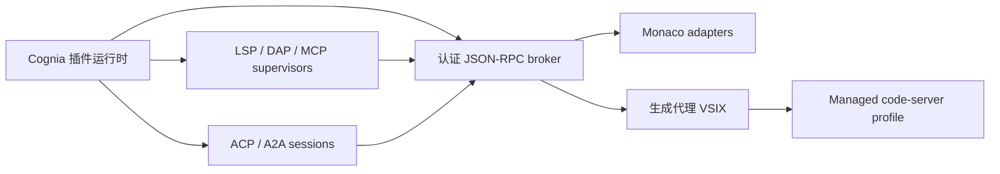

# 托管 IDE 扩展平台

<Status variant="beta">Protocol 1.0 · Code 1.128.0 · code-server 4.128.0</Status>

平台把同一个 Cognia 插件运行时投影到 Monaco 与 Pro IDE。Pro IDE 代理只含
已校验声明、静态资源和平台自有启动代码；插件业务代码不会在 VS Code
extension host 中执行。

每台主机有两个互斥 profile。Managed Pro IDE 只加载固定 built-in、Cognia
broker 和签名生成代理。Native Extensions IDE 在独立进程、端口、
`user-data-dir` 与 `extensions-dir` 中加载用户选择的 Open VSX 扩展，且永远
拿不到 broker 凭据。两者不共享扩展状态、secret、Workspace Trust 或
capability ticket。

- [作者与 SDK](./authoring)：`manifest.ide`、锁定 catalog、schema、provider
  family 与代理生成。
- [协议与安全](./protocol-security)：framing、认证、授权、存储、webview 与
  协议进程。
- [运维](./operations)：本地/远程托管、事务更新、迁移、Dev Mode 与排障。
- [兼容性](./compatibility)：版本政策、显式排除项与发布门禁。

背景决策见 [ADR-0088](../../adr/0088-pro-ide-code-server)。
