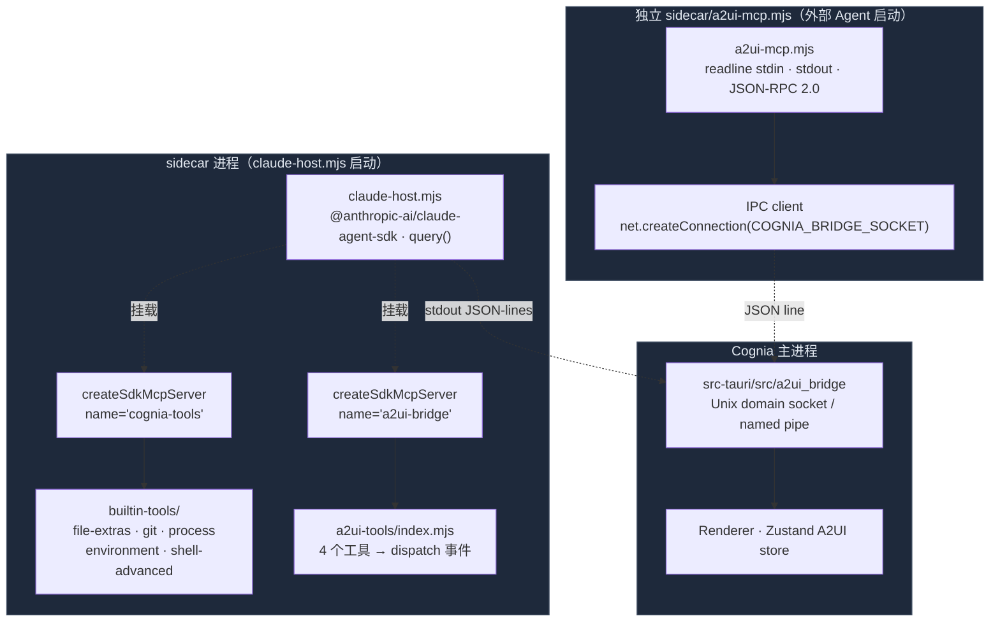

# MCP 服务（Sidecar 端）

## 适用场景

- 给当前 Claude Agent SDK 会话挂"扩展工具"：git 只读查询、process 列表、文件级 hash/diff、shell 受控执行、environment 读取。
- 让 Claude（或其他 AI SDK 提供者）直接在聊天里"画 UI"，通过 A2UI 协议产出可交互表面（dialog / panel / inline / fullscreen）。
- 让 Cognia 之外的编码 Agent（Claude Code CLI / Cursor / Codex / Gemini）也能控制 Cognia 的 A2UI 表面 —— 即"外面的 Claude 给里面的 Cognia 画 UI"。

## 不适用场景

- 暴露 Cognia 的 **wiki / RAG / 运行时实体** —— 那是 [External Bridge](./external-bridge) 的事，由 `lib/external-bridge/mcp-server/` 承载。
- 持久化工具结果到 Dexie —— sidecar 不直接接 IndexedDB；所有持久化必须经 IPC 回主进程。

## 架构

## 关键模块与文件路径

<Files>
  <Folder name="sidecar/" defaultOpen>
    <File name="claude-host.mjs" />
    <File name="a2ui-mcp.mjs" />
    <File name="fetch-interceptor.mjs" />
    <File name="package.json" />
    <Folder name="builtin-tools/">
      <File name="index.mjs" />
      <File name="safety.mjs" />
      <File name="file-extras.mjs" />
      <File name="git.mjs" />
      <File name="process.mjs" />
      <File name="environment.mjs" />
      <File name="shell-advanced.mjs" />
    </Folder>
    <Folder name="a2ui-tools/">
      <File name="index.mjs" />
    </Folder>
    <Folder name="dispatch/">
      <File name="index.mjs" />
      <File name="anthropic.mjs" />
      <File name="ai-sdk.mjs" />
      <File name="event-adapter.mjs" />
      <File name="input-stream.mjs" />
    </Folder>
  </Folder>
</Files>

| 文件 / 目录                        | 职责                                                                                                                    |
| ---------------------------------- | ----------------------------------------------------------------------------------------------------------------------- |
| `claude-host.mjs`                  | sidecar 顶层，包装 Claude Agent SDK 的 `query()`；按 settings 挂上 builtin-tools 与 a2ui-tools                          |
| `a2ui-mcp.mjs`                     | 独立 stdio MCP 服务，给 Cognia 之外的 Agent 用；通过 socket 回派 dispatch                                               |
| `builtin-tools/index.mjs`          | `buildCogniaToolsServer({ enabled })` —— 按用户的分类开关组装 in-process MCP 服务                                       |
| `builtin-tools/safety.mjs`         | 路径穿越守卫、shell allow/blocklist、`toolText` / `toolError` 工具响应封装                                              |
| `builtin-tools/file-extras.mjs`    | `file_hash` / `file_diff` / `file_search` / `content_search` / `file_copy` 等 13 个文件工具                             |
| `builtin-tools/git.mjs`            | git 只读子命令（log、status、diff、blame），用 `execFile` 避免 shell 注入                                               |
| `builtin-tools/process.mjs`        | 跨平台进程列表 / 查询 / 终止，Windows 走 PowerShell `Get-Process`、POSIX 走 `ps`                                        |
| `builtin-tools/environment.mjs`    | `list_env` / `get_env` / `system_info`，对 `*KEY*/*TOKEN*` 模式默认脱敏                                                 |
| `builtin-tools/shell-advanced.mjs` | `shell_execute_advanced` —— 强制 user approval 的受限 shell，比 SDK Bash 更严格                                         |
| `a2ui-tools/index.mjs`             | 四个 A2UI MCP 工具：`a2ui_create_surface` / `a2ui_update_components` / `a2ui_data_model_update` / `a2ui_delete_surface` |
| `dispatch/`                        | provider-aware 调度（anthropic 走 Claude Agent SDK、其他走 AI SDK），与本页 MCP 间接相关                                |

`@modelcontextprotocol/sdk` 不在 `sidecar/package.json` 的 dependencies —— 它是 `@anthropic-ai/claude-agent-sdk` 的传递依赖（in-process MCP 通过 `createSdkMcpServer` 暴露）；`a2ui-mcp.mjs` 故意不引 SDK，自己手写 readline + JSON-RPC，让独立 sidecar 体积尽可能小。

## 两类服务对比

| 维度          | In-process（builtin-tools / a2ui-tools）                          | Standalone（`a2ui-mcp.mjs`）                                                     |
| ------------- | ----------------------------------------------------------------- | -------------------------------------------------------------------------------- |
| 启动方        | `claude-host.mjs` 在每次 Claude 会话开始时构造                    | 外部 Agent 在自己的 MCP config 里注册，作为子进程拉起                            |
| 通信          | SDK 的进程内消息总线（`createSdkMcpServer` 返回的 instance）      | JSON-RPC 2.0 / newline-delimited stdio                                           |
| 工具集        | 5 类 builtin-tools + A2UI 4 工具                                  | 仅 A2UI 4 工具                                                                   |
| 配置          | `settings.builtinTools.<category>` 开关 + per-character allowlist | 由外部 Agent 的 MCP 配置文件决定                                                 |
| 鉴权          | 由 Claude Agent SDK 的 canUseTool 钩 + 用户 approval 流程         | 完全信任本地进程；通过 `COGNIA_BRIDGE_SOCKET` 是否可达决定能不能写回主进程       |
| Dispatch 路径 | sidecar stdout JSON-lines → Rust → Renderer                       | Unix socket / named pipe → Rust → Renderer                                       |
| 失败模式      | SDK 报错 → 工具返回 `isError: true`                               | socket 不可达 → 工具仍然 ok-respond，但 `dispatched: false` 给 Agent 做 fallback |

## 数据流

### In-process：Claude 在会话里调 `file_hash`

<Steps>
<Step>用户在 Cognia 聊天里发"对 README.md 算 SHA-256"。</Step>
<Step>`claude-host.mjs` 把当前 character 的 `builtinTools` 开关编译进 `query()` 的 `mcpServers` 字段： `{ "cognia-tools": buildCogniaToolsServer({ enabled }) }`。</Step>
<Step>Claude 决策 → 发起 `mcp__cognia-tools__file_hash` 工具调用。</Step>
<Step>SDK 校验工具名 → 调进 `file-extras.mjs` 里 `file_hash` 的 handler。</Step>
<Step>handler 走 `safety.mjs:assertPathInside(rootCwd, target)` 防穿越，再用 `crypto.createHash('sha256')` 流式算。</Step>
<Step>返回 `toolText({ ok: true, sha256, sizeBytes })` —— 即标准 MCP `CallToolResult` 结构。</Step>
<Step>SDK 把结果回流给 Claude；Claude 写答复。</Step>
</Steps>

### In-process：Claude 创建 A2UI 表面

<Steps>
<Step>`a2ui-tools/index.mjs:buildA2UIBridgeServer({ sessionId, emit })` 在 sidecar 启动时构造，挂在 `mcpServers["a2ui-bridge"]`。</Step>
<Step>Claude 调 `mcp__a2ui-bridge__a2ui_create_surface({ surfaceId: "calc-1", surfaceType: "panel" })`。</Step>
<Step>handler 调 `dispatch({ type: "createSurface", … })` —— 实际是 `emit({ type: "a2ui_dispatch", sessionId, message })`，emit 由 host 注入并最终 `process.stdout.write` 一行 JSON。</Step>
<Step>Rust 端 `a2ui_bridge` 接收这行 stdout 事件，转发到 Renderer 的 Zustand store。</Step>
<Step>React 组件订阅 store → 渲染表面；后续 `a2ui_update_components` 走同样路径。</Step>
</Steps>

### Standalone：Claude Code CLI 通过外部 MCP 控制 Cognia

<Steps>
<Step>用户在 Claude Code 的 `~/.claude/mcp.json` 里注册 `{ command: "node", args: [".../sidecar/a2ui-mcp.mjs"], env: { COGNIA_BRIDGE_SOCKET: "/tmp/cognia-a2ui.sock" } }`。</Step>
<Step>Claude Code 启动时 spawn 这个进程，立刻发 `initialize` JSON-RPC。</Step>
<Step>`a2ui-mcp.mjs` 解析后返回 `serverInfo: { name: "a2ui-bridge", version: "0.9.0" }` + `capabilities.tools`。</Step>
<Step>同时 `connectIpc()` 尝试 `net.createConnection(COGNIA_BRIDGE_SOCKET)`。连接失败 → stderr 日志一行 + 进入"detached"模式。</Step>
<Step>Claude Code 调 `tools/call name=a2ui_create_surface`。`TOOL_TO_DISPATCH` 表把 args 转成 internal message，`dispatch(message)` 写到 socket。</Step>
<Step>无论 socket 是否可达，工具响应都返回 `ok: true`，仅在 detached 时补 `note: "running detached; no UI dispatch"` —— 让外部 Agent 的规划循环不会因为 Cognia 没开而崩。</Step>
</Steps>

## 工具清单

### `cognia-tools` server（in-process，5 分类）

工具命名空间是 `mcp__cognia-tools__<tool>`；分类开关在 Settings → System → Tools。

| 分类            | 代表工具                                                                                                                               | 风险等级                |
| --------------- | -------------------------------------------------------------------------------------------------------------------------------------- | ----------------------- |
| `fileExtras`    | `file_hash` · `file_diff` · `file_info` · `file_search` · `content_search` · `file_copy` · `file_rename` · `directory_create` 等 13 项 | 中（写文件需 approval） |
| `git`           | 全部只读 —— `git status / log / diff / blame / show / branch / remote …`                                                               | 低                      |
| `process`       | `list_processes` · `get_process` · `search_processes` · `start_process` · `terminate_process`（仅杀已追踪 PID）                        | 高（须 approval）       |
| `environment`   | `list_env`（脱敏） · `get_env` · `system_info`                                                                                         | 低                      |
| `shellAdvanced` | `shell_execute_advanced` —— allow/blocklist + 受限 timeout + 强制 approval                                                             | 高                      |

通用约束（写在 `safety.mjs`）：

- 路径穿越守卫 `assertPathInside(rootCwd, target)`，与 Tauri 侧 `src-tauri/src/files.rs:fs_read_workspace_file` 一致。
- shell allowlist + blocklist + dangerous-pattern 三段过滤，与 `lib/ai/tools/shell-tool.ts` 同源。
- 工具响应统一用 `toolText({ ok, … })` / `toolError(err, toolName)` 包出 MCP CallToolResult。

### `a2ui-bridge` server（in-process + standalone 双形态，4 工具）

| 工具                     | 用途                                                                             |
| ------------------------ | -------------------------------------------------------------------------------- |
| `a2ui_create_surface`    | 创建一个新表面（`surfaceType: "inline" \| "dialog" \| "panel" \| "fullscreen"`） |
| `a2ui_update_components` | 整树替换表面上的组件数组                                                         |
| `a2ui_data_model_update` | merge / replace 表面的数据模型（表单值、图表数据、表格行）                       |
| `a2ui_delete_surface`    | 移除表面、回收资源                                                               |

两个形态的 schema 由两份代码各自维护（in-process 用 zod、standalone 手写 JSON Schema），但保留完全一致的字段名 —— 改一边要同步改另一边，否则外部 Agent 与 in-process 行为分裂。

## 配置项与扩展点

### sidecar 启动 env

| 变量                     | 谁设                                | 作用                                                           |
| ------------------------ | ----------------------------------- | -------------------------------------------------------------- |
| `COGNIA_BRIDGE_SOCKET`   | Cognia Rust 启动时                  | `a2ui-mcp.mjs` 用它定位 socket，回派 dispatch                  |
| `COGNIA_BRIDGED`         | External Bridge HTTP 服务的 sidecar | 切到 bridged 模式（详见 [External Bridge](./external-bridge)） |
| `COGNIA_BRIDGE_SETTINGS` | External Bridge HTTP 服务的 sidecar | 启动时一次性灌入的 `ExternalBridgeSettings` JSON               |

### 扩展新工具到 `cognia-tools`

<Steps>
<Step>在 `lib/settings/builtin-tools-data.json` 的某个 category 下加 `{ "name": "<tool>", "description": "…" }`。</Step>
<Step>在 `sidecar/builtin-tools/<category>.mjs` 里用 `tool("<tool>", "<description>", zodSchemaObj, async (args) => {...})` 注册 handler，并 export 到该文件的 `<category>Tools` 数组。</Step>
<Step>`builtin-tools/index.mjs` 自动通过 `TOOLS_BY_CATEGORY` 取到新工具，按 `settings.builtinTools.<category>` 开关组装。</Step>
<Step>React 设置页（`components/settings/system/builtin-tools-section.tsx`）从同一份 JSON 渲染开关与工具列表 —— 无需改前端代码。</Step>
</Steps>

### 添加新 A2UI 操作

A2UI 是协议，扩展操作意味着同时改：

1. `a2ui-tools/index.mjs`（in-process）
2. `a2ui-mcp.mjs`（standalone）
3. Rust `a2ui_bridge` 模块的事件解码
4. Renderer 端 A2UI store 的 reducer

由于双形态共享 schema，建议在 `types/a2ui/` 抽公共类型源。

## 关联子系统

<Cards>
  <Card
    title="A2UI 系统"
    href="./a2ui"
    description="表面渲染、客户端 store、Rust 桥 —— 本页两类 MCP 是它的工具入口"
  />
  <Card
    title="Sidecar & Claude SDK"
    href="../core/sidecar-and-claude-sdk"
    description="claude-host.mjs 总览、stdio JSON-lines 协议、provider 调度"
  />
  <Card
    title="External Bridge"
    href="./external-bridge"
    description="另一类 MCP（暴露 Cognia 知识给外部）；本页讲的 a2ui-mcp.mjs 与之并列"
  />
  <Card
    title="技能系统"
    href="../chat/skills-system"
    description="技能可以约束 character.allowedTools 来收紧本页讨论的工具集"
  />
</Cards>

## 关联 ADR

- [ADR 0008 — External Bridge (LLM Wiki + MCP server)](../adr/0008-external-bridge) —— 解释为什么 `a2ui-mcp.mjs` 与 `cognia-mcp.js` 是两个独立 binary。

## 已知限制 / 开放问题

- **`a2ui-mcp.mjs` 没有 SDK 依赖**：手写 JSON-RPC 框架，缺 SDK 的 batch 支持、partial-result 流式。短期可用，长期建议迁回 `@modelcontextprotocol/sdk` —— External Bridge 的 stdio 标准化代码可以共用。
- **A2UI schema 双源**：in-process（zod）和 standalone（JSON Schema）各写一遍，容易漂移。Phase 后续可用 `zod-to-json-schema` 一份源代码生成两份。
- **socket 重连策略**：固定 2 s 间隔重连，没有 backoff；Cognia 重启过程中外部 Agent 一直在打孔，量大时会占文件描述符。
- **shell 工具白名单 hardcode**：`safety.mjs:ALLOWED_COMMANDS` / `BLOCKED_COMMANDS` 写死，用户改不了；下一步把它做成 settings 暴露面。
- **process 工具的跨平台差异**：Windows 走 PowerShell（依赖 `Get-Process` 在 PS 7+），POSIX 走 `ps`；输出字段在 Windows 比 POSIX 多/少几个属性，调用方不能假设字段全集。
- **detached 模式调试困难**：standalone 时无 UI 副作用，仅 stderr 一行日志；用户难定位"我让 Claude 画 UI，怎么没出现？"—— 计划在 `a2ui-mcp.mjs` 启动时打印目标 socket 路径与连接结果到 stderr 顶部。
- **secret redaction 不可逆**：`environment.mjs:isSecretKey` 用名字模式匹配脱敏，遇到`MY_TOKEN_FOR_PUBLIC_API` 这种命名也会被遮蔽，用户须 explicit pass `revealSecrets: true`。
