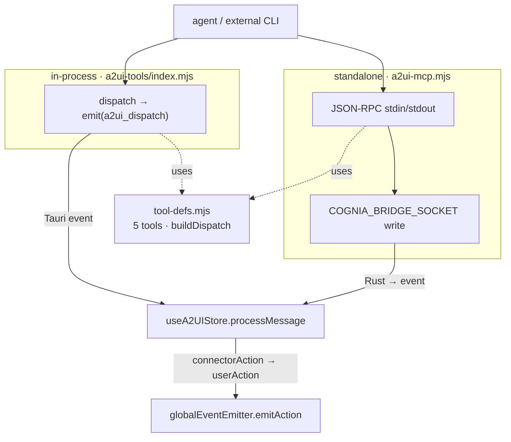

# A2UI MCP 桥接

<Status variant="stable">稳定 · 5 个工具 · 单一事实源 `tool-defs.mjs` · 进程内 + 独立</Status>

<TLDR>
  a2ui-bridge 让 agent 能够通过 MCP **绘制交互式 UI**。它以两种共享同一契约的形态存在：
  一个**进程内**的 SDK 服务器（`a2ui-tools/index.mjs`，由 sidecar 在每个会话挂载，
  `alwaysLoad: true`），以及一个**独立**的 stdio 服务器（`a2ui-mcp.mjs`，由 Claude Code 或 Cursor
  等外部 CLI 派生，通过 stdin/stdout 进行 JSON-RPC 通信）。两者的**五个**工具名称、
  描述、schema 和分发映射都来自同一个模块——`sidecar/a2ui-tools/tool-defs.mjs`——
  从而让两个服务器永不漂移（一个 Node 测试会断言该契约）。进程内形态会 `emit()` 一个
  分发事件；独立形态则会把它写入 `COGNIA_BRIDGE_SOCKET` Unix socket / 命名管道。
  两者最终都汇聚到渲染端的 A2UI store。第五个工具 `a2ui_handle_connector_action` 会把一个
  IM 用户的动作注入到 surface 上，让浏览器端用户和聊天端用户共享同一套流程。
</TLDR>

## 一个源头，两个服务器

```javascript title="sidecar/a2ui-tools/tool-defs.mjs:43"
export const TOOL_NAMES = [
  "a2ui_create_surface",
  "a2ui_update_components",
  "a2ui_data_model_update",
  "a2ui_delete_surface",
  "a2ui_handle_connector_action",
]
```

| Tool | Dispatch type | Purpose |
| ---- | ------------- | ------- |
| `a2ui_create_surface` | `createSurface` | 打开一个 surface（inline / dialog / panel / fullscreen） |
| `a2ui_update_components` | `updateComponents` | 替换组件树（A2UI v0.9 schema） |
| `a2ui_data_model_update` | `dataModelUpdate` | 补丁/替换表单值、图表数据、表格行 |
| `a2ui_delete_surface` | `deleteSurface` | 移除一个 surface，释放资源 |
| `a2ui_handle_connector_action` | `connectorAction` | 把 IM 渠道的用户动作注入到 surface 上 |

`tool-defs.mjs` 导出 `TOOL_NAMES`、`TOOL_DESCRIPTIONS`、`RAW_INPUT_SCHEMAS`（JSON Schema）、一个
`rawTools()` helper，以及 `buildDispatch(name, args)`——两个服务器都用它把工具参数转换为
一个分发信封：

```javascript title="sidecar/a2ui-tools/tool-defs.mjs:221"
case "a2ui_handle_connector_action":
  return {
    type: "connectorAction",
    surfaceId: args.surfaceId,
    componentId: args.componentId,
    actionType: args.actionType,
    value: args.value,
    payload: args.payload,
    platform: args.platform,
    triggerId: args.triggerId,
    conversationKey: args.conversationKey,
  }
```

一个漂移防护测试钉住了该契约：

```javascript title="sidecar/a2ui-tools/tool-defs.test.mjs:20"
test("exposes the five contracted tool names", () => {
  assert.deepEqual(TOOL_NAMES, [
    "a2ui_create_surface", "a2ui_update_components", "a2ui_data_model_update",
    "a2ui_delete_surface", "a2ui_handle_connector_action",
  ])
})
```

渲染端在 `lib/a2ui/mcp-tool-schemas.ts` 中保留了一份平行的类型化副本（`A2UI_BRIDGE_TOOLS`，第 53 行），
用于**填充内置的 `a2ui-bridge` 行**（`buildA2UIBridgeMcpRow`，第 197 行）、检测该行
（`isA2UIBridgeRow`），以及计算其用于投射到外部 agent 的命名空间工具名称。

## 进程内形态

`a2ui-tools/index.mjs:buildA2UIBridgeServer({ sessionId, emit, alwaysLoad })` 构建一个名为
`a2ui-bridge` 的 SDK MCP 服务器。每个工具的 handler 会调用 `buildDispatch`，然后调用 `dispatch`，后者会 `emit()`
一个单一事件，由 host 写入 stdout：

```javascript title="sidecar/a2ui-tools/index.mjs:69"
const dispatch = (message) => {
  emit({ type: "a2ui_dispatch", sessionId, message })
}
```

它被挂载为分发的 [layer 3](./session-resolution#stage-3--merge-layers-sidecar)，并带有
`alwaysLoad: true`——交互式 surface 绝不能被延后到 tool-search 之后：

```javascript title="sidecar/dispatch/anthropic.mjs:132"
const a2uiServer = buildA2UIBridgeServer({ sessionId, emit, alwaysLoad: true })
```

## 独立形态

`sidecar/a2ui-mcp.mjs` 是一个自包含的 stdio MCP 服务器，供运行在 Cognia **之外**的 agent 使用。它
在以换行符分隔的 stdin/stdout 上手写实现了 JSON-RPC 2.0（它刻意避免引入 SDK
以保持精简），并通过 `COGNIA_BRIDGE_SOCKET` 给定的 Unix socket / 命名管道进行分发：

```javascript title="sidecar/a2ui-mcp.mjs:82"
function dispatch(message) {
  if (!ipcSocket) return false
  try {
    ipcSocket.write(JSON.stringify({ type: "a2ui_dispatch", source: "a2ui-mcp", message }) + "\n")
    return true
  } catch (err) {
    logStderr(`dispatch write failed: ${err?.message ?? err}`)
    return false
  }
}
```

`tools/call` 会运行相同的 `buildDispatch`，然后报告该分发是否抵达了渲染端。关键在于，
它会**优雅降级**——如果 socket 不可达（Cognia 未运行、沙箱化的 agent），该工具
仍会返回 `ok: true` 且 `dispatched: false`，因此外部 agent 的规划循环永不崩溃：

```javascript title="sidecar/a2ui-mcp.mjs:123"
case "tools/call": {
  const message = buildDispatch(params?.name, params?.arguments ?? {})
  if (!message) return sendError(id, -32601, `unknown tool: ${params?.name}`)
  const dispatched = dispatch(message)
  return sendResponse(id, { content: [{ type: "text", text: JSON.stringify({
    ok: true, surfaceId: params.arguments?.surfaceId, dispatched,
    note: dispatched ? undefined : "running detached; no UI dispatch",
  }) }] })
}
```

socket 连接以固定的 2 秒退避进行重试；其路径会由 [`resolve.ts`](./session-resolution#stage-2--placeholder-resolution-external-agents)
注入到被投射的 a2ui-bridge 行中。

## 两条路径的汇聚处

两种形态都会抵达渲染端的 `useA2UIStore.processMessage`（进程内形态通过 Tauri 的 `a2ui://dispatch` 事件，
独立形态通过 socket → Rust → 事件）。`processMessage` 会把每种分发类型路由到一个
store action；`connectorAction` 会变成一个与渲染端点击无法区分的 `userAction`：

```typescript title="stores/a2ui/a2ui-store.ts:366"
if (isConnectorActionMessage(message)) {
  const action = message.value && message.value.length > 0 ? message.value : message.actionType
  const data: Record<string, unknown> = { source: "connector", actionType: message.actionType }
  if (message.value !== undefined) data.value = message.value
  if (message.platform !== undefined) data.platform = message.platform
  // …triggerId, conversationKey, payload…
  emitAction(message.surfaceId, action, message.componentId ?? "", data)
  return
}
```



## 进程内 vs 独立

| Dimension | In-process | Standalone |
| --------- | ---------- | ---------- |
| File | `a2ui-tools/index.mjs` | `a2ui-mcp.mjs` |
| Launcher | 每会话由 sidecar `claude-host.mjs` 启动 | 外部 agent 的 MCP 配置 |
| Transport | SDK 进程内总线 → emit() | 基于 stdio 的 JSON-RPC |
| Write-back | stdout JSON 行 → Rust → 渲染端 | `COGNIA_BRIDGE_SOCKET` → Rust → 渲染端 |
| Schemas | zod（来自相同的名称/描述） | 原始 JSON Schema（`rawTools()`） |
| SDK dependency | 是（`createSdkMcpServer`） | 无（手写实现） |
| Failure mode | SDK 错误 → `isError: true` | socket 断开 → `ok:true, dispatched:false` |

## 语境中的第五个工具

`a2ui_handle_connector_action` 正是让 A2UI surface 能从 Slack / Lark / Telegram / Discord 使用的关键：
connector 适配器接收到一次对平台原生卡片的点按，agent 携带动作
详情调用此工具，渲染端则把它注入为一个 `userAction`，于是 agent 的下一轮会看到它，
其形态与浏览器点击完全相同。端到端的 IM 往返（卡片投射 → 回调 → 此工具）记录在
[A2UI ⇄ IM 桥接](../a2ui/im-bridge)中。

## 相关页面

<Cards>
  <Card title="A2UI 子系统" href="../a2ui" description="这些工具所驱动的对象——协议、catalog 渲染、渲染端 store、输出 profile，以及 IM 投射。" />
  <Card title="会话解析" href="./session-resolution" description="Layer-3 挂载，以及注入到被投射的 a2ui-bridge 行中的 socket。" />
  <Card title="内置工具" href="./builtin-tools" description="sidecar 每个会话挂载的另一个进程内服务器（cognia-tools）。" />
</Cards>

## 相关 ADR

- [ADR 0025 — A2UI ⇄ IM 桥接](../../adr/0025-a2ui-im-bridge) — connector-action 往返。
- [ADR 0008 — External Bridge](../../adr/0008-external-bridge) — 为何 `a2ui-mcp.mjs` 是一个独立的二进制文件。
