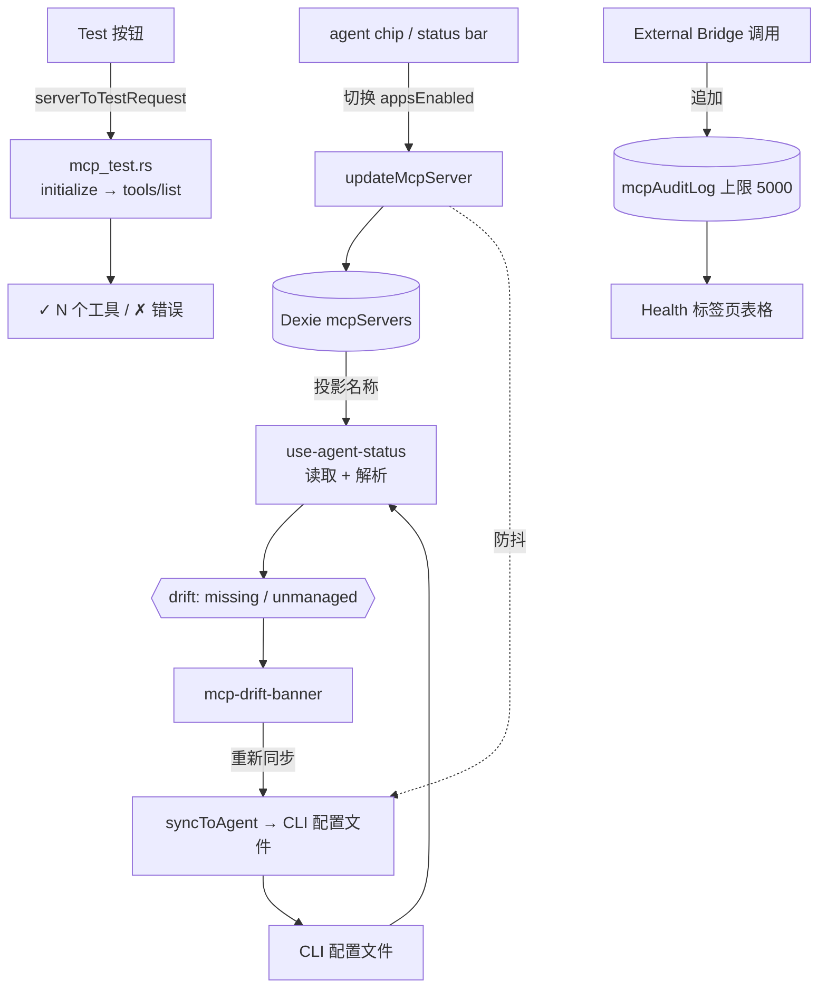

# Agent 同步与健康

<Status variant="stable">Stable · 7 个可写 + 2 个只读 agent · `mcp_test.rs` · `mcpAuditLog`（上限 5000）</Status>

<TLDR>
  每个 `McpServer` 行携带一个 `appsEnabled` 矩阵，将 `AgentId → boolean` 映射起来。当你切换某个标记时，
  CRUD 层会防抖地将该服务器写入该 agent 的磁盘 MCP 配置（`lib/claude/sync`）。
  由于文件可能与 Cognia 的视图发生漂移（手工编辑、同步失败），`use-agent-status` 会计算
  每个 agent 的 **drift** —— `missing`（已投影但文件中缺失）和 `unmanaged`（文件中存在，但 Cognia 未知）——
  由 **drift banner** 呈现，并支持一键重新同步。另外，**test** 按钮
  会运行一个 Rust 探针（`mcp_test.rs`），通过配置的 transport 执行真实的 `initialize → tools/list`
  握手，并返回工具计数。**Health 标签页**显示入站 External-Bridge
  服务器状态以及 `mcpAuditLog` —— 每一次桥接调用，无论允许还是拒绝，上限 5000 行。
</TLDR>

## 投影矩阵

七个 agent 是**可写**的（Cognia 将服务器镜像到它们的配置中），两个是**只读**的
（不写入的适配器 —— Cognia 可以读取它们的配置但无法推送）：

```typescript title="appsEnabled targets"
// writable
"claude-code" · "claude-desktop" · "cursor" · "vscode" · "codex" · "gemini" · "windsurf"
// read-only
"cline" · "roo-code"
```

切换标记会在 Dexie 中修补 `appsEnabled[agent]`；CRUD 层会调度文件同步：

```tsx title="components/settings/mcp-agent-chip-group.tsx:60"
const onClick = async () => {
  if (busy || inert) return
  const next = { ...(server.appsEnabled ?? {}), [agent.id]: !projected }
  await updateMcpServer(server.id, { appsEnabled: next })
  toast.success(projected
    ? t("removingToast", { agent: agent.displayName, name: server.name })
    : t("addingToast", { agent: agent.displayName, name: server.name }))
}
```

标记状态（`mcp-agent-chip-group.tsx:4`）：**on**（已投影到此处）、**off**（文件存在，但未投影）、
**missing**（无文件 —— 惰性）、**readonly**（适配器无法写入 —— 惰性）。

## Drift 检测

`use-agent-status` 通过适配器读取每个 agent 的配置文件，并将文件内的服务器名称
与 Cognia 的投影进行对比：

```typescript title="hooks/.../use-agent-status.ts (drift compute)"
for (const agent of MCP_AGENT_ADAPTERS) {
  if (!agent.writable) continue
  const snap = snapshots[agent.id]
  if (!snap.exists || snap.parseError) continue
  const projected = projectedNames[agent.id] ?? new Set<string>()
  const missing = [...projected].filter((n) => !snap.inFileNames.has(n))   // we say ON, file says no
  const unmanaged = [...snap.inFileNames].filter((n) => !projected.has(n)) // file has it, we don't
  drift[agent.id] = { missing, unmanaged }
}
```

- **`missing`** —— 可操作的那种；drift banner 显示一个 **Re-sync** 按钮（`syncToAgent`）。
- **`unmanaged`** —— 信息性的（手工添加的条目）；banner 转而提供 **Import**。

**drift banner**（`components/settings/mcp-drift-banner.tsx`）仅对存在
`missing.length > 0` 的 agent 渲染，可按会话关闭，并可展开列出有问题的服务器名称：

```tsx title="components/settings/mcp-drift-banner.tsx:55"
const onResync = async (agentId: AgentId) => {
  setBusy((b) => new Set(b).add(agentId))
  try {
    const r = await syncToAgent(agentId)
    if (r.ok) toast.success(t("resyncSuccess"))
    else if ("skipped" in r) toast.message(/* reason */)
    else toast.error(/* error */)
    refresh() // re-read file snapshots
  } finally {
    setBusy(/* drop agentId */)
  }
}
```

**agent 状态栏**（`mcp-agent-status-bar.tsx`）是 Agents 标签页的头部：每个 agent 的文件路径、
文件内计数对比投影计数（不一致时显示琥珀色），以及一个 per-agent 和一个 sync-all 按钮。

## 连接探针（`mcp_test.rs`）

每个服务器卡片上的 **Test** 按钮会调用 Rust 命令 `test_mcp_server`
（`src-tauri/src/claude/mcp_test.rs:38`）。它会启动/连接配置的 transport，走完 MCP
握手，捕获工具列表，然后拆除一切 —— 带有 10 秒握手超时：

```rust title="src-tauri/src/claude/mcp_test.rs:21"
pub struct McpTestResult {
    pub ok: bool,
    pub tool_count: usize,
    pub tools: Vec<McpToolInfo>,
    pub error: Option<String>,
    pub duration_ms: u64,
}
```

所有三种 transport 都运行相同的 JSON-RPC 序列 —— `initialize`（协议 `2024-11-05`）→
`notifications/initialized` → `tools/list`：

```rust title="src-tauri/src/claude/mcp_test.rs:107"
write_jsonrpc(&mut writer, &serde_json::json!({
  "jsonrpc": "2.0", "id": 1, "method": "initialize",
  "params": {
    "protocolVersion": "2024-11-05",
    "capabilities": {},
    "clientInfo": { "name": "cognia", "version": "0.1" }
  }
})).await?;
```

| Transport | 函数 | 说明 |
| --------- | -------- | ----- |
| stdio | `test_stdio` (82) | 以管道式 stdin/stdout 启动子进程；退出时始终 kill (181) |
| http | `test_streamable_http` (233) | POST JSON-RPC；同时处理 `application/json` *和* `text/event-stream`；回显 `mcp-session-id` |
| sse | `test_sse` (385) | 旧版：读取 `endpoint` 事件，然后向其 POST，从 SSE 流中读取回复 |

结果会填充卡片的 test 徽章（工具计数或错误）。

## 审计日志

`lib/db/mcp-audit-log.ts` 将每一次**入站** External-Bridge 调用记录到 `mcpAuditLog` Dexie
表中（行类型 `McpAuditLogRow`，`types/wiki/index.ts:264`）：timestamp、tool/method、scope、allow/deny、
延迟，以及可选的 reason/error。它的上限是 5000 行，并在每次追加的同一事务中进行修剪：

```typescript title="lib/db/mcp-audit-log.ts:27"
export async function appendMcpAuditLog(draft: McpAuditDraft): Promise<McpAuditLogRow> {
  const db = getDb()
  const row: McpAuditLogRow = { id: draft.id ?? newId(), ...draft }
  await db.transaction("rw", db.mcpAuditLog, async () => {
    await db.mcpAuditLog.add(row)
    await pruneOldest(AUDIT_CAP) // AUDIT_CAP = 5000
  })
  return row
}
```

`listMcpAuditLog({ tool?, deniedOnly?, limit? })` 返回最新优先的结果；`pruneOldest` 通过游标扫描
`ts` 索引并 `bulkDelete` 溢出部分，因此每次写入时的修剪保持低成本。索引：
`&id, ts, tool, allowed, [tool+ts]`。

### Health 标签页

`components/settings/mcp/mcp-health-tab.tsx`（仅桌面端）显示入站桥接服务器状态
（通过 `getMcpServerStatus` 获取 running/port/startedAt），并将审计日志渲染为表格 ——
timestamp · tool · scope · allowed/denied 徽章 · 延迟 —— 带有 denied-only 筛选和一个 clear 按钮。

```tsx title="components/settings/mcp/mcp-health-tab.tsx:44"
const refreshStatus = useCallback(async () => {
  setLoadingStatus(true)
  try { setStatus(await getMcpServerStatus()) }
  catch (err) { loggers.mcp.error("health.statusFailed", err) }
  finally { setLoadingStatus(false) }
}, [])
```

> 这里的审计日志和桥接状态属于**入站**服务器（Cognia 作为 MCP 服务器）。它们的
> 生产侧位于 [External Bridge](../external-bridge) 子系统中；本标签页是消费视图。

## 流程



## 相关页面

<Cards>
  <Card title="服务器配置与 store" href="./server-config" description="updateMcpServer + scheduleSyncFor —— 镜像的写入侧。" />
  <Card title="预设与导入" href="./presets-and-import" description="Import 是 sync 的逆向 —— 把 unmanaged 条目拉回来。" />
  <Card title="External Bridge" href="../external-bridge" description="Health 标签页展示其状态和审计日志的入站服务器。" />
</Cards>
