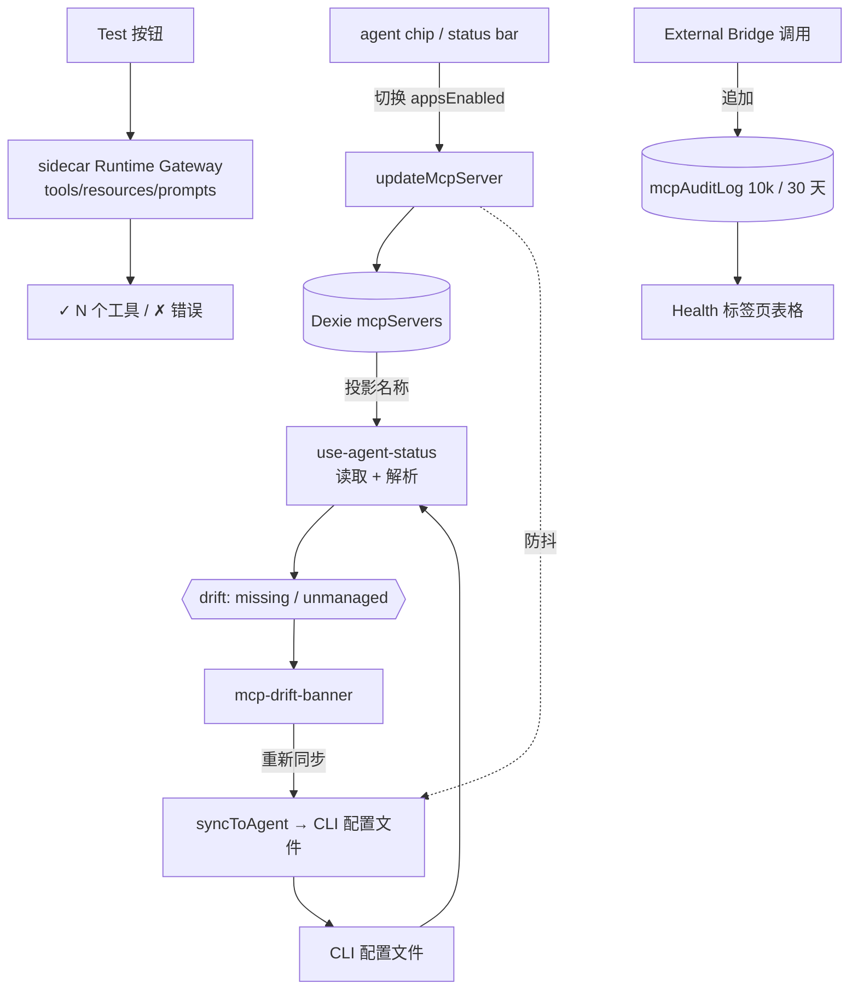

# Agent 同步与健康

<Status variant="stable">Stable · 持久化 `mcpSyncJobs` · sidecar Runtime Gateway · `mcpAuditLog`（10k / 30 天）</Status>

<TLDR>
  每个 `McpServer` 行携带一个 `appsEnabled` 矩阵，将 `AgentId → boolean` 映射起来。当你切换某个标记时，
  CRUD 层会防抖地将该服务器写入该 agent 的磁盘 MCP 配置（`lib/claude/sync`）。
  由于文件可能与 Cognia 的视图发生漂移（手工编辑、同步失败），`use-agent-status` 会计算
  每个 agent 的 **drift** —— `missing`（已投影但文件中缺失）和 `unmanaged`（文件中存在，但 Cognia 未知）——
  由 **drift banner** 呈现，并支持一键重新同步。**test** 按钮通过 sidecar Runtime Gateway 做受防护的
  能力发现。**Health 标签页**同时展示实时 runtime 指标、按服务器失败率、连接 P95、能力新鲜度、
  Agent 同步延迟、入站 External-Bridge 状态，以及无内容的 `mcpAuditLog`。
</TLDR>

## 投影矩阵

七个 agent 是**可写**的（Cognia 将服务器镜像到它们的配置中），两个是**只读**的
（不写入的适配器 —— Cognia 可以读取它们的配置但无法推送）：

```typescript title="appsEnabled targets"
// writable
"claude-code" · "claude-desktop" · "cursor" · "vscode" · "codex" · "gemini" · "windsurf"
// read-only
"cline" · "roo-code"
```

切换标记会在 Dexie 中修补 `appsEnabled[agent]`；CRUD 层会调度文件同步：

```tsx title="components/settings/mcp-agent-chip-group.tsx:60"
const onClick = async () => {
  if (busy || inert) return
  const next = { ...(server.appsEnabled ?? {}), [agent.id]: !projected }
  await updateMcpServer(server.id, { appsEnabled: next })
  toast.success(projected
    ? t("removingToast", { agent: agent.displayName, name: server.name })
    : t("addingToast", { agent: agent.displayName, name: server.name }))
}
```

标记状态（`mcp-agent-chip-group.tsx:4`）：**on**（已投影到此处）、**off**（文件存在，但未投影）、
**missing**（无文件 —— 惰性）、**readonly**（适配器无法写入 —— 惰性）。

## Drift 检测

`use-agent-status` 通过适配器读取每个 agent 的配置文件，并将文件内的服务器名称
与 Cognia 的投影进行对比：

```typescript title="hooks/.../use-agent-status.ts (drift compute)"
for (const agent of MCP_AGENT_ADAPTERS) {
  if (!agent.writable) continue
  const snap = snapshots[agent.id]
  if (!snap.exists || snap.parseError) continue
  const projected = projectedNames[agent.id] ?? new Set<string>()
  const missing = [...projected].filter((n) => !snap.inFileNames.has(n))   // we say ON, file says no
  const unmanaged = [...snap.inFileNames].filter((n) => !projected.has(n)) // file has it, we don't
  drift[agent.id] = { missing, unmanaged }
}
```

- **`missing`** —— 可操作的那种；drift banner 显示一个 **Re-sync** 按钮（`syncToAgent`）。
- **`unmanaged`** —— 信息性的（手工添加的条目）；banner 转而提供 **Import**。

**drift banner**（`components/settings/mcp-drift-banner.tsx`）仅对存在
`missing.length > 0` 的 agent 渲染，可按会话关闭，并可展开列出有问题的服务器名称：

```tsx title="components/settings/mcp-drift-banner.tsx:55"
const onResync = async (agentId: AgentId) => {
  setBusy((b) => new Set(b).add(agentId))
  try {
    const r = await syncToAgent(agentId)
    if (r.ok) toast.success(t("resyncSuccess"))
    else if ("skipped" in r) toast.message(/* reason */)
    else toast.error(/* error */)
    refresh() // re-read file snapshots
  } finally {
    setBusy(/* drop agentId */)
  }
}
```

**agent 状态栏**（`mcp-agent-status-bar.tsx`）是 Agents 标签页的头部：每个 agent 的文件路径、
文件内计数对比投影计数（不一致时显示琥珀色），以及一个 per-agent 和一个 sync-all 按钮。

## Sidecar Runtime Gateway 能力发现

**Test** 按钮和 workflow 工具选择器调用 `discoverMcpServerViaSidecar`。可信宿主先检查 policy 并解析
`SecretRef`，随后通过 allowlist 中的 `mcp-discover` feature call 到达
`sidecar/dispatch/mcp-runtime-gateway.mjs`。能力发现使用官方 stdio、Streamable HTTP 与 legacy SSE
transport，连接/列表超时为 15 秒，不自动重试工具调用，并始终关闭 client 与 DNS guard dispatcher。
原手写 Rust `test_mcp_server` 命令以及对应 Companion/Tauri 权限面已删除。

远程 Anthropic Agent SDK 配置会转换为由 SDK 管理的 stdio relay。SDK 仍负责子进程生命周期与重连，
`mcp-stdio-relay.mjs` 则负责上游 HTTP/SSE socket，并应用与 AI SDK/OAuth 相同的受防护 Undici DNS
lookup，从而关闭 DNS rebinding 缺口。

## 健康标签页

`McpHealthTab` 从两个方向回答 MCP 的健康状况，章节顺序也照此排列。

**出站**（Cognia 作为 MCP *客户端*）以 `McpLiveSessionCard` 开头——由 SDK 的 `mcpServerStatus()` 控制方法驱动的、
当前运行中 agent 会话的逐服务器状态，带有重连与按会话开关的操作。它也包含根本没有 `McpServer` 记录的进程内
`cognia` / `a2ui` / 插件服务器。随后是一小时滚动窗口的日志摘要、runtime gateway 指标（热复用、能力缓存命中、重试、超时、
策略拒绝、平均连接延迟）、持久化的逐服务器运行表，以及 `<LogPanel sources={["mcp"]} />`。

**入站**（Cognia 作为 MCP *服务器*，经 External Bridge）紧随其后：bridge 状态、通往 bridge 自身设置的深链，
以及[审计日志](#审计日志)。

<Callout type="info">
  实时会话卡片放在这里而不是服务器列表上方，是因为它回答的是一个健康问题——"运行中的 agent 现在看到了什么？"——
  而且一个高度可变的卡片压在主从列表顶部，会在每次切换会话时把列表推来推去。
</Callout>

## 审计日志

`lib/db/mcp-audit-log.ts` 将**出站与入站** MCP 操作的无内容审计记录到 `mcpAuditLog` Dexie
表中（行类型 `McpAuditLogRow`，`types/wiki/index.ts:264`）：timestamp、phase、server、surface、
decision、duration 与有界 error code。它按 10,000 行或 30 天（先到者）设定上限，并在每次追加的同一事务中进行修剪：

```typescript title="lib/db/mcp-audit-log.ts:27"
export async function appendMcpAuditLog(draft: McpAuditDraft): Promise<McpAuditLogRow> {
  const db = getDb()
  const row: McpAuditLogRow = { id: draft.id ?? newId(), ...draft }
  await db.transaction("rw", db.mcpAuditLog, async () => {
    await db.mcpAuditLog.add(row)
    await pruneOldest(AUDIT_CAP) // AUDIT_CAP = 10_000
  })
  return row
}
```

`listMcpAuditLog({ tool?, deniedOnly?, limit? })` 返回最新优先的结果；`pruneOldest` 通过游标扫描
`ts` 索引并 `bulkDelete` 溢出部分，因此每次写入时的修剪保持低成本。索引：
`&id, ts, tool, allowed, [tool+ts]`。

### Health 标签页

`components/settings/mcp/mcp-health-tab.tsx` 通过一个 `loadMcpOperationsSnapshot` 投影读取
`mcpServers`、`mcpAuditLog`、`mcpCapabilityCache` 与 `mcpSyncJobs`，展示按服务器失败率、连接 P95、
能力新鲜度与 Agent 同步延迟。入站 bridge 状态与近期审计表仍是同一视图中的独立区块。

```tsx title="components/settings/mcp/mcp-health-tab.tsx:44"
const refreshStatus = useCallback(async () => {
  setLoadingStatus(true)
  try { setStatus(await getMcpServerStatus()) }
  catch (err) { loggers.mcp.error("health.statusFailed", err) }
  finally { setLoadingStatus(false) }
}, [])
```

> 出站与入站事件只共享审计词汇，不共享原始 payload 或生命周期所有权。
> [External Bridge](../external-bridge) 仍是独立的入站信任平面。

## 流程



## 相关页面

<Cards>
  <Card title="服务器配置与 store" href="./server-config" description="updateMcpServer + scheduleSyncFor —— 镜像的写入侧。" />
  <Card title="预设与导入" href="./presets-and-import" description="Import 是 sync 的逆向 —— 把 unmanaged 条目拉回来。" />
  <Card title="External Bridge" href="../external-bridge" description="Health 标签页展示其状态和审计日志的入站服务器。" />
</Cards>
