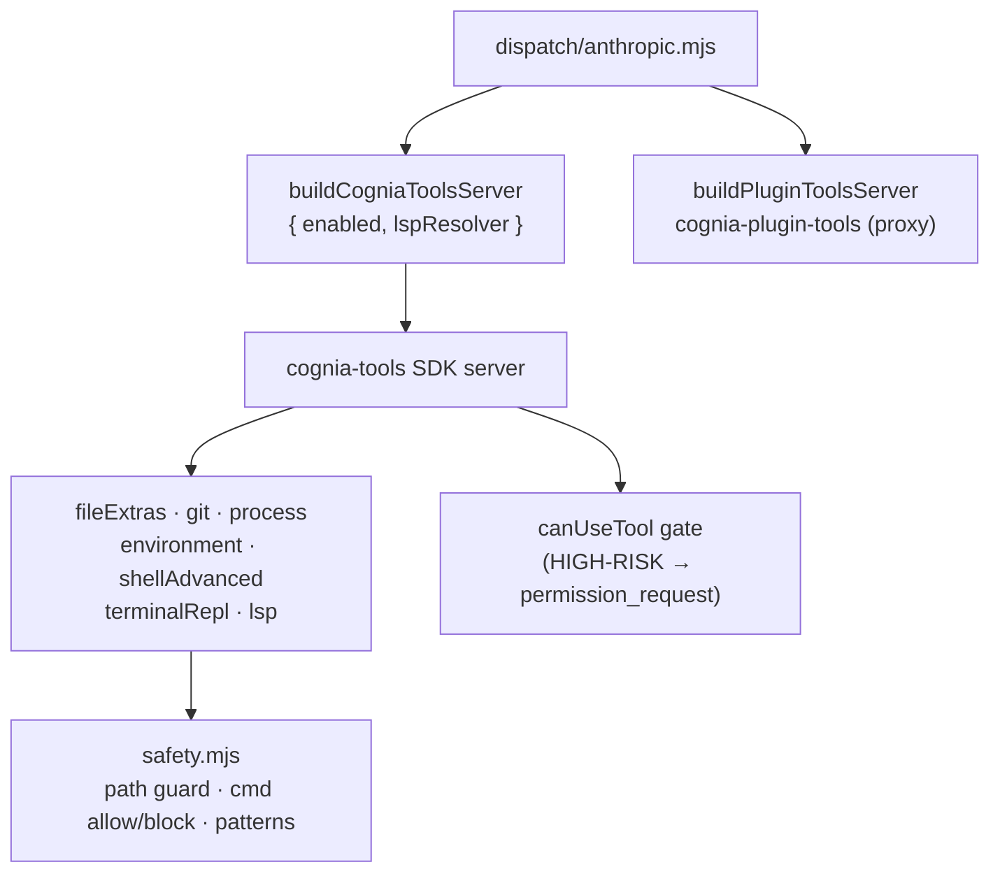

# 内置工具 (`cognia-tools`)

<Status variant="stable">稳定 · 44 个工具 · 7 个类别 · 安全门控</Status>

<TLDR>
  `sidecar/builtin-tools/index.mjs:buildCogniaToolsServer` 从按类别划分的工具模块中，组装出一个名为
  **`cognia-tools`** 的进程内 SDK MCP 服务器——`fileExtras`（13 个）、`git`（9 个）、`process`（9 个）、
  `environment`（3 个）、`shellAdvanced`（1 个）、`terminalRepl`（4 个）和 `lsp`（5 个，动态）——共计 **44 个工具**，
  命名空间为 `mcp__cognia-tools__<tool>`。类别由 `settings.builtinTools.<category>`
  开关门控，且被禁用的类别*还会*被推入 `disallowedTools` 作为纵深防御。每个工具
  都经过 `safety.mjs`：路径穿越防护、shell 允许/阻止清单 + 危险模式
  扫描器、机密信息脱敏，以及 `toolText`/`toolError` 结果包装器。写入/执行类工具
  （`directory_delete`、`start_process`、`terminate_process`、`shell_execute_advanced`）属于高风险，
  并始终经过 SDK 的 `canUseTool` 审批门。
</TLDR>

<StatGrid>
  <Stat label="工具总数" value="44" hint="7 个类别" />
  <Stat label="只读" value="~32" hint="alwaysLoad-optimized" />
  <Stat label="高风险" value="4" hint="审批门控的写入/执行" />
  <Stat label="允许清单内的 shell" value="~150" hint="safety.mjs ALLOWED_COMMANDS" />
</StatGrid>

## 组装

```javascript title="sidecar/builtin-tools/index.mjs:25"
const TOOLS_BY_CATEGORY = {
  fileExtras: fileExtrasTools,
  git: gitTools,
  process: processTools,
  environment: environmentTools,
  shellAdvanced: shellAdvancedTools,
  terminalRepl: terminalReplTools,
  // lsp: built dynamically via createLspTools(lspResolver)
}
```

`buildCogniaToolsServer({ enabled, alwaysLoad, lspResolver })`（第 69 行）仅包含已启用的
类别，在 LSP 工具存在时将其绑定到按会话划分的解析器，并在没有任何内容
启用时返回 `null`（这样分发层可以跳过挂载）。类别 ID、工具名称、服务器名称和版本号
均来自一份共享的 JSON（`lib/settings/builtin-tools-data.json`），从而让 React 设置 UI 与 sidecar
永不漂移。

被禁用的类别会被双重阻止——既不挂载，*又*把它们的工具名称加入
`disallowedTools`：

```javascript title="sidecar/builtin-tools/index.mjs:100"
export function namesForDisabledCategories(enabled) {
  /* returns mcp__cognia-tools__<tool> for every category turned off */
}
```

## 工具参考

命名空间：`mcp__cognia-tools__<tool>`。开关位于 **Settings → System → Tools**。

### `fileExtras` — 13 个工具 (`file-extras.mjs`)

| Tool | Kind | Notes |
| ---- | ---- | ----- |
| `file_hash` | read | md5/sha1/sha256/sha512，最大 100 MB |
| `file_diff` | read | 统一 diff，每侧最大 5 MB，上下文 0–20 |
| `file_info` | read | size · mtime · mode · mime |
| `file_exists` | read | 路径测试 |
| `file_search` | read | glob/列表，maxResults 200，遵循 `.gitignore`（根 + 嵌套；`respectGitignore:false` 关闭） |
| `content_search` | read | 子串/正则，maxResults 100，遵循 `.gitignore`（根 + 嵌套；`respectGitignore:false` 关闭） |
| `file_append` | write | 审批 + 路径防护 |
| `file_binary_write` | write | base64 载荷 |
| `file_copy` | write | 覆盖需显式选择 |
| `file_rename` | write | 原地 |
| `file_move` | write | 跨设备回退 |
| `directory_create` | write | 递归选项 |
| `directory_delete` | write | **高风险** |

### `git` — 9 个工具，全部只读 (`git.mjs`)

`git_status` · `git_diff` · `git_log` · `git_branch` · `git_remote` · `git_tag` · `git_repo_inspect` ·
`git_changes` · `git_history`。每个工具都通过 `git rev-parse --git-dir` 校验仓库，经由
`execFile` 运行（无 shell 注入），并将输出上限设为 256 KB。

```javascript title="sidecar/builtin-tools/git.mjs:124"
const argv = ["log", "-n", String(args.limit), "--pretty=format:%H%x09%an%x09%ae%x09%aI%x09%s"]
```

### `process` — 9 个工具 (`process.mjs`)

只读：`list_processes` · `get_process` · `search_processes` · `top_memory_processes` ·
`check_program_allowed` · `get_process_manager_status` · `get_tracked_processes`。
写入（高风险）：`start_process`（允许清单内的程序，追踪 PID）、`terminate_process`（除非传入
`allowUntracked`，否则拒绝未追踪的 PID）。跨平台——Windows PowerShell `Get-Process`，POSIX `ps`；
只有本会话中派生的 PID 才对 `get_tracked_processes` 可见：

```javascript title="sidecar/builtin-tools/process.mjs:24"
/** @type {Set<number>} */
const trackedPids = new Set()
```

### `environment` — 3 个工具 (`environment.mjs`)

`list_env` · `get_env` · `system_info`。除非传入 `revealSecrets: true`，否则形似机密的键会被
脱敏为 `********`：

```javascript title="sidecar/builtin-tools/environment.mjs (isSecretKey)"
/(key|secret|token|password|credential|passwd|api[_-]?key)/i
```

### `shellAdvanced` — 1 个工具 (`shell-advanced.mjs`)

`shell_execute_advanced` — 高风险，始终经过审批门。使用 `execFile`（参数永不被重新解析为
元字符）、64 KB 输出上限、5 分钟硬超时，以及一个三阶段的 `validateShellCommand` 门。

### `terminalRepl` — 4 个工具 (`terminal-repl-tool.mjs`)

一个由 `node-pty` 支撑的持久化私有 shell，与渲染端的终端 dock 正交。
`terminal_repl_spawn` · `terminal_repl_write` · `terminal_repl_read` · `terminal_repl_kill`。每个 agent
的配额为 8 个会话，每个会话 256 KB 环形缓冲区，闲置 10 分钟后进行 GC，每次调用都会检查所有权。

### `lsp` — 5 个工具，动态 (`lsp.mjs`)

绑定到按会话划分的 LSP 解析器；仅在提供了 `lspResolver` 时才存在。
`lsp_goto_definition` · `lsp_find_references` · `lsp_hover` · `lsp_document_symbols` · `lsp_diagnostics`。
位置会从 1 起始（编辑器）转换为 0 起始（LSP）：

```javascript title="sidecar/builtin-tools/lsp.mjs:87"
tool(
  "lsp_goto_definition",
  "Find where the symbol at a position is defined. Returns file:line:col locations.",
  { file: z.string(), line: z.number().int().min(1), character: z.number().int().min(1) },
  async (args) => {
    const res = await resolver.request(args.file, "definition", { position: pos(args.line, args.character) })
    return { content: [{ type: "text", text: formatLocations(res) }] }
  }
)
```

> 解析器及面向用户的 LSP 配置记录在
> [统一 LSP 配置](../../adr/0044-unified-lsp-configuration) ADR 中。

## 安全层 (`safety.mjs`)

所有工具共享同一个防护模块。

**路径穿越** — `assertPathInside(rootCwd, target)`（第 27 行）会规范化两个路径
（在可能时使用 `fs.realpathSync.native`），并拒绝通过 `..` 或符号链接进行的逃逸——与
Rust 的 `src-tauri/src/files.rs` 防护保持一致。

**命令校验** — `validateShellCommand(command, args)`（第 336 行）执行三项检查：

```javascript title="sidecar/builtin-tools/safety.mjs:336"
export function validateShellCommand(command, args) {
  if (typeof command !== "string" || command.trim().length === 0)
    return { safe: false, reason: "command must be a non-empty string" }
  const cmdLower = command.toLowerCase().replace(/\.exe$/i, "")
  if (BLOCKED_COMMANDS.has(cmdLower))
    return { safe: false, reason: `Command '${command}' is blocked.` }
  // …must be in ALLOWED_COMMANDS, then scan argv for DANGEROUS_PATTERNS…
}
```

- **`BLOCKED_COMMANDS`**（第 84 行）— `rm`、`del`、`format`、`shutdown`、`reboot`、`chmod`、`dd`、`mount`、
  `iptables`、`systemctl`、`crontab`、`reg`、`regedit`，等等。
- **`ALLOWED_COMMANDS`**（第 139 行）— 约 150 个条目：VCS（`git`、`gh`）、包管理器
  （`npm`/`pnpm`/`cargo`/`pip`/`go`…）、开发工具（`node`、`tsc`、`eslint`、`vitest`…）、系统信息、网络、
  归档、容器、DevOps、媒体、数据库客户端。
- **`DANGEROUS_PATTERNS`**（第 318 行）— 捕获 shell 链接、管道、重定向以及
  将反引号/`$()` 替换注入破坏性命令的正则表达式（例如 `; rm`、`&& format`、`| shutdown`）。

**结果包装器** — 每个 handler 都通过 `toolText({ ok, … })` 或 `toolError(err, label)`
（第 384 行）返回，生成标准的 MCP `CallToolResult`（失败时带 `isError: true`）。

## Plugin-tools 桥接

`plugin-tools.mjs:buildPluginToolsServer` **不是**内置类别——它是一个合成的进程内
服务器（`cognia-plugin-tools`），仅在渲染端传入 `sendOptions.pluginTools` 时构建。每个插件
工具都被合成为一个 MCP 工具，向父进程发出 `plugin_tool_exec`，并通过一个待决-promise 映射
等待 `plugin_tool_response`，因此实际的工具逻辑会在渲染端运行：

```text
sidecar → parent:  { type: "plugin_tool_exec",     sessionId, toolUseId, name, args }
parent  → sidecar: { type: "plugin_tool_response", sessionId, toolUseId, result? , error? }
```

它被挂载为分发的 [layer 4](./session-resolution#stage-3--merge-layers-sidecar)。

## 审批门

分发层的 `canUseTool` 会短路预先批准的工具以及规则集的允许/拒绝，否则
发出一个 `permission_request` 并在高风险工具运行前等待用户的决定
（`dispatch/anthropic.mjs:263`）。关于两层权限模型，参见 [Agent 自动模式](../../adr/0041-agent-auto-mode) ADR。



## 扩展工具面

<Steps>
<Step>在 `lib/settings/builtin-tools-data.json` 中某个类别下添加 `{ "name": "<tool>", "description": "…" }`。</Step>
<Step>在 `sidecar/builtin-tools/<category>.mjs` 中用 `tool(name, description, zodShape, handler)` 注册 handler，并将其导出到 `<category>Tools` 数组中。</Step>
<Step>`index.mjs` 会通过 `TOOLS_BY_CATEGORY` 自动接收它，并由 `settings.builtinTools.<category>` 门控。</Step>
<Step>设置 UI（`components/settings/system/builtin-tools-section.tsx`）会从同一份 JSON 渲染出新的开关——无需额外的前端代码。</Step>
</Steps>

## 相关页面

<Cards>
  <Card title="会话解析" href="./session-resolution" description="cognia-tools 与 cognia-plugin-tools 如何作为 layer 2 和 layer 4 挂载。" />
  <Card title="A2UI 桥接" href="./a2ui-bridge" description="sidecar 挂载的另一个进程内服务器——5 个 surface 工具。" />
  <Card title="External Bridge" href="../external-bridge" description="复用相同安全模式与审计日志的入站服务器。" />
</Cards>
