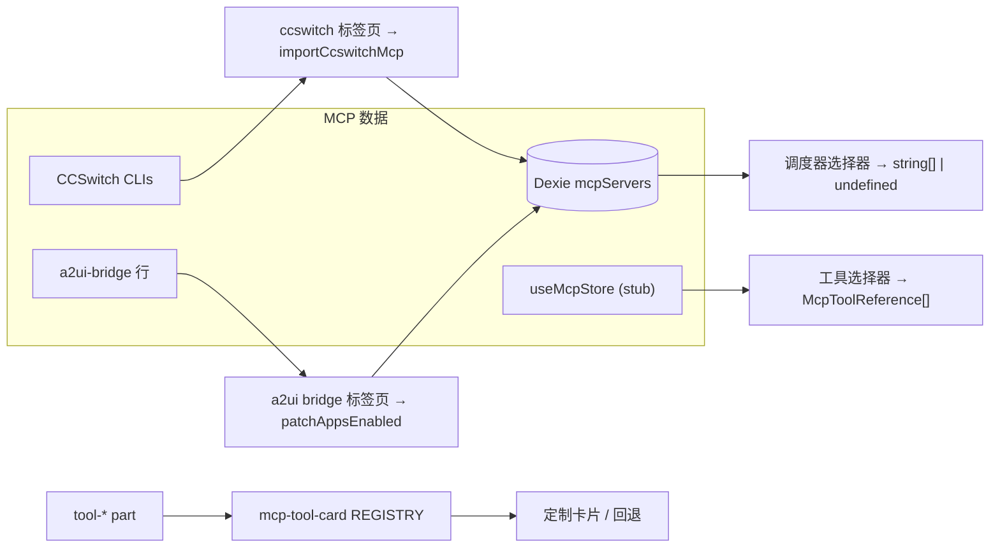

# 消费面

<Status variant="stable">Stable · 横跨 agent / scheduler / chat / settings 的 5 个消费面</Status>

<TLDR>
  在设置面板之外，有五个消费面以不同的形态读取 MCP 配置。**工具选择器**
  （agent 自定义模式）在预算约束下挑选单个工具，并带有 AI 排序的推荐。**调度器选择器**
  挑选整个服务器，并区分“使用默认”（`undefined`）与“显式置空”
  （`[]`）。**CCSwitch 标签页**是第二个导入器，把 CCSwitch 托管的 CLI 中的 MCP 配置拉取
  进 `mcpServers` store。**聊天工具卡片注册表**把工具名映射到定制的结果卡片
  （wiki/rag/read/plan/grep…），并带有通用回退。**A2UI bridge 标签页**控制常驻的
  a2ui-bridge 行的逐 agent 投影，并展示实时的 bridge 健康状况。
</TLDR>

## 工具选择器

`components/agent/mode/custom-mode-editor/mcp-tool-selector.tsx` 允许自定义模式在预算约束下启用一个特定
的 MCP 工具子集。它从 `useMcpStore` stub 读取已连接的服务器及其工具，从 `toolSelectionConfig`
读取预算，向 `getRecommendedMcpToolsForMode` 请求基于模式元数据的 AI 排序选项，并发射
`McpToolReference[]`（`{ serverId, toolName, displayName }`）：

```typescript title="components/agent/mode/custom-mode-editor/mcp-tool-selector.tsx:75"
const recommendedTools = useMemo(() => {
  if (!recommendationsEnabled || !recommendationContext) return []
  const recommendations = getRecommendedMcpToolsForMode(
    availableTools,
    recommendationContext,
    toolSelectionConfig.maxTools
  )
  return Array.isArray(recommendations) ? recommendations : []
}, [availableTools, recommendationContext, recommendationsEnabled, toolSelectionConfig.maxTools])
```

当选择超出 `toolSelectionConfig.maxTools` 时，会出现一个超预算徽标进行警告；“应用推荐”
按钮则用推荐面板里的内容填充选择。

## 调度器选择器

`components/scheduler/payload-editors/mcp-picker.tsx` 为计划任务挑选**服务器**（而非工具）。
它的关键微妙之处在于这个双状态取值——空数组表示“显式禁用 MCP”，`undefined` 表示
“让 `resolveSendOptions` 挑选角色/团队默认值”：

```typescript title="components/scheduler/payload-editors/mcp-picker.tsx:5"
/**
 * Multi-select for MCP servers with a "use character/team default" mode.
 * Distinguishing default from "no servers" matters — empty array means
 * "explicitly disable MCP" while default lets `resolveSendOptions` pick the subset.
 */
```

一个单选按钮在 `default` 与 `custom` 之间切换；在 `custom` 模式下，一份 `listMcpServers()`
的清单（已过滤掉禁用的行）驱动 id 数组。

## CCSwitch MCP 标签页

`components/settings/ccswitch/tabs/mcp-tab.tsx` 是一个**第二导入器**（与
[导入对话框](./presets-and-import#importing-from-a-cli-config)并列）。它读取 CCSwitch
为外部 CLI 托管的 MCP 服务器，并以一种冲突策略导入所选项：

```typescript title="components/settings/ccswitch/tabs/mcp-tab.tsx:59"
const onImport = async () => {
  const picks = servers.filter((s) => selected.has(s.id))
  const r = await importCcswitchMcp(picks, strategy) // "skip" | "overwrite" | "duplicate"
  setResultText(t("mcp.resultSummary", {
    imported: r.imported, updated: r.updated, skipped: r.skipped, errored: r.errored.length,
  }))
}
```

仅限桌面端（否则显示一条 web 模式提示）；每一行展示传输方式 + 备注；策略是一个单选按钮。关于这次同步的
传播一侧，参见 CCSwitch 子系统。

## 聊天工具卡片渲染器

`components/chat/message-parts/mcp-tool-card.tsx` 是一个注册表，它把 MCP 工具的**结果**渲染为
聊天记录中的结构化卡片，对未知工具或解析失败的情况则回退到通用的 `ToolBody`：

```tsx title="components/chat/message-parts/mcp-tool-card.tsx:35"
const REGISTRY: Record<string, CardComponent> = {
  // cognia external bridge
  wiki_search: WikiSearchCard, wiki_read: WikiReadCard, rag_search: RagSearchCard, runtime_query: RuntimeQueryCard,
  // Claude built-ins
  Plan: PlanCard, Read: ReadCard, Glob: GlobCard, Grep: GrepCard,
  WebFetch: WebFetchCard, WebSearch: WebSearchCard, NotebookEdit: NotebookEditCard,
  // workflow / computer use …
}
```

渲染器位于 `mcp-renderers/`。每个渲染器从 part 中取出 `input`，用共享的
`useParsedOutput<T>()` 校验 `output`（返回 `null` 触发回退），并通过 `McpCardShell` 渲染：

```tsx title="components/chat/message-parts/mcp-renderers/common.tsx:18"
export function parseOutputJson(output: unknown): unknown | null {
  if (output === null || output === undefined) return null
  if (typeof output === "string") {
    const trimmed = output.trim()
    if (!trimmed) return null
    try { return JSON.parse(trimmed) } catch { return null }
  }
  if (typeof output === "object") return output
  return null
}
```

## A2UI bridge 设置标签页

`components/settings/a2ui/mcp-bridge-tab.tsx` 控制常驻的 `a2ui-bridge` 行：它获取
不可变的 bridge 行，展示实时健康状况（工具数 = `A2UI_BRIDGE_TOOLS.length`、`liveSurfaceCount`、
Tauri 上的 sidecar 目录 + socket 路径），提供一次自检，并暴露逐 agent 的投影矩阵：

```tsx title="components/settings/a2ui/mcp-bridge-tab.tsx:27"
const MANAGED_AGENTS: AgentId[] = ["claude-code", "claude-desktop", "cursor", "vscode", "codex", "gemini", "windsurf"]
const READ_ONLY_AGENTS: AgentId[] = ["cline", "roo-code"]
```

托管 agent 会得到调用 `patchAppsEnabled` 的开关；只读 agent 则以禁用状态渲染并带有一个 X 图标。

## 消费面 → 数据映射



## 相关页面

<Cards>
  <Card title="服务器配置与 store" href="./server-config" description="这些选择器读取、CCSwitch 标签页写入的 mcpServers 行。" />
  <Card title="预设与导入" href="./presets-and-import" description="另一个导入器——用于原始 CLI 配置文件的导入对话框。" />
  <Card title="设置面板" href="./settings-panel" description="主要的管理消费面，以及工具选择器复用的 mcp-store stub。" />
</Cards>
