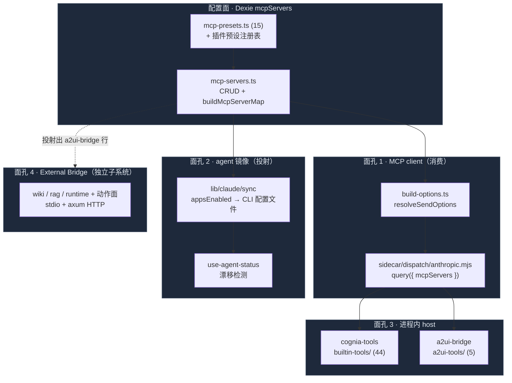

# MCP 系统

<Status variant="stable">Governed · Dexie schema v151 · 3 transports · scoped runtime</Status>

<TLDR>
  Cognia 拥有 **四张 MCP 面孔**。作为 **client**，它把用户/插件/内置服务器定义存放在
  一张 Dexie 表（`mcpServers`）里，并把每一轮（per-turn）的子集解析进 Claude Agent SDK 的 `mcpServers`
  选项（`build-options.ts:resolveSendOptions` → `buildMcpServerMap`）。作为 **mirror**，它把每个
  服务器的 `appsEnabled` 矩阵投射进七个外部 CLI 的磁盘配置（Claude Code、Cursor、
  VS Code、Codex、Gemini、Windsurf，外加只读的 Cline/Roo-Code），并监测漂移（drift）。作为 **host**，
  sidecar 为每个会话挂载两个进程内 SDK MCP 服务器——`cognia-tools`（横跨
  7 个类别的 44 个内置工具，由 `safety.mjs` 把关）和 `a2ui-bridge`（5 个 surface 工具）。作为 **面向外部的 server**，
  Cognia 通过 stdio/HTTP 暴露自己的知识 + 动作面——那一层属于
  [External Bridge](../external-bridge) 子系统。本节记录前三张面孔。
</TLDR>

<StatGrid>
  <Stat label="配置存储" value="Dexie mcpServers" hint="id · name · enabled（自 v2 起）" />
  <Stat label="Transports" value="3" hint="stdio · http · sse" />
  <Stat label="内置预设" value="15" hint="lib/claude/mcp-presets.ts + 插件叠加" />
  <Stat label="cognia-tools" value="44 工具" hint="7 个类别 · safety 把关" />
  <Stat label="a2ui-bridge" value="5 工具" hint="单一来源：tool-defs.mjs" />
  <Stat label="Agent 镜像目标" value="7 + 2 只读" hint="每个服务器的 appsEnabled" />
</StatGrid>

## 四张面孔



## 各部分位于何处

<Files>
  <Folder name="lib/" defaultOpen>
    <Folder name="db/">
      <File name="mcp-servers.ts" />
      <File name="mcp-audit-log.ts" />
    </Folder>
    <Folder name="claude/">
      <File name="mcp-presets.ts" />
      <Folder name="builtin-mcp/">
        <File name="resolve.ts" />
        <File name="runtime-context.ts" />
      </Folder>
    </Folder>
    <Folder name="a2ui/">
      <File name="mcp-tool-schemas.ts" />
    </Folder>
    <Folder name="plugin/">
      <File name="registries/mcp-server-preset-registry.ts" />
      <File name="sdk/define-mcp-server-preset.ts" />
    </Folder>
  </Folder>
  <Folder name="sidecar/">
    <Folder name="builtin-tools/">
      <File name="index.mjs" />
      <File name="safety.mjs" />
      <File name="file-extras.mjs · git.mjs · process.mjs" />
      <File name="environment.mjs · shell-advanced.mjs" />
      <File name="lsp.mjs · terminal-repl-tool.mjs · plugin-tools.mjs" />
    </Folder>
    <Folder name="a2ui-tools/">
      <File name="tool-defs.mjs (single source)" />
      <File name="index.mjs" />
    </Folder>
    <File name="a2ui-mcp.mjs (standalone stdio)" />
  </Folder>
  <Folder name="components/settings/mcp/">
    <File name="mcp-panel.tsx (4 tabs) · mcp-panel-tabs" />
    <File name="mcp-my-servers-tab（主从布局）· mcp-preset-grid · mcp-health-tab" />
    <File name="mcp-server-list-pane · mcp-server-list · mcp-server-row" />
    <File name="mcp-server-detail · mcp-tool-rules-card" />
    <File name="mcp-server-editor · kv-editor · mcp-transfer-dialog · mcp-export-dialog" />
  </Folder>
  <Folder name="sidecar/dispatch/">
    <File name="mcp-runtime-gateway.mjs（能力发现）" />
    <File name="anthropic-mcp-relay.mjs（受防护远程中继）" />
  </Folder>
</Files>

| 模块 | 位于 | 文档 |
| ------ | -------- | ------------- |
| 配置类型 + Dexie 存储 | `lib/db/mcp-servers.ts`, `lib/claude/types.ts` | [服务器配置](./server-config) |
| 预设 + 导入 | `lib/claude/mcp-presets.ts`, `components/settings/mcp-import-dialog.tsx` | [预设与导入](./presets-and-import) |
| 按轮解析 | `lib/claude/build-options.ts`, `lib/claude/builtin-mcp/` | [会话解析](./session-resolution) |
| 设置 UI + stores | `components/settings/mcp/`, `stores/mcp/` | [设置面板](./settings-panel) |
| Agent 镜像 + 健康 | `lib/mcp/sync-coordinator.ts`, `lib/mcp/operations.ts`, `mcp-audit-log.ts` | [Agent 同步与健康](./agent-sync-and-health) |
| 进程内内置工具 | `sidecar/builtin-tools/` | [内置工具](./builtin-tools) |
| A2UI MCP 桥接 | `sidecar/a2ui-tools/`, `sidecar/a2ui-mcp.mjs` | [A2UI 桥接](./a2ui-bridge) |
| 选择器 + 渲染器 | `components/agent/`, `components/scheduler/`, `components/chat/message-parts/` | [消费面](./consumption-surfaces) |

## 受治理的定义与运行时

每个 MCP server 都进入同一个版本化 Registry。原始凭证会替换为 `SecretRef`，且只在可信宿主内解析：

```typescript title="lib/claude/types.ts"
export interface McpServer {
  id: string
  name: string // 大小写不敏感的唯一外部命名空间
  displayName?: string
  schemaVersion?: 1
  revision?: number
  credentialVersion?: number
  origin?: McpServerOrigin
  trust?: { state: "legacy" | "pending" | "trusted" | "blocked" }
  transport: "stdio" | "sse" | "http"
  config: McpServerConfig // transport 判别联合；敏感值为 SecretRef
  enabled: boolean
  appsEnabled?: Partial<Record<AgentId, boolean>>
}
```

新建、手工导入、插件与 preset 定义都以 pending、禁用、无投射开始；legacy 定义继续可用。
Registry 变更在一个事务中更新移动端脱敏摘要并入队 durable Agent sync job。Workflow 与 plan
调用统一经过 `McpRuntimeGateway`：复用仅限单个 session/run，连接并发为 4，能力 TTL 为 5 分钟，
工具调用绝不自动重试。

## 何时使用本节

- **添加 / 配置一个外部 MCP 服务器**，让 Cognia（和/或你的其他 CLI）去调用 → [服务器配置](./server-config)、[预设与导入](./presets-and-import)。
- **理解某个服务器为何在某次 chat 或 team 中加载/未加载** → [会话解析](./session-resolution)。
- **诊断「我启用了它但 Claude Code 看不到」** → [Agent 同步与健康](./agent-sync-and-health)（漂移 + 重新同步）。
- **扩展内置工具面**（`cognia-tools`）或审查其安全门 → [内置工具](./builtin-tools)。
- **从一个 agent（进程内或外部 CLI）接出交互式 UI** → [A2UI 桥接](./a2ui-bridge)。

## 何时不要使用本节

- 把 Cognia **自己的** 知识/动作暴露给外部 agent（入站 MCP 服务器）→ [External Bridge](../external-bridge)。
- 渲染某个 A2UI surface 的组件 / 数据模型 / IM 投射 → [A2UI 子系统](../a2ui)。

## 相关子系统

<Cards>
  <Card title="External Bridge" href="../external-bridge" description="第四张面孔——Cognia 作为 MCP 服务器（wiki / rag / runtime + 受门控的动作），通过 stdio + axum HTTP 暴露。" />
  <Card title="A2UI System" href="../a2ui" description="a2ui-bridge 工具所驱动的对象：surface 渲染、渲染器 store、Rust 桥接以及 IM 投射。" />
  <Card title="Plugin System" href="../plugin-system" description="插件贡献 MCP 服务器预设，以及走同一条 sidecar dispatch 路径的 plugin-tools。" />
  <Card title="Unified Subscription / CCSwitch" href="../../adr/0025-a2ui-im-bridge" description="CCSwitch 把外部 CLI 的 MCP 配置反向导入 mcpServers 存储。" />
</Cards>

## 相关 ADR

- [ADR 0008 — External Bridge](../../adr/0008-external-bridge) — 为什么入站 MCP 服务器是与 `a2ui-mcp.mjs` 分离的独立二进制。
- [ADR 0025 — A2UI ⇄ IM bridge](../../adr/0025-a2ui-im-bridge) — 让 IM 用户驱动 surface 的 `a2ui_handle_connector_action` 工具。
- [ADR 0110 — MCP 控制面治理](../../adr/0110-mcp-control-plane-governance) — Registry、SecretRef、policy、durable sync、scoped runtime、隐私与审计决策。
