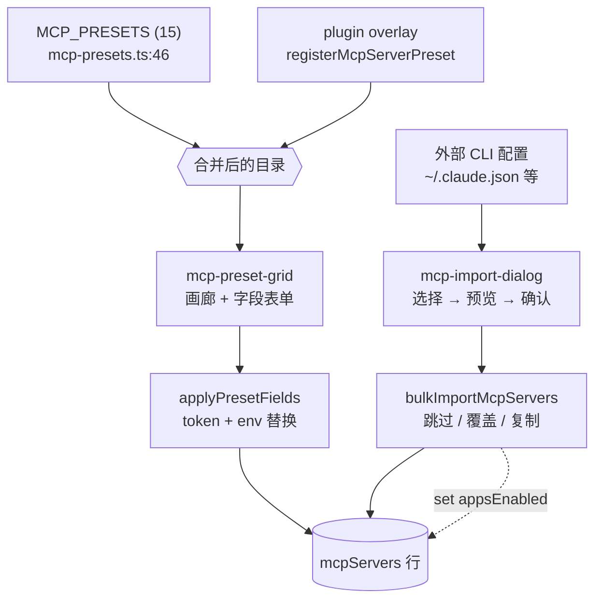

# 预设与导入

<Status variant="stable">Stable · 15 个内置预设 · 插件 overlay · CLI 导入</Status>

<TLDR>
  大多数用户从不手动输入 stdio 命令。**预设市场** 提供 15 个精选预设
  （`MCP_PRESETS`，`lib/claude/mcp-presets.ts:46`）—— filesystem、github、postgres、slack、deepwiki 以及
  通用 http/sse —— 每个都声明带类型的 `fields`（env 变量、arg token、URL、header），由
  `applyPresetFields` 替换进一个配置 blob。插件通过一个 **overlay 注册表**
  （`registerMcpServerPreset`）添加自己的预设，叠加在静态目录之上。导入则
  朝相反方向拉取：**导入对话框** 读取外部 CLI 的配置文件（Claude Desktop
  等），预览它找到的服务器，再由 `bulkImportMcpServers` 以 跳过/覆盖/复制 的冲突策略
  写入所选项。每条路径最终都落在同一个 `mcpServers` 行上。
</TLDR>

## 内置预设目录

```typescript title="lib/claude/mcp-presets.ts:46"
export const MCP_PRESETS: McpPreset[] = [/* 15 presets */]
```

每个预设的结构既适配画廊卡片，也适配字段表单：

| 字段 | 用途 |
| ----- | ------- |
| `id` / `name` / `description` / `icon` | 画廊卡片标识 |
| `transport` | `stdio` / `http` / `sse` |
| `config` | 带占位 token 的模板配置 |
| `fields` | 用户必须填写的 `McpPresetField[]` |
| `docsUrl?` / `tags?` | 外部文档链接 · 画廊筛选标签 |

15 个预设（`mcp-presets.ts` 中的行号范围）：

| # | id | transport | fields |
| - | -- | --------- | ------ |
| 1 | `filesystem` (47) | stdio | PATH arg |
| 2 | `github` (71) | stdio | `GITHUB_PERSONAL_ACCESS_TOKEN` |
| 3 | `gitlab` (94) | stdio | token + API URL |
| 4 | `brave-search` (122) | stdio | `BRAVE_API_KEY` |
| 5 | `puppeteer` (145) | stdio | — |
| 6 | `fetch` (159) | stdio | — |
| 7 | `memory` (173) | stdio | — |
| 8 | `sqlite` (187) | stdio | DB_PATH arg |
| 9 | `postgres` (209) | stdio | `DATABASE_URL`（secret） |
| 10 | `slack` (232) | stdio | bot token + team id |
| 11 | `time` (261) | stdio | — |
| 12 | `deepwiki` (275) | **http** | —（免鉴权） |
| 13 | `http-generic` (289) | **http** | URL + Authorization header |
| 14 | `sse-generic` (318) | **sse** | URL + Authorization header |
| 15 | `custom` (346) | stdio | —（手动） |

### 字段替换引擎

`McpPresetField` 通过 `placement` 声明其值 **放到哪里**：

```typescript title="lib/claude/mcp-presets.ts:9"
export interface McpPresetField {
  key: string
  label: string
  placement: "env" | "arg-replace" | "url" | "header"
  token?: string // for arg-replace, e.g. "<PATH>"
  description?: string
  placeholder?: string
  secret?: boolean // render as password input
}
```

`applyPresetFields` 深拷贝模板配置，并把每个字段写入它的 placement ——
env 变量写入 `config.env`、token 替换贯穿 `config.args`、http/sse 的 URL/header ——
然后返回一个全新对象（绝不修改目录本身）：

```typescript title="lib/claude/mcp-presets.ts:365"
export function applyPresetFields(
  preset: McpPreset,
  values: Record<string, string>
): Record<string, unknown> {
  const config = JSON.parse(JSON.stringify(preset.config)) as Record<string, unknown>
  for (const field of preset.fields) {
    const value = values[field.key] ?? ""
    if (field.placement === "env") {
      const env = (config.env as Record<string, string>) ?? {}
      env[field.key] = value
      config.env = env
    } else if (field.placement === "arg-replace" && field.token) {
      const args = (config.args as unknown[]) ?? []
      config.args = args.map((a) => (typeof a === "string" ? a.replaceAll(field.token!, value) : a))
    }
  }
  return config
}
```

## 插件预设 overlay

插件通过一个 **overlay 注册表**（`createOverlayRegistry`，
`lib/plugin/registries/mcp-server-preset-registry.ts:24`）扩展目录 —— 动态条目叠加在静态
`MCP_PRESETS` 之上，并带有干净的按插件拆除机制：

```typescript title="lib/plugin/registries/mcp-server-preset-registry.ts:28"
export const registerMcpServerPreset = registry.register
export const unregisterMcpServerPresetById = registry.unregisterById
export const unregisterMcpServerPresetsByPlugin = registry.unregisterByPlugin // bulk cleanup on disable
export const getMcpServerPreset = registry.get
export const listMcpServerPresetEntries = registry.listEntries // id + preset + pluginId, registration order
```

插件作者用纯类型辅助函数 `defineMcpServerPreset` 包裹其 manifest 条目，以获得 IDE
自动补全和编译期校验（它在运行时不做任何事）：

```typescript title="lib/plugin/sdk/define-mcp-server-preset.ts:11"
const playwright = defineMcpServerPreset({
  id: "playwright",
  name: "Playwright",
  transport: "stdio",
  config: { command: "npx", args: ["-y", "@playwright/mcp@latest"] },
})
```

插件预设类型（`types/plugin/plugin-mcp-preset.ts:15`）镜像内置的 `McpPreset`，并
新增一个 `runtime` 判别符，使预设可以面向特定的 agent runtime：

```typescript title="types/plugin/plugin-mcp-preset.ts:15"
export interface PluginMcpServerPresetDef {
  id: string
  name: string
  description?: string
  icon?: string
  transport: McpTransport
  config: Record<string, unknown>
  fields?: McpPresetField[]
  runtime?: "sdk" | "ai-sdk" | "both" // sdk = Claude Code sidecar; ai-sdk = Vercel runner
  docsUrl?: string
  tags?: string[]
}
```

## 预设市场 UI

`components/settings/mcp/mcp-preset-grid.tsx` 以两种模式渲染目录：

- **画廊模式**（第 131 行）—— 搜索框 + 标签 chip + 响应式网格；每张卡片显示 图标/名称/
  描述，当已存在同名服务器时显示 “added” 徽标。`custom` 预设
  始终可重新选择。
- **配置模式**（第 77 行）—— 选定某预设后，逐字段的表单（`secret` 字段为
  密码输入框）、重名警告，以及可选的文档链接。在必填字段填好且名称未被占用前，
  “Add Server” 处于禁用状态。

```typescript title="components/settings/mcp/mcp-preset-grid.tsx:39"
const presets = useMemo(() => {
  const q = query.trim().toLowerCase()
  return MCP_PRESETS.filter((p) => {
    if (activeTag && !(p.tags ?? []).includes(activeTag)) return false
    if (!q) return true
    const haystack = [p.name, p.description, p.id, ...(p.tags ?? [])].join(" ").toLowerCase()
    return haystack.includes(q)
  })
}, [query, activeTag])
```

提交时它发出 `onPresetSelected(preset, values)`；面板运行 `applyPresetFields` 并调用
`createMcpServer`。

### 空白服务器种子

当你从零添加一个服务器（而非来自预设）时，`blankServerSeed` 会把它预投影到 **每一个
可写 agent**，使手工创建的服务器默认落入你的各 CLI 配置 —— 你随后是把 chip 关掉，
而非逐个打开：

```typescript title="components/settings/mcp/server-seed.ts:15"
export async function blankServerSeed(): Promise<McpEditorSeed> {
  const appsEnabled: Record<string, boolean> = {}
  for (const id of await getDetectedWritableAgents()) appsEnabled[id] = true
  return { name: "", transport: "stdio", config: { command: "", args: [] }, enabled: true, appsEnabled }
}
```

## 从 CLI 配置导入

导入对话框（`components/settings/mcp-import-dialog.tsx`，仅桌面端，受 `isTauri()` 守卫）走
相反方向 —— 从外部 agent 的配置文件中读取服务器 *出来*。它是一个三步流程：

<Steps>
<Step>**选择 agent** —— 打开时并行探测每个 agent slot（`readAgentConfig` → `{ parsed, path, exists, parseError }`），每个再经其 adapter 重新解析以算出草稿数量。没有服务器 / 解析错误的 slot 会被禁用。</Step>
<Step>**预览** —— 检测到的服务器渲染为一个清单（默认全选），带 transport 徽标 + 配置摘要；选择一个冲突策略（跳过 / 覆盖 / 复制）。</Step>
<Step>**确认** —— `bulkImportMcpServers(filtered, strategy)` 写入所选项，随后每个被导入服务器的 `appsEnabled[agentId]` 被设为 true，使其往返回写到源 agent。</Step>
</Steps>

```typescript title="components/settings/mcp-import-dialog.tsx:450"
async function importFromAgentWithSelection(agentId, drafts, strategy) {
  const { bulkImportMcpServers, listMcpServers, updateMcpServer } = await import("@/lib/db/mcp-servers")
  const result = await bulkImportMcpServers(drafts, strategy)
  const importedNames = new Set(drafts.map((d) => d.name))
  for (const server of await listMcpServers()) {
    if (!importedNames.has(server.name)) continue
    await updateMcpServer(server.id, { appsEnabled: { ...(server.appsEnabled ?? {}), [agentId]: true } })
  }
  return result
}
```

结果 toast 汇总 `{ created, updated, skipped, errored }`，随后
`refreshAgentAvailability()` 更新整个面板的 chip 状态。

> CCSwitch 提供一个 *并行* 的导入器，从 CCSwitch 托管的 CLI 中拉取 MCP 配置 —— 参见
> [消费面](./consumption-surfaces#ccswitch-mcp-tab) 页面。

## 粘贴添加与导出

几乎每个公开的 MCP 服务器，自我介绍的方式要么是一条 `… mcp add …` 命令，要么是一段 `mcpServers` JSON，
所以 `lib/mcp/config-transfer.ts` 两种都读，也两种都能写回去。

```typescript title="lib/mcp/config-transfer.ts:597"
export function parseMcpTransferInput(input: string): McpTransferParse {
  const text = stripPromptChrome(input)
  if (!text) return { kind: "empty", drafts: [], warnings: [], error: "empty" }
  if (text.startsWith("{") || text.startsWith("[")) return parseMcpConfigJson(text)
  return parseMcpInstallCommand(text)
}
```

文本以花括号开头时优先按 JSON 解析：一段 JSON 不可能是合法命令行，而反过来猜则会把配置悄悄切成一堆垃圾 token。

| 输入 | 支持情况 |
| ---- | -------- |
| `claude mcp add …`、`codex mcp add …`、`gemini mcp add …`、`opencode`、`cognia` | `-t/--transport`、可重复的 `-e/--env`、`-H/--header`、`--url`、裸 `--` 分隔符；`-s/--scope` 等会被丢弃并给出提示 |
| `claude mcp add-json <name> '<json>'` | payload 转交 JSON 解析器 |
| `code --add-mcp '<json>'` | VS Code 的内联 `name` 形态 |
| `API_KEY=… npx -y @scope/server` | 裸命令行；`KEY=value` 前缀会提升为 `env` |
| `https://mcp.example.com/mcp` | 裸 URL → http 服务器 |
| `{"mcpServers": …}` / `servers` / `mcp_servers` / 单条目 | agent 会写出的全部四种包装 |

条目走的是 `normalizeMcpEntry`——和每个 agent adapter 用的是同一个归一化器，所以粘贴进来的配置与导入文件的解析方式完全一致。
名称会被规整到命名空间字符集；任何猜测或改名都会作为提示显示出来，而不是悄悄生效。

### 反方向

`buildMcpInstallCommand` 与 `buildMcpTransferJson` 把已配置的服务器渲染回去。面向具体 agent 的 JSON 交由该 adapter 自己的
`project()` 生成，所以输出与同步写入器产生的内容逐字节一致；命令只在 POSIX shell 确实需要时才加引号。

```typescript title="lib/mcp/config-transfer.ts:643"
export function buildMcpInstallCommand(server: InstallCommandInput, agent?: AgentId): string {
```

<Callout type="warn">
  已保存的凭据只会输出为它的 `secretRef` 定位符，绝不会输出明文。这些字符串存在的意义就是被粘贴到终端或聊天里，
  而这两个地方都不适合放解密后的 token。
</Callout>

两个方向共用同一对解析器 / 序列化器，所以导出对话框吐出的东西，粘贴框都能读回来——测试用例正是通过往返验证这一性质的。

## 来源 → 目录 → 安装



## 相关页面

<Cards>
  <Card title="Server config & store" href="./server-config" description="每个预设/导入最终写入的行结构与 CRUD。" />
  <Card title="Agent sync & health" href="./agent-sync-and-health" description="导入/种子设置的 appsEnabled 如何镜像到 CLI 文件，以及如何调和漂移。" />
  <Card title="Consumption surfaces" href="./consumption-surfaces" description="CCSwitch 标签页 —— 另一个导入器 —— 以及消费这些行的各选择器。" />
</Cards>
