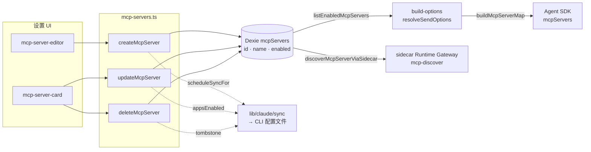

# 服务器配置与存储

<Status variant="stable">Stable · `lib/db/mcp-servers.ts` · 211 lines</Status>

<TLDR>
  一张 Dexie 表 `mcpServers` 持有每一个 MCP 服务器定义。其行类型（`McpServer`，
  `lib/claude/types.ts:1969`）带有一个 `transport` 判别符，以及一个随 transport 形态而定的 `config`
  blob（stdio → `{ command, args?, env? }`；http/sse → `{ url, headers? }`）。`mcp-servers.ts` 是
  CRUD 层：每次 create/update/delete 都会刷新 `updatedAt`，并触发一个 **fire-and-forget** 的
  `scheduleSyncFor(appsEnabled)`，使变更被镜像到相关的外部 CLI 配置文件。
  `buildMcpServerMap` 把已评审的行投射到 Agent SDK 命名空间。设置页发现能力时，仅在可信宿主
  解析 `SecretRef`，随后通过 sidecar Runtime Gateway 执行；渲染器 MCP SDK 与手写原生探针均已移除。
</TLDR>

## 配置模型

```typescript title="lib/claude/types.ts:1948"
export type McpTransport = "stdio" | "sse" | "http"
```

```typescript title="lib/claude/types.ts:1969"
export interface McpServer {
  id: string // mcp_${timestamp}_${random} (newId(), mcp-servers.ts:5)
  name: string // trimmed; "" coerces to "unnamed"
  transport: McpTransport
  config: Record<string, unknown>
  enabled: boolean // reaches Cognia's own chat
  appsEnabled?: Partial<Record<AgentId, boolean>> // per-CLI mirror toggles
  pluginId?: string // set only by the plugin manager → soft-delete on uninstall
  createdAt: number
  updatedAt: number
}
```

`config` 载荷 **随 transport 形态而定**，从不被规范化成带类型的列：

| Transport | `config` 形态 | 探测 / SDK 键 |
| --------- | -------------- | --------------- |
| `stdio` | `{ command: string, args?: string[], env?: Record<string,string> }` | 派生一个子进程 |
| `http` | `{ url: string, headers?: Record<string,string> }` | streamable-HTTP POST |
| `sse` | `{ url: string, headers?: Record<string,string> }` | 遗留 SSE 端点 |

`types/mcp/index.ts` 只携带被迁移过的 agent 代码所用的小型 re-export 桩——
`McpServerStatus`（`"stopped" | "starting" | "running" | "error" | "unknown"`）、`McpServerInfo`，以及
`McpToolSelectionConfig`（由[工具选择器](./consumption-surfaces)消费的预算/allowlist 形态）。

## Dexie 表

`mcpServers` 在 **Dexie v2** 中引入，其索引签名自此一直稳定
（`lib/db/schema.ts:332`，在之后的版本里原样重复）：

```typescript title="lib/db/schema.ts"
this.version(2).stores({
  // …
  mcpServers: "id, name, enabled",
})
```

- **主键** `id`（string）—— O(1) `get`。
- **索引 `name`** —— 面板用的有序列表。
- **索引 `enabled`** —— `listEnabledMcpServers` 的快速过滤。

**v7** 升级新增了 `appsEnabled` 这个 per-agent 投射字段，并把 `{}` 回填到遗留
行上，使下游代码无需做 null 检查。

## CRUD 层

`lib/db/mcp-servers.ts` 是唯一的写入方。每次变更都会刷新 `updatedAt` 并安排一次 agent 同步。

| 函数 | 行 | 行为 |
| -------- | ---- | -------- |
| `listMcpServers()` | 9 | 所有行，按 `name` 排序。 |
| `listEnabledMcpServers()` | 13 | 内存中 `filter(s => s.enabled)`。 |
| `getMcpServer(id)` | 21 | 主键查找。 |
| `createMcpServer(partial)` | 25 | 插入；生成 `id`；盖上两个时间戳；`scheduleSyncFor(appsEnabled)`。 |
| `listMcpServersByPlugin(pluginId)` | 56 | 枚举插件拥有的行（卸载时使用）。 |
| `updateMcpServer(id, patch)` | 64 | 合并 + 刷新 `updatedAt`；也会同步那些被*移除*了开关的 agent。 |
| `deleteMcpServer(id)` | 76 | 删除；捕获 `name` + `appsEnabled`，以便 sync 把它从 agent 文件中移除。 |
| `buildMcpServerMap(servers)` | 109 | 纯投射 → SDK 形态。 |
| `bulkImportMcpServers(drafts, strategy)` | 142 | 批量 create/update，带 skip/duplicate/overwrite 冲突处理。 |
| `parseClaudeMcpConfig(raw)` | 209 | 把 `~/.claude.json` 的 `mcpServers` 块解析成 drafts。 |

### Create + sync 副作用

```typescript title="lib/db/mcp-servers.ts:25"
export async function createMcpServer(
  partial: Pick<McpServer, "name" | "transport" | "config"> & {
    enabled?: boolean
    appsEnabled?: McpServer["appsEnabled"]
    pluginId?: string
  }
): Promise<McpServer> {
  const now = Date.now()
  const server: McpServer = {
    id: newId(),
    name: partial.name.trim() || "unnamed",
    transport: partial.transport,
    config: partial.config,
    enabled: partial.enabled ?? true,
    appsEnabled: partial.appsEnabled ?? {},
    ...(partial.pluginId !== undefined ? { pluginId: partial.pluginId } : {}),
    createdAt: now,
    updatedAt: now,
  }
  await getDb().mcpServers.put(server)
  scheduleSyncFor(server.appsEnabled)
  return server
}
```

`scheduleSyncFor`（第 92 行）惰性导入 `@/lib/claude/sync`，从 `appsEnabled` map
收集启用的 agent id，并对每个 agent 调用 `scheduleSync(id, tombstone)`。它 **从不抛错**——一次同步
失败属于尽力而为，不会回滚 Dexie 写入。（完整镜像机制 →
[Agent 同步与健康](./agent-sync-and-health)。）

## 运行时投射

### → Agent SDK（`buildMcpServerMap`）

该 map 以服务器 **name**（而非 id）为键，因为那是 SDK 向模型暴露的命名空间
（`mcp__<name>__<tool>`）。被禁用的行会被丢弃。

```typescript title="lib/db/mcp-servers.ts:109"
export function buildMcpServerMap(servers: McpServer[]): Record<string, Record<string, unknown>> {
  const out: Record<string, Record<string, unknown>> = {}
  for (const s of servers) {
    if (!s.enabled) continue
    out[s.name] = { type: s.transport, ...s.config }
  }
  return out
}
```

一个有代表性的输出：

```json
{
  "filesystem": { "type": "stdio", "command": "npx", "args": ["-y", "@modelcontextprotocol/server-filesystem", "/repo"] },
  "deepwiki": { "type": "http", "url": "https://mcp.deepwiki.com/mcp" }
}
```

### → Sidecar 能力发现（`discoverMcpServerViaSidecar`）

Test 按钮和 workflow 工具选择器把已存储的 server 交给 `lib/claude/feature-call.ts`。该封装先执行
MCP policy，在可信宿主解析 `SecretRef`，再通过 allowlist 中的 `mcp-discover` feature call 发送临时定义。
`sidecar/dispatch/mcp-runtime-gateway.mjs` 使用官方 client-managed transport，复用 AI SDK/OAuth 的
socket 级 DNS 与重定向防护，列出 tools/resources/prompts，并保证 client 与 dispatcher 被拆除。

## UI 辅助函数

`mcp-server-utils.ts` 还携带面板侧的胶水代码：

| 辅助函数 | 行 | 用途 |
| ------ | ---- | ------- |
| `objectToKvRows` / `kvRowsToObject` | 23 / 31 | 在对象与 [KV 编辑器](./settings-panel)所用的 `[{key,value}]` 行之间往返转换 `env`/`headers`。 |
| `summarizeServer` | 41 | 单行预览：stdio → `"<command> <args>"`，http/sse → `url`。 |
| `cloneServerDraft` | 85 | 深拷贝 config，追加 `" copy"`，沿用 `appsEnabled`。 |
| `groupServers` | 115 | 按 `none`/`transport`/`status` 分区，并把收藏项浮到每组顶部。 |

```typescript title="components/settings/mcp/mcp-server-utils.ts:41"
export function summarizeServer(s: McpServer): string {
  const c = s.config as { command?: string; url?: string; args?: string[] }
  if (s.transport === "stdio") {
    return [c.command, ...(c.args ?? [])].filter(Boolean).join(" ")
  }
  return c.url ?? "(no url)"
}
```

## 数据模型与流转



## 不变量

- **`updatedAt` 总会刷新**——每次 CRUD 调用都会，驱动面板的实时重排序。
- **`name` 即 SDK 命名空间**——重名会在 `buildMcpServerMap` 中冲突；导入路径
  以大小写不敏感的方式去重。
- **`pluginId` 仅属拥有者**——用户手填的行将其留为 undefined；插件卸载据此枚举。
- **同步属尽力而为**——Dexie 是事实来源；CLI 文件是镜像，由
  [漂移检测器](./agent-sync-and-health)进行调和。

## 相关页面

<Cards>
  <Card title="预设与导入" href="./presets-and-import" description="行从何而来：15 个内置预设、插件叠加注册表，以及从 CLI 配置文件导入。" />
  <Card title="会话解析" href="./session-resolution" description="listEnabledMcpServers + buildMcpServerMap 如何喂入单次 chat 轮。" />
  <Card title="设置面板" href="./settings-panel" description="调用本 CRUD 层的编辑器、卡片、KV 编辑器和 stores。" />
</Cards>
