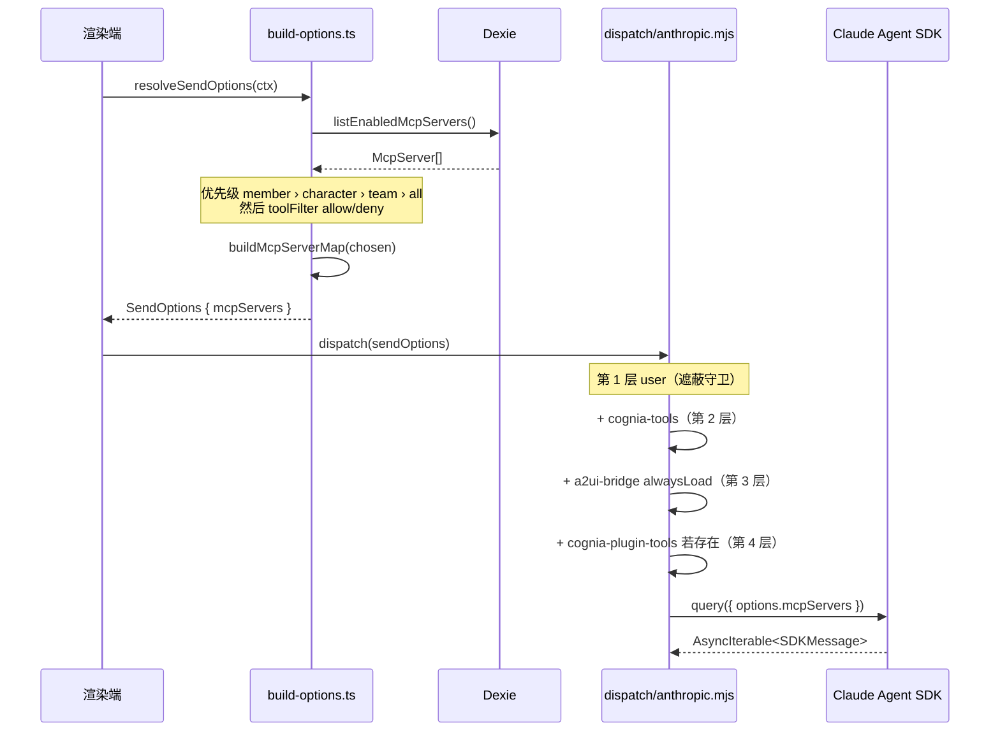

# 会话解析

<Status variant="stable">Stable · `build-options.ts` + `builtin-mcp/` + `dispatch/anthropic.mjs`</Status>

<TLDR>
  解析分两个阶段。**渲染端**（`build-options.ts:resolveSendOptions`）决定
  本回合获得 *哪些* 已启用的服务器，沿一条优先级链行走 —— team 成员覆盖胜过
  character 的 `mcpServerIds`，后者胜过 team 的，再回退到所有已启用项 —— 然后应用任何
  工具过滤器，并将幸存者经 `buildMcpServerMap` 投影进 `opts.mcpServers`。**Sidecar
  端**（`dispatch/anthropic.mjs`）拿到那张映射表，并在其上分层叠加进程内服务器：
  `cognia-tools`（内置）、`a2ui-bridge`（始终加载）以及 `cognia-plugin-tools`（存在时），
  每层都带名称遮蔽守卫。对 *外部* agent，第三个辅助函数（`builtin-mcp/resolve.ts`）会改写
  `${COGNIA_SIDECAR_DIR}` 占位符并注入 `COGNIA_BRIDGE_SOCKET` env，使 a2ui-bridge 子进程
  能够回连。
</TLDR>

## 阶段 1 —— 哪些服务器（渲染端）

`resolveSendOptions`（`lib/claude/build-options.ts:931`）解析出本回合的子集。优先级是
严格的 —— 第一个匹配的层级获胜：

| 层级 | 来源 | 何时 |
| ---- | ------ | ---- |
| 1 | `memberOverride.mcpServerIdsOverride` | team 聊天，按成员 |
| 2 | `character.mcpServerIds` | character 钉住一个子集 |
| 3 | `team.mcpServerIds` | team 会话默认值 |
| 4 | *所有已启用的服务器* | 以上都未设置 |

```typescript title="lib/claude/build-options.ts:938"
const enabled = await listEnabledMcpServers()
let chosen = enabled
const memberMcp = memberOverride?.mcpServerIdsOverride
if (memberMcp) {
  const wanted = new Set(memberMcp)
  chosen = enabled.filter((srv) => wanted.has(srv.id))
} else if (character?.mcpServerIds) {
  const wanted = new Set(character.mcpServerIds)
  chosen = enabled.filter((srv) => wanted.has(srv.id))
} else if (session?.kind === "team" && session.teamId) {
  const team = await getTeam(session.teamId)
  if (team?.mcpServerIds) {
    const wanted = new Set(team.mcpServerIds)
    chosen = enabled.filter((srv) => wanted.has(srv.id))
  }
}
```

随后一个可配置的 **工具过滤器** 进一步收窄 —— `allow` 取交集，`deny` 做减法：

```typescript title="lib/claude/build-options.ts:958"
if (toolFilter && toolFilter.mode !== "all" && toolFilter.mcpServerIds?.length) {
  const fset = new Set(toolFilter.mcpServerIds)
  chosen =
    toolFilter.mode === "allow"
      ? chosen.filter((srv) => fset.has(srv.id))
      : chosen.filter((srv) => !fset.has(srv.id))
}
if (chosen.length > 0) opts.mcpServers = buildMcpServerMap(chosen)
```

输出是 `opts.mcpServers: Record<name, { type, ...config }>` —— 参见
[`buildMcpServerMap`](./server-config#-agent-sdk-buildmcpservermap)。它随 `SendOptions` 一起进入 sidecar。

## 阶段 2 —— 占位符解析（外部 agent）

内置的 MCP 行（尤其是被投影的 `a2ui-bridge` 行）携带的是 **占位符 token** 而非
绝对路径，因为 bundle 位置只有在运行时才知道。`builtin-mcp/resolve.ts` 会改写
它们。两个操作：在 `command`/`args`/`env` 上替换 `${COGNIA_SIDECAR_DIR}`，以及 —— 仅对
a2ui-bridge 行 —— 注入 `COGNIA_BRIDGE_SOCKET`，使被 spawn 的子进程能够回派到渲染端：

```typescript title="lib/claude/builtin-mcp/resolve.ts:93"
export function resolveBuiltinMcpConfig(server: McpServer, ctx: BuiltinMcpResolveContext): McpServer {
  const config = server.config ?? {}
  let changed = false
  const nextConfig: Record<string, unknown> = { ...config }
  if (typeof config.command === "string") {
    const replaced = substitute(config.command, ctx.sidecarDir)
    if (replaced !== config.command) { nextConfig.command = replaced; changed = true }
  }
  // …args rewrite…
  const injectSocket = isA2UIBridgeRow(server) ? ctx.socketPath : null
  const nextEnv = rewriteEnv(config.env, ctx.sidecarDir, injectSocket)
  if (nextEnv.changed) { nextConfig.env = nextEnv.value; changed = true }
  if (!changed) return server // referential identity preserved
  return { ...server, config: nextConfig }
}
```

该替换避开正则，因此 Windows 反斜杠永远不需要转义：

```typescript title="lib/claude/builtin-mcp/resolve.ts:33"
function substitute(value: string, sidecarDir: string): string {
  if (!value.includes(COGNIA_SIDECAR_DIR_TOKEN)) return value
  return value.split(COGNIA_SIDECAR_DIR_TOKEN).join(sidecarDir)
}
```

运行时路径经 IPC 从 Rust 传来，并在进程生命周期内缓存（它们只在
应用重启时改变）：

```typescript title="lib/claude/builtin-mcp/runtime-context.ts:23"
async function fetchRuntimePaths(): Promise<BuiltinMcpResolveContext | null> {
  if (!isTauri()) return null // web preview / jsdom → caller short-circuits
  const raw = await invoke<RuntimePathsRaw>("a2ui_bridge_runtime_paths")
  return { sidecarDir: raw.sidecar_dir, socketPath: raw.socket_path }
}
```

## 阶段 3 —— 合并各层（sidecar）

`sidecar/dispatch/anthropic.mjs` 接收 `sendOptions.mcpServers` 并分四层组装出最终
映射表。每层先检查 `hasOwnProperty`，因此一个使用保留名称的用户自定义服务器会
**遮蔽**（胜过）内置项并记录一条警告：

| 层 | 来源 | 名称 | alwaysLoad |
| ----- | ------ | ---- | ---------- |
| 1 | 用户配置 | （它们的名称） | 按工具搜索策略 |
| 2 | 内置 | `cognia-tools` | 按策略 |
| 3 | A2UI bridge | `a2ui-bridge` | **true**（绝不延迟） |
| 4 | 插件工具 | `cognia-plugin-tools` | 按策略，仅当存在时 |

```javascript title="sidecar/dispatch/anthropic.mjs:116"
const baseUserServers = stampUserServersAlwaysLoad(sendOptions.mcpServers, serverAlwaysLoad)
const withBuiltins = builtinServer
  ? Object.prototype.hasOwnProperty.call(baseUserServers, BUILTIN_SERVER_NAME)
    ? (log("warn", `user mcp '${BUILTIN_SERVER_NAME}' shadows built-in tools — keeping user's`), baseUserServers)
    : { ...baseUserServers, [BUILTIN_SERVER_NAME]: builtinServer }
  : { ...baseUserServers }
```

A2UI 始终被添加（交互式界面必须常驻，绝不被工具搜索）：

```javascript title="sidecar/dispatch/anthropic.mjs:132"
const a2uiServer = buildA2UIBridgeServer({ sessionId, emit, alwaysLoad: true })
```

插件工具以 `sendOptions.pluginTools` 为条件，并构建一个进程内代理，把每次调用
往返回送到渲染端（参见 [内置工具 › plugin-tools bridge](./builtin-tools#plugin-tools-bridge)）：

```javascript title="sidecar/dispatch/anthropic.mjs:149"
if (Array.isArray(sendOptions.pluginTools) && sendOptions.pluginTools.length > 0) {
  const pluginToolsServer = buildPluginToolsServer({ tools: sendOptions.pluginTools, emit, sessionId, /* … */ })
  if (pluginToolsServer) mergedMcpServers = { ...withA2UI, [PLUGIN_TOOLS_SERVER_NAME]: pluginToolsServer }
}
```

合并后的映射表随即直接交给 SDK（先剥除 undefined/null 键）：

```javascript title="sidecar/dispatch/anthropic.mjs"
const options = { cwd, model, mcpServers: mergedMcpServers, /* … */ }
const q = query({ prompt: inputStream.iterable, options })
```

## 端到端



## 边界情况

- **空结果** —— 若 `chosen` 为空，`opts.mcpServers` *不会* 被设置；该回合仍会在
  sidecar 端获得加入的进程内服务器（cognia-tools / a2ui-bridge）。
- **名称冲突** —— 两个 `name` 相同的已启用行会在 `buildMcpServerMap` 中坍缩；面板的
  重名警告就是为防止这种情况而存在。
- **非 Anthropic 提供方** —— AI-SDK dispatch 路径（`dispatch/ai-sdk.mjs`）消费同一份
  `mcpServers` 映射表，但以不同方式桥接工具；若存在请参见 [ADR-0043](../../adr/0043-llm-provider-execution)。
- **Web / jsdom** —— `runtime-context.ts` 在 Tauri 之外返回 `null`，因此占位符解析被
  跳过，只走本地进程内路径。

## 相关页面

<Cards>
  <Card title="Server config & store" href="./server-config" description="listEnabledMcpServers + buildMcpServerMap —— 阶段 1 的输入。" />
  <Card title="Built-in tools" href="./builtin-tools" description="cognia-tools 和 cognia-plugin-tools 在第 2、4 层添加了什么。" />
  <Card title="A2UI bridge" href="./a2ui-bridge" description="始终加载的第 3 层服务器，以及 resolve.ts 注入的 socket。" />
</Cards>
