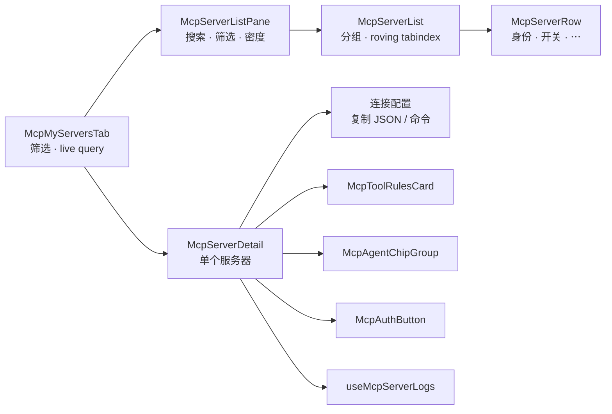
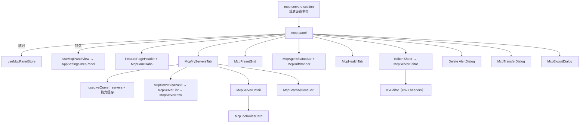

# 设置面板

<Status variant="stable">Stable · `components/settings/mcp/` · `stores/mcp/`</Status>

<TLDR>
  MCP 面板（`mcp-panel.tsx`）是一个填满设置窗格、自己持有滚动的四标签页界面 ——
  **My Servers · Presets · Agents · Health**。**My Servers** 是主从布局：左侧一条密集的服务器轨道，
  右侧是某一个服务器的工具、Agent 投射、OAuth 状态、连接配置与最近日志。状态被拆分到**两个** store：
  `mcp-panel-store` 持有*临时* UI 状态（当前标签、搜索、筛选、批量选择、详情选择、编辑/删除/粘贴/导出目标），
  `use-mcp-panel-view` 则把*持久*偏好（行密度、分组、收藏）保存到 `AppSettings.mcpPanel`。
  轨道通过 `useLiveQuery` 读取 Dexie，因此其他地方的任何 CRUD 都会实时反映。
</TLDR>

## 四个标签页，同一个固定框架

```typescript title="stores/mcp/mcp-panel-store.ts:14"
export type McpPanelTab = "my-servers" | "presets" | "agents" | "health"
export type McpTransportFilter = "all" | McpTransport
export type McpStatusFilter = "all" | "enabled" | "disabled"
export type McpTrustFilter = "all" | McpServerTrustState
```

| 标签页 | 内容 | 文档 |
| ------ | ---- | ---- |
| **My Servers** | `McpMyServersTab` —— 轨道 + 详情面板、批量操作条 | 本页 |
| **Presets** | `McpPresetGrid` —— 预设市场 | [预设与导入](./presets-and-import) |
| **Agents** | `McpAgentStatusBar` + `McpDriftBanner` + 相关设置区 | [Agent 同步与健康](./agent-sync-and-health) |
| **Health** | `McpHealthTab` —— 实时会话卡片、入站 bridge 状态、审计日志 | [Agent 同步与健康](./agent-sync-and-health#健康标签页) |

有两条布局规则让框架保持静止，而打破其中任何一条，都正是旧版本每次切换标签都会跳动的原因：

```tsx title="components/settings/mcp/mcp-panel.tsx:169"
<AnimatePresence mode="wait" initial={false}>
  <motion.div
    key={activeTab}
    initial={reduce ? false : { opacity: 0 }}
    animate={{ opacity: 1 }}
    exit={reduce ? undefined : { opacity: 0 }}
    transition={fade}
    className="flex min-h-0 w-full flex-1 overflow-hidden"
  >
```

1. **`mode="wait"`，只做透明度过渡。** 默认的 `"sync"` 模式下，切出与切入的两个面板会同时处于正常流中，
   容器高度会瞬间翻倍；再叠加一个 `y` 位移，就会明显地"顿一下"。
2. **每个标签页内容自己持有滚动容器**，位于 `min-h-0 flex-1` 的框架内。这里没有任何一个包住全部标签页的
   `ScrollArea`，因此再高的标签页也无法改变标签栏所在框架的高度。

标签栏本身是 Radix `Tabs`（`mcp-panel-tabs.tsx:31`），且**不加** `overflow-x-auto` —— 不受限的宽度会让
`w-fit` 的列表按 max-content 渲染并溢出窄窗格，那正是点击半隐藏标签时 scroll-into-view 抖动的来源。
现在触发器改为收缩并截断文本。

<Callout type="info">
  Radix `TabsTrigger` 是在 **mousedown/focus** 时选中，而不是 click。测试里 `fireEvent.click` 不会切换标签 ——
  请改用 `userEvent`。
</Callout>

页头使用共享的 `FeaturePageHeader`，承载「已启用 / 总数」计数与四个面板级操作（粘贴 · 导入 · 导出全部 · 添加服务器）。
编辑 `Sheet`、删除 `AlertDialog` 以及粘贴/导出对话框都挂在标签页内容**之外**，因此切换标签不会把它们关掉。

## 填满设置窗格

`mcp` 是设置外壳 `FILL_HEIGHT_SECTIONS` 的成员，因此该 section 走固定框架分支，包装层只需填满它：

```tsx title="components/settings/mcp-servers-section.tsx:28"
<div className={cn("flex h-full min-h-0 w-full flex-1 flex-col overflow-hidden", className)}>
  <McpPanel />
</div>
```

<Callout type="warn">
  旧版本要的是 `h-[calc(100dvh-var(--settings-header-h,8rem))]` —— 一个没有任何地方定义的变量 ——
  并用负 margin 抵消外壳的 padding，而这一切都发生在被限宽的 `max-w-5xl` `ScrollArea` 分支里。
  由此产生了三个可见症状：宽屏下浪费宽度、多出一条滚动条、框架高度与它所处的窗格对不上。
  把 section id 加进 `FILL_HEIGHT_SECTIONS` 就是修复；`sections/skills-section.tsx` 记录了同样的改造。
</Callout>

## 主从布局：My Servers



轨道承载身份、复核状态、启用开关与批量勾选框；所有需要空间的东西都放在详情一侧。
在移动端（`useIsMobile`）详情侧改为 `Sheet`，因为 300px 轨道 + 详情面板在手机上放不下。

### 两个 live query，而不是两百个

标签页只**订阅一次** agent 文件快照、只**订阅一次**能力缓存，然后把派生出的映射往下传。
另一种做法——每行一个 hook——正是旧版网格打开缓慢的原因：

```tsx title="components/settings/mcp/mcp-my-servers-tab.tsx:75"
const capabilityRows = useLiveQuery(() => getDb().mcpCapabilityCache.toArray(), [])
const { toolNames, toolCounts, deniedToolCounts } = useMemo(() => {
  const freshest = new Map<string, string[]>()
  const seenAt = new Map<string, number>()
  for (const row of capabilityRows ?? []) {
    if ((seenAt.get(row.serverId) ?? -1) >= row.updatedAt) continue
    seenAt.set(row.serverId, row.updatedAt)
    freshest.set(row.serverId, row.tools.map((tool) => tool.name))
  }
  // …每个服务器的工具数与被禁用数
}, [capabilityRows, servers])
```

这些工具名同时喂给搜索，所以"哪个服务器提供 `create_issue`？"可以直接在轨道的筛选框里得到答案。

### 键盘

轨道是一个真正的 listbox。只有一行持有 tabstop，因此 Tab 只会进入列表一次；Up/Down/Home/End 在列表内移动，
并且**选择跟随焦点**，让详情侧跟随键盘的方式与跟随点击完全一致。

```tsx title="components/settings/mcp/mcp-server-list.tsx:76"
// Tab must land somewhere even before anything is selected (mobile opens no
// detail pane), so the first row holds the tabstop when nothing is active.
const rovingId = activeId && order.includes(activeId) ? activeId : (order[0] ?? null)
```

`order` 是跨分组的扁平渲染顺序，所以分组标题永远不会成为死路。

<Callout type="warn">
  这些行刻意**不做动画**。它们曾经放在 `staggerChildren` 容器里淡入；当 variant 传播没有触发时，
  每一行都会停在自己的 `initial` variant，`opacity: 0` —— DOM 里在、屏幕上看不见。
  而且按 `STAGGER_INTERVAL` 0.04s 计算，一个百服务器的轨道要在渲染后四秒才完成。标签切换的淡入淡出已经覆盖了这段过渡。
</Callout>

### `McpServerDetail`

单个服务器，自上而下：身份 + 信任徽章 + 启用开关 + 操作；服务器处于 `pending`/`legacy` 时的信任复核横幅；
**连接配置**（配置摘要，来源/修订号/密钥项/更新时间，复制为 JSON 或复制为一条 `claude mcp add` 命令，
远程传输的 `McpAuthButton`）；**工具**；**Agent 目标**；以及该服务器最近的日志行。

配置*表单*仍留在编辑 `Sheet` 里。这个面板用于读取状态并对其操作 —— 把一个带校验的表单混进实时更新的面板，
正是旧界面会在用户光标底下重新回填字段的原因。

这里的一次成功**测试**不会被丢掉：它会经 `recordMcpCapabilities` 写入缓存，
所以同一次「证明服务器能连上」的运行，也顺带填好了工具开关。

### `McpToolRulesCard`

两条禁用轴并存，卡片必须让它们保持可区分，因为二者行为不同：开关钉住**一个**工具名；
规则则会持续覆盖服务器之后新增的工具。因此被规则禁用的工具会显示为**禁用态**开关并标出是哪条规则 ——
给出一个会被规则悄悄压过的开关，本身就是一种欺骗。

批量的**全部允许** / **全部禁用**作用于*当前筛选*的子集；筛选生效时还会多出一个按钮，把该筛选存为规则。
钉在服务器已不再提供的工具上的规则，会保留在"找不到对应工具的规则"里，以便删除。
持久化与发送路径见[服务器配置 → 按工具的禁用规则](./server-config#按工具的禁用规则)。

### `McpTransferDialog` / `McpExportDialog`

粘贴一条安装命令或一段 JSON，解析是实时且纯的 —— 输入框下方的预览*就是*将要写入的内容，
每条可勾选，并可选择名称冲突策略。导出对话框是它的反向：把选中的（或全部）服务器渲染成 JSON，
或渲染成面向某个 agent 的安装命令。二者共用同一对解析器/序列化器，所以导出的东西粘贴框都能读回来。
参见[预设与导入](./presets-and-import#粘贴添加与导出)。

## 两个 store，两种生命周期

### 临时 UI 状态 —— `mcp-panel-store`

```typescript title="stores/mcp/mcp-panel-store.ts:34"
interface McpPanelStoreState {
  activeTab: McpPanelTab
  search: string
  transportFilter: McpTransportFilter
  statusFilter: McpStatusFilter
  trustFilter: McpTrustFilter
  selection: Set<string>              // batch-selected server ids
  editorTarget: McpEditorTarget       // create / edit / closed
  deleteTarget: { serverId: string; name: string } | null
  filterSheetOpen: boolean
  detailServerId: string | null       // master-detail selection
  transferOpen: boolean               // paste-to-add dialog
  exportTarget: { serverIds: string[] } | null // [] means "every server"
  // actions: setActiveTab, setSearch, set*Filter, resetFilters,
  //          toggleSelection, selectAll, clearSelection,
  //          openCreate(seed?), openEdit(id), closeEditor, setDeleteTarget,
  //          openDetail(id), closeDetail, setTransferOpen, openExport(ids), closeExport
}
```

`detailServerId` 与 `selection`（批量操作）和 `editorTarget`（配置表单）都相互独立：
打开编辑器不应该把详情面板从用户正在阅读的那一行上移走。

`selection` 是不可变 `Set` —— 每次切换都返回一份新拷贝，保证订阅者正确重渲染：

```typescript title="stores/mcp/mcp-panel-store.ts:96"
toggleSelection: (id) =>
  set((s) => {
    const next = new Set(s.selection)
    if (next.has(id)) next.delete(id)
    else next.add(id)
    return { selection: next }
  }),
```

> `stores/mcp/mcp-store.ts` 是**另一个**极简 store —— 一个契约兼容的 stub
> （`servers`、`toolSelectionConfig`、`lastToolSelection`），供 agent 模式的
> [工具选择器](./consumption-surfaces#工具选择器)使用，*不*被本面板使用。

### 持久化偏好 —— `use-mcp-panel-view`

视图偏好通过 `useSettingsStore.save()` 持久化在 `AppSettings.mcpPanel` 上（跨设备，而非 localStorage）：

```typescript title="hooks/mcp/use-mcp-panel-view.ts:26"
export type McpPanelView = "grid" | "list"
export type McpPanelGroupBy = "none" | "transport" | "status"
export interface McpPanelPrefs { view: McpPanelView; groupBy: McpPanelGroupBy; favorites: string[] }
```

<Callout type="info">
  `view` 仍以 `"grid"` / `"list"` 存储，以兼容面板变成主从布局之前写入的数据。这两个值现在的含义是单列轨道中的
  **宽松**与**紧凑**行密度；改掉存储字面量只会悄悄重置每一位现有用户的偏好，却换不来任何行为上的收益。
</Callout>

## 组件树



## 关键组件

### `McpServerEditor`

按 transport 区分的创建/编辑表单，带表单 ↔ JSON 切换。`buildConfig` 从当前分区重建 `config`：

```tsx title="components/settings/mcp/mcp-server-editor.tsx:76"
const buildConfig = (): Record<string, unknown> => {
  if (transport === "stdio") {
    const args = argsText.split("\n").map((a) => a.trim()).filter(Boolean)
    const env = kvRowsToObject(envRows)
    const config: Record<string, unknown> = { command }
    if (args.length > 0) config.args = args
    if (Object.keys(env).length > 0) config.env = env
    return config
  }
  const headers = kvRowsToObject(headerRows)
  const config: Record<string, unknown> = { url }
  if (Object.keys(headers).length > 0) config.headers = headers
  return config
}
```

有两样东西它刻意**不管**。`appsEnabled` 永远不在保存 payload 里 —— 逐 agent 的 chip 组是唯一写入方，
在这里一并写出会与 chip 点击竞态。禁用规则则原样透传，因此保存一次配置修改绝不会悄悄放宽模型可调用的范围：

```tsx title="components/settings/mcp/mcp-server-editor.tsx:155"
await onSave({
  name: name.trim(),
  transport,
  config,
  enabled,
  disallowedTools: initial.disallowedTools,
})
```

Sheet 的表单体独立滚动，页头与编辑器自身的操作行保持不动，因此很长的 `env` 列表也不会把**保存**顶出屏幕。

### `KvEditor`

可复用的键值行编辑器（`add` / `update` / `remove` 均为不可变处理器），stdio 的 `env` 与 http/sse 的 `headers` 共用。
行数据经由 `objectToKvRows` / `kvRowsToObject` 往返。

### `McpBatchActionsBar`

当 `selection.size > 0` 时出现的浮动操作条。启用/停用/重新同步/删除都循环调用**单行** CRUD 函数，
使逐行的 agent 镜像副作用与单独操作时完全一致；导出则把当前选择交给导出对话框：

```tsx title="components/settings/mcp/mcp-batch-actions-bar.tsx:52"
const handleDelete = async () => {
  let failed = 0
  for (const s of selected) {
    try { await deleteMcpServer(s.id) }
    catch (err) { failed += 1; loggers.mcp.warn("batch delete skipped", { id: s.id, error: String(err) }) }
  }
  if (failed > 0) toast.warning(t("deletedPartial", { ok: count - failed, total: count }))
  else toast.success(t("deletedCount", { count }))
  clear()
}
```

## 注意事项

- **Radix Tabs** —— 标签栏已从手写的 `role="tab"` 按钮迁移过来；注意上文的 mousedown 提醒。
- **实时数据** —— `useLiveQuery(listMcpServers)` 意味着导入、插件安装、CCSwitch 同步都会自动出现，无需手动刷新。
- **收藏上浮** —— `groupServers`（见 [server-config 辅助函数](./server-config#ui-辅助函数)）把收藏的服务器提到每个分组顶部。
- **编辑器重挂载** —— 编辑 `Sheet` 会随 `editorTarget` 变化重挂载，因此表单状态不会在行之间泄漏；
  并且会等到被编辑的行加载完成后再挂载，保证它的一次性 seed 绝不会捕获空白或过期的 `initial`。
- **创建后的落点** —— 创建成功后会在详情面板打开新服务器，让它的工具开关与 Agent 投射一眼可见。

## 相关页面

<Cards>
  <Card title="服务器配置与存储" href="./server-config" description="面板调用的 CRUD 函数、禁用规则，以及分组/摘要辅助函数。" />
  <Card title="预设与导入" href="./presets-and-import" description="预设市场、CLI 配置导入，以及粘贴/导出这一对传输能力。" />
  <Card title="Agent 同步与健康" href="./agent-sync-and-health" description="Agents 与 Health 标签页详解 —— chips、drift、探测与审计日志。" />
  <Card title="消费面" href="./consumption-surfaces" description="mcp-store stub，以及复用这份配置的其他选择器。" />
</Cards>
