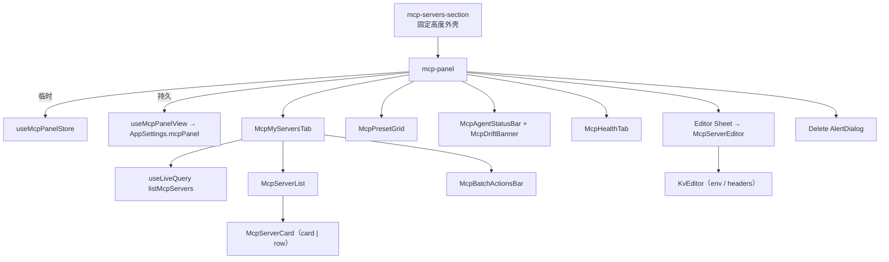

# 设置面板

<Status variant="stable">Stable · `components/settings/mcp/` · `stores/mcp/`</Status>

<TLDR>
  MCP 面板（`mcp-panel.tsx`）是一个四标签页界面 —— **My Servers · Presets · Agents · Health** ——
  由原生 `role="tab"` 按钮（而非 Radix）构建，配合尊重 reduced motion 的 `AnimatePresence` 页面过渡。
  状态被拆分到**两个** store 中：`mcp-panel-store` 持有*临时* UI 状态
  （当前标签、搜索、transport/status 筛选、一个由选中 id 组成的 `Set`、编辑/删除目标），而
  `use-mcp-panel-view` 将*持久*偏好（grid 还是 list、分组、收藏）持久化到
  `AppSettings.mcpPanel` 以实现跨设备同步。服务器列表通过 `useLiveQuery` 读取 Dexie，因此其他地方的任何
  CRUD 都会实时反映。批量操作循环调用单行 CRUD 函数，使 agent 镜像副作用保持完全一致。
</TLDR>

## 四个标签页

```typescript title="stores/mcp/mcp-panel-store.ts:14"
export type McpPanelTab = "my-servers" | "presets" | "agents" | "health"
export type McpTransportFilter = "all" | McpTransport
export type McpStatusFilter = "all" | "enabled" | "disabled"
```

| 标签页 | 内容 | 页面 |
| --- | ------- | ---- |
| **My Servers** | `McpMyServersTab` —— 视图/分组控件、过滤后的列表、批量操作栏 | 本页 |
| **Presets** | `McpPresetGrid` —— 预设市场 | [预设与导入](./presets-and-import) |
| **Agents** | `McpAgentStatusBar` + `McpDriftBanner` + 相关分区条 | [Agent 同步与健康](./agent-sync-and-health) |
| **Health** | `McpHealthTab` —— 入站桥接状态 + 审计日志 | [Agent 同步与健康](./agent-sync-and-health#health-tab) |

标签条是手工构建的（没有用 Radix Tabs），内容采用交叉淡入淡出：

```tsx title="components/settings/mcp/mcp-panel.tsx:161"
<AnimatePresence initial={false}>
  <motion.div
    key={activeTab}
    initial={reduce ? false : { opacity: 0, y: 4 }}
    animate={{ opacity: 1, y: 0 }}
    exit={reduce ? undefined : { opacity: 0, y: -4 }}
    transition={fade}
  >
    {activeTab === "my-servers" && <McpMyServersTab />}
    {activeTab === "presets" && <McpPresetGrid existingNames={[]} onPresetSelected={onPresetSelected} />}
    {activeTab === "agents" && <div className="space-y-4"><McpAgentStatusBar /><McpDriftBanner /></div>}
    {activeTab === "health" && <McpHealthTab />}
  </motion.div>
</AnimatePresence>
```

编辑器 `Sheet` 和删除 `AlertDialog` 被托管在标签内容*之外*，因此它们能在标签切换中保留下来
（`mcp-panel.tsx:186`）。

## 两个 store，两种生命周期

### 临时 UI 状态 —— `mcp-panel-store`

```typescript title="stores/mcp/mcp-panel-store.ts:34"
interface McpPanelStoreState {
  activeTab: McpPanelTab
  search: string
  transportFilter: McpTransportFilter
  statusFilter: McpStatusFilter
  selection: Set<string> // batch-selected server ids
  editorTarget: McpEditorTarget // create / edit / closed
  deleteTarget: { serverId: string; name: string } | null
  filterSheetOpen: boolean
  // actions: setActiveTab, setSearch, set*Filter, resetFilters,
  //          toggleSelection, selectAll, clearSelection,
  //          openCreate(seed?), openEdit(id), closeEditor, setDeleteTarget, …
}
```

selection 是一个不可变的 `Set` —— 每次切换都会返回一个全新的副本，以便订阅者正确重新渲染：

```typescript title="stores/mcp/mcp-panel-store.ts:78"
toggleSelection: (id) =>
  set((s) => {
    const next = new Set(s.selection)
    if (next.has(id)) next.delete(id)
    else next.add(id)
    return { selection: next }
  }),
```

> `stores/mcp/mcp-store.ts` 是一个**不同的**、精简的 store —— 一个契约兼容的 stub
> （`servers`、`toolSelectionConfig`、`lastToolSelection`），被 agent 模式的
> [工具选择器](./consumption-surfaces#tool-selector)消费，*而非*本面板。

### 持久偏好 —— `use-mcp-panel-view`

视图偏好通过 `useSettingsStore.save()` 持久化到 `AppSettings.mcpPanel`（跨设备，而非 localStorage）：

```typescript title="hooks/mcp/use-mcp-panel-view.ts:18"
export type McpPanelView = "grid" | "list"
export type McpPanelGroupBy = "none" | "transport" | "status"
export interface McpPanelPrefs { view: McpPanelView; groupBy: McpPanelGroupBy; favorites: string[] }
```

```typescript title="hooks/mcp/use-mcp-panel-view.ts:78"
const toggleFavorite = useCallback(
  async (id: string) => {
    const next = favoriteSet.has(id)
      ? prefs.favorites.filter((f) => f !== id)
      : [...prefs.favorites, id]
    await persist({ favorites: next })
  },
  [favoriteSet, prefs.favorites, persist]
)
```

## 组件树



## 关键组件

### `McpMyServersTab`

读取实时服务器列表，并在 name、transport、command、url 和 args 上应用当前筛选 + 搜索：

```tsx title="components/settings/mcp/mcp-my-servers-tab.tsx:55"
const visibleServers = useMemo(() => {
  const q = search.trim().toLowerCase()
  return servers.filter((s) => {
    if (transportFilter !== "all" && s.transport !== transportFilter) return false
    if (statusFilter === "enabled" && !s.enabled) return false
    if (statusFilter === "disabled" && s.enabled) return false
    if (!q) return true
    const cfg = s.config as { command?: string; url?: string; args?: string[] }
    return [s.name, s.transport, cfg.command ?? "", cfg.url ?? "", (cfg.args ?? []).join(" ")]
      .join(" ").toLowerCase().includes(q)
  })
}, [servers, search, transportFilter, statusFilter])
```

### `McpServerCard`

单个服务器卡片，有两种变体 —— `card`（堆叠式，页脚带 agent 标记）和 `row`
（内联式）。它拥有每个服务器的**测试**操作，调用 Rust 探针并渲染绿色 ✓（带工具计数）或红色 ✗ 徽章。
收藏 / 测试 / 编辑 / 克隆 / 删除操作在桌面端悬停前隐藏，在触摸端始终可见。

### `McpServerEditor`

transport 感知的创建/编辑表单，带有 表单 ↔ JSON 切换。`buildConfig` 从当前分区重建 `config` blob：

```tsx title="components/settings/mcp/mcp-server-editor.tsx:76"
const buildConfig = (): Record<string, unknown> => {
  if (transport === "stdio") {
    const args = argsText.split("\n").map((a) => a.trim()).filter(Boolean)
    const env = kvRowsToObject(envRows)
    const config: Record<string, unknown> = { command }
    if (args.length > 0) config.args = args
    if (Object.keys(env).length > 0) config.env = env
    return config
  }
  const headers = kvRowsToObject(headerRows)
  const config: Record<string, unknown> = { url }
  if (Object.keys(headers).length > 0) config.headers = headers
  return config
}
```

### `KvEditor`

一个可复用的键/值行编辑器（`add` / `update` / `remove` 不可变处理函数），同时用于 stdio
`env` 和 http/sse `headers`。行通过 `objectToKvRows` / `kvRowsToObject` 往返转换。

### `McpBatchActionsBar`

当 `selection.size > 0` 时显示的浮动栏。启用/禁用/重新同步/删除全部都循环调用**单行**
CRUD 函数，使每行的 agent 镜像副作用与逐个操作时完全一样地触发：

```tsx title="components/settings/mcp/mcp-batch-actions-bar.tsx:49"
const handleDelete = async () => {
  let failed = 0
  for (const s of selected) {
    try { await deleteMcpServer(s.id) }
    catch (err) { failed += 1; loggers.mcp.warn("batch delete skipped", { id: s.id, error: String(err) }) }
  }
  if (failed > 0) toast.warning(t("deletedPartial", { ok: count - failed, total: count }))
  else toast.success(t("deletedCount", { count }))
  clear()
}
```

### `McpServersSection`

设置页面的入口点。它将面板拉伸到固定的视口高度，使面板在内部滚动，而不是外层设置的
`ScrollArea` 滚动：

```tsx title="components/settings/mcp-servers-section.tsx:25"
className="h-[calc(100dvh-var(--settings-header-h,8rem))] …"
```

## 说明

- **没有 Radix Tabs** —— 标签是带 `role="tab"` / `aria-selected` 的原生按钮。
- **实时数据** —— `useLiveQuery(listMcpServers)` 意味着导入、插件安装和 CCSwitch 同步都会
  在无需手动刷新的情况下出现。
- **收藏置顶** —— `groupServers`（来自[服务器配置工具](./server-config#ui-helpers)）将
  收藏的服务器提升到每个分组的顶部。
- **编辑器重新挂载** —— 编辑器 `Sheet` 在 `editorTarget` 变化时重新挂载，因此表单状态绝不会
  在不同行之间泄漏。

## 相关页面

<Cards>
  <Card title="服务器配置与 store" href="./server-config" description="面板调用的 CRUD 函数和分组/摘要辅助函数。" />
  <Card title="Agent 同步与健康" href="./agent-sync-and-health" description="深入讲解 Agents 和 Health 标签页 —— 标记、drift、探针和审计日志。" />
  <Card title="消费界面" href="./consumption-surfaces" description="mcp-store stub 以及复用此配置的其他选择器。" />
</Cards>
