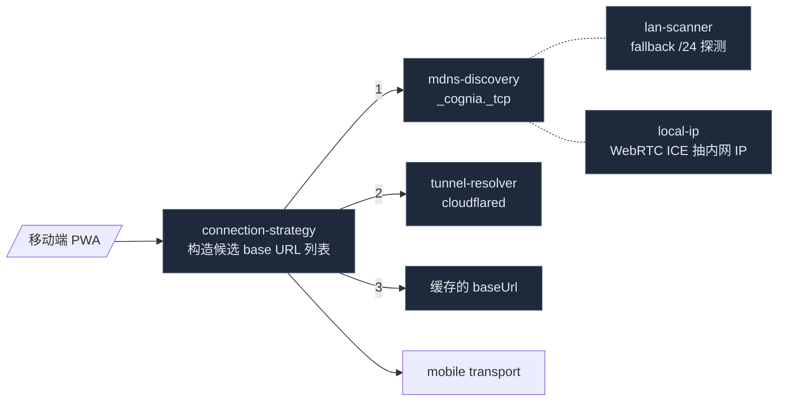

# 其他子系统

这页汇总几个规模相对较小、但任何一个少了都明显缺东西的子系统。每个小节先讲它做什么，再列关键文件，最后给关联文档。结构上比其他子系统页扁平 —— 这些模块各自相对独立，没必要按一份大的统一模型组织。
## 速览

| 子系统              | 角色                                     | 涉及位置                                |
| ------------------- | ---------------------------------------- | --------------------------------------- |
| TTS                 | 文本转语音 9 provider + Edge WSS 桥      | `lib/tts/` · `src-tauri/src/tts/`       |
| Push                | 移动端推送通知（APNs/FCM）               | `lib/push/`                             |
| QR & Barcode        | 配对二维码 + 移动端扫码                  | `lib/qr/`                               |
| Network             | 浏览器侧代理配置 + proxy-aware fetch     | `lib/network/`                          |
| Proxy Config (Rust) | 进程级代理状态 + reqwest/WSS 接入        | `src-tauri/src/proxy_config/`           |
| Connectivity        | mDNS / LAN /24 探测 / cloudflared tunnel | `lib/connectivity/`                     |
| Queue               | 移动端 outbound 队列 + 退避 + deadletter | `lib/queue/`                            |
| Wallpaper           | 用户壁纸文件持久化                       | `src-tauri/src/wallpaper/`              |
| LaTeX               | KaTeX 渲染 LRU 缓存 + 宏                 | `lib/latex/`                            |
| Monaco / Workbench  | 画板 Monaco 选项 + 活跃编辑器 registry   | `lib/monaco/` · `lib/editor-workbench/` |
| Media               | 插件生成媒体的落地接口                   | `lib/media/`                            |
| Time                | 极简相对时间格式器                       | `lib/time/`                             |

## TTS

文本转语音，9 个 provider 加一个 Edge-TTS WebSocket 桥。前端 `lib/tts/`，Tauri 侧 `src-tauri/src/tts/`。

供应商一览（`types/media/tts.ts:TTS_PROVIDERS`）：

| Provider   | 入口文件                  | 备注                |
| ---------- | ------------------------- | ------------------- |
| OpenAI     | `providers/openai.ts`     | REST，需 API key    |
| Gemini     | `providers/gemini.ts`     | Google AI 系        |
| ElevenLabs | `providers/elevenlabs.ts` | 高质量声纹          |
| LMNT       | `providers/lmnt.ts`       | 低延迟              |
| Hume       | `providers/hume.ts`       | 含情感参数          |
| Cartesia   | `providers/cartesia.ts`   | Sonic 系列          |
| Deepgram   | `providers/deepgram.ts`   | TTS + STT 同栈      |
| Xiaomi     | `providers/xiaomi.ts`     | 国内可用            |
| Edge       | `providers/edge.ts`       | 微软免费；走 WSS 桥 |
| System     | `providers/system.ts`     | Web Speech API 兜底 |

`tts-orchestrator.ts` 是单例编排器：拿到 `SpeechSettings` → 选 provider → `preprocessTextForProvider` + 应用发音字典 + `splitTextForTTS` 分段 → 缓存（`tts-cache.ts`）查命中 → 调对应 provider → 串接播放队列。`auto-play-gates.ts` 的 `canAutoPlayTTS({ ttsEnabled, ttsAutoPlay, isLoading, isStreaming })` 是聊天 send 完成后唯一的"该不该自动播"判定。

编排器通过三个触点接入聊天：逐条消息的**朗读按钮**（`components/chat/read-aloud-button.tsx`，按 `ttsEnabled` 门控，用聚焦的 `useReadAloudStatus` 选择器，使虚拟化列表里的按钮不会被进度 tick 刷新）、**自动播放**（`hooks/media/use-chat-auto-play-tts.ts` 在回合完成的边沿触发 `canAutoPlayTTS`）、以及单实例全局**播放浮条**（`components/tts/tts-now-playing-bar.tsx`，挂在 app 根）。三者都经 `resolveCharacterVoice` 解析按角色声线（团队按 `senderId`，直聊用会话绑定角色），共用一个命令式入口 `lib/tts/speak-chat-message.ts`。编排器的 `activeSourceId` 标记当前由哪条消息持有播放。

Edge-TTS 在浏览器里被 CORS 卡死，所以走 Tauri 桥（`src-tauri/src/tts/edge.rs`）：Rust 端开 WSS 到 `speech.platform.bing.com`，发 SSML，把二进制 MP3 帧拼回前端。`src-tauri/src/tts/keyring.rs` 用 OS keyring（macOS Keychain / Windows Credential Manager / Linux Secret Service）存其余 8 个 provider 的 API key；服务名 `com.cognia.tts`，account 是 provider id。`src-tauri/src/tts/proxy.rs` 是通用 HTTP 代理，给那些走 REST 但被 CORS 挡的 provider 用。

`speech.ts` 顺带提供语音输入的 BCP-47 语种表（`SPEECH_LANGUAGES`），13 种内置语言（中英日韩西法德意葡俄阿），给 composer 的麦克风按钮做下拉。

### 缓存

`tts-cache.ts` 是 IndexedDB-backed 音频缓存：

```ts title="lib/tts/tts-cache.ts"
const DB_NAME = "cognia-next-tts-cache"
const STORE_NAME = "audio-cache"
const CACHE_TTL = 24 * 60 * 60 * 1000 // 24h
const MAX_CACHE_SIZE = 100 * 1024 * 1024 // 100 MB

export interface TTSCacheEntry {
  key: string // text + provider + 相关 setting 哈希
  audioBlob: Blob
  mimeType: string
  createdAt: number
  expiresAt: number
  provider: TTSProvider
  text: string
  size: number
}
```

写入时先清掉过期项，再按 `createdAt` 升序淘汰到容量以下。复读同一段（如系统欢迎语、AI 自我介绍）命中率非常高 —— 这对 ElevenLabs / Cartesia 这种按字符计费的 provider 直接降本。

### Provider 元信息

`types.ts:TTS_PROVIDERS` 一张大表，每个 provider 有：

```ts
interface TTSProviderInfo {
  id: TTSProvider
  name: string
  description: string
  requiresApiKey: boolean
  apiKeyProvider?: string // 共享 key 的情形（gemini → google）
  supportsStreaming: boolean
  maxTextLength: number // 上层据此切片
}
```

`maxTextLength` 是切片用的硬上限 —— `tts-text-utils.ts:splitTextForTTS` 在超过时按句号 / 段落切，保证每片单独可发；上层把音频片段串接播放，监听到 `chunkended` 触发下一片，听感不间断。

关键文件：`lib/tts/{tts-orchestrator,tts-cache,tts-text-utils,speech-settings,auto-play-gates,keyring,speech,types}.ts` · `lib/tts/providers/*.ts` · `src-tauri/src/tts/{edge,keyring,proxy}.rs`。

## Push

移动端推送注册外壳（M4.6）。`lib/push/push-notifications.ts` 包 `@capacitor/push-notifications`：

- `requestPermission()` → OS 权限 prompt（`granted / denied / prompt / prompt-with-rationale`）。
- `register()` → 触发 APNs / FCM 注册，返回 `RegistrationOutcome`（`registered + token + platform` / `permission_denied` / `unsupported` / `registration_failed`）。
- `subscribePush(handler)` → 订阅入站推送事件，转给 UI 路由到 banner 或 inbox。

Web 模式下插件不存在，全套 API 返回 `unsupported`，调用方据此降级。Token 通过 `_rpc/register_push_token` 报回桌面端（companion server）；服务侧投递逻辑在 Rust 那侧的 HITL 工作量里，本模块只管"拿到 token + 路由入站消息"。

`PushDelivery` 是统一入站事件：

```ts
export interface PushDelivery {
  title?: string // OS 横幅标题
  body?: string // 横幅正文
  data: Record<string, unknown> // 服务端附带的 payload（deep-link、session id）
  foreground: boolean // 应用是否在前台
}
```

`data` 里的 `route` / `sessionId` 让前端可以反应式打开对应聊天；后端在投递时按消息类型分桶（新消息 / 审批 / 提醒），手机统一进 Inbox 列表。

关键文件：`lib/push/push-notifications.ts`。

## QR & Barcode

`lib/qr/` 处理"配对二维码"与"扫码"两条路径。

`pair-payload.ts` 定义 `PairQrPayload`：`{ baseUrl, pairJwt, v? }` —— 桌面 Settings → Companion 渲染这种 QR，手机扫码 prefill 配对表。`pair-qr.ts` 提供编码 / 解码工具（`parsePairQrPayload(raw)` 错的输入返回 `null`，调用方据此 fallback 到"让用户粘贴"）。

`barcode-scanner.ts` 是 `@capacitor-mlkit/barcode-scanning` 的薄壳：动态 `import()` 避免 Web bundle 解析 native plugin；统一返回 `ScanOutcome`（`scanned + raw` / `permission_denied` / `cancelled` / `unsupported` / `error`）。手机端调一次拿一次 raw，再过 `parsePairQrPayload` 判断是不是配对二维码。

关键文件：`lib/qr/{pair-payload,pair-qr,barcode-scanner}.ts`。

## Network & Proxy

`lib/network/` 是项目级 HTTP 代理的前端表示。

`proxy-config.ts` 提供纯函数：

- `isProxyActive(cfg)` —— mode ≠ off + 有 host + port > 0。
- `buildProxyUrl(cfg)` —— 构造 `http(s)://user:pass@host:port` 或 `socks5://...`，凭证 URL 编码。
- `shouldBypass(targetUrl, bypass[])` —— 按字面 host / 域名后缀（`.internal`）/ loopback 判断。

`proxy-fetch.ts` 在此基础上提供 `createProxyFetch(cfg)`，返回一个会按需走代理的 `fetch` 替身。这一层只在浏览器侧用 —— 桌面真正的 HTTP / WS 走 `src-tauri/src/proxy_config/` 由 Rust 接管。

### Rust 侧

`src-tauri/src/proxy_config/` 是进程范围的代理状态：

```rust title="src-tauri/src/proxy_config/mod.rs"
pub struct ProxyConfig {
    pub mode: ProxyMode,            // Off | Manual | Auto
    pub protocol: ProxyProtocol,    // Http | Https | Socks5
    pub host: String, pub port: u16,
    pub username: Option<String>, pub password: Option<String>,
    pub bypass: Vec<String>,
    pub proxy_websockets: bool,
}
```

`current() / set_current()` 暴露 `OnceLock<RwLock<...>>`；每次设置变更前端调 `proxy_set` 命令同步。Rust 这边的核心服务：

- `build_reqwest_proxy()` —— 给 reqwest builder 用，含 bypass closure。
- `env_vars()` —— 喂给子进程（sidecar 等）`HTTP_PROXY / HTTPS_PROXY / NO_PROXY` 大小写两份。
- `basic_auth_header()` —— Base64 编码的 `Proxy-Authorization`，WSS CONNECT 隧道用。
- `wsproxy::connect_via_proxy()` —— WSS over HTTP CONNECT 拨号器。
- `detect.rs` —— Auto 模式下扫描本机已运行的代理软件。

`detect.rs` 的策略很直接：对一组常见 loopback 端口（Clash 的 7890/7891、SOCKS 1080、Mihomo 等）做 500 ms TCP probe，并行 fire。命中 Clash/Mihomo 端口时再发一次 `GET http://127.0.0.1:9090/version` 取控制器版本，让设置 UI 显示"检测到 Clash Verge v1.x"，一键采用该端口。

`ProxyCandidate` 携带 `kind: "http" | "socks5" | "clash"` 区分协议，UI 列表按探测顺序展示，保持稳定。

两侧的 bypass 算法刻意保持一致，TS 和 Rust 走同一组单测断言：

```ts
shouldBypass("http://127.0.0.1:3000", ["127.0.0.1"]) // → true
shouldBypass("https://api.internal/foo", [".internal"]) // → true（后缀）
shouldBypass("https://api.example.com", ["localhost"]) // → false
```

代理路径的"谁先生效"是有讲究的：浏览器 fetch 走 `lib/network/proxy-fetch.ts` 命中 TS 侧；所有 Tauri 命令发出的 HTTP / WS 走 `proxy_config::current()` 命中 Rust 侧；子进程（Node sidecar、shell 工具）通过 `env_vars()` 注入环境变量自己处理。三条路径的配置来自同一份 `AppSettings.network.proxy`，设置 UI 改一次三方同步。

关键文件：`lib/network/{proxy-config,proxy-fetch}.ts` · `src-tauri/src/proxy_config/{mod,commands,detect,wsproxy}.rs`。

## Connectivity

`lib/connectivity/` 是手机找桌面机器的发现层（Wave 1.5/1.6）。



`connection-strategy.ts:buildCandidates(ctx)` 按 mDNS → tunnel → cached 顺序生成 `ConnectionCandidate[]`，每个候选带 `label / baseUrl / origin`，UI 据此显示"尝试 LAN → 尝试隧道 → 用上次成功的地址"。

`mdns-discovery.ts` 用 `@jonz94/capacitor-mdns` 听 `_cognia._tcp` 广播，TXT 记录里带桌面机器的 SPKI 指纹，移动端用它来 pin 信任的桌面。`lan-scanner.ts` 是 mDNS 失败时的兜底：通过 WebRTC ICE candidate trick（`local-ip.ts:getPrivateLocalIps`）拿到本机的内网 IP，按 `/24` 段并行探测 cognia 的 401 签名。

`tunnel-resolver.ts` 包 Tauri 命令 `companion_tunnel_*`，控制桌面端的 cloudflared 隧道（启动 / 停止 / 拿公网 URL），返回 `TunnelInfo { publicUrl, localUrl }`。Web 模式下短路 —— `tauriInvoker()` 在 `__TAURI_INTERNALS__` 不存在时返回 `null`，调用方据此降级。

### LocalIP 的 WebRTC trick

`local-ip.ts:getPrivateLocalIps()` 不依赖任何原生插件就能拿到本机内网 IP：

1. `new RTCPeerConnection({ iceServers: [] })` —— 不配 STUN，候选只从本机接口收集（无网络往返）。
2. 创建一个 dummy data channel 强制收集 host candidates。
3. `setLocalDescription(createOffer())` 触发 ICE gathering。
4. 监听 `icecandidate`，过滤出符合 `10.x / 172.16-31.x / 192.168.x` 这三个私网段的 IPv4，丢掉 `<uuid>.local` 这种 mDNS 匿名化 hostname（现代浏览器默认开启，不能直接用）。

privacy 上的代价是 user 在 iOS 14+ 会看到 "Local Network" 权限提示；拒绝则返回空列表，`lan-scanner` 那侧自动跳过 IP-segment 探测，只剩 mDNS 一条路径。

关键文件：`lib/connectivity/{connection-strategy,mdns-discovery,lan-scanner,local-ip,tunnel-resolver}.ts`。

## Queue

`lib/queue/` 是移动端"先排队、再发"的小队列实现（Wave 2.1）。

`outbound-queue.ts` 是 runner —— 从 Dexie 表 `mobileOutboundQueue` 取下一行（`claimNext`），调 `transport.call(command, payload, { idempotencyKey })`，按结果 `markSent` / `recordFailure`。触发条件：网络 online、应用 resume、手动 `kick()`。Web 模式下短路成 no-op。

`retry-policy.ts` 是纯函数：

- `MAX_ATTEMPTS = 5` —— 超过则入 deadletter。
- `backoffDelayMs(attempt, random?)` —— `1 / 2 / 4 / 8 / 16` 秒指数退避，封顶 60 s，加 25% jitter。
- `NON_RETRYABLE_PATTERNS` —— 4xx 类错误正则白名单（无意义重试）。

跟 `lib/connectors/outbound-runner.ts`（平台连接器的发送队列）独立 —— 两者各为不同的入站/出站语义服务，没复用一套实现。

关键文件：`lib/queue/{outbound-queue,retry-policy}.ts`。

## Wallpaper

用户自定义壁纸的持久化。前端 `lib/themes/`（plugin Theme API）会读取 `AppSettings.wallpapers[]`；实际文件落地在 Tauri 侧。

`src-tauri/src/wallpaper/commands.rs` 暴露：

- `save_wallpaper(name, bytes)` —— 落到 `<app_data>/cognia/wallpapers/<uuid>.<ext>`，返回 `SavedWallpaper { rel_path, abs_path, bytes }`。`MAX_BYTES = 32 MB` 是 Rust 侧的硬上限（前端早一步拒绝）。
- `list_wallpapers()` / `delete_wallpaper(rel_path)` —— 简单 CRUD。
- 前端用 `convertFileSrc(abs_path)` 把绝对路径转成 webview 可加载的 URL。

Web 模式下没有这条路径，UI 退回到把 Blob 直接放进 IndexedDB。

`SavedWallpaper` 返回结构：

```rust title="src-tauri/src/wallpaper/commands.rs"
pub struct SavedWallpaper {
    pub rel_path: String,    // wallpapers/<uuid>.<ext>，前端塞进 settings
    pub abs_path: String,    // 绝对路径，convertFileSrc 给 webview
    pub bytes: u64,
}
```

`wallpapers_dir()` 解析 `dirs::data_dir() + cognia/wallpapers`，缺失自动 mkdir。为方便测试，单独有 `wallpapers_dir_at(base)` 接受外部基目录 —— 单测把临时目录传进来，不污染真实 `<app_data>`。

`lib/themes/index.ts` 在 plugin Theme API 里读 `AppSettings.wallpapers[]`，把当前激活的那张作为 `ResolvedTheme.background` 字段暴露给插件。颜色主题与壁纸完全独立 —— 用户可以同时用"oceanic 配色 + 自定义风景照"。

关键文件：`src-tauri/src/wallpaper/{mod,commands}.rs` · `lib/themes/index.ts`。`lib/themes/wallpaper/` 在 cognia-next 当前没有独立 TS 模块 —— 壁纸逻辑融入 `lib/themes/index.ts` 与 `stores/settings/`。

## LaTeX

`lib/latex/` 是 KaTeX 的 LRU 缓存层。

`config.ts` 集中 KaTeX 选项：

- `KATEX_MACROS` —— 常用数学宏（`\R / \N / \E / \rank / \argmax / ...`），让用户少敲。
- `getKatexOptions()` —— 返回完整 `KatexOptions`，含 `throwOnError: false`、`strict: "ignore"` 等保守默认。
- `MATH_CACHE_MAX_SIZE / MATH_CACHE_MAX_AGE` —— 缓存上限（条数 + 时长）。

`cache.ts` 是 `MathCache` 类：`render(latex, displayMode) → html`，命中缓存直接返回；未命中调 `katex.renderToString` 然后入表，LRU 淘汰，统计 hits/misses 暴露给 dev 面板。

被 `streamdown` / `message-renderer` 在渲染 AI 数学公式时调用。重复公式（如 $x$、$y$、$\theta$）命中率极高，省下大量 KaTeX 调用开销。

宏的几个常用类别：

- **数集** —— `\R / \N / \Z / \Q / \C` → `\mathbb{R}` 等。
- **概率统计** —— `\E / \P / \Var / \Cov / \Corr` 走 `\mathbb` 或 `\operatorname`。
- **线性代数** —— `\rank / \trace / \tr / \diag / \det`。
- **微积分** —— `\d / \DD / \pd`（区分微分算子与偏导）。
- **优化** —— `\argmax / \argmin`。

这些宏跟用户能在 KaTeX 输入框打的常见 LaTeX 习惯对齐，让 AI 输出无需在每次 prompt 里强调 `use \mathbb{R}`。

关键文件：`lib/latex/{cache,config}.ts`。

## Monaco & Editor Workbench

`lib/monaco/` 和 `lib/editor-workbench/` 都是为画板 / AI 检视器准备的编辑器集成。两者都是 Cognia 原项目特性的"兼容 shim" —— 接口在 cognia-next 保留，行为按当前需要削减。

`lib/monaco/index.ts:createEditorOptions(kind, overrides?)` 从 `useCanvasSettingsStore` 取用户偏好（字体 / minimap / wrap / ...），按 `kind`（`"code"` 不 wrap，`"document"` wrap）覆盖，再合并 `overrides`。返回给 Monaco 构造器。

`lib/monaco/snippets.ts` 暴露 `registerAllSnippets / registerEmmetSupport` —— cognia-next 中是 no-op，让画板钩子编译通过；用户的真实 snippet 通过画板的 `snippet-registry` 管。

`lib/editor-workbench/editor-context-registry.ts` 是单 slot 全局注册表，跟踪"当前聚焦的 Monaco 编辑器是谁"：

```ts title="lib/editor-workbench/editor-context-registry.ts"
export interface ActiveEditorContext {
  editorId: string
  contextId?: "canvas" | "ai-inspector" | (string & {})
  editor?: any // Monaco handle，dynamic import 故弱类型
  documentId?: string
  language?: string
  selection?: { startLineNumber; startColumn; endLineNumber; endColumn } | null
  cursor?: { line; column }
  getValue?: () => string
  metadata?: Record<string, unknown>
}
```

画板挂载时 `setActiveEditor(ctx)`，AI 检视器读 `getActiveEditor()` 拿当前光标位置/选中内容，发命令时再 `editor.executeEdits` 应用变更。监听器集（`Set<(ctx) => void>`）用来让插件 API 反应式响应。

`monaco-context-binding.ts` 是把 Monaco 的 `onDidChangeCursorSelection` 等事件桥接到上述 registry 的具体绑定函数 —— 调一次返回 `dispose()`。

关键文件：`lib/monaco/{index,snippets}.ts` · `lib/editor-workbench/{editor-context-registry,monaco-context-binding}.ts`。

## Media

`lib/media/media-ingest.ts` 是插件 Media API 的"落地器"接口。

插件运行时生成图 / 视频 / 音频时，调 `registerPluginMediaAsset(input)`：

```ts title="lib/media/media-ingest.ts"
export interface PluginMediaAssetInput {
  kind: "image" | "video" | "audio" | "document"
  name: string
  mimeType: string
  dataUrl?: string // 或
  payload?: Blob | ArrayBuffer | Uint8Array
  width?: number
  height?: number
  durationMs?: number
  metadata?: Record<string, unknown>
  pluginId?: string // 由 register 自动填
  origin?: PluginMediaOrigin // { type, sourceId, pluginId? }
}
```

`MediaCatalogWriter` 接口（同步或异步都行）由桌面端实现 —— 落到 Dexie `mediaAssets` 表 + Rust 文件系统。返回的 asset id 立即可用，插件代码可以 `` 直接显示。

`PluginMediaOrigin.type = "plugin" | "user" | "ai"` —— 让媒体库 UI 可以按来源筛选，运行时审计可以反向追溯到具体插件。

关键文件：`lib/media/media-ingest.ts`。

## Time

`lib/time/relative.ts` 是十几行的相对时间格式器：`just now / Xm ago / Xh ago / Xd ago`。五桶式，不依赖 `date-fns`。

```ts title="lib/time/relative.ts"
export function formatRelative(epochMs: number, now = Date.now()): string {
  const delta = now - epochMs
  if (delta < 0) return "just now"
  if (delta < 60_000) return "just now"
  if (delta < 60 * 60_000) return `${Math.floor(delta / 60_000)}m ago`
  if (delta < 24 * 60 * 60_000) return `${Math.floor(delta / (60 * 60_000))}h ago`
  return `${Math.floor(delta / (24 * 60 * 60_000))}d ago`
}
```

用于不需要本地化的"X 分钟前"标签。需要 i18n 的位置上 `Intl.RelativeTimeFormat`，不在这一层。

关键文件：`lib/time/relative.ts`。

## 关联文档

每个小节关心的相邻子系统：

<Cards>
  <Card
    title="平台连接器"
    href="./platform-connectors"
    description="Queue / Push / Connectivity 给移动端用"
  />
  <Card
    title="主题与 i18n"
    href="./theming-and-i18n"
    description="Wallpaper / LaTeX / Monaco 影响渲染表面"
  />
  <Card title="存储" href="../data/storage" description="壁纸 / 队列 / 媒体落地的 Dexie 表" />
  <Card
    title="运行时 & Tauri"
    href="../core/runtime-and-tauri"
    description="Proxy / Wallpaper / TTS 的 Tauri 命令"
  />
  <Card title="搜索系统" href="../data/search-system" description="Network proxy 影响所有外部 fetch" />
  <Card
    title="聊天与技能"
    href="../chat/chat-and-skills"
    description="TTS / Media / LaTeX 在 send 链路里的位置"
  />
  <Card
    title="插件系统"
    href="./plugin-system"
    description="Media / Theme / Monaco 都暴露给插件 API"
  />
</Cards>

## 未来可拆分

下列子系统在仓库继续生长时可能值得独立成页：

- **TTS** —— 当前已有 9 provider + Edge 桥 + auto-play 门控 + 缓存。一旦 STT（语音输入）也接入，加上多语种发音字典，能撑起一个独立 `voice-stack` 页。
- **Connectivity & Push** —— 当移动端 PWA / 远程控制（`./remote-control`）成熟后，整个发现 + 配对 + 推送链路可以一起搬到 `mobile-architecture` 或新的 `discovery-and-pairing` 页。
- **Monaco & Editor Workbench** —— 当前是 shim；如果 cognia-next 真的内置完整的代码编辑表面（更多语言 server、format-on-save、调试视图），独立成 `code-editor` 页。
- **Wallpaper + Theme** —— 现在归 `theming-and-i18n`，未来若引入动画/视频壁纸或动态主题引擎，独立成 `appearance-engine`。

短期内这些都不必拆 —— 散在本页能让读者一次看到全貌，对照"为什么不写这一段" 比为每个 stub 单独开一页更划算。

## 在哪里入手

| 目标               | 文件                                                                                                       |
| ------------------ | ---------------------------------------------------------------------------------------------------------- |
| 加新 TTS provider  | `lib/tts/providers/<name>.ts` + `types.ts:TTS_PROVIDERS` 注册 + `tts-orchestrator.ts` switch               |
| 改代理 bypass 规则 | `lib/network/proxy-config.ts:shouldBypass` + `src-tauri/src/proxy_config/mod.rs:should_bypass`（同步两侧） |
| 调队列退避         | `lib/queue/retry-policy.ts:backoffDelayMs`                                                                 |
| 加 KaTeX 宏        | `lib/latex/config.ts:KATEX_MACROS`                                                                         |
| 扩展媒体 origin    | `lib/media/media-ingest.ts:PluginMediaOrigin`                                                              |
| 新增 mDNS 字段     | `lib/connectivity/mdns-discovery.ts:DiscoveredService` + Rust 广播端                                       |
| 改壁纸大小上限     | `src-tauri/src/wallpaper/commands.rs:MAX_BYTES` + 前端早期校验                                             |
