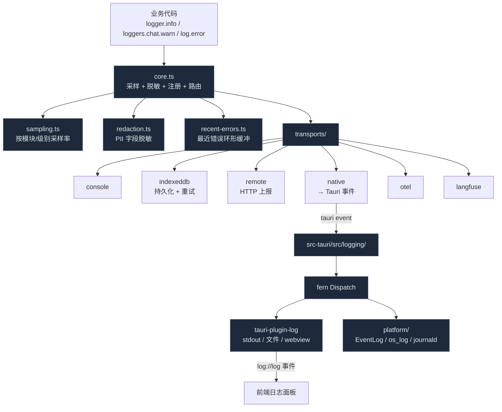

# 可观测性

Cognia 把"日志能去哪里、查得到哪条"这件事抽成一条统一管线：浏览器侧 `lib/logging/` 是单一入口，几路 transport（console / IndexedDB / remote / native / OTel / Langfuse）按运行时按需挂载；Rust 侧 `src-tauri/src/logging/` 接管 fern 分发 + tauri-plugin-log，把记录再镜像到 OS 平台日志器。这页讲清楚谁负责哪一层、日志怎么从一次 `logger.info(...)` 走到 Windows 事件查看器。

<TLDR>
  浏览器侧：`createLogger("module")` 拿到 `Logger`；调 `logger.info / warn / error / fatal` 时进入
  `core.ts` 的统一管线，做模块注册、采样、PII 脱敏、源位置抓取，然后扇出到注册过的
  transport。Transport 包括
  console、IndexedDB（在浏览器持久化）、remote（带重试队列）、native（Tauri
  事件桥）、OTel（OpenTelemetry）、Langfuse。Rust 侧用 `fern` + `tauri-plugin-log`
  把同一份记录分发到 stdout / 文件 / webview（回到前端）/ 平台日志器。设置 UI 实时切换 transport
  与采样率；日志面板 `components/logging/log-panel.tsx` 聚合多源记录、支持过滤分组导出。
</TLDR>

## 总览



## 浏览器侧入口

`lib/logging/index.ts` 暴露三组消费方式：

```ts title="lib/logging/index.ts"
// 1) 默认 app logger
import { logger } from "@/lib/logging"
logger.info("ready")

// 2) 模块化 logger（25 个常用模块预创建）
import { loggers } from "@/lib/logging"
loggers.chat.warn("retry", { attempt: 2 })
loggers.tts.error("synthesis failed", err)

// 3) 自定义模块
import { createLogger } from "@/lib/logging"
const log = createLogger("my-feature")
```

`loggers` 预创建的模块：`app · ai · chat · agent · mcp · plugin · native · ui · store · network · auth · error · media · scheduler · search · document · export · skills · sync · screenshot · tts · shell · canvas · a2ui`。所有模块共享同一份 transport 配置 —— `createLogger` 只是给条目打上 `module` 标签，不影响路由。

`log` 是面向脚本式调用的快捷函数（`log.info / log.debug / ...`），内部走的就是默认 logger。

## 日志条目结构

`StructuredLogEntry` 是统一对象，traced 后通过 transport 链：

```ts title="lib/logging/types.ts"
export interface StructuredLogEntry {
  id: string // 唯一 id
  timestamp: string // ISO
  level: LogLevel // trace | debug | info | warn | error | fatal
  message: string
  module: string // createLogger 时绑的标签
  traceId?: string // 跨请求关联
  requestId?: string // 单次操作关联
  origin: LogOrigin // frontend | tauri | mcp | plugin | ...
  runtime: LogRuntime // browser | tauri | server | mcp | plugin
  source?: { file; line; function } // 仅 dev
  data?: Record<string, unknown>
  error?: { name; message; stack }
  // 多字段省略
}
```

`LEVEL_PRIORITY` 把级别映射成数字 0..5，`minLevel` 过滤靠它实现。

## 上下文 / Trace ID

`lib/logging/context.ts` 维护一个隐式上下文：

```ts title="lib/logging/context.ts"
logContext.newTraceId()
logContext.set({ userId: "u_123" })
logger.info("processing") // 自动带上 traceId + userId

await traced(async () => {
  // 在闭包内重置 trace
  // ...
})
```

`generateTraceId()` 用 base36 短 id，足够开发期看清"哪几条日志属于同一次 send"。

`lib/logging/runtime.ts` 推断当前运行时（`browser / server / tauri / mcp / plugin / internal / unknown`），自动塞进每条 entry，便于在面板上按 origin 着色。

## 采样

`sampling.ts` 让"高频但低价值"的日志不被淹没：

- 全局 `samplingRate(level)` 给每个级别一个 0..1 概率。
- `configureSampling({ trace: 0.01, debug: 0.1, info: 1, warn: 1, error: 1, fatal: 1 })` —— 默认 trace 1%、debug 10%、其余 100%。
- 命中后才进 transport，否则直接丢弃。

`logSampler` 是单例，运行期可改 —— 设置 UI 的"日志采样率"滑块直接调它。

## 脱敏

`redaction.ts` 在写出前扫描 `data` / `error.message`：

- 字段名匹配（`password / token / apiKey / authorization / cookie / sessionId / secret / ...`）→ 值替换为 `[REDACTED]`。
- 正则匹配（邮箱、phone、JWT）→ 用 placeholder。
- `LoggerRedactionConfig` 允许逐项关闭，方便在隔离环境调试。

脱敏发生在 transport 之前，意味着即使 IndexedDB / 远端备份意外外泄，敏感字段也不存在。

## 最近错误缓冲

`recent-errors.ts` 在内存里持有最近 N 条 `error / fatal` 级别记录（默认 50），通过 `subscribeRecentErrorLogs(cb)` 派发给监听者。状态栏的红点 + Toast 提示就靠它。

`clearRecentErrorLogs()` 在用户点"已知悉"时清空。

## Transports

每个 transport 是 `Transport` 接口的实现：

```ts
interface Transport {
  name: string
  enabled: boolean
  minLevel?: LogLevel
  write(entry: StructuredLogEntry): Promise<void> | void
  flush?(): Promise<void>
  health?(): TransportHealthSnapshot
}
```

### ConsoleTransport

`transports/console-transport.ts` —— 直接调 `console.debug / log / warn / error`。彩色 prefix，dev 下含源位置链接。

### IndexedDBTransport

`transports/indexeddb-transport.ts` —— 把每条 entry 写入 IndexedDB（独立于 Dexie 主库的 `logs` 表）。带容量上限 + LRU 清理。这是日志面板默认查询源 —— 即使应用关掉再开，最近的日志还能看到。

### RemoteTransport

`transports/remote-transport.ts` —— HTTP POST 上报到外部 logging endpoint。带：

- **重试队列**（`remote-retry-queue-store.ts`） —— 网络抖动时落 IndexedDB，恢复后批量重发。
- **转换函数** —— `sentryTransform` / `logglyTransform` 把统一 entry 转成各服务的字段名。
- **健康状态** —— 连续失败 → `degraded` → `unhealthy`；UI 红点。

### NativeTransport

`transports/native-transport.ts` —— 不写本地，发 Tauri 事件 `log://log` 给 Rust。Rust 那侧由 fern 接管再分发。这是浏览器→桌面单向通道。

### OTelTransport

`transports/otel-transport.ts` —— 把 `error` 级别条目转成 OpenTelemetry log records，发到配置的 OTLP collector。`lib/observability/` 同时提供 metrics / traces；详见下文 [OpenTelemetry 薄壳](#opentelemetry-薄壳)。

### LangfuseTransport

`transports/langfuse-transport.ts` —— 专门为 LLM 调用准备的可观测层；把 traceId 关联的 `ai / chat / agent` 模块日志映射成 Langfuse trace + observation。`lib/logging/loggers.ai` 通常配 Langfuse。

## Rust 侧分发

`src-tauri/src/logging/` 负责把所有"native"日志（来自 Rust 自身 + 来自 webview 的 `NativeTransport` 事件）落到该落的地方：

```rust title="src-tauri/src/logging/mod.rs"
pub fn bootstrap(app: &App) -> Result<(), Box<dyn std::error::Error>> {
    let plan = native_bootstrap::plan_native_logging_bootstrap(true);
    let mut builder = LogBuilder::default().level(log::LevelFilter::Info);
    for target in plan.targets() {
        builder = builder.target(target);
    }
    builder = builder.target(platform::dispatch_target());
    app.handle().plugin(builder.build())?;
    native_bootstrap::apply_native_logging_bootstrap(&plan);
    Ok(())
}
```

### Bootstrap 模式

`native_bootstrap.rs` 在启动期决定三种模式：

| Mode       | 何时生效                         | 激活 targets                            |
| ---------- | -------------------------------- | --------------------------------------- |
| `Full`     | 默认                             | `stdout + folder + webview`（三者全开） |
| `Fallback` | `folder` 无法准备（权限 / 磁盘） | `stdout + webview`                      |
| `Disabled` | `should_register == false`       | 无                                      |

`NativeLoggingReadiness` 暴露给前端（`logging::commands` 提供 Tauri 命令），日志面板可显示"持久化失败，已降级到内存"之类的诊断。

### 平台桥

`platform/{windows,macos,linux,noop}.rs` 实现 `PlatformLogger` trait：

- **Windows** —— `Windows Event Log`（Application channel；source `Cognia`）。
- **macOS** —— `os_log`（subsystem `com.cognia.app`）。
- **Linux** —— 优先 `systemd-journald`，回退到 `syslog`。
- **noop** —— Android / iOS 占位（cognia-next 仅桌面）。

`dispatch_target()` 返回一个 fern `Output`，把每条记录转成平台调用。`min_level` 默认 `warn` —— 不污染 OS 日志。

### Webview 回流

`tauri-plugin-log` 的 `webview` target 通过 `log://log` 事件把 Rust 侧记录（包括子进程 sidecar / shell 的捕获输出）反向送回前端。前端的 `useLogStream` hook（`hooks/logging/`）订阅这个事件，让日志面板能看到 Rust 段的内容。

## OpenTelemetry 薄壳

`lib/observability/` 在 cognia-next 是 `@opentelemetry/api` 的极简包装：

- `chart-config.ts` —— Recharts 图表用的颜色 / 边距常量（不是 OTel，但和监控 UI 同一域）。
- `format-utils.ts` —— `formatTimestamp / formatBytesCompact / formatRate / formatTokens` 几个面板用的格式化工具。

完整 metrics / traces 通过 `lib/logging/transports/otel-transport.ts` 提交。AI provider 调用、Twin 流水线、调度器执行都会 emit span，dev 控制台可见。这一层目前是占位形态，留待接入完整 OTLP backend 后扩展。

## 日志面板 UI

`components/logging/log-panel.tsx` 是统一查看器，从 `useLogStream / useLogModules / useAgentTraceAsLogs / useTransportHealth` 几个 hook 聚合多源：

| 子组件               | 职责                                            |
| -------------------- | ----------------------------------------------- |
| `LogPanelToolbar`    | 视图模式 / 搜索 / 过滤器 / 导出动作             |
| `LogPanelStatsBar`   | 各级别计数、transport 健康、原生日志诊断        |
| `VirtualizedLogList` | 大列表虚拟化（react-window）                    |
| `LogDetailPanel`     | 单条 entry 详情（含 stack、source、data 折叠）  |
| `LogStatsDashboard`  | 按模块 / 级别的聚合图表（用 `chart-config.ts`） |
| `LogTimeline`        | 密度时间线，按分钟级 bucket                     |
| `LogFilterPresets`   | 预设过滤："最近错误" / "调度器" / "agent trace" |
| `LogSettings`        | transport / 采样 / 保留策略的实时切换           |

`AGENT_TRACE_MODULE` 是 `lib/agent-trace/log-adapter` 暴露的虚拟模块名 —— agent 团队的步骤事件会被映射成 log entry 一起呈现，方便和系统日志同窗对照。

时间范围预设：`15m / 1h / 6h / 24h / 7d`，由 `TIME_RANGES` 常量定义。

## Bootstrap 与配置

`bootstrap.ts` 在 `LoggerProvider`（`app/layout.tsx` 中）启动期调用：

```ts title="lib/logging/bootstrap.ts"
export function bootstrapLogger(settings: AppSettings) {
  // 1. applyLoggingSettings → 同步 minLevel / sampling / 启用的 transport
  // 2. 注册 transport：console 总开，indexeddb 默认开，其余按设置
  // 3. 设置变更时通过 listRegisteredTransports + addTransport/removeTransport 增量更新
}
```

存储 key：

- `LOGGING_TRANSPORTS_STORAGE_KEY` —— 每个 transport 的启用 / minLevel / 配置 JSON。
- `LOGGING_RETENTION_STORAGE_KEY` —— IndexedDB 容量上限、自动清理周期。
- `LOGGING_SAMPLING_STORAGE_KEY` —— 各级别采样率。

`getLoggingBootstrapState()` 暴露当前快照给设置 UI。

## 健康监控

每个 transport 都可暴露 `TransportHealthSnapshot`：

```ts
{
  status: "healthy" | "degraded" | "unhealthy" | "disabled",
  lastSuccessAt?: string,
  lastFailureAt?: string,
  consecutiveFailures: number,
  message?: string,
}
```

`getTransportHealthSnapshot()` 一把拉所有 transport 的状态。`emitLoggerDiagnostic()` 在 transport 内部出错（带 cooldown，避免雪崩）时回写到 `logger.internal` 模块 —— 这是唯一允许的递归路径。

## 关联文档

<Cards>
  <Card title="开发" href="./development" description="本地调试 + 在浏览器/Tauri 控制台读日志" />
  <Card title="插件系统" href="./plugin-system" description="插件日志走哪个 origin" />
  <Card title="存储" href="./storage" description="IndexedDB 里日志表的位置" />
  <Card title="运行时 & Tauri" href="./runtime-and-tauri" description="log://log 事件 + 命令接口" />
</Cards>

## 在哪里入手

| 目标                 | 文件                                                                                                                             |
| -------------------- | -------------------------------------------------------------------------------------------------------------------------------- |
| 加新 transport       | 在 `lib/logging/transports/<name>-transport.ts` 实现 `Transport` → 在 `transports/index.ts` 导出 → 在 `bootstrap.ts` 注册路径添加 |
| 调默认采样率         | `lib/logging/sampling.ts:DEFAULT_SAMPLING_CONFIG`                                                                                 |
| 新增脱敏字段         | `lib/logging/redaction.ts` 的字段名表 + 正则表                                                                                    |
| 改 Rust → 平台日志桥 | `src-tauri/src/logging/platform/<os>.rs`                                                                                         |
| 日志面板新过滤维度   | `lib/logging/filter-presets.ts` + `hooks/logging/use-log-panel-filters.ts`                                            |
| OTLP collector 配置  | `lib/logging/transports/otel-transport.ts` + 启动期 env                                                                           |
