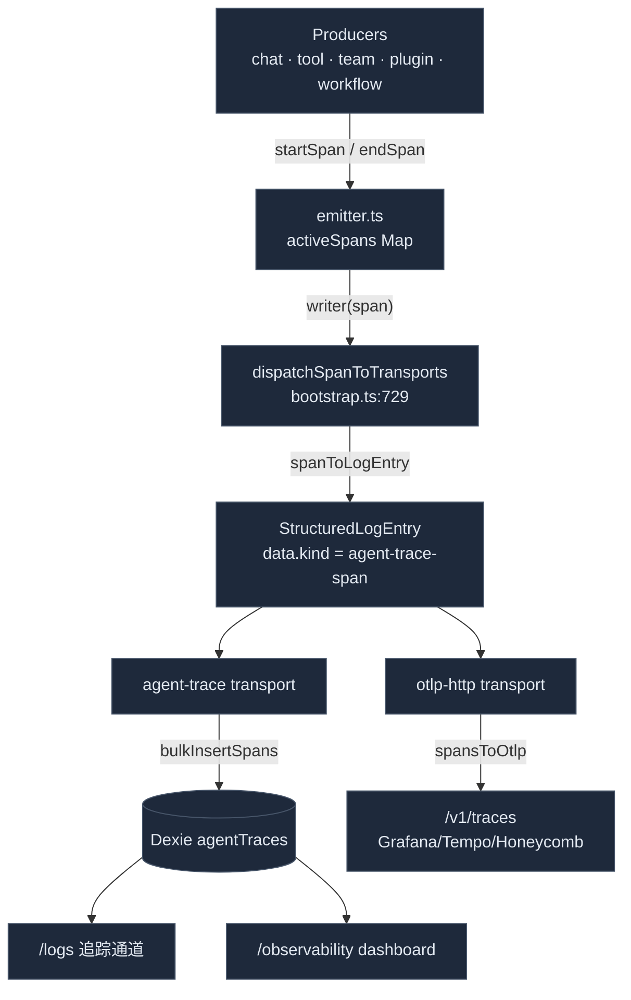

# Agent-Trace Span

<Status variant="stable" />

<TLDR>
  Agent-trace 是一条纯 TS 的 span 流水线。`lib/agent-trace/emitter.ts` 在一个
  `Map<spanId, AgentTraceSpan>` 中缓存进行中的 span；`startSpan` → `recordEvent` → `endSpan` 把
  完成的 span 交给一个已注册的 writer。`lib/logging/bootstrap.ts` 把该 writer 接到
  `dispatchSpanToTransports`，后者将 span 转换为一个 `StructuredLogEntry`（`spanToLogEntry`）并
  扇出到各传输 —— **agent-trace** 传输把它持久化到 Dexie 的 `agentTraces` 表，而 **otlp-http**
  传输则把它导出到 `/v1/traces`。Span 形如 OTel-GenAI（`gen_ai.*` semconv）。生产方：
  每个聊天回合（`invoke_agent`）、每次工具调用（`execute_tool` 子 span）、团队交接、插件
  钩子，以及工作流 LLM 节点。消费方：[日志面板](./log-panel)的追踪通道与
  [追踪仪表盘](./tracing-dashboard)。
</TLDR>

<StatGrid>
  <Stat label="操作" value="5" hint="invoke_agent · execute_tool · chat · invoke_workflow · retrieval" />
  <Stat label="Provider" value="6" hint="anthropic · openai · cognia.plugin/team/connector/workflow" />
  <Stat label="Surface" value="5" hint="chat · agent-team · plugin-hook · connector · workflow" />
  <Stat label="生产方" value="6" hint="聊天回合 · 工具调用 · 团队 · 外部 agent · 插件钩子 · 工作流节点" />
  <Stat label="Dexie 表" value="agentTraces" hint="v55；按 trace/session/parent/surface 建索引" />
  <Stat label="导出格式" value="OTLP/HTTP JSON" hint="无依赖，gen_ai semconv" />
</StatGrid>

## Span 模型

`AgentTraceSpan`（`types/agent-trace/span.ts:65`）是被持久化的行 —— 字段名简短、对 JS 友好，
OTel 映射则推迟到 OTLP 转换器中处理：

```ts title="types/agent-trace/span.ts:65"
export interface AgentTraceSpan {
  id: string                 // primary key — same as spanId
  traceId: string            // 32-hex (16 bytes)
  spanId: string             // 16-hex (8 bytes)
  parentSpanId?: string
  startTime: number; endTime?: number; durationMs?: number
  operationName: SpanOperationName   // invoke_agent | execute_tool | chat | invoke_workflow | retrieval
  providerName: SpanProviderName     // anthropic | openai | cognia.plugin/team/connector/workflow
  requestModel?: string; responseModel?: string
  agentId?: string; agentName?: string; toolName?: string
  usage?: SpanUsage          // { inputTokens, outputTokens, cacheCreationTokens, cacheReadTokens }
  costUsdEstimate?: number; finishReasons?: string[]
  errorType?: string; errorMessage?: string
  sessionId: string; surface: SpanSurface; pluginId?: string
  handoff?: SpanHandoff      // { fromAgent, toAgent, reason? }
  events?: SpanEvent[]       // { name, at, attributes? }
  inputPreview?: string; outputPreview?: string   // opt-in, PII-gated
  metadata?: Record<string, unknown>
}
```

`AGENT_TRACE_SPAN_KIND = "agent-trace-span"`（`span.ts:120`）是嵌入到
`StructuredLogEntry.data` 中的判别符，使各传输能够识别 span 形态的条目。Dexie 的 `agentTraces`
表（v55）按 `id`(pk)、`sessionId`、`[sessionId+startTime]`、`traceId`、
`[traceId+startTime]`、`parentSpanId` 和 `surface` 建索引。

## 发射器

```ts title="lib/agent-trace/emitter.ts (the lifecycle)"
const h = startSpan({ operationName: "invoke_agent", providerName: "anthropic",
  surface: "chat", traceId, sessionId })          // → SpanHandle { spanId, traceId }
recordEvent(h.spanId, { name: "tool_call", at: Date.now() })
endSpan(h.spanId, { usage, costUsdEstimate, outputPreview })
```

`endSpan`（`emitter.ts:165`）是幂等的，且绝不向调用方抛出 —— writer 错误会被
吞掉：

```ts title="lib/agent-trace/emitter.ts:165"
export function endSpan(spanId: string, input: EndSpanInput = {}): AgentTraceSpan | null {
  const span = activeSpans.get(spanId)
  if (!span) return null
  activeSpans.delete(spanId)
  span.endTime = input.endTime ?? Date.now()
  span.durationMs = Math.max(0, span.endTime - span.startTime)
  // …apply usage / cost / previews / error…
  if (writer) { try { writer(span) } catch { /* never throw into emitter */ } }
  return span
```

`emitFinishedSpan(partial)`（`emitter.ts:206`）是用于自测量工作的一次性形式（插件
钩子用它）。`generateTraceId()`（16 字节）/ `generateSpanId()`（8 字节）生成十六进制 id。
`setAgentTraceWriter(fn)` 注册接收端 —— 在 `lib/logging/bootstrap.ts:660` 接到
`dispatchSpanToTransports`。

## 流水线



## 生产方

Span 在精心挑选的边界处被植入（与 perf 热点注册表同一哲学）：

| 生产方 | Span | 调用点 |
| --- | --- | --- |
| **聊天回合** | `invoke_agent` / `anthropic` / `chat`；traceId+spanId 回写进 `SendOptions` | `hooks/chat/use-claude-chat.ts:855`（start）、`:1534`（success）、`:1257`（`turn_error`） |
| **聊天工具调用** | `execute_tool` 子 span，父挂在该回合下 | `chat-tool-spans.ts:138`，经 `handleSdkEventForToolSpans`（`use-claude-chat.ts:1400`） |
| **Agent Team 派发** | `invoke_agent` / `cognia.team` / `agent-team` | `lib/ai/agent/team/dispatch-teammate.ts:246`（start）、`:290`（带 usage 的 success） |
| **外部 agent 桥接** | `invoke_agent`，provider 由协议决定，带 `handoff` | `lib/ai/agent/external/agent-trace-bridge.ts:74` |
| **插件钩子** | `execute_tool` / `cognia.plugin` / `plugin-hook`，自测量 | `lib/plugin/messaging/hooks-system.ts:125`（`emitFinishedSpan`） |
| **工作流 LLM 节点** | `chat` / `cognia.workflow` / `workflow` | `lib/workflow/nodes/built-ins.ts:308`（`ai.classify`/`ai.extract` 经此委派） |

`chat-tool-spans.ts` 把 Claude SDK 的 `tool_use`/`tool_result` 块桥接成子 span，以
`sessionId → tool_use_id → spanId` 为键；`mcp__` 前缀的工具名映射到 provider `cognia.plugin`，
其余映射到 `anthropic`。

## 转换器

**span → log entry**（`span-to-log-entry.ts:51`）—— 日志面板从不见到原始 span；完整的 span
被塞进 `data.span`：

```ts title="lib/agent-trace/span-to-log-entry.ts:51"
export function spanToLogEntry(span: AgentTraceSpan): StructuredLogEntry {
  const isError = Boolean(span.errorType || span.errorMessage)
  return {
    id: span.id,
    timestamp: new Date(span.startTime).toISOString(),
    level: isError ? "error" : "info",
    message: formatSpanMessage(span),
    module: AGENT_TRACE_MODULE,       // "agent.trace"
    traceId: span.traceId, sessionId: span.sessionId,
    data: { kind: AGENT_TRACE_SPAN_KIND, span },
    tags: buildSpanTags(span),        // surface:… op:… provider:… tool:… error:…
  }
```

`AGENT_TRACE_MODULE = "agent.trace"` 是日志面板"仅 agent trace"过滤的模块。
`extractSpanFromLogEntry` 是它的逆操作。

**span → OTLP**（`span-to-otlp.ts:95`）—— 遵循 OTel GenAI 语义约定外加 `cognia.*` 厂商属性，
序列化为无依赖的 OTLP/HTTP JSON `ResourceSpans`：
`gen_ai.operation.name`、`gen_ai.provider.name`、`gen_ai.conversation.id`（= sessionId）、
`gen_ai.request.model`、`gen_ai.usage.input_tokens` / `output_tokens` / `cache_read.input_tokens`、
`cognia.cost.usd_estimate`、`error.type`、`cognia.surface`、`cognia.handoff.*`。Trace/span id
经 `hexToBase64` 编码（16/8 字节）；时间为 `msToNanoString`。Scope 为
`{ name: "cognia.agent-trace", version: "1.0.0" }`。

## 成本 —— 一个桩，而非定价表

`cost-estimator.ts` 是故意做成的一个**桩** —— cognia-next 中没有 token→价格表。成本
来自生产方在 `costUsdEstimate` 中报告的任何值（SDK 报告一个合并的成本；
团队/工作流 span 将其透传）。该文件只**格式化**一个 USD 数字：

```ts title="lib/agent-trace/cost-estimator.ts:9"
export function formatCost(usd: number | null | undefined): string {
  if (typeof usd !== "number" || !Number.isFinite(usd)) return "—"
  if (usd === 0) return "$0"
  if (usd < 0.01) return `$${usd.toFixed(4)}`
  return `$${usd.toFixed(2)}`
}
```

## 消费方与持久化

`lib/db/agent-traces.ts` 是唯一触及 `agentTraces` 表的 DB 模块：

- **Writers**（由传输调用）：`insertSpan`、`bulkInsertSpans`。
- **Readers**：`queryRecent`（日志面板归并）、`queryByWindow`（仪表盘）、`queryByTrace`（追踪
  时间线 / 瀑布图）、`queryBySession`。
- **Aggregators**：`aggregateStatsAll` → `AgentTraceStatsSummary`（token/缓存/成本细分、
  `cacheHitRate = cacheRead/(input+cacheRead)`、`byModel`、`bySurface`）；`aggregateBySession` →
  按会话分析。
- **Lifecycle**：`pruneOlderThan`、`deleteSpansForSession`。

eval 子系统也会读取 span（`lib/ai/eval/targets/{chat,team,workflow}.ts` 经由
`queryByTrace` 组装样本）。

## 从哪里开始

| 目标 | 文件 |
| --- | --- |
| 为一个新边界插桩 | 从 `lib/agent-trace/emitter` 调用 `startSpan`/`endSpan`（或 `emitFinishedSpan`） |
| 新增一个 span 字段 | `types/agent-trace/span.ts` + 在 `span-to-otlp.ts` 中映射 + 在仪表盘中呈现 |
| 新增一个 OTLP 属性 | `lib/agent-trace/span-to-otlp.ts:182` 中的 `buildSpanAttributes` |
| 以不同方式持久化/聚合 | `lib/db/agent-traces.ts` |
