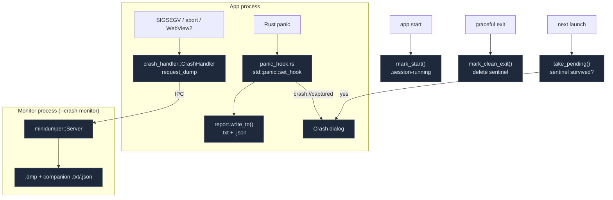

# 崩溃上报

<Status variant="stable" />

<TLDR>
  `src-tauri/src/crash/` 捕获两类故障。**Rust panic** 由进程内的 `std::panic::set_hook`
  （`panic_hook.rs`）捕获，写入一份 Minecraft 风格的 `.txt` 加一份结构化的 `.json`。**原生硬崩溃**
  （SIGSEGV、栈溢出、abort、WebView2）则在进程外捕获：一个兄弟监控进程持有一个 `minidumper::Server`，
  应用安装一个 `crash_handler::CrashHandler`，在发生故障时请求一份 `.dmp`。*下次启动* 是否弹出崩溃对话框，
  **并非**取决于是否存在报告，而是取决于一个干净退出**哨兵**（`.session-running`）—— 它在启动时写入、
  在优雅关闭时删除 —— 因此可恢复的 worker panic 永远不会触发误报。报告保存在
  `<data_local_dir>/Cognia/crash-reports/` 中。七个 `crash_*` 命令涵盖上下文摄入、列出/读取/删除，
  以及消费待处理的崩溃信号。
</TLDR>

<StatGrid>
  <Stat label="捕获路径" value="2" hint="in-process panic · out-of-process minidump" />
  <Stat label="报告文件" value=".txt + .json (+ .dmp)" hint="panic: txt+json; native: dmp+companion" />
  <Stat label="哨兵" value=".session-running" hint="干净退出标记 —— 判断“是否崩溃了？”的唯一真相源" />
  <Stat label="面包屑环形缓冲" value="50" hint="MAX_BREADCRUMBS (context.rs:15)" />
  <Stat label="Tauri 命令" value="7" hint="crash_set_context/push_breadcrumb/list/read/open/delete/take_pending" />
  <Stat label="存储位置" value="Cognia/crash-reports/" hint="与 Cognia/logs/ 同级" />
</StatGrid>

## 两条捕获路径



## Panic 钩子

`panic_hook.rs` 安装一个全局钩子（幂等，并链接前一个钩子），它捕获 payload、位置、线程名以及一份强制生成的
backtrace，然后写入报告并发出 `crash://captured`：

```rust title="src-tauri/src/crash/panic_hook.rs:20"
pub fn install() {
    if INSTALLED.swap(true, Ordering::SeqCst) { return; }
    let previous = std::panic::take_hook();
    std::panic::set_hook(Box::new(move |info| {
        let _ = std::panic::catch_unwind(std::panic::AssertUnwindSafe(|| write_report(info)));
        previous(info);
    }));
}
```

`write_report` 收集 `message`/`location`/`thread`/`backtrace`，再加上 `system_info::gather()`、
`context::snapshot()` 和 `app_extra()`，构建一个 `CrashReport { kind: Panic, … }`，并写入两个文件。
可恢复的 panic（例如自动化 worker 的 `catch_unwind`）在这里仍会写入报告，但**不会**弹出对话框 ——
那是哨兵的职责。

## Minidump 监控进程

`monitor.rs` 运行一个兄弟进程。`maybe_run_monitor()`（在 `main.rs` 中最先被调用）扫描 argv 寻找
`--crash-monitor <socket>`；如果存在，它会运行 `minidumper::Server` 循环并返回，使 `main` 在不启动应用的情况下
退出。否则，`install_client()` 派生出监控子进程、建立连接，并附加原生处理器：

```rust title="src-tauri/src/crash/monitor.rs:128"
let attach = crash_handler::CrashHandler::attach(unsafe {
    crash_handler::make_crash_event(move |cc: &crash_handler::CrashContext| {
        let _ = client_for_crash.ping();
        crash_handler::CrashEventResult::Handled(client_for_crash.request_dump(cc).is_ok())
    })
});
```

发生故障时，监控进程会写入 `<stem>.dmp`（`create_minidump_file`）以及一份配套的 `.txt`/`.json`
（`write_companion`），它由应用转发过来的最后一份 `KIND_META` 上下文构建而成，随后退出。

## 哨兵 —— 真相源

`sentinel.rs` 才是真正决定“是否崩溃了？”的角色。一个标记文件在启动时写入、在优雅关闭时删除；如果它存活到了下次启动，
就意味着发生了非正常退出：

```rust title="src-tauri/src/crash/sentinel.rs:64"
pub fn take_pending() -> Option<PendingCrash> {
    let path = sentinel_path()?;
    let raw = fs::read_to_string(&path).ok()?;
    let _ = fs::remove_file(&path);            // consume the stale marker
    let marker: SessionMarker = serde_json::from_str(&raw).ok()?;
    let (latest_report_stem, report_count) = scan_reports();
    Some(PendingCrash { started_at: marker.started_at, version: marker.version,
        latest_report_stem, report_count })
}
```

`take_pending()` 必须在 `mark_start()` **之前**运行。`scan_reports()` 在 `txt|json|dmp` 文件中找出最新的报告
stem 以及总数。

## 生命周期

<Steps>
<Step>**监控进程提前退出** —— `main.rs:7` `maybe_run_monitor()`：如果以 `--crash-monitor` 重新启动，则运行服务器循环并返回。</Step>
<Step>**安装原生处理器** —— `main.rs:14` `install_client()`：派生监控子进程，附加 `CrashHandler`。</Step>
<Step>**安装 panic 钩子** —— `main.rs:15` `install_panic_hook()`。</Step>
<Step>**检测过期哨兵** —— `lib.rs:850` `take_pending()`（读取并消费 `.session-running`）。在下一步之前运行。</Step>
<Step>**写入本次会话的哨兵** —— `lib.rs:851` `mark_start()`；将待处理结果暂存供对话框使用（`PendingCrashState`）。</Step>
<Step>**运行时上下文推送** —— 渲染端调用 `crash_set_context` / `crash_push_breadcrumb`（已脱敏），同时也会将 meta 转发给监控进程。</Step>
<Step>**发生崩溃时** —— panic → `write_report`（+ `crash://captured`）；native → 监控进程写入 `.dmp` + 配套文件。</Step>
<Step>**优雅关闭** —— `lib.rs:1091` `mark_clean_exit()` 删除哨兵。</Step>
<Step>**下次启动** —— `CrashReportDialog` 挂载，调用 `takePendingCrash()`（仅触发一次）；设置页可浏览所有报告。</Step>
</Steps>

## CrashReport 模型

```rust title="src-tauri/src/crash/report.rs:64"
#[serde(rename_all = "camelCase")]
pub struct CrashReport {
    pub kind: CrashKind,        // Panic | Native
    pub captured_at: String,
    pub thread: Option<String>,
    pub message: String,
    pub location: Option<String>,
    pub backtrace: Option<String>,   // skip if None
    pub dump_path: Option<String>,   // native only
    pub system: SystemDetails,
    pub context: ContextSnapshot,
    pub extra: serde_json::Value,    // { nativeLogging, crashReportsDir, logDir }
}
```

`render_txt` 排布出一个横幅、故障细节、backtrace、**System Details**、**Application State**、一个
**经脱敏的 Configuration** 块，以及 **Breadcrumbs**。stem 格式为
`crash-%Y-%m-%d_%H-%M-%S-{panic|native}`。`write_to` 在 `crash_reports_dir()`
（`<data_local_dir>/Cognia/crash-reports/`）下写入 `<stem>.txt` + `<stem>.json`。

### 主机快照（与 Perf 共享）

`system_info.rs::gather()` 构建 `SystemDetails`（OS/版本/内核/架构/CPU/内存/应用+Tauri 版本/构建配置/
已启用的 OCR 特性），由 Rust 自行收集，因此即使 webview 已死也能保留下来。它被
**perf 仪表盘复用**（`perf_system_details` → `crash::system_info::gather()`）。

### 面包屑上下文

`context.rs` 维护一个 50 条目的面包屑环形缓冲，外加一份经脱敏的配置快照，由渲染端推送并转发给监控进程，
这样一份原生崩溃报告仍能携带应用上下文：

```rust title="src-tauri/src/crash/context.rs:77"
pub fn publish_to_monitor() {
    let meta = crate::crash::report::MonitorMeta { context: snapshot(), extra: app_extra() };
    if let Ok(bytes) = serde_json::to_vec(&meta) {
        crate::crash::monitor::send_meta(&bytes);
    }
}
```

渲染端（`lib/native/crash-context.ts`）**在跨越边界之前进行脱敏** —— `pushCrashContext` 通过来自
`lib/twin/ingest/redact.ts` 的 `redactText` 对每个字符串做深度脱敏，这与应用其余部分使用的是同一个 PII 关卡。

## 命令与 UI

七个 `crash_*` 命令（`crash/commands.rs`，注册于 `lib.rs:469`）：`crash_set_context`、
`crash_push_breadcrumb`、`crash_list_reports`、`crash_read_report`、`crash_open_report_dir`、
`crash_delete_report`、`crash_take_pending`（`validate_stem` 防范路径穿越）。UI：

- `components/desktop/crash-report-dialog.tsx` —— **下次启动对话框**，挂载在
  `app/layout.tsx` 中；调用一次 `takePendingCrash()`，提供打开文件夹 / 查看报告。
- `components/settings/sections/native-crash-reports-card.tsx` —— 设置 → 诊断中的一个只读
  **报告浏览器**（类型徽章、捕获时间、扩展标志、查看/删除/打开文件夹）。

> 注意：`lib/logging/crash-log.ts` + `hooks/logging/use-crash-logs.ts` 是一套**独立的**、
> 渲染端的崩溃*日志*包（近期错误 + 持久化的 IndexedDB 日志 + 原生日志诊断 → 可导出、重新脱敏的导出）。
> 它们不调用 `crash_*` 原生命令；原生崩溃报告桥接是 `lib/native/crash-reports.ts` + `crash-context.ts`。

## 从哪里入手

| 目标 | 文件 |
| --- | --- |
| 从渲染端添加一条面包屑 | `pushCrashBreadcrumb(message)`（`lib/native/crash-context.ts`） |
| 更改报告布局 | `src-tauri/src/crash/report.rs` 中的 `render_txt` |
| 向主机快照添加内容 | `system_info::gather()`（同时也喂给 perf） |
| 调整崩溃对话框 | `components/desktop/crash-report-dialog.tsx` |
