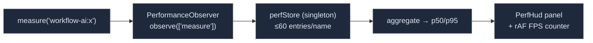

# 前端性能计时

<Status variant="internal" />

<TLDR>
  `lib/perf` 是一个面向浏览器的小型**开发/可选启用**埋点层 —— 与 Rust 的[性能仪表盘](./perf-dashboard)
  完全分离。`perf-marker.ts` 封装了标准的 W3C `performance.mark`/`measure` API（命名空间为
  `workflow-ai:`），让计时数据在 Chrome DevTools 中可见并可被聚合。`perf-hud.tsx` 是一个浮动 HUD，
  它通过 `PerformanceObserver` 订阅这些 measure，按名称聚合 p50/p95，并附带一个 rAF FPS 计数器 ——
  受 `localStorage.cogniaPerfHud="1"` 控制（开发模式下自动挂载）。`profiler-boundary.tsx` 将子树包裹在
  `React.Profiler` 中（仅非生产环境），并在每次 commit 时发出一条 `performance.measure`，在 HUD 中以
  `react:<id>` 行的形式呈现。
</TLDR>

<StatGrid>
  <Stat label="命名空间" value="workflow-ai:" hint="PERF_NAMESPACE (perf-marker.ts:14)" />
  <Stat label="HUD 启用标志" value="cogniaPerfHud=1" hint="localStorage；开发模式自动启用" />
  <Stat label="HUD 环形缓冲/名称" value="60" hint="MAX_ENTRIES_PER_NAME (perf-hud.tsx:27)" />
  <Stat label="生产环境行为" value="惰性" hint="profiler 返回 children；HUD 需要该标志" />
</StatGrid>

## W3C Marker API

`perf-marker.ts` 发出标准的 User-Timing 条目，做了特性检测且对 SSR 安全（每次调用都包裹在
try/catch 中）：

```ts title="lib/perf/perf-marker.ts"
import { mark, measure, measureRange } from "@/lib/perf"

mark("ai:send:start")
// …work…
mark("ai:send:end")
const ms = measure("ai:send", "ai:send:start", "ai:send:end")   // → number | undefined
```

所有名称都以 `workflow-ai:`（`PERF_NAMESPACE`）为前缀。`measureRange(name, startTime, endTime)` 是
profiler 边界使用的选项对象形式。`clearMeasuresByName(name)` 会清空 User-Timing 缓冲区，避免其无限制增长。
这些都是真实的 `performance.*` 条目 —— 在 Chrome DevTools 的 Performance 面板中可见 —— 与插件 profiler 的
`performance.now()` map 不同。

## 屏上 HUD

`perf-hud.tsx` 是一个浮动面板，实时聚合 `workflow-ai:*` 的 measure：



一个模块级单例 `perfStore` 为每个 measure 名称保留至多 `MAX_ENTRIES_PER_NAME = 60` 个采样，并在每次
observer 回调时清空 User-Timing 缓冲区。`isHudEnabledForRuntime()` 会排除 Capacitor 移动端，在开发模式下
自动挂载，并在生产环境中要求 `localStorage.cogniaPerfHud="1"`。`PerfHud()` 使用 `useSyncExternalStore`
订阅该启用标志，禁用时返回 `null`；`PerfHudInner` 渲染 p50/p95 表格，外加一个 rAF 驱动的 FPS 计数器以及
清空/关闭按钮。

## Profiler 边界

`profiler-boundary.tsx` 将一棵子树包裹在 `React.Profiler` 中（仅在非生产环境），并在每次 commit 时写入一条
measure：

```tsx title="lib/perf/profiler-boundary.tsx:24"
// onRender → measureRange(`react:${id}`, startTime, startTime + actualDuration)
<PerfBoundary id="chat-list">
  <ExpensiveTree />
</PerfBoundary>
```

在生产环境中它直接返回 children（零开销）。每次 commit 都会在 HUD 中呈现为一行 `react:<id>`，因此你可以在自己的
`workflow-ai:` measure 旁边观察某个组件的 commit 开销。

`lib/perf/index.ts` 重新导出了公开接口：`PERF_NAMESPACE`、`mark`、`measure`、`measureRange`、
`clearPerfEntries`、`PerfBoundary`、`PerfHud`。HUD 使用硬编码的英文字符串 —— 它是一项面向开发者的便利设施，
并未接入 i18n。

## 从哪里入手

| 目标 | 文件 |
| --- | --- |
| 为某段代码路径计时 | 从 `@/lib/perf` 引入 `mark`/`measure`（在 DevTools + HUD 中可见） |
| 观察某个组件的 commit 开销 | 用 `<PerfBoundary id="…">` 包裹它 |
| 在生产环境开启 HUD | `localStorage.cogniaPerfHud = "1"` |
