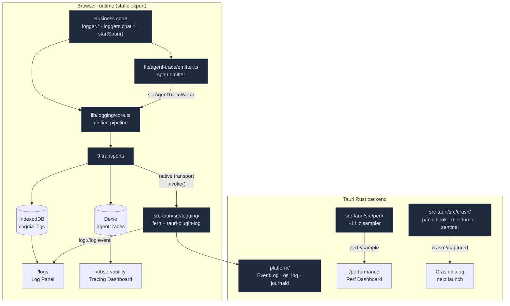

# 可观测性

<Status variant="stable" />

<TLDR>
  Cognia 的可观测性是**五个协作平面**，而不是一个日志盒子。(1) **日志（Logging）** ——
  `createLogger("module")` 进入单一的浏览器管道（`lib/logging/core.ts:404`：level-gate →
  sample → context-merge → redact → fan-out），写出到至多 9 个 transport；Rust 一侧
  （`src-tauri/src/logging/`）通过 `fern` + `tauri-plugin-log` 让相同的记录进入 OS
  logger（Windows Event Log / macOS `os_log` / Linux journald）。(2) **Agent-trace** ——
  `lib/agent-trace/emitter.ts` 为每一次聊天回合、工具调用、团队交接、插件 hook 以及工作流 LLM 节点发出
  OTel-GenAI 形状的 span；它们持久化到 Dexie 的 `agentTraces` 表，并可经
  OTLP/HTTP 导出。(3) **追踪仪表盘（Tracing dashboard）** —— `app/observability` 是一个 Grafana/Langfuse 风格的
  可拖拽面板网格（`lib/observability/` 是一个真实的百分位/分桶/汇总引擎），读取
  这些 span。(4) **性能（Performance）** —— `app/performance`（ADR-0035）是一个任务管理器风格的实时视图，展示
  Rust 进程树、Tokio 运行时和 span 热点，以约 1 Hz 经 `perf://sample` 采样。(5)
  **崩溃上报（Crash reporting）** —— `src-tauri/src/crash/` 在进程内捕获 Rust panic，在进程外
  捕获原生硬崩溃（minidump），由一个干净退出的 **sentinel（哨兵）** 门控。Token/成本用量
  （`lib/claude/usage.ts`、Anthropic 配额探测、收件箱遥测）补全了整幅图景。
</TLDR>

<StatGrid>
  <Stat label="路由" value="3" hint="/logs · /observability · /performance（+ 崩溃对话框）" />
  <Stat label="日志 transport" value="9" hint="console · indexeddb · remote · native · otel · otlp-http · langfuse · agent-trace · retry-queue" />
  <Stat label="健康状态" value="3" hint="healthy · degraded · offline（不是 'unhealthy'）" />
  <Stat label="原生日志后端" value="4" hint="Windows EventLog · macOS os_log · Linux journald/syslog · noop" />
  <Stat label="仪表盘面板" value="13" hint="5 种：stat · timeseries · donut · bar · traces" />
  <Stat label="Perf 事件速率" value="~1 Hz" hint="perf://sample，面板打开时引用计数" />
  <Stat label="崩溃捕获路径" value="2" hint="进程内 panic hook · 进程外 minidump" />
  <Stat label="i18n 命名空间" value="3" hint="logging · observability · performance" />
</StatGrid>

## 它是什么

cognia-next 里的“可观测性”是一切回答*“应用在做什么、出了什么错”*的东西 —— 横跨浏览器运行时、
Tauri Rust 后端、捆绑的 Node sidecar、插件以及外部 agent。由于应用以 **静态导出**
的形式发布、由 Tauri 和 Capacitor 包裹，设计因此干净地一分为二：任何需要 OS 级能力（真实的日志文件、Windows Event
Log、minidump 处理器、进程树）的东西都驻留在 Rust 里；浏览器拥有统一入口点、
IndexedDB 持久化和仪表盘。两半通过一小组 Tauri 命令和事件相遇。

这五个平面彼此足够独立，可以以任意顺序阅读，但它们共享一条脊柱：**带 `traceId` 的结构化
记录**。一次 `logger.info()` 和一个 agent-trace span 都携带 trace id，因此日志面板、追踪仪表盘
和崩溃报告都能被关联回单一的用户操作。

## 三条路由（外加一个对话框）

| 路由 | 平面 | 数据源 | 在 web 上可用？ |
| --- | --- | --- | --- |
| `/logs` | 日志面板 | IndexedDB（`cognia-logs`）+ agent-trace span + Rust `log://log` | 是 |
| `/observability` | 追踪仪表盘 | Dexie `agentTraces` 表 | 是（移动端也可） |
| `/performance` | 性能仪表盘 | Rust `perf://sample`（Tokio + 进程树） | **仅桌面端**（web 上为惰性说明页） |
| 崩溃对话框 | 崩溃上报 | Rust `crash_take_pending` + 报告文件 | 仅桌面端 |

## 五个平面

<Cards>
  <Card title="日志管道" href="./observability/logging-pipeline" description="lib/logging 核心：createLogger、core.ts 热路径、采样、脱敏、context/traceId、recent-errors、bootstrap。" />
  <Card title="Transports" href="./observability/transports" description="9 个 sink：console、IndexedDB（LRU）、remote（+ 持久重试队列）、native、OTel span-events、OTLP/HTTP、Langfuse、agent-trace（Dexie）。健康模型。" />
  <Card title="Rust 分发与 OS 桥接" href="./observability/rust-logging" description="src-tauri/src/logging：fern Dispatch、Full/Fallback/Disabled bootstrap 模式、PlatformLogger trait 及其四个后端、log://log 往返。" />
  <Card title="日志面板 UI" href="./observability/log-panel" description="components/logging + hooks/logging：多源查看器、@tanstack/react-virtual 列表、密度时间线刷选、trace 视图、Recharts 仪表盘、URL 同步、4-tab 设置。" />
  <Card title="Agent-trace span" href="./observability/agent-trace" description="lib/agent-trace：OTel-GenAI span 模型、emitter、谁产生 span（chat/tool/team/plugin/workflow），以及到日志条目和 OTLP 的转换器。" />
  <Card title="追踪仪表盘" href="./observability/tracing-dashboard" description="app/observability：Grafana/Langfuse 风格的面板网格。lib/observability 是一个真实引擎 —— 精确百分位、固定边界分桶、trace 汇总 + 瀑布、group-by 分解、阈值。" />
  <Card title="性能仪表盘" href="./observability/perf-dashboard" description="ADR-0035：Rust /performance 面板 —— 进程树 + Tokio RuntimeMetrics + 可选启用的 span 热点注册表（对数分桶直方图 p50/p95）、约 1 Hz 引用计数采样器。" />
  <Card title="前端性能计时" href="./observability/frontend-perf" description="lib/perf：W3C performance.mark/measure 辅助函数、屏上 PerfHud（PerformanceObserver）以及 React.Profiler 边界。开发期便利设施，区别于 Rust 仪表盘。" />
  <Card title="崩溃上报" href="./observability/crash-reporting" description="src-tauri/src/crash：panic hook（.txt + .json）、进程外 minidump 监视器、决定下次启动对话框的干净退出 sentinel、脱敏后的面包屑上下文。" />
  <Card title="用量与遥测" href="./observability/usage-and-telemetry" description="lib/claude/usage.ts 上下文窗口计算（4.6+ 为 1M）、每回合会话用量、Anthropic 配额探测，以及收件箱连接器遥测环形缓冲区。" />
</Cards>

## 设计不变量

- **唯一的状态枚举。** Transport 健康精确为 `healthy | degraded | offline`
  （`types/logging/transport.ts:8`）。任何地方都没有 `unhealthy` 状态 —— 早先文档中命名过该状态的
  都是错的。
- **脱敏先于 transport。** `redactStructuredLogEntry`（`lib/logging/redaction.ts:92`）在管道中、
  *任何* sink 看到记录*之前*运行，因此即便泄露了 IndexedDB 或 remote 备份也绝不会
  包含密钥。崩溃 bundle 会再次重新清洗，附加路径/URL 模式。
- **零空闲成本。** perf 采样器是引用计数的 —— 仅在 `/performance` 挂载时运行
  （`perf_start_sampling` / `perf_stop_sampling`），与 Windows 任务管理器使用的模型相同。日志
  采样丢弃高频低价值条目（`mouse` 按 1 %、`keyboard` 按 10 %），但绝不丢弃
  `error`/`fatal`。
- **浏览器是 offline-first 的。** 日志面板的实时更新来自跨标签页的
  `BroadcastChannel`（`cognia-logs-updates`），而非服务器。remote transport 保有一条*持久的*
  IndexedDB 重试队列，因此网络瞬断也不会丢失任何东西。
- **trace id 是连接键。** 日志、agent-trace span 和仪表盘瀑布都以
  `traceId` 为键；日志面板可以转入“仅此 trace”，仪表盘也从同一 id 下钻到 span
  瀑布。

## 相关文档

<Cards>
  <Card title="ADR 0035 — Rust 性能仪表盘" href="../adr/0035-rust-performance-dashboard" description="/performance 背后的决策记录。" />
  <Card title="运行时与 Tauri" href="../core/runtime-and-tauri" description="原生 logger 和 perf 采样器所搭乘的命令/事件桥。" />
  <Card title="插件系统" href="./plugin-system" description="插件日志携带哪种 origin，以及 perf.panel 扩展插槽。" />
  <Card title="存储" href="../data/storage" description="cognia-logs 和 agentTraces 表所在之处。" />
</Cards>
