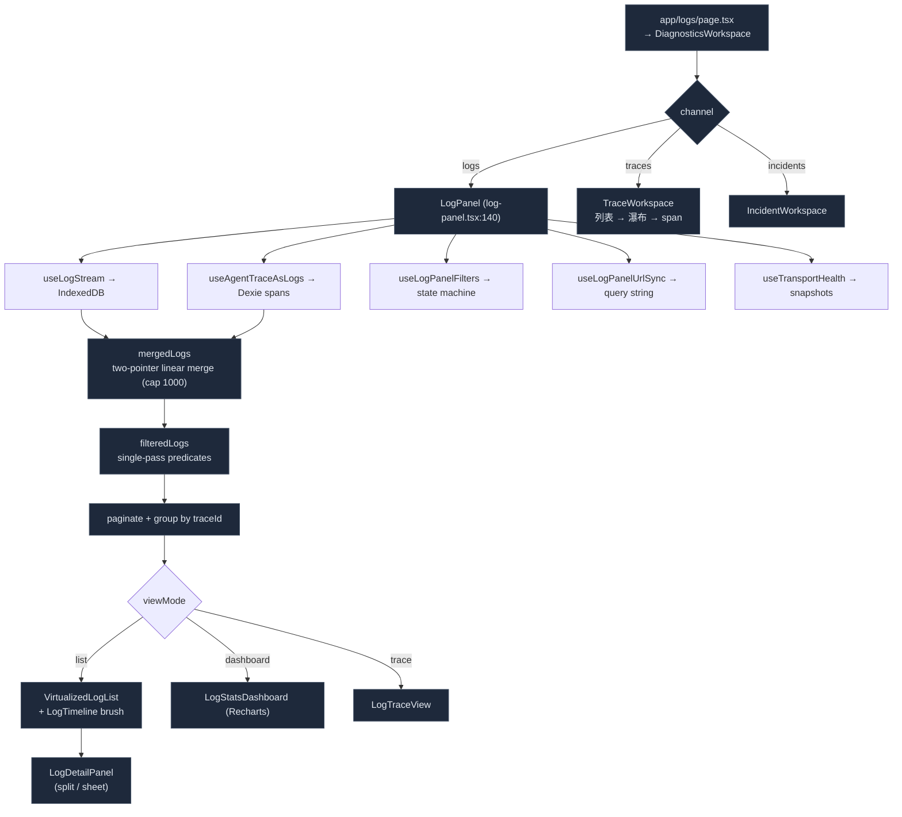

# 日志面板

<Status variant="stable" />

<TLDR>
  `/logs`（`app/logs/page.tsx`）渲染 `DiagnosticsWorkspace` —— 一个三通道外壳（**日志 / 追踪 /
  事故**），默认落在日志。日志通道即 `<LogPanel>`（`components/logging/log-panel.tsx:140`），即
  聚合五个记录源（frontend / tauri / mcp / plugin / internal）外加 agent-trace span 的
  组合根。它接入 `useLogStream`（IndexedDB）、`useLogPanelFilters`（那个大型状态
  机）、`useLogPanelUrlSync`、`useTransportHealth` 和 `useAgentTraceAsLogs`，对两条
  按时间戳排序的流做线性归并（`log-panel.tsx:214`），一遍过滤、分页，并在三种视图间
  切换：虚拟化**列表**（`@tanstack/react-virtual`）、Recharts **仪表盘**，以及一个
  **追踪**视图。一条带点击拖拽刷选的密度**时间线**位于列表上方。一切皆由键盘
  驱动，并通过 `history.replaceState` 镜像到 URL。整套使用的 i18n 命名空间是 `logging`。
</TLDR>

<StatGrid>
  <Stat label="视图模式" value="3" hint="list · dashboard · trace" />
  <Stat label="记录源" value="5" hint="frontend · tauri · mcp · plugin · internal" />
  <Stat label="虚拟化" value="@tanstack/react-virtual" hint="不是 react-window（log-virtualized-list.tsx:10）" />
  <Stat label="过滤维度" value="13" hint="level · module · source · session · time · trace · severity · bookmarks · density · …" />
  <Stat label="设置标签页" value="4" hint="levels · transports · advanced · retention" />
  <Stat label="实时更新" value="BroadcastChannel" hint="cognia-logs-updates，并非服务器" />
</StatGrid>

## 组合



`app/logs/page.tsx` 渲染 `DiagnosticsWorkspace`
（`components/logging/diagnostics-workspace.tsx`）—— 一个三通道外壳：**日志 / 追踪 / 事故**，
默认落在日志。通道状态存放在 `stores/logging/log-workspace-store.ts`（持久化，`version: 2`），
并镜像到 `?channel=`。

日志通道挂载 `<LogPanel showStats showTimeline includeAgentTrace>`。这里的 `includeAgentTrace`
过去是 `false`，一次性关掉了 span 归并、工具栏的追踪视图按钮和 `AgentTraceStatsBar`；现在已打开，
`agent.trace` 行会出现在日志流中，模块筛选芯片可将范围收敛到它们。

面板仍通过 `useLogPanelHeader()`（一个 React context）向传入 `headerSlot` 的宿主发布页头 API；
`/logs` 外壳自己拥有页头，因此计数徽标和预设下拉来自面板自带的工具栏。

由于外壳把 `channel` 和 `traceId` 与面板自身的参数一同放在查询串里，`useLogPanelUrlSync` 只重建
它自己拥有的键（`OWNED_PARAMS`）并原样保留其余参数 —— 从空 `URLSearchParams` 重建会在第一次
按键时丢掉宿主的参数。

### 追踪通道

`components/logging/trace-workspace.tsx` 组合的全部机件此前都已存在，只是无处安放：

| 栏 | 来源 |
| --- | --- |
| trace 列表 | `useTraceList` → `queryByWindow` + `rollupTraces`，在内存中筛选与分页 |
| 时间线 + 瀑布图 | 上方 `TraceTimeline`（基于 `buildTraceTimeline`），下方 `useTraceDetail` → `buildWaterfall` / `flattenWaterfall`，复用观测台的 `WaterfallRow`（现支持可选选中） |
| span 详情 | `TraceSpanDetail` —— 时间、模型、token/缓存/成本、结束原因、交接、事件、错误、经脱敏门的内容预览、元数据、各类 ID |

#### 时间线色带

`lib/observability/trace-timeline.ts` 把一条追踪的 span 投影到少数几条横向泳道上。瀑布图回答
「谁调用了谁」，时间线回答「它在什么时候做了什么」—— 一次带二十个工具调用的对话轮次，在前者是要
滚二十行，在后者是一眼看完。

| 控件 | 行为 |
| --- | --- |
| **刻度** | `duration`（真实耗时）或 `sequence`（每个 span 等宽一格）。当一条追踪里有一次 40 秒的模型调用和三十次亚毫秒工具调用时，只有 sequence 还能看。 |
| **分组** | 泳道按 `operation` / `surface` / `model` / `agent` 划分。操作分组按工作流转顺序排列（`invoke_agent → chat → execute_tool → retrieval → embeddings → invoke_workflow`），其余分组按繁忙度降序。 |
| **缩放** | 在色带上拖拽选取窗口。几何量以相对窗口的百分比给出，因此缩放不需要重新推导任何东西 —— 并且下方瀑布图会筛到同一窗口，而不是只在旁边跟着缩放。双击复位。 |
| **选中** | 点击色块即选中该 span，瀑布图与详情面板随之联动，反之亦然。 |
| **搜索** | 列表的查询词只会把不匹配的色块变暗而不移除，让筛选后的追踪仍保有它的形状。 |

span 的 `events[]` 会投影到同一坐标轴上成为刻点，嵌套深度决定色块明度，零耗时 span 也保有可点击的
最小宽度。

同一个 Grafana 式时间范围控件（`5m…30d` 加上可固定的自定义区间，`lib/observability/time-range.ts`）
同时驱动列表、瀑布图，以及该频道另一个子视图里的[追踪仪表盘](./tracing-dashboard)，因此头部数字与
下方行永远描述同一批数据——它们都是同一次 `useObservabilityData` 读取的折叠结果。筛选作用于整个窗口
而非当前页，这也是列表读取窗口而不是用 `queryRecentTraces` 分页的原因。

span 详情的**在日志中查看这条追踪**会切到日志通道并写入 `?trace=<id>`，同时重挂面板，让它的挂载期
URL 水合读到这个焦点。同一批 span 的聚合视图就在同一频道里一键之遥：「仪表盘」子视图
（`?channel=traces&view=dashboard`），也就是过去那个独立的 `/observability` 路由。

## 多源归并

面板持有两个已排序（时间戳降序）的数组 —— IndexedDB 日志和 agent-trace span ——
并以 O(n+m) 复杂度归并而无需重新排序，上限 1000：

```ts title="components/logging/log-panel.tsx:214"
for (let i = 0; i < limit; i++) {
  if (ai >= a.length) out[i] = b[bi++]
  else if (bi >= b.length) out[i] = a[ai++]
  else if (a[ai].timestamp >= b[bi].timestamp) out[i] = a[ai++]
  else out[i] = b[bi++]
}
```

`filteredLogs`（`:246`）是单次线性遍历，应用每一个谓词：允许的源、
源过滤、agent-trace 是否纳入、时间范围（预设或自定义）、`highSeverityOnly`、追踪聚焦、
会话、诊断传输过滤（module 必须为 `logger.internal` 且带 `data.sourceTransport`），
以及书签过滤。`getLogSource`（`:127`）根据每条记录的 `origin`/`runtime`/`module`
把它归类到五个源之一。

## IndexedDB 流

`useLogStream`（`hooks/logging/use-log-stream.ts`）是数据引擎 —— 从一个
模块级共享 `IndexedDBTransport` 增量拉取，并做过滤、分组以及派生 `stats` + `logRate`。在
`autoRefresh` 下它既轮询又订阅跨标签页广播：

```ts title="hooks/logging/use-log-stream.ts:195"
const unsubscribe = IndexedDBTransport.onLogsUpdated(() => {
  void fetchLogs()
  if (pollingTimerRef.current) clearInterval(pollingTimerRef.current)
  pollingTimerRef.current = setInterval(() => { void fetchLogs() }, interval)
})
```

`onLogsUpdated` 即 `cognia-logs-updates` 这个 `BroadcastChannel`（`indexeddb-transport.ts:448`）——
**唯一**的推送机制。字符串 `log://log` *不在*面板的数据路径中（它只出现在
一个运行时测试里）。`useLogModules()` 将已注册的模块名与 IndexedDB 统计的 module
键合并，使模块过滤器列出所有曾经记录过日志的对象。

## 虚拟化列表

`log-virtualized-list.tsx` 使用 `@tanstack/react-virtual` 的 `useVirtualizer`（不是 react-window）：

```ts title="components/logging/log-virtualized-list.tsx:87"
const virtualizer = useVirtualizer({
  count: filteredLogs.length,
  getScrollElement: () => scrollRef.current,
  estimateSize: () => rowHeight,
  overscan: 10,
})
```

行通过 `transform: translateY()` 绝对定位，并经由 `virtualizer.measureElement`
测量。密度决定行高（`compact:28 / comfortable:44 / spacious:60`）。
当 `groupByTraceId` 开启时，它按每个 trace 渲染 `<TraceGroup>`（不虚拟化）。每一行
（`log-entry.tsx`）展示图标/时间/模块/trace 徽标/消息，并带悬停操作（书签、聚焦
trace/会话、复制）、可展开的 `data`/`stack`/`source`，以及一个查询高亮的 `<mark>`。

## 密度时间线

`log-timeline.tsx` 绘制一条按严重程度着色的水平密度条（默认 60 个桶），带
点击拖拽刷选以过滤时间范围。刷选通过 ref 保持记忆化的瓦片稳定，使拖拽
不会重新渲染每一个桶：

```ts title="components/logging/log-timeline.tsx:280"
// mouseUp → onTimeRangeClick(buckets[startIdx].start, buckets[endIdx].end)
```

每个级别的迷你火花线位于主条之下。分桶在 `bucketCount` 个桶之间跨越
`max(maxTs - minTs, 1000)` 毫秒，把每条日志归类为 error/warn/info/other 以做不透明度缩放。

## 统计仪表盘

`log-stats-dashboard.tsx` 是 Recharts 分析视图：8 个汇总 `StatCard`，外加一个级别饼图、一个
堆叠面积量级图、一条错误趋势线、一个模块活动柱状图，以及一个 top-errors 列表。
`computeVolumeBuckets`（`:62`）以 5 分钟粒度分桶（上限 96 个桶）；
`computeErrorTrendData` 把窗口拆为当前/上一半以计算趋势箭头；`topErrors`
按 80 字符消息前缀对错误日志分组。颜色通过 `useThemeColors()` 解析（原始 oklch
字符串，因为 Recharts 无法在 SVG `fill` 中读取 CSS 变量）。

## 追踪视图与 Agent-Trace 树

`log-trace-view.tsx` 按 `traceId` 把日志分组成行（前缀、时长、级别计数、一个 SVG 事件
迷你时间线；没有 `traceId` 的日志被排除，`MAX_TRACES = 50`）。当详情面板在一个
agent-trace 条目上打开时，`agent-trace-tree.tsx` 从 Dexie 实时查询 `queryByTrace(traceId)` 并
渲染父→子 span 树（`buildTree` 将孤儿提升为根），带每个 span 的时长
条、模型、token 和成本。`agent-trace-stats-bar.tsx` 在一个 `today/week/month/all` 窗口上
经由 `aggregateStatsAll` 聚合成本/token/缓存命中/工具调用。它们是通往
[agent-trace](./agent-trace) 与[追踪仪表盘](./tracing-dashboard)两个平面的桥梁。

## 过滤、URL 同步与健康度

`useLogPanelFilters`（`hooks/logging/use-log-panel-filters.ts`）掌管整个过滤/视图/分页/
书签/预设/搜索历史/密度状态，由 localStorage 支撑（书签存于
`cognia-log-bookmarks`，密度存于 `cognia-log-density`，预设经由 `lib/logging/filter-presets.ts`）。
`useLogPanelUrlSync` 把该状态镜像到查询字符串 —— 挂载时读取一次（ref 保护），
通过 `window.history.replaceState` 写入（相对 `router.replace` 而言选它是为了静态导出构建）——
从而使一个过滤后的视图成为一个可分享的 URL。`useTransportHealth` 每 3 秒轮询
`getTransportHealthSnapshot()` + `getNativeLoggingReadiness()`，为统计条的火花线
保留一个 30 样本的队列深度历史。

## 设置

`log-settings.tsx` 是完整的配置 UI —— 四个 `forceMount` 标签页（**levels** 与采样、
**transports**、**advanced** 脱敏/队列/采样、**retention**）—— 读取
`getLoggingBootstrapState()`，并通过 `applyLoggingSettings({ …, persist: true })` +
`configureSampling` 写入。全部 8 个面向用户的传输都以折叠面板形式渲染，带每个传输的详情
表单（native min-level/batch、remote endpoint/retries、langfuse keys/host、OTel endpoint/service、
agentTrace capture/retention、agentTraceOtlp preset/Grafana-Cloud headers）。

## 键盘与入口

面板绑定了一个窗口级 `keydown` 处理器：`r` 刷新，`Esc` 关闭/清除，`d` 列表↔仪表盘，
`/` 聚焦搜索，`b` 书签，`g` 预设，`j/k` 或方向键移动焦点，`Enter`/`o` 打开详情，
`?` 快捷键。进入 `/logs` 的入口：设置链接卡片、托盘 `tray://open-logs` 操作、
View 菜单，以及全局的 <Kbd>Ctrl</Kbd>+<Kbd>Shift</Kbd>+<Kbd>L</Kbd>。

## 从哪里开始

| 目标 | 文件 |
| --- | --- |
| 新增一个过滤维度 | `hooks/logging/use-log-panel-filters.ts` + 在 `log-panel-toolbar.tsx` 中呈现 + 在 `use-log-panel-url-sync.ts` 中镜像 |
| 新增一个仪表盘图表 | `components/logging/log-stats-dashboard.tsx` |
| 更改行密度 / 高度 | `log-virtualized-list.tsx` 中的 `DENSITY_ROW_HEIGHTS` |
| 新增一个设置字段 | `components/settings/logs/panels/` 下对应的面板（+ 在 `hooks/logging/use-log-settings-draft.ts` 中加草稿字段，新增传输通道另需改 `bootstrap.ts`） |
