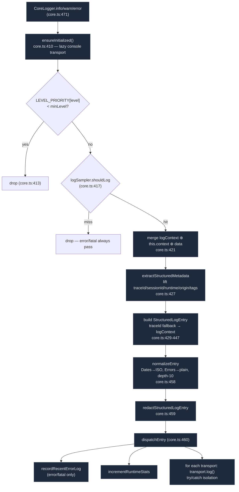

# 日志管道

<Status variant="stable" />

<TLDR>
  每一条浏览器侧的日志都流经同一个漏斗。`createLogger("module")`
  （`lib/logging/core.ts:713`）返回一个 `CoreLogger`；调用 `.info/.warn/.error/...` 会抵达
  私有热路径 `CoreLogger.log`（`core.ts:404`），它会：(1) 通过
  `LEVEL_PRIORITY` 按 `minLevel` 门控，(2) 询问 `logSampler.shouldLog`（error/fatal 始终通过），(3) 合并
  环境 `logContext` + 每-logger context + 调用数据，并将关联字段提升出来，(4) 构建一个
  `StructuredLogEntry`，(5) `normalizeEntry`（Date→ISO，Error→普通对象），(6)
  `redactStructuredLogEntry`，(7) `dispatchEntry` 以每-transport 的 try/catch
  隔离 fan-out 到每一个已注册的 transport。默认的 `logger` 和 25 个预制的 `loggers.*` 模块
  都共享这个漏斗 —— `createLogger` 只给 `module` 标签打标记。
</TLDR>

<StatGrid>
  <Stat label="预制模块" value="25" hint="loggers.app/ai/chat/agent/mcp/…（core.ts:133）" />
  <Stat label="日志级别" value="6" hint="trace0 debug1 info2 warn3 error4 fatal5（LEVEL_PRIORITY）" />
  <Stat label="热路径阶段" value="9" hint="init→gate→sample→context→build→normalize→redact→dispatch→stats" />
  <Stat label="Recent-error 环" value="100" hint="MAX_RECENT_ERROR_LOGS（recent-errors.ts:3）" />
  <Stat label="默认脱敏键" value="~15" hint="password/token/apiKey/authorization/cookie/secret/…（logger.ts:90）" />
</StatGrid>

## 入口点

`lib/logging/index.ts` 暴露三种消费模式，它们全都喂给同一个核心：

```ts title="lib/logging/index.ts"
// 1) Default app logger — createLogger("app") (index.ts:128)
import { logger } from "@/lib/logging"
logger.info("ready")

// 2) 25 pre-made modular loggers (index.ts:133)
import { loggers } from "@/lib/logging"
loggers.chat.warn("retry", { attempt: 2 })
loggers.tts.error("synthesis failed", err)

// 3) Custom module
import { createLogger } from "@/lib/logging"
const log = createLogger("my-feature")
```

这 25 个预制模块（`index.ts:133-159`）：`app · ai · chat · agent · mcp · plugin · native · ui ·
store · network · auth · error · media · scheduler · search · document · export · skills · sync ·
screenshot · tts · shell · canvas · a2ui · tray`。`app` 复用单例 `logger`；其余 24 个
是全新的 `createLogger(...)` 调用。`log`（`index.ts:164`）是委托给默认
logger 的简写。**`module` 标签是 `createLogger` 唯一改变的东西** —— 路由、采样和
transport 都是全局的。

## 日志条目契约

`StructuredLogEntry`（`types/logging/log-entry.ts:10`）是流经整个管道的单一对象：

```ts title="types/logging/log-entry.ts"
export interface StructuredLogEntry {
  id: string            // log-<base36>-<rand> (core.ts:62)
  timestamp: string     // ISO
  level: LogLevel       // trace | debug | info | warn | error | fatal
  message: string
  module: string        // bound at createLogger time
  traceId?: string      // cross-operation correlation
  requestId?: string; executionId?: string; workflowId?: string; stepId?: string
  runtime?: LogRuntime  // browser | server | tauri | mcp | plugin | internal | unknown
  origin?: LogOrigin    // frontend | web-runtime | tauri | mcp | plugin | diagnostic | unknown
  sessionId?: string
  data?: Record<string, unknown>
  stack?: string
  source?: { file?; line?; function? }   // dev only
  tags?: string[]
}
```

`LEVEL_PRIORITY`（`types/logging/log-level.ts:29`）映射 `{ trace:0, debug:1, info:2, warn:3, error:4,
fatal:5 }`；每一次 `minLevel` 比较和 recent-error 过滤都依赖它。

## 热路径

`CoreLogger.log`（`core.ts:404`）是每个条目穿过的漏斗：



两条承重的尾段 —— normalize/redact/dispatch 和隔离的 fan-out：

```ts title="lib/logging/core.ts:457"
// normalize -> redact -> dispatch
const normalized = normalizeEntry(entry)
const redacted = redactStructuredLogEntry(normalized, config.redaction)
dispatchEntry(redacted)
```

```ts title="lib/logging/core.ts:299"
const transports = [...runtimeState.transports.values()]
for (const transport of transports) {
  if (options?.skipTransports?.has(transport.name)) { continue }
  try { void transport.log(entry) }
  catch (error) {
    emitLoggerDiagnostic({
      code: "logger.transport.failed",
      // ...re-emits a guarded diagnostic that SKIPS the failed transport
      skipTransports: [transport.name],
```

某个 transport 抛出异常绝不会打断循环、也绝不会打断调用方；相反，logger 通过
`emitLoggerDiagnostic` 自我上报（见 [自诊断](#self-diagnostics)）。

## Trace-Id 上下文

`lib/logging/context.ts` 维护一个环境的、每标签页的关联上下文，热路径会把它合并进
每一个条目（`core.ts:421`）。session id 跨重载持久化：

```ts title="lib/logging/context.ts:37"
private initSessionId(): string {
  if (typeof window === "undefined") { return generateId() }
  const stored = sessionStorage.getItem("cognia-log-session-id")
  if (stored) { return stored }
  const newId = generateId()
  sessionStorage.setItem("cognia-log-session-id", newId)
```

- `logContext.newTraceId()` / `setTraceId(id)` / `clearTraceId()` 设置环境 trace id。
- `logContext.set({ userId })` 添加由后续每个条目携带的上下文字段。
- `traced(fn)`（`context.ts:151`）在一个全新的 trace id 下运行闭包，并在 `finally`
  中恢复先前的那个 —— agent-trace emitter 和聊天发送循环使用它，从而让一次用户操作产生
  一个 trace。

`generateTraceId()`（`context.ts:144`）和 `generateId()`（经 `crypto.getRandomValues` 生成的 32 位十六进制）让
id 保持短小且无依赖。`lib/logging/runtime.ts` 校验并自动标记 `runtime`/`origin`
对（`createLogRuntimeContext` 添加 `runtime:*` / `source:*` 标签），从而让面板能按 origin 上色。

## 采样

`lib/logging/sampling.ts` 防止高频、低价值的日志淹没信号。该
决策是按 `module:level` 进行的：

```ts title="lib/logging/sampling.ts:99"
shouldLog(module, level, _message?): boolean {
  if (level === "error" || level === "fatal") { return true }   // always pass
  const config = this.getConfig(module)
  // minInterval throttle, then burstLimit, then probability:
  return Math.random() < config.rate
}
```

默认值（`DEFAULT_SAMPLING`，`sampling.ts:23`）—— 注意对 UI 噪声的刻意抑制，以及对任何
安全相关项的 1.0 速率：

| 模块类别 | 速率 | minInterval |
| --- | --- | --- |
| `mouse` | 0.01 | 100 ms |
| `keyboard` | 0.1 | 50 ms |
| `scroll` | 0.05 | 100 ms |
| `animation` | 0.01 | 16 ms |
| `network` / `state` | 0.5 | — |
| `render` | 0.2 | — |
| `error` / `auth` / `security` | **1.0** | — |
| `default` | 1.0 | — |

`getConfig` 先做精确匹配，再做**前缀**匹配（`module.startsWith(key)`），最后回退到 `default`。一个
5 s 的去重窗口（`DEDUPE_WINDOW`）折叠完全相同的重复项。`logSampler` 是一个可变单例 ——
日志设置的“sampling”标签页通过 `configureSampling` 实时调整它。

## 脱敏

`redactStructuredLogEntry`（`redaction.ts:92`）在任何 transport 看到记录之前清洗 `message`、`stack` 和
`data`。它结合键名匹配与正则文本替换，并经由
一个 `WeakSet` 做到防环：

```ts title="lib/logging/redaction.ts:10"
function shouldRedactKey(key, config): boolean {
  const normalized = normalizeKey(key)   // lowercase, [\s-]+ → _
  return config.redactKeys.some((candidate) => {
    const target = normalizeKey(candidate)
    return normalized === target || normalized.includes(target)
```

默认键列表与模式位于 `DEFAULT_UNIFIED_CONFIG.redaction`（`types/logging/logger.ts:87`）：
`password / passwd / pwd / token / access_token / refresh_token / secret / api_key / apikey /
authorization / cookie / session / client_secret / private_key / bearer`，外加针对 `Bearer …`
token 和 `(api_key|token|secret) = …` 赋值的正则，`maxDepth: 8`。`LoggerRedactionConfig`
允许按调用退出脱敏，用于隔离调试。

## Recent-Error 环形缓冲区

`recent-errors.ts` 在内存中保有最后 100 条 `error`/`fatal` 条目并通知订阅者 ——
状态栏红点和 toast 警报从中读取。`dispatchEntry` 写入它（`core.ts:297`）：

```ts title="lib/logging/recent-errors.ts:18"
export function recordRecentErrorLog(entry): void {
  if (!isRecentErrorLevel(entry)) { return }
  recentErrorLogs = [entry, ...recentErrorLogs.filter((c) => c.id !== entry.id)].slice(
    0, MAX_RECENT_ERROR_LOGS )
  notifySubscribers()
```

最新优先，按 `id` 去重，上限为 `MAX_RECENT_ERROR_LOGS = 100`。
`subscribeRecentErrorLogs(cb)` 返回一个取消订阅函数；当用户确认时，`clearRecentErrorLogs()` 清空它。

## Bootstrap

`bootstrap.ts` 在 `LoggerProvider` 启动期间（位于 `app/layout.tsx` 内）运行一次。它读取四个
localStorage 键，初始化核心，并从设置注册/更新每一个 transport：

```ts title="lib/logging/bootstrap.ts (storage keys)"
LOGGING_TRANSPORTS_STORAGE_KEY = "cognia-logging-transports"   // per-transport enable/minLevel/config
LOGGING_RETENTION_STORAGE_KEY  = "cognia-logging-retention"    // IndexedDB capacity + age
LOGGING_CONFIG_STORAGE_KEY     = "cognia-logging-config"       // minLevel etc.
LOGGING_SAMPLING_STORAGE_KEY   = "cognia-logging-sampling"     // per-level/module rates
```

`applyTransportSettings`（`bootstrap.ts:541`）是增/删 fan-out —— 例如 console 是
无条件的，但 remote **仅当** `transports.remote` **与**一个非空的
`config.remoteEndpoint` **都**设置时才挂载（`bootstrap.ts:589`）。默认值（`DEFAULT_TRANSPORT_SETTINGS`，
`bootstrap.ts:70`）默认启用 console / indexedDB / native / remote / langfuse / opentelemetry /
agentTrace，并让 `agentTraceOtlp` 保持关闭。`bootstrap.ts` 还经由 `setAgentTraceWriter` →
`dispatchSpanToTransports`（`bootstrap.ts:660`）将 agent-trace emitter 接入 transport；
见 [Agent-trace span](./agent-trace)。

## 自诊断

`emitLoggerDiagnostic`（`core.ts:645`）是 logger 唯一被许可的递归路径 —— 它自我记录
进一个虚拟的 `logger.internal` 模块。它按 `code` 做限速（`diagnosticRateLimitMs`，默认 2000 ms，
下限 250 ms），并由 `isEmittingDiagnostic` 做可重入保护，因此一个失败的 transport
不会引发日志雪崩。日志面板把它们以 `internal` 源、用一种独特的颜色呈现。

## 从哪里开始

| 目标 | 文件 |
| --- | --- |
| 添加一个新的模块 logger | 直接调用 `createLogger("name")` —— 无需注册 |
| 改变某模块的采样 | `lib/logging/sampling.ts:DEFAULT_SAMPLING`（或设置 UI） |
| 添加一个脱敏字段 | `types/logging/logger.ts:87` 中的 `redactKeys` / `redactPatterns` |
| 添加一个新的 transport | 实现 `Transport`，在 `transports/index.ts` 中导出，在 `bootstrap.ts` 中注册 —— 见 [Transports](./transports) |
| 查看 trace 关联 | `lib/logging/context.ts`（`logContext`、`traced`） |
