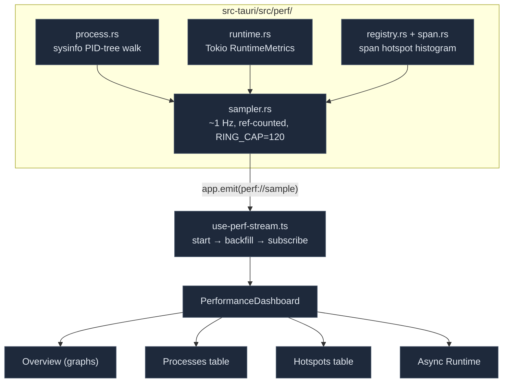

# 性能仪表盘

<Status variant="stable" />

<TLDR>
  `/performance`（ADR-0035）是 **Rust** 运行时的实时、任务管理器风格视图——仅限桌面端。
  Rust 子系统 `src-tauri/src/perf/` 以 ~1 Hz 频率通过 `perf://sample` 事件将三层组合成一个
  `PerfSample`：(1) 经 `sysinfo` 的**进程树**（`process.rs`），从 app 向下遍历 PID 树
  直到每一个后代进程，分类为 `main`/`sidecar`/`child`，CPU 归一化到
  0–100；(2) 经 `RuntimeMetrics` 的 **Tokio 运行时**（`runtime.rs`），通过对单调 busy 时长
  做差分得到头条的 worker busy %；(3) **span 热点**（`registry.rs` + `span.rs`）——一个
  进程级全局注册表，每个被插桩的 `&'static str` 累积 count/error/total/min/max
  外加一个固定**对数桶直方图**以得到近似 p50/p95。采样器是**引用计数**的——面板关闭时
  零成本。前端（`hooks/perf/use-perf-stream.ts` +
  `components/performance/`）start → 从 120 个样本的环形缓冲 backfill → subscribe，并渲染四个
  标签页：Overview、Processes、Hotspots、Async Runtime。
</TLDR>

<StatGrid>
  <Stat label="数据层" value="3" hint="进程树 · Tokio 运行时 · span 热点" />
  <Stat label="采样率" value="~1 Hz" hint="DEFAULT_INTERVAL_MS=1000, 限幅 250–10000" />
  <Stat label="事件" value="perf://sample" hint="sampler.rs:24 ↔ commands.ts:14" />
  <Stat label="Backfill 环" value="120" hint="RING_CAP（@1 Hz 约 2 分钟）" />
  <Stat label="直方图桶数" value="25" hint="2^i µs 桶 ≈ 33.6 s span (registry.rs:22)" />
  <Stat label="Tauri 命令" value="9" hint="perf_snapshot/start/stop/set_interval/hotspots/…" />
  <Stat label="仪表盘标签页" value="4" hint="Overview · Processes · Hotspots · Async Runtime" />
</StatGrid>

## 它为何存在

app 已经拥有日志、崩溃上报、前端性能计时以及一个 `dial9` Tokio 飞行
记录器。缺失的是一个*实时 Rust 运行时*视图：Rust 进程树此刻占用了多少 CPU/内存、
Tokio 运行时负载有多高，以及哪些后端操作较慢。ADR-0035 恰好补上了这点，
且不依赖进程内采样剖析器（基于信号的采样器如 `pprof-rs` 在 Windows 上不可用/不安全）——
而是将已有的 dial9 trace 文件暴露出来供离线分析，并提供一个实时 span 热点表用于归因。

## 架构



## 第 1 层——进程树

`process.rs` 采样当前 PID 加上每一个后代进程。它构建一个父索引，计算
后代集合（迭代式、防环），随后归一化 CPU 并从间隔推导出每秒磁盘字节数。
sidecar 检测以打包的 Node host 为关键字：

```rust title="src-tauri/src/perf/process.rs:64"
pub fn classify_role(pid: u32, current_pid: u32, name: &str, cmd: &[String]) -> ProcessRole {
    if pid == current_pid { return ProcessRole::Main; }
    let is_node = name.to_ascii_lowercase().starts_with("node");
    let runs_sidecar = cmd.iter().any(|a| a.contains("claude-host.mjs"));
    if runs_sidecar || (is_node && cmd.iter().any(|a| a.contains("sidecar"))) {
        ProcessRole::Sidecar
    } else { ProcessRole::Child }
}
```

```rust title="src-tauri/src/perf/process.rs:182"
cpu_pct: (cpu_raw / cores).min(100.0),   // normalized 0–100
cpu_pct_raw: cpu_raw,                      // raw sum, may exceed 100
mem_bytes: p.memory(),
disk_read_bps: (disk.read_bytes as f64 / secs) as u64,
disk_write_bps: (disk.written_bytes as f64 / secs) as u64,
run_secs: p.run_time(),
```

CPU 需要两次刷新，因此采样器会在首帧前 `prime()` 一个基线。每个
`ProcessSample` 携带 `pid/parentPid/name/role/cpuPct/cpuPctRaw/memBytes/diskReadBps/diskWriteBps/
runSecs`。Processes 标签页渲染一个可排序表格、一个 CPU 热力图、每 PID 的 CPU 迷你折线图，以及一个
内存占比条。

## 第 2 层——Tokio 运行时

`runtime.rs` 对 `RuntimeMetrics` 拍快照（完整表面之所以可用，是因为 `.cargo/config.toml`
为 dial9 设置了 `--cfg tokio_unstable`）。头条指标是 **worker busy %**，通过将
单调的每 worker busy 时长与上一个样本做差分计算得到：

```rust title="src-tauri/src/perf/runtime.rs:44"
pub fn compute_busy_pct(prev: &[Duration], cur: &[Duration], elapsed: Duration) -> (f64, Vec<f64>) {
    let elapsed_secs = elapsed.as_secs_f64();
    if elapsed_secs <= 0.0 || prev.len() != cur.len() || cur.is_empty() {
        return (0.0, vec![0.0; cur.len()]);
    }
    let per: Vec<f64> = cur.iter().zip(prev.iter()).map(|(c, p)| {
        ((c.saturating_sub(*p).as_secs_f64() / elapsed_secs) * 100.0).clamp(0.0, 100.0)
    }).collect();
    let mean = per.iter().sum::<f64>() / per.len() as f64;
    (mean, per)
}
```

`RuntimeSample` 还携带 `aliveTasks`、`globalQueueDepth`、`blockingThreads`、
`blockingQueueDepth`、`spawnedTasksCount`，以及汇总后的 `workerStealCount`/`workerParkCount`/
`workerOverflowCount`。Async Runtime 标签页将这些归入 Workers/Tasks/Queues/Throughput 卡片
外加每 worker 的 busy 迷你折线图，并列出 dial9 trace 文件（提供打开文件夹的入口）。

## 第 3 层——Span 热点

`registry.rs` 是一个以 `&'static str` 为键的进程级全局注册表。每个名字累积
count/error/total/min/max 外加一个固定**对数桶直方图**（25 个桶，桶 *i* 覆盖
`[2^i, 2^(i+1))` µs），给出无依赖、内存有界的近似分位：

```rust title="src-tauri/src/perf/registry.rs:73"
pub fn percentile_micros(&self, q: f64) -> u64 {
    if self.count == 0 { return 0; }
    let target = (q.clamp(0.0, 1.0) * self.count as f64).ceil().max(1.0) as u64;
    let mut cum = 0u64;
    for (i, &c) in self.buckets.iter().enumerate() {
        cum += c;
        if cum >= target { return bucket_upper_micros(i); }
    }
    bucket_upper_micros(HIST_BUCKETS - 1)
}
```

插桩（`span.rs`）是可选且符合人体工学的——一个 RAII guard 在 drop 时记录，因此在
`.await` 之间也安全：

```rust title="src-tauri/src/perf/span.rs:57"
impl Drop for Guard {
    fn drop(&mut self) {
        REGISTRY.record(self.name, self.start.elapsed(), self.ok);
    }
}
```

三种形态：`crate::perf::guard("name")`（RAII）、`timed(name, fut)`（可失败的 async，ok 取自
`is_ok()`），以及 `record(name, elapsed, ok)`（手动）。精心选取的边界是有意为之（`connector.send`、
`ocr.extract`、`vector.query`、…）——Tauri 中没有通用的命令中间件，因此覆盖面会随着
边界被插桩而增长。每个 `SpanSnapshot` 携带
`name/count/errorCount/totalMs/avgMs/minMs/maxMs/p50Ms/p95Ms/buckets`。Hotspots 标签页是一个可排序
表格，带一个总耗时相对条和一个对数桶分布迷你条形图。

## 采样器

`sampler.rs` 将全部三层组合成一个 `PerfSample` 并发出它；该循环是**引用计数**的，因此
面板关闭时没有成本：

```rust title="src-tauri/src/perf/sampler.rs:126"
let processes = proc_sampler.sample(interval_secs);
let runtime = rt_sampler.sample(&tokio::runtime::Handle::current().metrics());
let top_spans = REGISTRY.snapshot();
let system_memory = Some(proc_sampler.sample_system_memory());
// …assemble PerfSample…
handle.push(sample.clone());                       // bounded ring (RING_CAP=120)
if let Err(err) = app.emit(SAMPLE_EVENT, &sample) { /* warn */ }
```

一个 120 项的环为新打开的面板的滚动图表做 backfill。`PerfSample`
（`sampler.rs:34`）为 `{ tsMs, intervalMs, processes[], runtime, topSpans[], systemMemory }`，与
`lib/perf/backend/types.ts` 一一对应。

### 命令

九个 `perf_*` 命令（`perf/commands.rs`，注册于 `lib.rs:759`）：

| 命令 | 用途 |
| --- | --- |
| `perf_snapshot` | 环 + 运行标志 + 间隔 |
| `perf_start_sampling` / `perf_stop_sampling` | 引用计数的循环控制（面板挂载/卸载） |
| `perf_set_interval` | 更改间隔（限幅 250–10000 ms） |
| `perf_hotspots` / `perf_reset_hotspots` | span 快照（采样器关闭时也可用）/ 重置 |
| `perf_system_details` | 主机快照——复用 `crash::system_info::gather()` |
| `perf_list_traces` / `perf_open_trace_dir` | dial9 飞行记录器 trace 文件 |

## 前端流

`use-perf-stream.ts` 驱动仪表盘——启动后端循环、从快照环 backfill，
随后订阅实时样本，保持一个滚动的 120 样本窗口：

```ts title="hooks/perf/use-perf-stream.ts:73"
await perfStartSampling(DEFAULT_PERF_INTERVAL)
const snapshot = await perfSnapshot()
if (snapshot.samples.length > 0) setHistory(snapshot.samples.slice(-PERF_HISTORY_LIMIT))
unsubscribe = subscribePerfSample(append)
// cleanup: unsubscribe() + perfStopSampling()
```

Pause 冻结 UI 而不停止后端；`setIntervalMs` 也会调用 `perfSetInterval`。
`PerformanceDashboard` 渲染四个标签页（Overview / Processes / Hotspots / Async Runtime）外加一个
`perf.panel` 插件扩展槽，并通过一个仅限桌面的门控在 web/移动端渲染一个静态说明页。
`lib/perf/backend/{commands,export,format}.ts` 提供 `isTauri()` 门控的封装、JSON/CSV 导出，
以及纯函数格式化器。i18n 命名空间为 `performance`。

## 从哪里入手

| 目标 | 文件 |
| --- | --- |
| 插桩一个后端边界 | `crate::perf::guard("name")` / `timed(name, fut)`（`src-tauri/src/perf/span.rs`） |
| 更改采样间隔边界 | `src-tauri/src/perf/sampler.rs` 中的 `MIN/MAX_INTERVAL_MS` |
| 添加一个 perf 命令 | `src-tauri/src/perf/commands.rs` + 在 `lib.rs` 中注册 + 在 `lib/perf/backend/commands.ts` 中封装 |
| 添加一个仪表盘卡片/图表 | `components/performance/`（Recharts + `useThemeColors`） |
