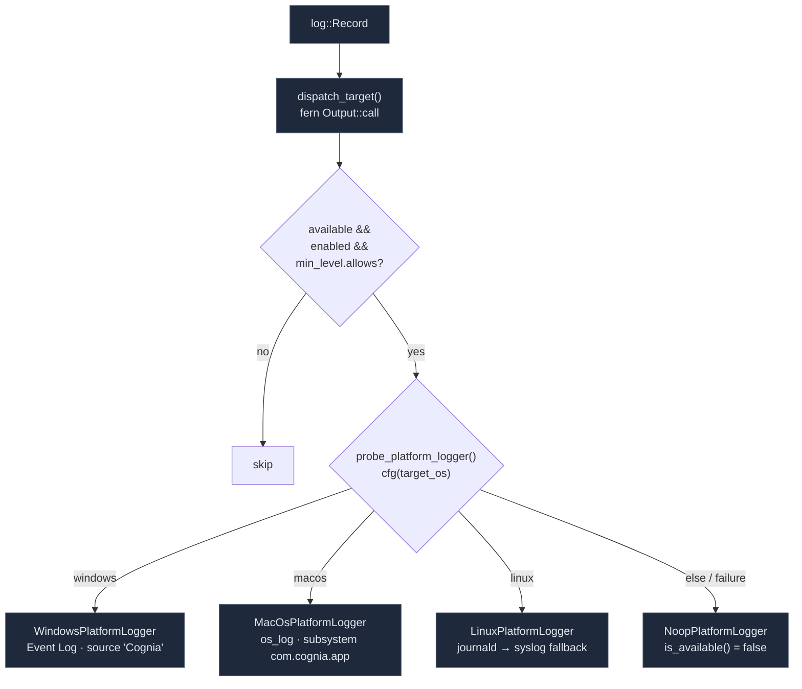

# Rust 派发与操作系统桥接

<Status variant="stable" />

<TLDR>
  `logging::bootstrap(app)`（`src-tauri/src/logging/mod.rs:31`，从 `lib.rs:838` 调用）以一组规划好的
  target（`stdout` + `folder` + `webview`）安装 `tauri-plugin-log`，外加一个自定义的
  `fern` **dispatch target**，把每条记录镜像到操作系统日志器。规划器
  （`native_bootstrap.rs`）会选出 **Full**（日志目录可写）、**Fallback**（目录不可用 → 无文件
  target）或 **Disabled**，并向前端暴露一份 `NativeLoggingReadiness` 快照。操作系统桥接
  是一个带四个实现的 `PlatformLogger` trait —— Windows **事件日志**（源 `Cognia`）、macOS
  **`os_log`**（subsystem `com.cognia.app`）、Linux **journald**（syslog 回退），以及一个 **noop**。
  `webview` target 通过 `log://log` 事件，把 Rust + sidecar + shell 输出往返送回前端。六个
  `#[tauri::command]` 覆盖就绪状态、日志目录访问，以及 browser→Rust 转发。
</TLDR>

<StatGrid>
  <Stat label="引导模式" value="3" hint="Full · Fallback · Disabled（native_bootstrap.rs）" />
  <Stat label="操作系统后端" value="4" hint="event_log · os_log · journald/syslog · noop" />
  <Stat label="Tauri 命令" value="6" hint="native_logging_* + platform_logging_*（lib.rs:463）" />
  <Stat label="默认平台级别" value="warn" hint="PlatformLoggingState::Default min_level" />
  <Stat label="Webview 事件" value="log://log" hint="TargetKind::Webview → 前端面板" />
</StatGrid>

## 引导

`bootstrap()` 无条件运行于 Tauri 的 `setup` 闭包中（`lib.rs:838`）。它规划各个 target，
链上平台 dispatch target，然后安装插件：

```rust title="src-tauri/src/logging/mod.rs:31"
pub fn bootstrap(app: &App) -> Result<(), Box<dyn std::error::Error>> {
    let plan = native_bootstrap::plan_native_logging_bootstrap(true);
    let targets = plan
        .targets()
        .into_iter()
        .chain(std::iter::once(platform::dispatch_target()));
    let builder = LogBuilder::default()
        .level(log::LevelFilter::Info)
        .targets(targets);
    if let Err(error) = app.handle().plugin(builder.build()) { /* warn */ }
    native_bootstrap::apply_native_logging_bootstrap(&plan);
```

全局的 plugin-log 级别过滤器是 `LevelFilter::Info`。`.targets(...)`（复数）会替换掉
预置的默认值，使 `Stdout`/`LogDir` 这一对不会被重复添加。

## 三种引导模式

`plan_native_logging_bootstrap_with`（`native_bootstrap.rs:155`）通过探测持久化日志目录
（`<data_local_dir>/Cognia/logs`）能否被创建和写入来决定模式
（`prepare_persistent_log_target` 会写入并删除一个 `.native-logging-probe` 文件）：

| 模式 | 条件 | 启用的 target | 健康度 |
| --- | --- | --- | --- |
| **Full** | 日志目录已创建 + 探测写入 OK | `stdout` + `folder` + `webview` | `Healthy` |
| **Fallback** | 探测失败（权限 / 磁盘） | `stdout` + `webview` | `Degraded`（原因 `persistent_target_unavailable`） |
| **Disabled** | `!should_register`（生产环境从不触发） | 无 | `Inactive` |

```rust title="src-tauri/src/logging/native_bootstrap.rs:177"
match prepare_persistent_target() {
    Ok(_) => /* mode: Full, health: Healthy, targets: [stdout, folder, webview] */
    Err(message) => /* mode: Fallback, health: Degraded, targets: [stdout, webview],
        fallback_reason: { code: "persistent_target_unavailable", message } */
}
```

`targets()` 把每个 target 字符串映射到一个 `tauri-plugin-log` 的 `TargetKind` —— `"stdout"`→`Stdout`、
`"folder"`→`LogDir { file_name: Some("cognia") }`、`"webview"`→`Webview`。最终得到的
`NativeLoggingReadiness`（模式、健康度、启用的 target、回退原因、平台状态、时间戳）
被存入一个全局 `Mutex` 并由前端读取，从而让日志面板能够显示"持久化失败，
已降级为内存模式"。

## 平台桥接

`platform/mod.rs` 定义了跨平台契约，以及为其供数的 fern dispatch：

```rust title="src-tauri/src/logging/platform/mod.rs:15"
pub trait PlatformLogger: Send + Sync {
    fn log(&self, level, target, message, data: Option<&str>) -> Result<(), String>;
    fn is_available(&self) -> bool;
    fn name(&self) -> &'static str;
}
```

`dispatch_target()` 返回一个 fern `Output::call`，把每条 plugin-log 记录转发给
当前活动的 `PlatformLogger`：

```rust title="src-tauri/src/logging/platform/mod.rs:202"
pub fn dispatch_target() -> Target {
    Target::new(TargetKind::Dispatch(Dispatch::new().chain(
        fern::Output::call(|record| {
            let _ = forward_record(record);
        }),
    )))
}
```

每条记录在到达操作系统之前都会被门控 —— 仅当日志器可用、配置已启用、且记录满足
平台 `min_level`（默认 **`warn`**，以保持操作系统日志不被淹没）时才会发出：

```rust title="src-tauri/src/logging/platform/mod.rs:227"
if !state.logger.is_available()
    || !state.config.enabled
    || !state.config.min_level.allows(level)
{
    return Ok(());
}
state.logger.log(level, target, message, data)
```

平台健康度（`derive_status`，`:245`）在禁用时为 `Inactive`，在可用且无错误时为 `Healthy`，
否则为 `Degraded`。

### 四个后端



**Windows**（`platform/windows.rs`）—— 注册一个事件日志源 `Cognia`，并通过
`eventlog` crate 写入。注册失败不是致命的（存为软错误）；只有 `EventLog::new`
失败才会降级为 noop。级别映射把 Fatal/Error 合并为 `Level::Error`，Debug/Trace 合并为
`Level::Debug`。

```rust title="src-tauri/src/logging/platform/windows.rs:12"
pub(crate) fn probe_logger() -> PlatformLoggerProbe {
    let registration_error = eventlog::register(EVENT_SOURCE)   // "Cognia"
        .err()
        .map(|error| format!("event_log_source_registration_failed:{error}"));
    match EventLog::new(EVENT_SOURCE, Level::Trace) {
        Ok(inner) => PlatformLoggerProbe::success(Arc::new(WindowsPlatformLogger { inner }), …),
        Err(error) => PlatformLoggerProbe::failure("event_log",
            format!("event_log_initialization_failed:{error}")),
```

**macOS**（`platform/macos.rs`）—— 每个 category（即日志 target/模块）一个 `OsLog`，subsystem 为
`com.cognia.app`；级别映射把 Fatal → `Fault`，Warn → `Default`。始终探测为 `success`。

**Linux**（`platform/linux.rs`）—— 当 `SD_JOURNAL_SOCK_PATH` 存在时优先用 journald，否则用一个 unix
`syslog` 连接（`Formatter3164`，facility `LOG_USER`，identifier `cognia`）；两者都不可用 →
`failure("syslog", …)`。journald 字段：`SYSLOG_IDENTIFIER=cognia`、`MODULE`/`TARGET`、`PAYLOAD`。

**noop**（`platform/noop.rs`）—— 用于不受支持的平台或探测失败的、始终不可用的接收端；
`is_available() → false`，但 `name()` 会保留预期的后端，使诊断信息仍能读出例如
`"event_log"`。

## Webview 往返

`tauri-plugin-log` 的 `webview` target 是把 **Rust 侧记录**（包括
打包的 Node sidecar（`claude-host.mjs`）和 shell 捕获的输出）通过 Tauri 事件
`log://log` 送回前端的通道。前端日志面板的主列表并*不*监听 `log://log`
（那来自 IndexedDB）；该事件为 "tauri / mcp / plugin" 这几个源供数，使原生内容
得以与浏览器日志一同出现。

## Tauri 命令

六个 `#[tauri::command]`（`logging/commands.rs`，注册于 `lib.rs:463-468`）：

| 命令 | 用途 |
| --- | --- |
| `native_logging_get_readiness` | `NativeLoggingReadiness` 快照（模式/健康度/target/回退） |
| `native_logging_get_log_directory` | 解析得到的 `app_log_dir` 路径 |
| `native_logging_open_log_directory` | 在操作系统文件管理器中显示日志文件夹 |
| `platform_logging_get_status` | `PlatformLoggingStatus`（后端、健康度、是否启用、min_level） |
| `platform_logging_set_config` | 运行时切换平台日志 / 更改 min_level |
| `platform_logging_forward` | 接收来自原生传输的浏览器条目 |

```rust title="src-tauri/src/logging/commands.rs:56"
#[tauri::command]
pub async fn platform_logging_forward(
    entries: Vec<platform::PlatformLogEntry>,
) -> Result<(), String> {
    platform::forward_entries(&entries)
}
```

浏览器侧（`lib/native/native-logging.ts`）对这些命令做了封装；[原生传输](./transports#native)
调用 `platform_logging_forward`，而[日志面板](./log-panel)通过
`native_logging_get_readiness` 读取就绪状态以渲染原生日志诊断卡片。

## 从哪里开始

| 目标 | 文件 |
| --- | --- |
| 新增/修改一个操作系统后端 | `src-tauri/src/logging/platform/<os>.rs`（实现 `PlatformLogger`） |
| 更改默认平台 min level | `platform/mod.rs` 中的 `PlatformLoggingState::Default` |
| 更改日志文件名 / 目录 | `native_bootstrap.rs` 中的 `LOG_FILE_NAME` / `APP_LOG_DIR_NAME` |
| 新增一个日志命令 | `logging/commands.rs` + 在 `lib.rs` 的 invoke_handler 中注册 |
