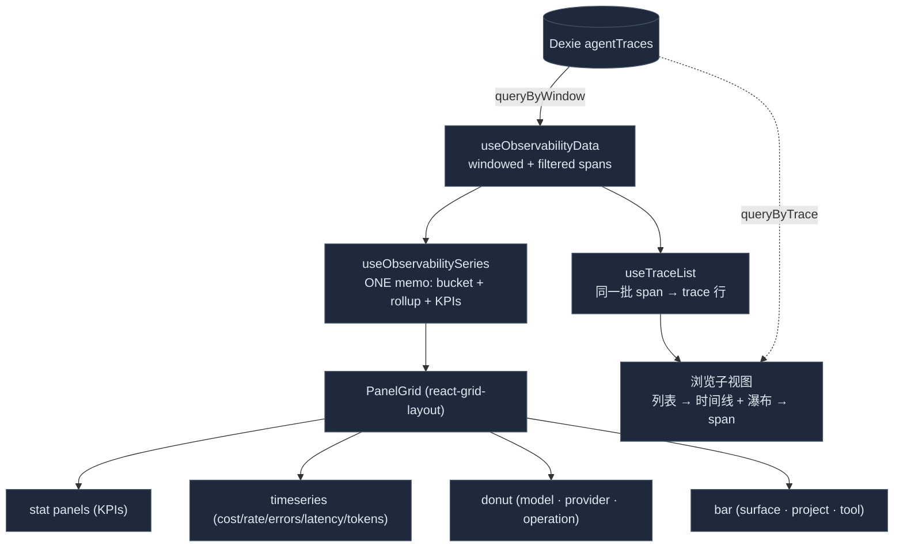

# 追踪仪表盘

<Status variant="beta" />

<TLDR>
  **`/logs` → 追踪频道的「仪表盘」子视图**（`components/observability/observability-dashboard.tsx`）是一个
  Grafana/Langfuse 风格的遥测仪表盘：一个可拖拽、可缩放的 `react-grid-layout` 面板网格，读取
  **Dexie `agentTraces` 表**（与 [agent-trace](./agent-trace) 流水线持久化的 span 相同）——因此它可在
  浏览器和移动端工作，不像 `/performance`。它过去是独立的 `/observability` 路由，自带一套时间范围控件、
  一套筛选和一次独立的窗口读取；现在它是频道喂给的一个面板，与旁边的「浏览」子视图共用同一次读取，
  因此 KPI 数字与 trace 列表不可能互相矛盾。`lib/observability/` 是一个真正的分析引擎：精确分位
  （`percentiles.ts`）、带空缺补 null 的固定边界时间分桶（`aggregate-series.ts`）、
  spans→trace 汇总 + 父/子瀑布图（`trace-rollup.ts`）、分组拆解
  （`breakdown.ts`）以及阈值分类（`thresholds.ts`）。单个
  `useObservabilitySeries` memo 一次性计算所有内容；16 个面板（4 种类型）据此渲染。
</TLDR>

<StatGrid>
  <Stat label="数据源" value="Dexie agentTraces" hint="不是 fixture——queryByWindow (use-observability-data.ts)" />
  <Stat label="面板数" value="16" hint="panel-registry.ts" />
  <Stat label="面板类型" value="4" hint="stat · timeseries · donut · bar" />
  <Stat label="时间预设" value="7" hint="5m · 15m · 1h · 6h · 24h · 7d · 30d" />
  <Stat label="拆解维度" value="7" hint="model · surface · operation · tool · provider · project · session" />
  <Stat label="网格引擎" value="react-grid-layout v2" hint="基于 hooks，React-19 安全" />
</StatGrid>

## 数据源

仪表盘读取 Dexie `agentTraces` 表——**而非** fixture（那些只存在于测试中）。
证据链：

```ts title="hooks/observability/use-observability-data.ts"
const windowSpans = useClientLiveQuery(
  () => queryByWindow({ since: range.since, until: range.until, limit: SPAN_READ_CAP }),
  [range.since, range.until, tick, limit],
  EMPTY,
)
// queryByWindow → v150 的全局 startTime 索引，按最新 N 条封顶；countByWindow 提供分母，
// 让被截断的读取能说出来，而不是悄悄给出片面答案。
```

所以流程是：由[日志流水线](./logging-pipeline)发出的 span → 由
**agent-trace transport** 持久化 → 经 `useLiveQuery` 按窗口读取 → 由纯函数
`lib/observability` 分桶/汇总 → 渲染进面板网格。`tick` 位于依赖数组中，因此
相对窗口会随墙上时钟推进而重新拉取。



## 分析引擎

`lib/observability/` 是纯函数、无副作用，且每个模块都有单元测试。

### 分位

通过排序 + 最近秩加线性插值得到精确分位（"type 7" / NumPy / Excel
`PERCENTILE`）：

```ts title="lib/observability/percentiles.ts:14"
export function percentile(sortedAsc: number[], p: number): number {
  const n = sortedAsc.length
  if (n === 0) return 0
  if (n === 1) return sortedAsc[0]
  const rank = Math.min(1, Math.max(0, p)) * (n - 1)
  const lo = Math.floor(rank); const hi = Math.ceil(rank)
  if (lo === hi) return sortedAsc[lo]
  return sortedAsc[lo] + (sortedAsc[hi] - sortedAsc[lo]) * (rank - lo)
}
```

`percentilesOf(values, ps)` 只排序一次，并为每个请求的分位返回一个值——用于
p50/p95/p99 延迟序列。

### 时间分桶

`aggregate-series.ts` 将 span 按来自 `bucketBoundaries(range)` 的**固定边界**分桶，以便空的
前导/尾随桶仍能渲染（Grafana 行为）。每个 span 落入
`floor((startTime - since) / bucketMs)`。各序列构建器——`costSeries`、`tokenSeries`、
`requestRateSeries`、`errorRateSeries`、`latencyPercentileSeries`——为空桶发出 `null`，让
recharts 绘制空缺而非误导性的零值：

```ts title="lib/observability/aggregate-series.ts:131"
if (durations.length === 0) return { p50: null, p95: null, p99: null }
const [p50, p95, p99] = percentilesOf(durations, [0.5, 0.95, 0.99])
```

`windowKpis(spans, range)` 将整个窗口汇总为 `{ totalCost, totalSpans, errorRate,
cacheHitRate, p95LatencyMs, reqPerMin, toolCalls, toolFailures }`。

### 追踪汇总与瀑布图

`trace-rollup.ts` 有两个输出。`rollupTraces` 为每个 `traceId` 产出一个 `TraceRollupRow`，用于
最近追踪表（根 = 最早开始的 span，时长 = `maxEnd - minStart`）。`buildWaterfall`
为抽屉构建带 offset/width 几何信息的父/子树，并防范
缺失/自引用/环状父节点（孤儿成为根，`visited` 集合打破环）：

```ts title="lib/observability/trace-rollup.ts:142"
offsetMs: Math.max(0, span.startTime - traceStart),
widthMs: Math.max(0, span.durationMs ?? (span.endTime ?? span.startTime) - span.startTime),
```

`flattenWaterfall` 通过先序 DFS 得到行列表。

### 拆解与阈值

`breakdown.ts` 将 span 按七个维度之一（`model | surface | operation | tool | provider |
project | session`）分组为 `BreakdownRow`（span 数、cost、tokens、错误数、平均延迟）。
`distinctValues` 驱动过滤栏的选项。

`thresholds.ts` 将一个指标值分类为 `ok | warn | crit` 并映射到主题色。
默认值：

```ts title="lib/observability/thresholds.ts:24"
DEFAULT_THRESHOLDS = {
  errorRate:    { warn: 0.02, crit: 0.1,   direction: "above" },
  latencyP95:   { warn: 5000, crit: 15000, direction: "above" },
  cost:         { warn: 5,    crit: 20,    direction: "above" },
  cacheHitRate: { warn: 0.5,  crit: 0.2,   direction: "below" },
}
```

`time-range.ts` 解析预设（`5m…30d`），将 `bucketMs` 对齐到合适步长（`pickBucketMs`，目标 60
个桶，上限 1000），并计算边界。`filters.ts` 应用 `TraceFilters`，语义为
**维度之间取 AND、维度之内取 OR**（Grafana 模板变量语义），在已按窗口过滤的 span
上于客户端执行。

## 数据 Hook

- `useObservabilityData(range, filters, tick)`——带窗口（且封顶）的 `useLiveQuery` + 客户端过滤；
  返回 `{ spans (filtered), windowSpans (pre-filter, for option lists), loading, spanCount,
  windowSpanCount, truncated }`。这是整个频道唯一的一次读取。
- `useObservabilitySeries(spans, range)`——**单个** `useMemo`，计算 `bucketMs`、全部 5 条序列、6
  个拆解以及 `windowKpis`，因此没有面板需要重新分桶。trace 汇总不在这里：`useTraceList`
  对同一批 span 已经折叠过一次。
- `useObservabilityControls()` / `useResolvedRange(tick)`——位于持久化的
  `useObservabilityStore`（zustand `persist`，key 为 `cognia-observability`；`editMode` 是瞬态的，因此
  网格始终以锁定状态重新打开）之上的选择器层。
- `useTraceDetail(traceId)`——仅在某个追踪被选中时才惰性执行 `queryByTrace`，随后 `buildWaterfall`。
- `useRefreshTick(intervalMs)`——自动刷新计数器（`0` 禁用，依赖 `useLiveQuery`）。

## 面板注册表

`panel-registry.ts` 是纯配置（无 JSX）。一个 `PanelDef` 携带 `id`、`kind`、`titleKey`，以及
可选的 `statMetric` / `seriesKind` / `dimension` / `threshold`。共有 **16 个注册面板**，
分属 **4 种类型**：

| 类型 | 面板 |
| --- | --- |
| `stat` | `kpi-cost` · `kpi-spans` · `kpi-errors` · `kpi-cache` · `kpi-latency` · `kpi-rate` · `kpi-tools` · `kpi-tool-failures` |
| `timeseries` | `ts-cost` · `ts-rate` · `ts-errors` · `ts-latency` · `ts-tokens` |
| `donut` | `bd-model` · `bd-provider` · `bd-operation` |
| `bar` | `bd-surface` · `bd-project` · `bd-tool` |

刻意没有 `traces` 类型：网格旁边的「浏览」子视图本身就是 trace 列表，读取同一个窗口、同一套筛选，
它的瀑布图就是被删除的 `RecentTracesPanel` + `TraceWaterfallDrawer` 组合曾提供的下钻。

`defaultLayouts()` 提供精心设计的 12 列（`lg`）、8 列（`md`）以及派生的 2 列（`sm`）
布局。`useObservabilitySeries` 计算的每个拆解现在都有面板绘制，`resolveStat` 能格式化的每个
`StatMetric` 现在都有 KPI 卡片——`panel-registry.test.ts` 把这两条都钉住了，因为这对配对已经跑偏过两次
（`bd-provider`/`bd-project` 曾静默地绘制 model 汇总，而 `reqPerMin` 被计算出来却无人使用）。

## 组件

`TraceWorkspace`（`components/logging/trace-workspace.tsx`）是组合根：它串联各 hook
（`controls → tick → range → data → series`），渲染子视图切换 + `ObservabilityToolbar` +
`ObservabilitySettingsSheet`，并把派生的 series 交给 `ObservabilityDashboard`——后者现在只剩网格与空态。
`ObservabilityPanel` 依据 `panel.kind` 分派到 `StatPanel` / `TimeSeriesPanel` /
`DonutPanel` / `BreakdownBarPanel`。`PanelGrid` 使用 **react-grid-layout v2**
（基于 hooks + `ResizeObserver`，React-19 安全——无 `findDOMNode`），配置 `COLS {lg:12, md:8, sm:2}`，
拖拽通过 `.panel-drag-handle` 受 `editMode` 控制。`PanelFrame` 添加卡片外观与一个
阈值状态点。

图表面板（`TimeSeriesPanel`）按 `seriesKind` 构建 recharts 配置——cost 为 chart-1
区域图，error rate 为 destructive 折线，latency 为三条 p50/p95/p99 折线，tokens 为四条堆叠
区域图——带阈值 `ReferenceLine` 以及取自 `useThemeColors` 的颜色。瀑布图本身位于「浏览」子视图
（见[日志面板 UI](./log-panel)），通过共享的 `WaterfallRow` 渲染 `flattenWaterfall` 行，每行是一条按比例
的计时条（`offsetPct`/`widthPct`），按 operation 着色，可展开以显示 events/model/tokens/cost。

## i18n

仪表盘使用 `observability` 命名空间（`observability.panels.*`、`observability.series.*`、
`observability.toolbar.*`、`observability.range.*`、`observability.filters.*`、
`observability.waterfall.*`），外加用于子视图切换的 `logging.workspace.traces.subViews.*`。
guild-rail 已不再有独立入口——`/logs` 是唯一目的地。

## 交互与设置

除只读面板外，仪表盘还支持交互：

- **点击即过滤** —— 点击环形图切片/图例行或柱条，会把该值切入变量过滤（`lib/observability/filters.ts`
  的 `toggleFilterValue`），从而让拆解面板对整个仪表盘做交叉过滤。选中项会高亮；每个面板还有度量切换
  （`BreakdownMetricToggle`）在 spans/cost/errors 间切换（`breakdownValue` + `topByMetric`）。
- **图例开关** —— 多序列时序面板（延迟分位、Token 吞吐）提供可点击图例，隐藏/显示单条序列。
- **设置抽屉**（`ObservabilitySettingsSheet`，齿轮按钮）—— 逐指标 warn/crit 阈值覆盖（`mergeThresholds`，
  持久化于 store）、默认时间范围 + 刷新频率、面板显隐（`hiddenPanels`）、数据管理（span 计数 +
  `pruneOlderThan` 保留 + `clearAllSpans`）。
- **导出/导入**（`ExportMenu`）—— 最近 Trace → CSV（`tracesToCsv`）、整个仪表盘配置 → JSON
  （`serializeDashboardConfig`/`parseDashboardConfig`），走跨平台 `saveExport`。
- **手动刷新 + 上次更新**（`RefreshStatus` 基于 `useRefreshTick` 的 `{ tick, lastUpdated, refresh }`）。
- **深链** —— 当前范围 + 过滤映射进 URL（`useObservabilityUrlSync` 基于 `lib/observability/url-state.ts`），
  `/logs?channel=traces&view=dashboard&range=6h&f=…` 链接可复现视图。该同步只重写自己拥有的四个参数，
  因此频道自己的 `channel`/`view`/`traceId` 不会被抹掉。
- **快捷键**（`useObservabilityHotkeys`）—— `e` 编辑 · `r` 刷新 · `f` 聚焦过滤 · `s` 设置。
- **空状态**（`ObservabilityEmptyState`）—— 窗口内无 span 时展示。

## 自适应布局

频道测量的是**它自己**（`useElementWidth` 作用于工作区根节点以及工具栏的 `flex-1` 槽位），而不是读取
视口媒体查询：外壳导航栏和频道列表经常让视口比面板真正拿到的宽度多出 300px —— `lg:` 断点会一边报告
「宽」，一边渲染三个 150px 的列。三档全部基于容器宽度：小于 768px 时「浏览」只剩列表，瀑布图与 span
详情进底部抽屉；小于 1180px 时是两列（列表 │ 瀑布图叠 span 详情）；再宽则是三列。工具栏在自身槽位
小于 1120px 时折叠：七个维度下拉收进一个「筛选」触发器（两级下钻），导出/编辑与「N 秒前」读数只留
图标 —— 实测把 68px 的换行工具栏压回单行 32px，并且一直保持到频道宽约 600px。槽位再小于 420px 时还有
一档（`dense`）：收起自动刷新节流下拉——它是这里唯一一个已有完全相同第二入口的控件（设置 → 默认值 →
刷新，就在旁边两个按钮外的齿轮里），也正是它让 390px 手机从三行降到两行。除此之外不隐藏任何控件。面板网格保留自己的 `react-grid-layout` 断点（`lg` 1200 / `md` 768 /
`sm` 0），同样基于容器测量；`sm` 布局把 KPI 卡片两两并排，带坐标轴的面板一律整宽。

## 从哪里入手

| 目标 | 文件 |
| --- | --- |
| 添加面板 | 在 `components/observability/panel-registry.ts` 的 `PANELS` 中添加一个 `PanelDef` + 一个 `defaultLayouts` 槽位 |
| 添加指标/序列 | `lib/observability/aggregate-series.ts` + `TimeSeriesPanel` 配置 |
| 添加拆解维度 | `Dimension` 联合类型 + `lib/observability/breakdown.ts` 中的 `dimValue` + 过滤栏 |
| 调整默认阈值 | `lib/observability/thresholds.ts` 中的 `DEFAULT_THRESHOLDS`（用户可在设置抽屉中覆盖） |
| 修改设置抽屉 | `components/observability/observability-settings-sheet.tsx` + `stores/observability/observability-store.ts` 的 store 切片 |
| 修改深链内容 | `lib/observability/url-state.ts` |
| 修改导出格式 | `lib/observability/export-csv.ts` / `lib/observability/dashboard-config.ts` |
