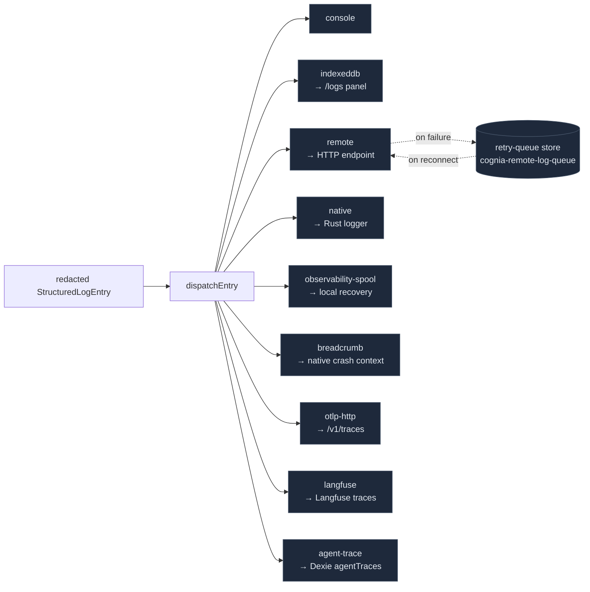

# Transports

<Status variant="stable" />

<TLDR>
  一个 transport 是任何实现了 `Transport`（`types/logging/transport.ts:33`）的东西：一个 `name` 和一个
  `log(entry)` 方法，可选地有 `flush/close/getHealth/getPendingCount`。管道把每一条
  脱敏后的条目 fan-out 给所有已注册的 transport。共存在九个：**console**（同步、彩色）、**indexeddb**
  （批处理、保留 + LRU 驱逐、跨标签页 `BroadcastChannel`）、**remote**（`fetch` POST + 一条
  *持久*的 IndexedDB 重试队列 + Sentry/Loggly 线格式 shim）、**native**（Tauri `invoke` 到 Rust
  logger）、**observability-spool**、**breadcrumb**、**otlp-http**、**langfuse**，以及
  **agent-trace**。产品事件使用独立的结构化 envelope fan-out 到 OTLP Logs 与 managed/BYO
  PostHog。健康精确为 `healthy | degraded | offline` —— 不存在
  `unhealthy` 状态。
</TLDR>

<StatGrid>
  <Stat label="Transports" value="9" hint="console · indexeddb · remote · spool · native · breadcrumb · otlp-http · langfuse · agent-trace" />
  <Stat label="健康状态" value="3" hint="healthy · degraded · offline（transport.ts:8）" />
  <Stat label="持久队列" value="2" hint="remote retry-batches + indexeddb buffer" />
  <Stat label="minLevel 门控" value="2" hint="native + langfuse 默认 warn" />
  <Stat label="Span sink" value="动态" hint="通用 OTLP · managed/BYO PostHog · 本地 agent-trace" />
</StatGrid>

## Transport 接口

```ts title="types/logging/transport.ts:33"
export interface Transport {
  name: string
  log(entry: StructuredLogEntry): void | Promise<void>   // the only required method
  flush?(): void | Promise<void>
  close?(): void | Promise<void>
  getHealth?(): TransportHealthSnapshot
  getPendingCount?(): number
}
```

`log()` 是唯一必需的成员。接口上**没有** `enabled` 或 `minLevel` 字段 ——
是否启用在 `bootstrap.ts` 中决定，且只有 `native` 和 `langfuse` 暴露一个每-transport 的
`minLevel` 选项（两者都默认 `"warn"`）。健康快照是一个固定形状
（`transport.ts:10`）：

```ts
interface TransportHealthSnapshot {
  transport: string
  status: "healthy" | "degraded" | "offline"   // transport.ts:8 — the ONLY three states
  queueDepth: number; retryCount: number; droppedEntries: number
  lastSuccessAt?; lastFailureAt?; lastError?; updatedAt
}
```



## console

`console-transport.ts` —— 一次性、同步写入到 `globalThis.console`，按
级别挑选方法（`getConsoleMethod`，`:122`；error+fatal → `console.error`）。彩色 `%c` 前缀仅在
浏览器中，stack 单独打印，traceId 截断到 8 个字符。无缓冲、无健康。`name =
"console"`（`:65`）。

## indexeddb

`indexeddb-transport.ts` —— 持久的浏览器存储，也是**日志面板的默认查询
源**。写入一个专用的 `cognia-logs` IndexedDB 数据库（与主 Dexie DB 分离），
对象存储为 `logs`，以 `id` 为键，并在 `timestamp/level/module/traceId` 上建索引。带缓冲
（`bufferSize` 50，`flushInterval` 1000 ms）。两条清理规则在 `cleanup()`（`:175`）中运行：

```ts title="lib/logging/transports/indexeddb-transport.ts:178"
const cutoff = Date.now() - (this.options.retentionDays || 7) * 24*60*60*1000
const range = IDBKeyRange.upperBound(cutoffDate)   // 1) time-based purge
// 2) max-entries LRU: if count > maxEntries (10000), delete oldest-by-timestamp first
```

在 flush 时，它向一个跨标签页的 `BroadcastChannel`
（`cognia-logs-updates`）发送 `{ type: "logs-flushed" }`；`IndexedDBTransport.onLogsUpdated(cb)`（`:448`）是面板
订阅的**唯一**推送机制 —— 面板的数据路径中没有 Rust 事件。一次失败的 flush
经由 `buffer.unshift` 重新入队条目。

## remote

`remote-transport.ts` —— 经 `fetch` POST 把批次发往一个 HTTP 端点，具备在线/离线
感知、指数退避，以及一条**持久的 IndexedDB 重试队列**。它的健康由队列驱动，
而非基于阈值：

```ts title="lib/logging/transports/remote-transport.ts:195"
private resolveStatus(): TransportHealthStatus {
  if (!this.isOnline) return "offline"
  if (queueDepth > 0 || retryCount > 0) return "degraded"
  return "healthy"
}
```

发送使用一个 `AbortController` 超时；在 `maxRetries`（3）次、延迟为 `retryDelay * 2^attempt` 之后，该
批次被持久化到重试队列，并在重连时重放（`flushRetryQueue` 发出
`logger.remote.recovered`）。一个可选的 `transform` 重塑请求体 —— 随附两个 shim：

```ts title="lib/logging/transports/remote-transport.ts:516"
export function sentryTransform(entries) { /* → {level, message, timestamp, extra, tags} */ }
export function logglyTransform(entries) { /* → {level, message, timestamp, tag, traceId, …} */ }
```

它们**只是线格式 shim** —— 没有捆绑任何 Sentry/Loggly SDK。

### remote-retry-queue-store

`remote-retry-queue-store.ts` 是 `remote` 的持久后端：一个 IndexedDB 存储
（`cognia-remote-log-queue` / `retry-batches`），当 IDB 不可用时带内存回退。
容量通过丢弃最旧的批次（FIFO）来强制执行，直至同时低于两个上限
（`DEFAULT_LIMITS = { maxEntries: 5000, maxBytes: 10 MiB }`）：

```ts title="lib/logging/transports/remote-retry-queue-store.ts:259"
while (mutable.length > 0 &&
  (stats.entryCount > this.limits.maxEntries || stats.totalBytes > this.limits.maxBytes)) {
  const oldest = mutable.shift()                  // FIFO oldest by sorted id
  droppedEntries += oldest.entries.length
  await this.deleteBatch(oldest.id)
}
```

## native

`native-transport.ts` —— 把条目转发给 Rust 原生 logger，**仅在桌面端**。它受
`minLevel` 门控（默认 `"warn"`）和 Tauri 门控（`isTauri()`），带批处理（`batchSize` 10）。该
转发是一个 Tauri **命令**，而非事件：

```ts title="lib/logging/transports/native-transport.ts:81"
const forwarded = await forwardPlatformLoggingEntries(
  entries.map((entry) => ({ level, module, message, timestamp, traceId, sessionId,
    data: normalizeEntryData(entry) }))
)
// → invoke("platform_logging_forward", { entries })   (lib/native/native-logging.ts:125)
```

初始健康为 `isTauri() ? "healthy" : "offline"`。一次失败的转发会重新缓冲并报告
`"degraded"`。它的 Rust 一侧是 [Rust 分发与 OS 桥接](./rust-logging)。

## observability spool 与 breadcrumb

`ObservabilitySpoolTransport` 写入有版本、容量受限的本地恢复 envelope。仅桌面的
`BreadcrumbTransport` 把已脱敏的崩溃上下文转发给 Rust。旧文档遗漏了这两个实现；已删除的
`otel-transport.ts` 不再是现有 transport。

## otlp-http

`otlp-http-transport.ts` —— 一个面向 **agent-trace span**（而非通用日志）的 OTLP/HTTP **JSON** 导出器。`name = "agent-trace-otlp"`，默认关闭。它抽取那些条目携带
`data.kind === AGENT_TRACE_SPAN_KIND` 的 span，批处理（`bufferSize` 32），并经 `spansToOtlp`
（见 [agent-trace](./agent-trace)）POST 到一个已配置的 `/v1/traces` 端点。重试分类是
HTTP 感知的 —— 4xx（除 408/429）不可重试；5xx/超时以
`delay = min(30s, retryBaseMs * 2^attempt)` 重试。当没有端点或存在
`lastError` 时健康为 `degraded`，否则为 `healthy`（绝不为 `offline`）。内容捕获经 `hasNoLeakingPii` 做 PII 门控。
`grafanaCloudHeaders` 为 Grafana Cloud / Tempo / Honeycomb / Datadog
OTLP 构建 `Authorization: Basic …`。

### PostHog 目的地

同一个 OTLP transport 类可注册为 `agent-trace-posthog-managed` 与
`agent-trace-posthog-byo`。这些实例始终禁用内容采集，固定使用 `/i/v0/ai/otel`，在 Tauri
中通过 Rust 类型化凭据 seam 注入公开项目 token，并为每个 span 打上 `posthog.distinct_id`，
使渲染端 span 与 sidecar `enrichSpan` 标注的 span 归属同一个 person。Sidecar 在单一
`NodeSDK` 下，为每个通用 OTLP 或 PostHog 目的地创建独立 `BatchSpanProcessor`。

产品分析不进入日志管道：`track-event.ts` 只有在通过行为授权、分类、采样、标量和 PII 闸门后，
才把结构化事件 envelope fan-out 到 OTLP Logs 与 `posthog-product.ts`。`posthog-product.ts`
直接使用 PostHog 批量采集 API —— `POST {host}/batch/`，body 为 `{ api_key, sent_at, batch }` ——
而不内嵌 `posthog-js`：浏览器 SDK 会从渲染进程自行发起连接，而桌面端 `connect-src` 策略
不允许任何此类连接。批量请求在 Tauri 上经 `telemetry_otlp_export` 发出，其他壳走 `fetch`；
累积 20 条或 2 秒后发送。配置未变化的目的地在设置保存时复用同一个 exporter，因此重新应用
设置不会丢掉待发批次。

## langfuse

`langfuse-transport.ts` —— 一个 LLM 可观测性 sink，把条目分组进 Langfuse trace。它
懒导入 `@/lib/ai/observability/langfuse-client`，缓冲，并在 flush 时按
`traceId || sessionId || "default"` 分组，每组创建一个 trace、每条目创建一个 span：

```ts title="lib/logging/transports/langfuse-transport.ts:127"
const traceKey = entry.traceId || entry.sessionId || "default"
// → createChatTrace({ sessionId: traceKey, ... }); per entry:
const spanName = `${eventPrefix||"log"}.${entry.level}.${entry.module}`
const span = createSpan(trace, { name: spanName, input: entry.message,
  level: mapLogLevelToLangfuse(entry.level) })
```

`minLevel` 默认 `"warn"`。`mapLogLevelToLangfuse`：trace/debug→`DEBUG`，info→`DEFAULT`，
warn→`WARNING`，error/fatal→`ERROR`。

## agent-trace

`agent-trace-transport.ts` —— span 持久化 sink。它检测 span 形状的条目
（`data.kind === AGENT_TRACE_SPAN_KIND`），清洗预览，缓冲（32），并经 `bulkInsertSpans` 把内嵌的
`AgentTraceSpan` 行写入 Dexie 的 `agentTraces` 表，带保留裁剪
（`pruneOlderThan`，默认 7 天）。健康是二态的：若有 `lastError` 则 `degraded`，否则 `healthy`。
这是 [追踪仪表盘](./tracing-dashboard) 和日志面板追踪通道的写入侧。隐私：`captureContent: false` 默认会剥离 `inputPreview`/`outputPreview`；开启时，
预览被截断到 `maxPreviewBytes` 并经 `hasNoLeakingPii` 门控。

## 健康模型 —— 一览

| Transport | 目的地 | 缓冲 | 健康逻辑 |
| --- | --- | --- | --- |
| console | `console` | 否 | 无 |
| indexeddb | IDB `cognia-logs` + BroadcastChannel | 是（50） | 无 |
| remote | `fetch` POST + 持久重试队列 | 是（50） | `offline` / `degraded`(queue>0 \|\| retry>0) / `healthy` |
| native | Tauri `invoke(platform_logging_forward)` | 是（10） | `offline`(非 Tauri) / `degraded`(失败) / `healthy`；minLevel warn |
| observability-spool | 有界本地恢复 spool | 是 | 通过 logger core 诊断 |
| breadcrumb | Rust 崩溃上下文环 | 否 | 桌面 best-effort |
| otlp-http | OTLP `/v1/traces` | 是（32） | `degraded`(无端点 \|\| lastError) / `healthy` |
| langfuse | Langfuse SDK | 是（10） | 无；minLevel warn |
| agent-trace | Dexie `agentTraces` | 是（32） | `degraded`(lastError) / `healthy` |

`getTransportHealthSnapshot()`（`core.ts:587`）一次性拉取所有 transport 快照；日志面板的
统计栏和设置的 transport 标签页渲染它们，而 `useTransportHealth` hook 每 3 s 轮询它们
一次，并带一条 30 个样本的 queue-depth 火花线历史。

## 从哪里开始

| 目标 | 文件 |
| --- | --- |
| 添加一个 transport | 在 `transports/<name>-transport.ts` 中实现 `Transport` → 在 `transports/index.ts` 中导出 → 在 `bootstrap.ts:applyTransportSettings` 中注册 |
| 把 remote 指向某服务 | 在设置的 remote 表单里设置 endpoint +（可选）`sentryTransform`/`logglyTransform` |
| 启用 OTLP span 导出 | 翻转 `agentTraceOtlp` + endpoint 预设（`off`/`grafana-cloud`/`self-hosted`/`custom`） |
| 调优持久队列 | `remote-retry-queue-store.ts` 中的 `DEFAULT_LIMITS` |
