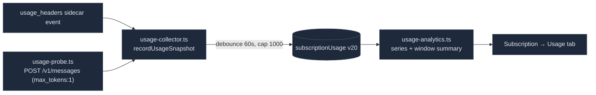

# 用量与遥测

<Status variant="stable" />

<TLDR>
  在仪表盘旁边坐落着三个独立的面。**上下文窗口计算** ——
  `lib/claude/usage.ts` 是规范的工具，用于计算窗口大小（Claude 4.6+ 为 1M，其余为 200k）并计算占用率；
  编辑器的 `ContextUsageIndicator` 和 `/context` 都读取它。**按轮次用量** ——
  `lib/db/session-usage.ts` 为每个 SDK result 持久化一条 token/成本行（Dexie v24）；
  `lib/usage/session-analytics.ts` 为非 SDK 轮次回填成本，并按模型/日期/会话聚合，供订阅 Usage 标签页使用。
  **Anthropic 配额** ——
  `lib/subscription/anthropic/usage-collector.ts` 消费 `usage_headers` 事件，而一个可选启用的
  `usage-probe.ts` 会主动 ping `/v1/messages` 以读取速率限制响应头，二者持久化到
  `subscriptionUsage`（Dexie v20）并由 `usage-analytics.ts` 分析。**Inbox 遥测** ——
  `lib/telemetry/` 将连接器流水线面包屑写入一个环形缓冲。这些都不会喂给可观测性仪表盘或日志面板；它们各自独立成面。
</TLDR>

<StatGrid>
  <Stat label="默认窗口" value="200k" hint="DEFAULT_CONTEXT_WINDOW (usage.ts:25)" />
  <Stat label="大窗口" value="1M" hint="Claude 4.6/4.7/4.8 + [1m] builds (usage.ts:44)" />
  <Stat label="自动压缩" value="83.5%" hint="AUTO_COMPACT_FRACTION (usage.ts:32)" />
  <Stat label="用量表" value="3" hint="sessionUsage v24 · subscriptionUsage v20 · pluginSkillUsage v37" />
  <Stat label="配额来源" value="2" hint="被动响应头 + 可选探针" />
  <Stat label="探针开销" value="~11 tokens" hint="每次探针 10 入 + 1 出 (usage-probe.ts)" />
</StatGrid>

## 上下文窗口计算（规范）

`lib/claude/usage.ts` 是上下文窗口尺寸计算的唯一真相源 —— 它自带一张 模型→窗口 表，这样编辑器 bundle 就不必
拉入 provider 目录。首个匹配优先，并在家族默认值之前先检查显式的 `[1m]` 构建标记：

```ts title="lib/claude/usage.ts:44"
const MODEL_CONTEXT_WINDOWS: Array<{ pattern: RegExp; window: number }> = [
  { pattern: /\[1m\]/i, window: 1_000_000 },
  { pattern: /[-._]1m(\b|$)/i, window: 1_000_000 },
  { pattern: /claude-opus-4-(6|7|8)/i, window: 1_000_000 },
  { pattern: /claude-sonnet-4-(6|7|8)/i, window: 1_000_000 },
  { pattern: /claude-(opus|sonnet|haiku)/i, window: 200_000 },
  { pattern: /gpt-4o/i, window: 128_000 },
  { pattern: /gpt-4\.1/i, window: 1_000_000 },
  { pattern: /gemini-(1\.5|2\.5|3)/i, window: 1_000_000 },
]
```

`tokensInWindow(usage)`（`:103`）累加 input + output + cacheRead + cacheCreation；`contextLevel`
对占比进行分级（`crit ≥ 0.835`、`warn ≥ 0.6`，否则为 `ok`）；`computeContextWindowUsage` 将它们串联起来供
指示器使用。`getLatestUsage(messages)` 从尾部向前遍历，因此一个正在流式输出的轮次不会重置读数。

`components/chat/context-usage-indicator.tsx` 是唯一的编辑器/工作流环（整合了两个旧的 `<Context>` 块 +
一个已删除的 header `ContextGauge`）。它绘制填充条，并在 `AUTO_COMPACT_FRACTION` 处标出一个自动压缩阈值标记。
`components/agent/workspace/token-usage-line.tsx` 是 Agent Team 聊天的紧凑入/出/总计读数。

## 按轮次的会话用量

`lib/db/session-usage.ts` 为每个 SDK `result` 事件持久化一行，以 Anthropic 的 `messageId` 为键
（天然幂等）。由聊天和 team 钩子中的 `recordResultUsage` 写入：

```ts title="lib/db/session-usage.ts:19"
export interface SessionUsageRow {
  messageId: string        // PK
  sessionId: string; characterId?: string; at: number; model?: string
  inputTokens: number; outputTokens: number
  cacheCreationTokens: number; cacheReadTokens: number
  costUsd: number          // SDK total_cost_usd; 0 when missing
  durationMs: number
}
```

Dexie v24：`sessionUsage: "&messageId, sessionId, [sessionId+at], at, model, characterId"`。聚合器
（`totalsBySession`、`topByCost`）喂给会话成本徽章和 agent-runtime sessions 标签页。

`lib/usage/session-analytics.ts` 是计费分析层 —— 它为非 SDK 轮次（这些轮次落得 `costUsd: 0`）
依据静态定价**回填**成本，并应用缓存系数：

```ts title="lib/usage/session-analytics.ts:43"
if (row.costUsd > 0) return row.costUsd
const pricing = row.model ? priceFor(row.model) : null
if (!pricing) return 0
return (
  row.inputTokens * inRate + row.outputTokens * outRate +
  row.cacheReadTokens * inRate * CACHE_READ_MULT +       // 0.1
  row.cacheCreationTokens * inRate * CACHE_WRITE_MULT     // 1.25
)
```

随后它按 模型 / 日期 / 会话 聚合，并为 Usage 标签页导出 CSV/JSON。

## Anthropic 配额获取

两个来源持久化到 `subscriptionUsage` Dexie 表（v20）中，从
`anthropic-ratelimit-unified-*` 响应头解析而来：



`usage-collector.ts` 订阅 `usage_headers` 事件，并以每来源 60 秒去抖和 1000 行上限（裁剪掉最旧的）持久化。
`usage-probe.ts` 是**主动的、可选启用的**路径（设置 → Subscription → Claude → `probeEnabled`）：它向最便宜的
会发出响应头的模型 POST 一个近乎空的请求，并解析速率限制响应头 —— 每次探针耗费约 10 入 + 1 出 token
（即便返回 429 也仍能产出一份有效快照）：

```ts title="lib/subscription/anthropic/usage-probe.ts:43"
const body = JSON.stringify({ model: PROBE_MODEL, max_tokens: 1,
  messages: [{ role: "user", content: "." }] })
// POST https://api.anthropic.com/v1/messages with OAuth bearer → parse unified headers
```

`usage-analytics.ts` 是纯函数且可注入时钟 —— `buildUtilizationSeries`（5h/7d 百分比序列）、
`summarizeCurrentWindow`（仪表 + 重置倒计时）、`levelForUtilizationPct`（`crit ≥ 100`、`warn ≥
threshold`）。Usage 标签页（`usage-tab.tsx`，仅 Tauri）渲染趋势图、当前窗口仪表、模型细分、随时间变化的成本
以及顶级会话 —— 复用来自 `lib/observability/` 的 `chart-palette`/`chart-config`，**仅用于样式**
（并非共享数据面）。

## 展示模式、折叠与动效

各用量界面共享一个全局**展示模式**偏好，与聊天 agent-flow 模式同构：
`AppSettings.usageDisplayMode`（`simplified` / `standard` / `detailed`，默认
`standard`），经 `hooks/usage/use-usage-display-mode.ts` 读写。两个入口驱动同一值
—— 工具栏快捷切换（`components/settings/subscription/usage-display-toggle.tsx`）
与外观设置卡（`components/settings/appearance/components/usage-display-card.tsx`）。

Usage 标签页的渐进式信息密度（`usage-tab.tsx` 的 `defaultOpenForMode`）：

| 模式 | 默认展开 | 额外细节 |
| --- | --- | --- |
| `simplified` | 统计卡片 + 当前窗口 | —— |
| `standard` | + 趋势、模型、成本、顶级会话 | —— |
| `detailed` | + 原始快照 | 缓存写入列、每会话输入/输出拆分 |

每个区块独立折叠。展开状态为**按模式默认 + 会话内本地覆盖**（按当前模式作用域的
`Map<SectionId, boolean>`，模式切换时重置 —— 不使用 effect 同步），与聊天
`tool-activity-group` 的稀疏 Map 约定一致。工具栏的**全部展开 / 全部收起**可一次性
驱动所有区块。

动效经 `useFlowMotion`（`components/chat/motion/motion-reveal.tsx`）门控：区块主体经
`MotionCollapse` 展开，卡片经 `MotionReveal` 交错入场，当前窗口的严重度字形经
`MotionStatusSwap` 交叉淡入，recharts `isAnimationActive` 绑定到 `!reduce`，头部统计
卡通过 `hooks/usage/use-count-up.ts` 数字递增。当 `motion.reduce` 或操作系统的
`prefers-reduced-motion` 提示开启时，所有路径都退化为瞬时。该偏好同样作用于输入框的
`ContextUsageIndicator`（简化模式隐藏 SDK 分类细分）、Agent Team 运行时卡片
（`detailed` 增加 prompt/completion 拆分）以及移动端今日统计卡（Token + 花费卡片）。

## Inbox 连接器遥测

`lib/telemetry/inbox-events.ts` 是面向连接器流水线的发后即忘式面包屑写入器 ——
每个 `inbound.received` / `outbound.sent` / `breaker.open` 事件写一行，追加到
`inboxTelemetryEvents` Dexie 环形缓冲，并吞掉错误，使遥测永不阻塞运行时：

```ts title="lib/telemetry/inbox-events.ts:43"
try {
  return await append({ kind, at: input.at ?? Date.now(),
    adapterId: input.adapterId, conversationKey: input.conversationKey, fields: input.fields })
} catch { return null }   // best-effort — never block the caller
```

`inbox-telemetry-export.ts` 将环形缓冲序列化为 CSV/JSON，供 设置 → 诊断 → 导出 使用。
`lib/db/plugin-skill-usage.ts`（v37）为插件贡献的 skill 跟踪用量计数器，而
`lib/storage/usage.ts` 驱动移动端存储页（`navigator.storage.estimate()` + 备份大小）—— 二者均独立。

## 这些与仪表盘的关系

这些模块都不向可观测性仪表盘或日志面板数据面写入。它们是三个独立的面：

| 面 | 表 | 呈现处 |
| --- | --- | --- |
| Token/成本用量 | `sessionUsage` v24 | 订阅 Usage 标签页、会话成本徽章、编辑器指示器 |
| Anthropic 配额 | `subscriptionUsage` v20 | 订阅 Usage / Overview 标签页 |
| Inbox 遥测 | `inboxTelemetryEvents` | 设置 → 诊断导出 |

唯一的耦合是外观上的 —— Usage 标签页借用了 `lib/observability` 的 Recharts 样式常量以保持视觉一致性。

## 从哪里入手

| 目标 | 文件 |
| --- | --- |
| 添加某个模型的上下文窗口 | `lib/claude/usage.ts:44` 中的 `MODEL_CONTEXT_WINDOWS` |
| 更改缓存成本系数 | `lib/usage/session-analytics.ts` 中的 `CACHE_READ_MULT` / `CACHE_WRITE_MULT` |
| 添加一项配额指标 | `lib/subscription/anthropic/parser.ts` + `usage-analytics.ts` |
| 添加一种 inbox 遥测类型 | `InboxTelemetryKind` + `trackInboxEvent` 调用点 |
