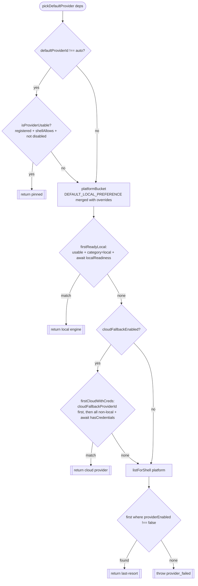
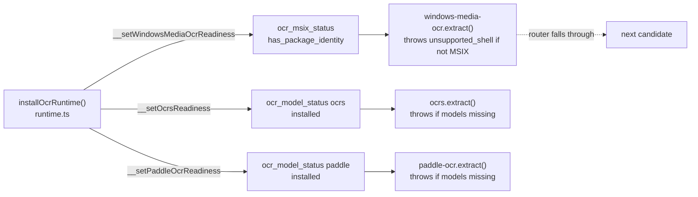

# 自动路由器

<Status variant="beta">纯选择逻辑 — lib/ocr/auto-router.ts</Status>

<TLDR>
  当调用方未固定 `providerId` 时，`pickDefaultProvider(deps)`（`auto-router.ts:149`）负责选择一个。它是一个
  **纯异步函数** —— registry、settings、platform、一个可选的就绪性探测以及一个可选的凭据探测全部通过
  `AutoRouterDeps` 注入，因此整张决策表无需后端即可单元测试。决策分四步运行：固定设置 → 平台本地引擎 →
  云端回退 → 兜底任一已启用项。按操作系统区分的偏好表是 `DEFAULT_LOCAL_PREFERENCE`（`auto-router.ts:67`）；
  MSIX 与模型下载门控实际发生在 **provider 内部**（由 `runtime.ts` 接线），而非在生产环境通过路由器的就绪性
  参数实现。
</TLDR>

## 决策过程

```ts
// auto-router.ts:149 — the full body
export async function pickDefaultProvider(deps: AutoRouterDeps): Promise<OcrProvider> {
  // 1. Explicit setting wins.
  if (deps.settings.defaultProviderId !== "auto") {
    const pinned = deps.registry.get(deps.settings.defaultProviderId)
    if (isProviderUsable(pinned, deps.platform, deps.settings)) return pinned
  }
  // 2. Platform-local engine.
  const localPick = await firstReadyLocal(deps, platformBucket(deps))
  if (localPick) return localPick
  // 3. Cloud fallback.
  if (deps.settings.cloudFallbackEnabled) {
    const cloudPick = await firstCloudWithCreds(deps, allCloudCandidates(deps))
    if (cloudPick) return cloudPick
  }
  // 4. Last resort — any enabled, shell-compatible provider.
  for (const p of deps.registry.listForShell(deps.platform)) {
    if (deps.settings.providerEnabled[p.id] === false) continue
    return p
  }
  throw new OcrError("provider_failed", "auto-router", "No OCR provider is available …")
}
```



<Callout type="info" title="代码中 4 步，ADR 中 3 步">
  ADR-0024 记录了三个信号（固定 → 平台本地 → 云端回退）。代码新增了第四个 **兜底** 分支
  （`auto-router.ts:168`）：即便云端回退已关闭或未配置凭据，它也会返回任一已启用且 shell 兼容的 provider，
  因此只有当 registry 中完全没有 shell 兼容项时路由器才会抛出异常。此外，`mistral-ocr` 这一默认值并未在路由器
  中硬编码 —— 它来自 `settings.cloudFallbackProviderId`（其默认值存放在 `DEFAULT_OCR_SETTINGS` 中）。
</Callout>

共享门控 `isProviderUsable`（`auto-router.ts:79`）即 `registered && shellAllows && providerEnabled !== false`。
`resolveProviderById`（`auto-router.ts:182`）是当调用方 *确实* 固定了某个 id 时所走的同步路径 —— 对未知 id 抛出
`provider_failed`，当 provider 不在当前 shell 中运行时抛出 `unsupported_shell`。

## 按操作系统区分的偏好表

```ts
// auto-router.ts:67 — head = strongest preference; settings.platformOverrides merges over this
export const DEFAULT_LOCAL_PREFERENCE = {
  tauri:   [],
  mobile:  [],
  web:     ["tesseract-wasm"],
  windows: ["windows-media-ocr", "ocrs", "paddle-ocr", "tesseract-native", "tesseract-wasm"],
  macos:   ["apple-vision", "ocrs", "paddle-ocr", "tesseract-native", "tesseract-wasm"],
  linux:   ["ocrs", "paddle-ocr", "tesseract-native", "tesseract-wasm"],
  ios:     ["apple-vision", "tesseract-wasm"],
  android: ["mlkit-android", "tesseract-wasm"],
  browser: ["tesseract-wasm"],
}
```

`platformBucket`（`auto-router.ts:119`）合并 `{ ...DEFAULT_LOCAL_PREFERENCE, ...deps.localPreference }`，随后在
`osTag` 存在时以其为键，否则将 `web → browser` 映射。注意裸 `tauri` / `mobile` 桶是 **空的** —— 因此要在
桌面/移动端命中真正的本地引擎，必须下钻到 `osTag`（`windows`/`macos`/`linux`/`ios`/`android`）。`local-http`
被刻意排除在每个桶之外（它仅供用户手动固定）。

设置中的 **平台覆盖** 标签页写入 `settings.platformOverrides`；将某个桶恢复为其默认排序会删除该键，而不是存储一份
冗余副本。参见 [设置界面](./settings-ui)。

## 就绪性与凭据的实际门控方式

`AutoRouterDeps`（`auto-router.ts:41`）暴露两个可注入探测 —— `localReadiness(id)` 与 `hasCredentials(id)` ——
两者均默认为 `() => true`。它们在单元测试中被详尽演练，**但在生产环境 `extract()` 并不传入它们**
（`index.ts:220` 调用 `pickDefaultProvider` 时仅传入 registry/settings/platform/osTag/localPreference）。取而代之的是：



因此 **MSIX 门控**（`windows-media-ocr`）与 **模型下载门控**（`ocrs` / `paddle-ocr`）位于 provider 的
`extract()` 边界 —— provider 抛出 `unsupported_shell`，分发随即向下回退到下一个候选项。路由器自身的
`localReadiness` / `hasCredentials` 注入点保留可用，供未来接线及测试使用。

## 连接探测 —— `probe.ts`

`probeOcrProvider(providerId, deps, opts)`（`probe.ts:41`）是设置中的"探测连接"按钮。它针对一张 67 字节的
1×1 透明 PNG 以 `useCache: false` 运行一次真实的 `extract()`，并将任何抛出归一化为 `ProbeOutcome`：

```ts
// probe.ts:16
export interface ProbeOutcome {
  ok: boolean
  durationMs: number
  error?: { code: OcrErrorCode; message: string }
}
```

`toProbeError`（`probe.ts:71`）对 `OcrError` 做鸭子类型判定，因此跨模块的 `OcrError` 仍能产出带类型的 `code`。
这是一次 **连接** 健康检查 —— 与路由器的 **就绪性**（`isReady`）和 **凭据**（`hasCredentials`）门控不同。
三个互相独立的概念。

## 用例推荐 —— `provider-recommendations.ts`

它 **不** 属于路由器 —— 而是为[设置向导](./settings-ui)提供种子数据。`RECOMMENDATION_MAP`
（`provider-recommendations.ts:30`）是一张从用例到入门预设的静态精选查找表（按顺序排列的 provider 列表，表头为
默认项，外加默认语言 / 格式 / 一个 `prefersLlmVision` 标志）：

| 用例 | Providers（表头 = 默认） | 语言 | 格式 |
| --- | --- | --- | --- |
| `chineseReceipts` | `paddle-ocr` · `lark-basic` · `mistral-ocr` | zh, en | markdown |
| `handwriting` | `google-vision` · `azure-document-intelligence` · `anthropic-vision` | en | markdown |
| `formulas` | `mathpix` · `anthropic-vision` · `gemini-vision` | en | markdown |
| `scannedContracts` | `azure-document-intelligence` · `aws-textract` · `abbyy-cloud` | en | blocks |
| `webScreenshots` | `mistral-ocr` · `gemini-vision` · `apple-vision` | en | markdown |
| `mixed` | `mistral-ocr` · `tesseract-wasm` · `anthropic-vision` | en | markdown |

`validateRecommendationMap`（`provider-recommendations.ts:74`）断言每个预设至少有 1 个 provider，且每个 id 都存在于
`OCR_PROVIDER_CAPABILITIES` 中 —— 这是一道防漂移守卫，防止某个 provider 被重命名后从向导脚下抽走。
