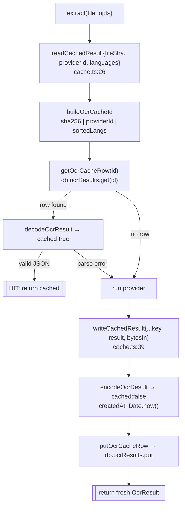

# 缓存

<Status variant="beta">ocrResults — Dexie v36 (DB v70)</Status>

<TLDR>
  相同的 图片 + provider + 语言 组合永远不会消耗两次成本。`extract()` 通过一个 Dexie 表进行读穿，该表以
  `sha256(file) | providerId | sortedLangs` 为键（`lib/db/ocr-results.ts:33`）；命中时立即返回
  `cached: true`，未命中则运行 provider 并写回。落盘的行将 `OcrResult` 存为 JSON
  （`cached: false`），外加用于 TTL 计算的 `createdAt` 与用于设置统计的 `bytesIn`。`ocrResults` 表在
  **schema v36** 引入，自此未再变更（数据库现已是 v70）。存在一个 `purgeOcrCacheOlderThan`
  TTL 清理函数，但它**未**接入 cron——清理是手动的。
</TLDR>

## 这张表

`ocrResults` 在 `lib/db/schema.ts:263` 声明，并在 v36 迁移中引入：

```ts
// lib/db/schema.ts:1191 — never re-declared after v36
this.version(36).stores({
  ocrResults: "&id, providerId, createdAt, fileSha",
})
```

| 索引 | 作用 |
| --- | --- |
| `&id` | 主键 —— 缓存 id（`fileSha` + `providerId` + `langs`），唯一 |
| `providerId` | 按 provider 清理（`clearOcrCacheForProvider`） |
| `createdAt` | TTL 清理（`purgeOcrCacheOlderThan`） |
| `fileSha` | “该文件的所有结果”（索引已存在；目前尚无 helper 使用它） |

行结构（`OcrResultRow`，`ocr-results.ts:14`）：

<TypeTable
  type={{
    id: { description: "主键 —— 缓存 id：fileSha、providerId 与 langs 以竖线拼接。", type: "string" },
    fileSha: { description: "输入字节的 SHA-256。", type: "string" },
    providerId: { description: "产出该结果的 provider。", type: "string" },
    langs: { description: "逗号拼接、小写化 + 排序后的语言列表（无语言时为空字符串）。", type: "string" },
    result: { description: "JSON 编码的 OcrResult，以 cached:false 存储。", type: "string" },
    createdAt: { description: "Epoch 毫秒 —— 已建索引以供 TTL 清理。", type: "number" },
    bytesIn: { description: "输入字节数 —— 喂给缓存统计行。", type: "number" },
  }}
/>

## 键公式

```ts
// ocr-results.ts:33 — buildOcrCacheId
const normalized = (langs ?? []).map((l) => l.toLowerCase()).sort()
return `${fileSha}|${providerId}|${normalized.join(",")}`
```

分隔符是 `|`；语言在用 `,` 拼接前会**先小写化再排序**。这种归一化意味着
`["EN","zh"]` 与 `["zh","en"]` 会落到同一条记录——这是有意为之，因此大小写与顺序永远不会让缓存碎片化。

## 读穿 / 写回

`cache.ts`（55 行）是 `extract()` 调用的薄封装；`ocr-results.ts`（116 行）是其下层的 Dexie CRUD。



`readCachedResult` 是纯粹的命中/未命中——无论是行缺失**还是** JSON 损坏都返回 `null`（运行继续）。
注意读取时**不**做 TTL 检查：陈旧性仅由下文的手动清理处理。`encodeOcrResult`
（`ocr-results.ts:102`）在存储副本上强制 `cached: false`；`decodeOcrResult`（`ocr-results.ts:108`）在读取时将其翻回 `cached: true`。

## TTL 清理与清空

```ts
// ocr-results.ts:73 — manual TTL sweep; ttlMs <= 0 means "never expire"
export async function purgeOcrCacheOlderThan(ttlMs, now = Date.now()): Promise<number> {
  if (!Number.isFinite(ttlMs) || ttlMs <= 0) return 0
  const stale = await db.ocrResults.where("createdAt").below(now - ttlMs).primaryKeys()
  if (stale.length === 0) return 0
  await db.ocrResults.bulkDelete(stale)
  return stale.length
}
```

<Callout type="warn" title="purgeOcrCacheOlderThan 未接入 cron">
  全仓库搜索发现 `purgeOcrCacheOlderThan` 仅被它自己的测试和 ADR 文本引用——没有生产侧调用者。`cacheTtlDays`
  设置（默认 30）在 UI 中有暴露，但过期是**手动**的：用户从设置的 Cache 标签页清空缓存。ADR-0024 的
  “尚未接入 cron”依然成立。
</Callout>

清空辅助函数：

| Helper | file:line | 效果 |
| --- | --- | --- |
| `clearOcrCache()` | `ocr-results.ts:54` | 全局 —— 先计数再 `.clear()`，返回数量 |
| `clearOcrCacheForProvider(id)` | `ocr-results.ts:61` | 按 provider —— `where("providerId").equals(id)` → `bulkDelete` |
| `ocrCacheStats()` | `ocr-results.ts:87` | `{ count, bytes }` —— 累加 `bytesIn`，喂给 Cache 标签页头部 |

设置中的 [Cache 标签页](./settings-ui) 是目前唯一驱动这些函数的界面；Auto-Router 面板的
“clear all cache” 按钮也会调用 `clearOcrCache()`。
